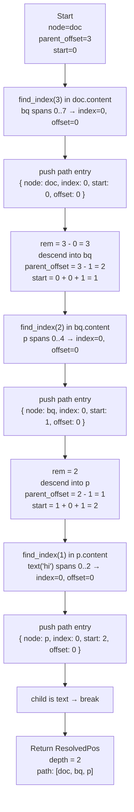
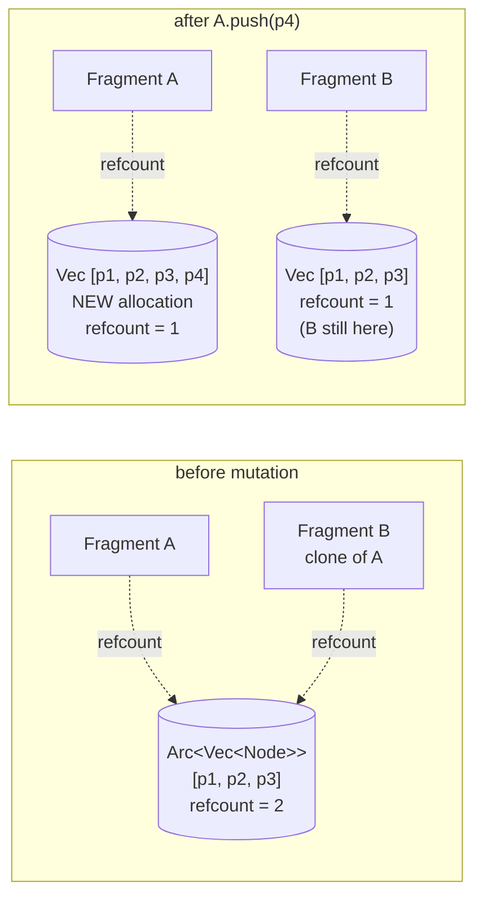
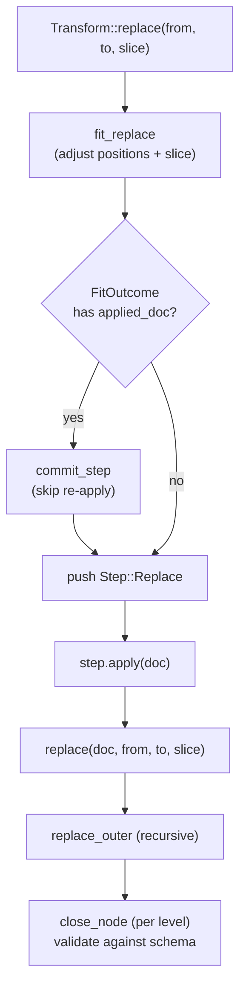
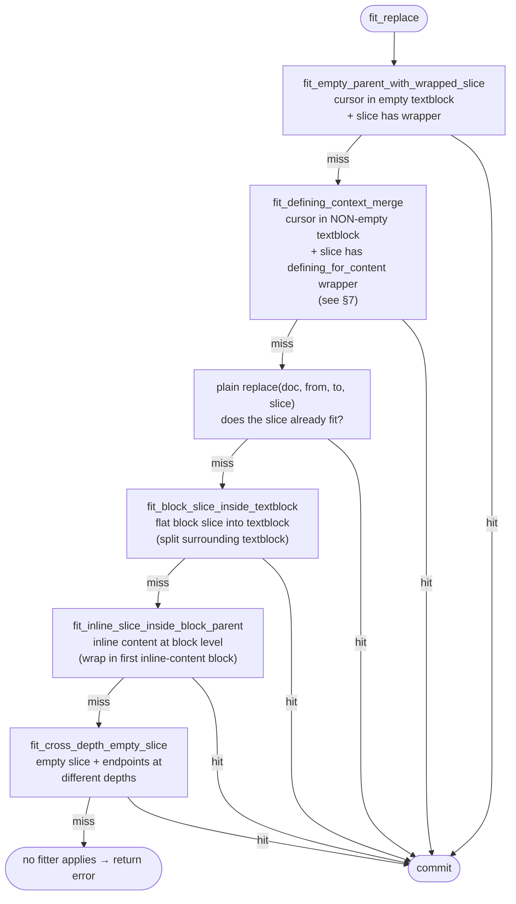
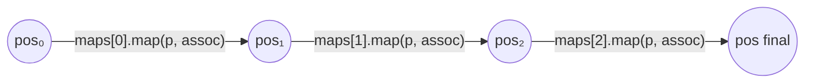
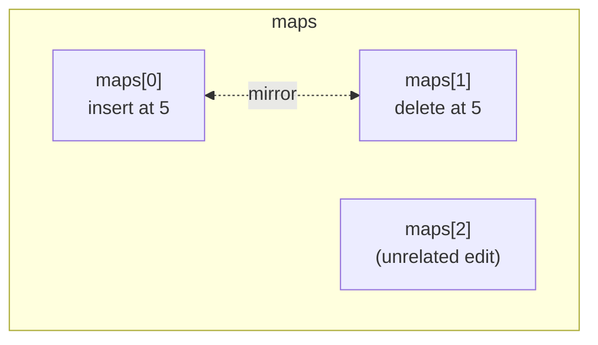
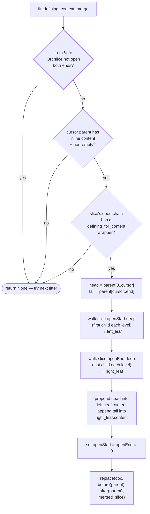
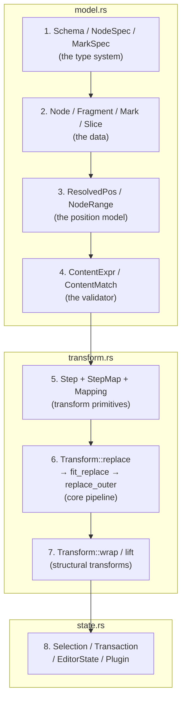

# pine-richtext — architecture & critical algorithms

This is a deep-dive reference for the algorithms that are easy to forget and
hard to re-derive from the code alone. The intended audience is future-me
(and anyone touching the transform engine after the initial commits stop
being warm in their head).

Each section follows the same shape:

1. The problem in plain language.
2. A tree diagram of the data state involved.
3. A walk-through of the algorithm with the actual transitions.
4. A small code snippet anchored to the source file + line.
5. A "why this design" note for the parts where the obvious-looking
   alternative is wrong.

Everything here is a Rust port of a ProseMirror primitive; pine deliberately
omits the DOM / view layer but mirrors the model + transform + state core.

> Diagrams are rendered in two flavors:
>
> - **ASCII trees** (`└─ ├─ │`) for concrete document states. These look
>   exactly like the trees in pine's parity tests.
> - **Mermaid** for control-flow, pipelines, and anything where labelled
>   edges or branches matter.

---

## 1. Positions and `ResolvedPos`

### The problem

The document is a tree. Edits, selections, and cursors refer to positions in
that tree using a flat integer scheme — same convention as ProseMirror. A
position is "the number of tokens before this point," where every node
boundary counts as one token and every text character counts as one.

For the doc:

```
doc
 └─ blockquote
     └─ paragraph
         └─ "hi"
```

The positions along the tree look like:

```
 0  ─┐                                   ─┐
     │   doc.content starts               │
 1  ─┼─► blockquote opens                 │
     │                                    │
     │   bq.content starts                │
 2  ─┼─► paragraph opens                  │
     │                                    │
     │   p.content starts                 │
 3  ─┼─► before "h"                       ├─ positions
 4  ─┼─► between "h" and "i"              │   inside the
 5  ─┼─► after "i"   (p.content ends)     │   doc
     │                                    │
 6  ─┼─► after paragraph closes           │
     │   (bq.content ends)                │
 7  ─┘   after blockquote closes         ─┘
         (= doc.content_size)
```

A single integer doesn't tell you which depth you're at. **Resolving** a
position turns the integer into a `ResolvedPos` — a path through the tree
with the index, content-start, and offset at every depth.

### Walkthrough — `doc.resolve(3)`



The final path is:

```
ResolvedPos { pos: 3, depth: 2, path: [
  { node: doc,         index: 0, start: 0, offset: 0 },   ← depth 0
  { node: blockquote,  index: 0, start: 1, offset: 0 },   ← depth 1
  { node: paragraph,   index: 0, start: 2, offset: 0 },   ← depth 2 (parent)
] }
```

`$pos.parent` is the deepest entry (`p`). `$pos.index(d)` returns the child
index at depth `d`. `$pos.before(d)` is the position just before the node at
that depth.

### Code

Source: `src/model.rs::Node::resolve`

```rust
pub fn resolve(&self, pos: usize) -> RichTextResult<ResolvedPos> {
    let mut path = Vec::new();
    let mut node = self.clone();
    let mut start = 0;
    let mut parent_offset = pos;

    loop {
        let (index, offset) = node.content.find_index(parent_offset);
        path.push(ResolvedPathEntry { node: node.clone(), index, start, offset });

        let rem = parent_offset.saturating_sub(offset);
        if rem == 0 || index == node.child_count() {
            break;
        }
        let child = node.child(index).expect("checked").clone();
        if child.is_text() || child.is_leaf() {
            break;
        }
        node = child;
        parent_offset = rem - 1;     // consume the child's opening token
        start += offset + 1;
    }

    Ok(ResolvedPos { pos, path })
}
```

### Why it matters

Every transform begins with one or two `resolve()` calls. The path produced
is the *only* way the rest of the engine knows which node lives at which
depth. Without it the transform code would be a pile of ad-hoc tree walks.

The path entries store `Node` clones, which used to be the single most
expensive thing pine did per replace — see section 2 for why this is now
cheap.

---

## 2. Fragments are `Arc<Vec<Node>>`

### The problem

A `Node`'s content is a `Fragment`. A `Fragment` is a list of child `Node`s.
If `Fragment::children` were a plain `Vec<Node>`, then cloning a doc node
would deep-clone every paragraph, every text node, every mark.

Consider this doc:

```
doc
 ├─ paragraph
 │   └─ "first"
 ├─ paragraph
 │   └─ "second"
 └─ paragraph
     └─ "third"
```

`ResolvedPos` clones a `Node` at every depth. The replace pipeline does
several `resolve()`s and several intermediate `Fragment::cut` /
`Fragment::append` builds per transform. With plain `Vec`, every clone
deep-copies all three paragraphs and their text. With `Arc`, the children
list is shared — clones are a refcount bump.

### The COW trick



When there are no other handles, `Arc::make_mut` returns `&mut Vec<Node>`
without any allocation. Only the rare two-handle case pays the clone.

The `merge_adjacent_text` cleanup is gated on a fast precheck: if no
adjacent pair of text nodes could possibly be merged, the function
short-circuits without cloning anything. Most fragments — pure block
content, single text runs — hit this fast path.

### What the tree looks like in memory

```
Fragment A.children ──► Arc<Vec<Node>>
                          │
                          ├─ Node { name: "paragraph", content: Fragment ──► Arc<Vec<Node>> }
                          ├─ Node { name: "paragraph", content: Fragment ──► Arc<Vec<Node>> }
                          └─ Node { name: "paragraph", content: Fragment ──► Arc<Vec<Node>> }
                                                                              │
                                                                              └─ Node { text: "third" }
```

Every dotted arrow is a refcount bump on clone, not a deep copy. A clone
of the doc node ends up sharing every subtree.

### Code

Source: `src/model.rs::Fragment`

```rust
pub struct Fragment {
    pub(crate) children: Arc<Vec<Node>>,
}

impl Fragment {
    pub fn push(&mut self, child: Node) {
        Arc::make_mut(&mut self.children).push(child);
        self.merge_adjacent_text();
    }

    pub(crate) fn children_mut(&mut self) -> &mut Vec<Node> {
        Arc::make_mut(&mut self.children)
    }

    pub fn replace_child(&self, index: usize, node: Node) -> RichTextResult<Fragment> {
        let mut next = self.clone();
        Arc::make_mut(&mut next.children)[index] = node;
        Ok(next)
    }

    pub(crate) fn merge_adjacent_text(&mut self) {
        let needs_merge = self
            .children
            .windows(2)
            .any(|pair| can_merge_text_pair(&pair[0], &pair[1]));
        if !needs_merge { return; }
        // …actual merge over Arc::make_mut(&mut self.children)…
    }
}
```

### Why it matters

The benchmark that originally ran in 514ms (replace inline-into-block on a
50-paragraph doc) now runs in 25µs. Most of that 20,000× speedup comes from
this single structural change. Removing the `Arc` would re-introduce that
cost. Treat it as a load-bearing invariant.

---

## 3. The replace pipeline

### The problem

`Transform::replace(from, to, slice)` is the single most-used entry into
the transform engine. Every concrete edit — insert, delete, paste,
setBlockType, wrap, lift — eventually lowers to a replace.

Conceptually, a replace says: "remove document content between `from` and
`to`, then put `slice` in its place." That's easy when the slice perfectly
matches the surrounding context. But often it doesn't, and the engine has
to **fit** the slice — adjust positions, wrap content, unwrap context —
before the replace is valid against the schema.

### Pipeline shape



### The fitter chain

`fit_replace` tries fitters in order, picking the first that succeeds.
Each fitter looks at the cursor's surroundings and the slice's open
structure, and either rewrites both into a closed pair that the bare
`replace` can swallow, or hands off to the next fitter.



The order matters: defining-context drops MUST run before the plain
replace, otherwise a wrapped slice would silently unwrap into the cursor's
existing paragraph.

### Pre-applied doc cache (the doubled-replace fix)

Each fitter that succeeds has already called `replace()` internally to
verify its synthesized slice produces a valid doc. The successful result is
stuffed into `FitOutcome.applied_doc`:

```rust
struct FitOutcome {
    from: usize,
    to: usize,
    slice: Slice,
    applied_doc: Option<Node>,  // ← already-built doc from the fitter
}
```

`Transform::replace` then calls `commit_step` (a no-apply path) to push the
result onto the transform's history without re-running `replace`. This
removed the doubled-replace pass that was burning ~40% of the time on
setBlockType benchmarks.

Source: `src/transform.rs::Transform::replace` and `commit_step`.

### `replace_outer` — the recursive descent

Once we have a validated `Step::Replace`, applying it walks down the doc
matching the from/to depths against the slice's open structure:

```rust
fn replace_outer(from, to, slice, depth, schema) -> Node {
    let index = from.index(depth);
    let node = from.node(depth);

    // 1. If both endpoints stay inside the same child at this depth AND
    //    the slice still has open structure below, recurse one level
    //    deeper, leaving the surrounding wrapper alone.
    if index == to.index(depth) && depth < from.depth - slice.open_start {
        let inner = replace_outer(from, to, slice, depth + 1)?;
        return close_node(node, node.content().replace_child(index, inner));
    }

    // 2. Empty slice and depths match → two-way merge.
    if slice.content.is_empty() {
        return close_node(node, replace_two_way(from, to, depth));
    }

    // 3. Closed slice at the matching depth → flat splice.
    if slice.open_start == 0 && slice.open_end == 0
       && from.depth == depth && to.depth == depth {
        let content = node.content().cut(0, from.parent_offset)
            .append(slice.content.clone())
            .append(node.content().cut(to.parent_offset, node.content_size));
        return close_node(node, content);
    }

    // 4. Open slice at this depth → three-way merge with the slice's edges.
    let (start, end) = prepare_slice_for_replace(slice, from);
    close_node(node, replace_three_way(from, &start, &end, to, depth))
}
```

### The three-way merge

Replacing `[from..to]` with a slice that has open ends:

```
Doc side:
  doc
   └─ wrapper                        ← node at this depth
       ├─ children before from
       ├─ ┃                          ← from cursor
       │  ┃   …
       │  ┃                          ← to cursor
       └─ children after to

Slice side (resolved within a synthetic doc):
  start ─────► end
  ├─ open-start chain (left edge)
  ├─ closed inner children
  └─ open-end chain   (right edge)
```

Result content is assembled in five concatenated pieces:

```
[ doc children before from ]
  ─┐
   │  close( joinable(from, start, depth+1),
   │         replace_two_way(from, start, depth+1) )    ← open-start join
  ─┤
   │  [ slice children fully inside ]
  ─┤
   │  close( joinable(end, to, depth+1),
   │         replace_two_way(end, to, depth+1) )        ← open-end join
  ─┘
[ doc children after to ]
```

`joinable_replace_node` checks that the doc's wrapper and the slice's
wrapper have compatible content expressions before joining. If
incompatible, the replace fails. (Same-type wrappers always pass;
cross-type pairs need content-expression overlap.)

### `close_node`

At every level of recursion, `close_node` is responsible for validating the
combined content against the parent's content expression:

```mermaid
flowchart TD
    A[close_node(node, content)]
    B[closed = node.copy_with_content(content)]
    C{schema.check_node(closed).is_ok()?}
    D{closed.content().len() &lt;= 1?}
    E["fill_before BFS (≤ 4096 states)"]
    F{filler found?}
    G[node.copy_with_content(filler + content)]
    H{schema.check_node(filled).is_ok()?}
    I[return filled]
    J[return validation error]
    K[return closed]

    A --> B --> C
    C -- yes --> K
    C -- no  --> D
    D -- no  --> J
    D -- yes --> E --> F
    F -- no  --> J
    F -- yes --> G --> H
    H -- yes --> I
    H -- no  --> J
```

The `content().len() <= 1` gate was a 500ms→185µs perf fix on the
inline-into-block benchmark. The BFS can fix "blockquote with no
paragraphs" (auto-fill with one empty paragraph), but cannot fix
"blockquote with a paragraph + a hard_break in the middle" (the hard_break
is wrong-content, not missing-prefix). The gate is what prevents the BFS
from chewing through 4096 fragment clones for nothing.

### Why the pipeline is shaped this way

ProseMirror's `Node.replace` is the textbook algorithm; pine's
`replace_outer` is a direct port. The two pine-specific deviations:

1. **Pre-applied doc cache** — pine avoids the upstream's habit of running
   `replace` once inside each fitter to validate and then again at apply
   time. The cache eliminates the second pass.
2. **Auto-fill gate in close_node** — pine has auto-fill (PM's `replace`
   does too, via `Node.replace` → `replace` → `close`) but pine's
   `fill_before` is much more expensive than PM's because pine doesn't have
   PM's ContentMatch state graph. The gate works around that without losing
   correctness for the cases auto-fill is meant to handle.

---

## 4. Step mapping — how positions survive across edits

### The problem

A single document might have multiple transforms in flight. A position that
makes sense in document version 1 may point at a different element in
version 2. **Mapping** translates positions from one version to another.

This is what makes collaborative editing possible: a client applies
transforms locally, receives transforms from peers, and needs to rebase its
own pending positions through the peers' steps.

### What a `StepMap` looks like

Every step produces a `StepMap` describing how positions changed:

```
StepMap
 ├─ ranges: Vec<MapRange>
 └─ inverted: bool

MapRange
 ├─ old_start: usize
 ├─ old_size:  usize   ← size of replaced range in OLD doc
 └─ new_size:  usize   ← size of replacement in NEW doc
```

For a single replace at positions 5..10 inserting 3 characters:

```
StepMap
 ├─ ranges:
 │   └─ MapRange { old_start: 5, old_size: 5, new_size: 3 }
 └─ inverted: false
```

```
old doc:  [ . . . . . X X X X X . . . . . ]
                       │←─ size 5 ─→│
                       5            10

new doc:  [ . . . . . Y Y Y . . . . . ]
                       │←sz 3→│
                       5      8

Mapping rules for a position p:
  p &lt; 5       → unchanged                       (before the range)
  5 ≤ p ≤ 10  → collapsed to 5 + new_size (= 8) (inside the range, "deleted")
  p &gt; 10      → p + (new_size - old_size) = p - 2   (after the range)
```

`map_result` does the same but tracks deletion flags (`deleted`,
`deleted_before`, `deleted_after`, `deleted_across`) so callers can tell
whether the original position landed inside a deleted range, at its left
or right boundary, etc.

### Mapping through a chain

A `Mapping` is a list of `StepMap`s plus an optional set of "mirrors"
(pairs of indices where one map cancels another — used for rebase
semantics):

```
Mapping
 ├─ maps:   Vec<StepMap>
 └─ mirror: BTreeMap<usize, usize>   ← index ↔ index
```



```rust
fn map_through_maps(maps: &[StepMap], mut pos: usize, assoc: i8) -> usize {
    for map in maps {
        pos = map.map(pos, assoc);
    }
    pos
}
```

### Mirrors and rebase

A "mirror" pair says: these two maps are inverses of each other. During
rebase (the operation collab uses to re-apply your pending steps after a
peer's steps land first), pine can use the mirror to recover positions that
would otherwise be lost.



The bookkeeping is the same as PM's:

```rust
mapping.append_map(insert_step.map());                  // index 0
mapping.append_map_with_mirror(delete_step.map(), 0);   // index 1 mirrors 0
```

A position deleted by step 1 can still be recovered through step 0's
mirror data.

### Why it matters

Without step mapping, you can't:

- Undo/redo (the undo needs to apply the inverse step to a doc that's
  moved since the original).
- Map a selection through a transform (cursor at position 5 should still
  point at "the same thing" after an edit shifts it).
- Run a collab algorithm (you need to know how to rebase your pending
  steps over peers' steps).

Source: `src/transform.rs` — `StepMap`, `MapResult`, `Mapping`.

---

## 5. Wrap and lift via `ReplaceAroundStep`

### The problem

Pine used to implement `wrap` and `lift` as "compute the new doc, then emit
a Replace step covering the whole doc." That works for direct application,
but the step doesn't *compose* through mapping: if another transform
inserts text outside the wrapped range, mapping pine's wrap step through
that insert would emit a Replace whose range still spans the entire
original doc — wiping out the unrelated insert.

ProseMirror solves this with `ReplaceAroundStep` — a more granular step
that says "replace the surroundings of a preserved gap." Pine now does the
same.

### The shape of a `ReplaceAroundStep`

```
ReplaceAroundStep
 ├─ from, to:         outer range to replace
 ├─ gap_from, gap_to: inner range that stays untouched
 ├─ slice:            the surroundings to put around the gap
 ├─ insert:           position inside slice.content where the gap goes
 └─ structure:        bool — fail rather than overwrite structure
```

Apply procedure:

```mermaid
flowchart TD
    A[apply(doc)]
    B[gap = doc.slice(gap_from, gap_to)]
    C{gap.open_start == 0<br/>and gap.open_end == 0?}
    D[content = slice.content<br/>with gap.content spliced<br/>at position `insert`]
    E["replace(doc,<br/>from, to,<br/>Slice(content,<br/>slice.open_start,<br/>slice.open_end))"]
    F[return error: structure violated]

    A --> B --> C
    C -- no --> F
    C -- yes --> D --> E
```

The clever bit is the splice step: `insert_into_fragment` walks the slice's
content to position `insert`, recursing into non-leaf children. For a wrap,
`slice` is the new wrapper with empty content and `insert = 1` ("inside the
wrapper, at content position 0").

### Wrap — before and after

Start:

```
doc
 ├─ paragraph "one"     ← gap_from
 └─ paragraph "two"     ← gap_to
```

Built `ReplaceAroundStep`:

```
slice
 └─ blockquote          ← empty wrapper, open=0
    (empty content)
insert = 1              ← gap goes at content position 0 inside blockquote
```

After `insert_into_fragment`:

```
slice
 └─ blockquote
     ├─ paragraph "one"   ← spliced in from gap
     └─ paragraph "two"
```

After the outer `replace`:

```
doc
 └─ blockquote
     ├─ paragraph "one"
     └─ paragraph "two"
```

```rust
pub fn wrap(&mut self, from, to, node_type, attrs) -> RichTextResult<&mut Self> {
    // … resolve from/to, compute start_pos/end_pos at the shared depth …

    // The wrapper has empty content (the gap will fill it during apply).
    // Use Node::unchecked because Schema::node would reject an empty wrapper
    // for a `block+` content expression.
    let wrapper = Node::unchecked(node_type, attrs, Vec::new(), Fragment::empty(), …);
    let slice = Slice::new(Fragment::from(wrapper), 0, 0);

    self.step(Step::ReplaceAround(ReplaceAroundStep {
        from: start_pos,
        to: end_pos,
        gap_from: start_pos,   // gap == the range being wrapped
        gap_to: end_pos,
        slice,
        insert: 1,             // gap goes inside the wrapper at content position 0
        structure: true,
    }))
}
```

Source: `src/transform.rs::Transform::wrap`.

### Lift — before and after

Lift is more intricate because it has to split the wrapper(s) around the
lifted content. The before/after chains are *empty* wrappers that the
replace algorithm joins with the actual surrounding context via open ends.

Partial lift of `p_b` out of `bq(p_a, p_b, p_c)` targeting depth 0:

Before:

```
doc
 └─ blockquote
     ├─ paragraph "a"
     ├─ paragraph "b"   ← target of lift
     └─ paragraph "c"
```

Built `ReplaceAroundStep`:

```
gap_from = pos before p_b
gap_to   = pos after p_b

slice
 ├─ blockquote (empty)      ← left split wrapper, openStart = 1
 └─ blockquote (empty)      ← right split wrapper, openEnd   = 1
insert   = 1                ← gap goes between the two empty bqs
openStart = 1
openEnd   = 1
```

After `insert_into_fragment` (gap spliced between the two empty bqs):

```
slice
 ├─ blockquote (empty)
 ├─ paragraph "b"           ← lifted content
 └─ blockquote (empty)
```

After the open-join `replace` (left bq joins with doc's bq prefix, right
bq joins with the suffix):

```
doc
 ├─ blockquote
 │   └─ paragraph "a"       ← from first half of original bq
 ├─ paragraph "b"           ← the lifted content
 └─ blockquote
     └─ paragraph "c"       ← from second half of original bq
```

`build_lift_around_step` walks from `range.depth()` down to `target_depth`,
splitting each level. At each level it either:

- Wraps the previous (inner) chain in an empty copy of the current
  ancestor (splitting that level), incrementing `open_start`/`open_end`.
- Or expands the outer `start--` / `end++` (consuming the wrapper's opening
  /closing token because that level doesn't need to be split).

The choice depends on whether there's content on the other side of the
range path at that depth: if yes, split; if no, expand outer.

Source: `src/transform.rs::build_lift_around_step` and
`Transform::lift`. The walker stops at the deepest isolating ancestor
(`max_lift_target_depth`) so lifts never escape isolating boundaries.

### The `insert + open_start` offset

`Transform::lift` walks outward from the lifted range down to `target_depth`,
trying each candidate depth via `build_lift_around_step` and the resulting
`ReplaceAroundStep` is run through `step.apply`. Both cursor-inside-textblock
and boundary positions (tags *between* paragraphs) reach the same step shape:
slice `[empty_wrapper, empty_wrapper]` with `open_start = open_end = 1` and
`insert = 1`.

`ReplaceAroundStep::apply` mirrors PM's `Slice.insertAt`: when the gap is
spliced into the slice, the insertion position is offset by `open_start`.
Without this offset, `insert_into_fragment` walks into the *first* open
wrapper at position 1 and ends up producing `[wrapper(gap), empty_wrapper]`
(the gap stuck inside the left half), instead of the correct
`[empty_wrapper, gap, empty_wrapper]` (gap between the two splits).

A whole-doc lift fallback (`lift_doc_range`) still exists for the rare case
where no `target_depth` produces a valid step. It computes the new doc
directly and emits a whole-doc `ReplaceStep`, which doesn't compose through
mapping — but in practice every lift exercised by the parity tests now lands
on the `ReplaceAroundStep` path.

---

## 6. Mark exclusion — the same-type default

### The problem

When you add a mark (italic, bold, link) to a span of text, sometimes the
new mark should replace an existing same-type mark (link to a different
URL), sometimes the marks should stack (multiple comment marks with
different IDs), sometimes the new mark should exclude *other* mark types
entirely (a "code" mark that excludes formatting).

The rules live on `MarkSpec`. Pine's default matches ProseMirror's:

> A mark spec **excludes its own type by default**. Calling
> `MarkSpec::new("em")` creates a spec with `excludes = {"em"}` — adding
> two `em` marks (with different attrs) replaces the old one with the new.
>
> To allow co-existence, call `.excludes("")` explicitly. This clears the
> excludes set including the default self-exclusion.

### `add_mark_to_set` decision tree

```mermaid
flowchart TD
    Start([add_mark_to_set(set, new)])
    Loop["for existing in set"]
    Eq{existing == new?}
    NewKills{new excludes existing?}
    ExKills{existing excludes new?}
    Place{"!placed AND<br/>existing.rank &gt; new.rank?"}

    R1[/return set unchanged/]
    R2[/skip existing/]
    R3[/return set unchanged<br/>(new dropped)/]
    R4[push new<br/>then push existing]
    R5[push existing]
    AfterLoop{placed?}
    R6[push new at end]
    Done([return result])

    Start --> Loop --> Eq
    Eq -- yes --> R1
    Eq -- no  --> NewKills
    NewKills -- yes --> R2 --> Loop
    NewKills -- no  --> ExKills
    ExKills -- yes --> R3
    ExKills -- no  --> Place
    Place -- yes --> R4 --> Loop
    Place -- no  --> R5 --> Loop
    Loop -- end --> AfterLoop
    AfterLoop -- no --> R6 --> Done
    AfterLoop -- yes --> Done
```

### Concrete examples

```
em.add_to_set( [] )                  →  [em]
em.add_to_set( [em] )                →  [em]                  (deduplicate)

# Default self-exclusion: same type with different attrs replaces.
link1.add_to_set( [link2] )          →  [link1]               (link2 dropped)

# With .excludes("") on a mark type:
comment1.add_to_set( [comment2] )    →  [comment2, comment1]  (both kept,
                                                               ordered by rank)

# The "_" wildcard excludes ALL marks.
user1.add_to_set( [em, strong] )     →  [user1]               (user excludes everything)
em.add_to_set( [user1] )             →  [user1]               (user still excludes em)

# Group exclusion.
strong.excludes("em-group");
strong.add_to_set( [em] )            →  [strong]              (em was in em-group)
```

### Code

Source: `src/model.rs::Schema::add_mark_to_set`.

```rust
pub fn add_mark_to_set(&self, set: &[Mark], mark: Mark) -> RichTextResult<Vec<Mark>> {
    let mark_rank = self.mark_type(&mark.name)?.rank;
    let mut result = Vec::with_capacity(set.len() + 1);
    let mut placed = false;

    for existing in set {
        if existing == &mark {
            return Ok(set.to_vec());                      // identical → no-op
        }
        if self.mark_excludes(&mark.name, &existing.name) {
            continue;                                     // new excludes existing
        }
        if self.mark_excludes(&existing.name, &mark.name) {
            return Ok(set.to_vec());                      // existing excludes new
        }
        if !placed && self.inner.marks[&existing.name].rank > mark_rank {
            result.push(mark.clone());
            placed = true;
        }
        result.push(existing.clone());
    }

    if !placed {
        result.push(mark);
    }
    Ok(result)
}
```

### Why this is a trap

Pine's `apply_mark_between` originally compared marks by *type name* when
removing, which silently stripped same-type marks with different attrs (a
custom-href link gets removed by `remove_mark` with an arbitrary link).
The fix was to compare marks by full equality:

```rust
middle.marks.retain(|existing| existing != mark);   // was `existing.name != mark.name`
```

If you ever go to "optimize" mark removal, make sure full-equality is
preserved. The parity tests pin this behavior.

---

## 7. Defining-context merge

### The problem

When pasting a slice that carries a structurally important wrapper (a list
item, a code block, a defined blockquote), the wrapper should survive the
paste instead of being unwrapped into the cursor's existing paragraph.

The wrapper is "structurally important" when its `NodeSpec` is declared
`defining_for_content`. Pine's `schema_basic` flags `blockquote`,
`code_block`, and `list_item` this way (matching upstream).

### Visual setup

Cursor at the start of "foo":

```
doc
 └─ paragraph
     └─ <a>"foo"          ← from = to = 1 (parent offset 0)
```

Slice (taken from a bullet list with `include_parents`):

```
Slice
 ├─ openStart: 3          ← outer ul, first li, first p are all open
 ├─ openEnd:   3          ← outer ul, last  li, last  p are all open
 └─ content:
     └─ ul
         ├─ list_item
         │   └─ paragraph "one"
         └─ list_item
             └─ paragraph "two"
```

Expected after paste:

```
doc
 └─ ul
     ├─ list_item
     │   └─ paragraph "one"
     └─ list_item
         └─ paragraph "twofoo"   ← "foo" merged onto the last item
```

### The algorithm



### Walking through the example

Step 1 — split the cursor's paragraph:

```
head = ""                                  (nothing before the cursor)
tail = "foo"
```

Step 2 — locate the leaves inside the slice:

```
slice.content
 └─ ul                                     depth 0
     ├─ list_item                          depth 1   ← first child for openStart=3
     │   └─ paragraph "one"  ← LEFT LEAF   depth 2
     └─ list_item                          depth 1   ← last child for openEnd=3
         └─ paragraph "two"  ← RIGHT LEAF  depth 2
```

Step 3 — splice head/tail into the leaves:

```
LEFT LEAF  paragraph "one"      ← head ("") + "one"  = "one"        (unchanged)
RIGHT LEAF paragraph "twofoo"   ← "two" + tail ("foo") = "twofoo"
```

Step 4 — close the slice (openStart = openEnd = 0):

```
merged_slice
 └─ ul
     ├─ list_item
     │   └─ paragraph "one"
     └─ list_item
         └─ paragraph "twofoo"
```

Step 5 — replace the entire cursor paragraph:

```
new_from = before(parent paragraph)   = 0
new_to   = after(parent paragraph)    = doc.content_size

replace(doc, 0, doc.content_size, merged_slice)
```

Result:

```
doc
 └─ ul
     ├─ list_item
     │   └─ paragraph "one"
     └─ list_item
         └─ paragraph "twofoo"
```

### Code

Source: `src/transform.rs::fit_defining_context_merge`.

```rust
fn fit_defining_context_merge(
    doc, from, to, slice, schema
) -> RichTextResult<Option<(usize, usize, Slice, Node)>> {
    if from != to { return Ok(None); }
    if slice.open_start == 0 || slice.open_end == 0 || slice.content.is_empty() {
        return Ok(None);
    }

    let resolved = doc.resolve(from)?;
    let parent = resolved.parent();
    if !parent_type.inline_content(schema) || parent.content_size() == 0 {
        // Empty-parent case is the OTHER fitter's job.
        return Ok(None);
    }
    if !slice_open_chain_has_defining_wrapper(slice, schema)? {
        return Ok(None);
    }

    // 1. Split the cursor parent's content.
    let head = parent.content().cut(0, resolved.parent_offset())?;
    let tail = parent.content().cut(resolved.parent_offset(), parent.content_size())?;

    // 2-4. Splice head/tail into the slice's leaves, close both ends.
    let mut merged = slice.content.clone();
    if !head.is_empty() {
        let leaf = left_leaf(&merged, slice.open_start)?;
        let new_content = head.append(leaf.content().clone());
        merged = replace_left_leaf_content(&merged, slice.open_start, new_content)?;
    }
    if !tail.is_empty() {
        let leaf = right_leaf(&merged, slice.open_end)?;
        let new_content = leaf.content().clone().append(tail);
        merged = replace_right_leaf_content(&merged, slice.open_end, new_content)?;
    }
    let merged_slice = Slice::new(merged, 0, 0);

    // 5. Replace the entire cursor parent.
    let new_from = resolved.before(resolved.depth())?;
    let new_to   = resolved.after(resolved.depth())?;
    replace(doc, new_from, new_to, merged_slice.clone(), schema)
        .map(|applied| Some((new_from, new_to, merged_slice, applied)))
}
```

### Why this is gated on `defining_for_content`

Without the flag, the default behavior is the right thing: a paste of
`p("hello")` into the middle of `p("world")` should just merge the text,
not wrap it. The flag says "this wrapper has semantic meaning; don't
unwrap." That's the signal that flips the fitter from "unwrap and merge
text" to "preserve wrapper, merge cursor content into the wrapper."

### What this doesn't handle

The cursor-only case is implemented. The general range case (`from != to`)
needs slightly more bookkeeping — extract head/tail from the *from* side
and *to* side respectively, with the right open-depth math. Skipped because
no existing parity test exercises it and the semantics get tangled.

---

## 8. Step JSON I/O

### The problem

`Transform`'s output is a sequence of `Step`s plus an updated doc. For
collaborative editing or persistence, those steps need to cross a process
boundary.

Pine matches ProseMirror's exact JSON shape so a Rust server can deserialize
steps produced by a JS PM client and vice versa.

### Wire format

Every step is an object with a `stepType` discriminator:

```
replace
 ├─ stepType: "replace"
 ├─ from: number
 ├─ to:   number
 └─ slice?: SliceJSON

replaceAround
 ├─ stepType: "replaceAround"
 ├─ from, to:        number
 ├─ gapFrom, gapTo:  number
 ├─ insert:          number
 ├─ slice:           SliceJSON
 └─ structure?:      bool

addMark / removeMark
 ├─ stepType
 ├─ from, to: number
 └─ mark:     MarkJSON

addNodeMark / removeNodeMark
 ├─ stepType
 ├─ pos:  number
 └─ mark: MarkJSON

attr
 ├─ stepType: "attr"
 ├─ pos:   number
 ├─ attr:  string
 └─ value: any

docAttr
 ├─ stepType: "docAttr"
 ├─ attr:  string
 └─ value: any
```

Subtypes:

```
SliceJSON
 ├─ content:    NodeJSON[]
 ├─ openStart?: number
 └─ openEnd?:   number

MarkJSON
 ├─ type:  string
 └─ attrs?: { [k: string]: any }

NodeJSON
 ├─ type:    string
 ├─ attrs?:  { ... }
 ├─ content?: NodeJSON[]
 ├─ marks?:  MarkJSON[]
 └─ text?:   string
```

The serde derives on `Slice` use `#[serde(rename = "openStart")]` /
`#[serde(rename = "openEnd")]` so the field names match upstream.

### Round trip

```mermaid
flowchart LR
    S1[Step (Rust enum)]
    J1[Value (serde_json)]
    Wire[(wire / disk / RPC)]
    J2[Value (serde_json)]
    S2[Step (Rust enum)]

    S1 -- Step::to_json --> J1 -- serialize --> Wire -- deserialize --> J2
    J2 -- "Step::from_json(&schema, v)" --> S2
```

```rust
let json = step.to_json();                       // -> Value
let copy = Step::from_json(&schema, json)?;      // requires the schema
assert_eq!(step, copy);
```

`from_json` routes marks and nodes through the schema — `Schema::mark` and
`schema.node` — so unknown types, missing required attributes, and other
validation errors surface during deserialization rather than during a later
`apply`. That's the same invariant as PM's `Schema.markFromJSON` and
`Schema.nodeFromJSON`.

### Code

Source: `src/transform.rs::Step::to_json` and `Step::from_json`.

A single `match` on the enum variant emits a `Value::Object` per variant.
`from_json` dispatches on the `stepType` string. Errors are reported as
`RichTextError::Step(String)`.

### Why this matters

Without `Step::to_json`/`from_json`, pine can compute transforms but can't
ship them anywhere. With it:

- A pine server can apply edits sent from a JS PM client.
- Pine can persist undo history (each step serializes to bytes).
- Pine can participate in `prosemirror-collab` rebase loops.

---

## 9. Where to look when something breaks

| Symptom | Most likely source |
|---|---|
| "blockquote cannot contain ... at child index 0" during an unrelated replace | `close_node` auto-fill BFS — check the `content().len() <= 1` gate didn't slip |
| Step apply succeeds but produces wrong content with a wrapper | Defining-context check in `fit_empty_parent_with_wrapped_slice` or `fit_defining_context_merge` |
| Mark addition silently drops attrs | `Schema::add_mark_to_set` exclusion logic — likely the same-type default catching an attr-differing mark |
| Mark removal strips marks with different attrs | `apply_mark_between` — make sure it's `existing != mark`, not `existing.name != mark.name` |
| Mapping returns wrong positions through a chain | `Mapping::map_through_maps`; check the `MapRange` for the failing step |
| Wrap or lift step doesn't compose with another insert through mapping | The `ReplaceAroundStep` path is bypassed (boundary-position fallback); the cursor needs to be inside text |
| Performance regression on bench | First suspect: a new code path that clones a `Fragment` or `Node` without going through `Arc::make_mut`. Run `cargo bench --bench transform_hot_paths -- --baseline pre_perf` to compare |

---

## 10. Suggested reading order for the source

If you're coming back to this code cold:



The parity ledger at `tests/PARITY.md` and the parity tests at
`tests/prosemirror_parity.rs` are the ground truth for behavior. If a
question reduces to "what does PM do here," check the parity tests first
before re-reading the algorithm.
