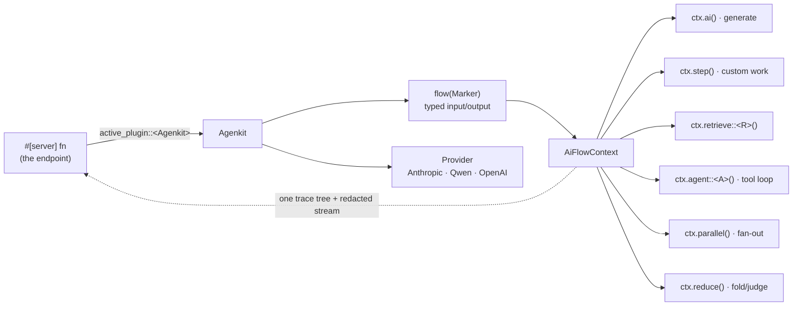

# Agenkit

Agenkit is Pocopine's generative-AI runtime. You configure it **once**, author
**flows** (typed input → typed output, with a declared context manifest and one
correlated trace tree), and call them from plain [`#[server]`](../server/server-functions.md)
functions. The runtime owns the parts that are easy to get wrong: provider
fan-out, structured-output coaxing, redacted progress streams, and
principal-scoped tools.



> **The mental model.** A flow is *internal logic*, not an endpoint. The
> `#[server]` fn is the boundary; the flow runs inside it under the caller's
> principal. Everything the flow touches goes **through `ctx`** so it lands in
> the trace tree and the context manifest — see [Traceable flow
> design](./traceable-flows.md).

## Install & configure

Agenkit ships as its own crates; apps depend on them directly (they are not
re-exported through the `pocopine` umbrella while the surface settles).

```toml
# Cargo.toml
[dependencies]
pocopine-agenkit = { path = "../../crates/pocopine-agenkit" }
# Recommended provider — native Claude Messages API:
pocopine-agenkit-anthropic = { path = "../../crates/pocopine-agenkit-anthropic" }
# first-party Qwen / DashScope compatible-mode provider:
# pocopine-agenkit-qwen = { path = "../../crates/pocopine-agenkit-qwen" }
# or the OpenAI-compatible provider (OpenAI, OpenRouter, Together, vLLM, …):
# pocopine-agenkit-oai = { path = "../../crates/pocopine-agenkit-oai" }
```

Configure the runtime once (§D3). Credentials are read from the environment,
server-side only — they never reach app code or the client bundle (§D10).

```rust
use pocopine_agenkit::prelude::*;
use pocopine_agenkit_anthropic::AnthropicProvider;

fn agenkit() -> Agenkit {
    Agenkit::builder()
        .provider(AnthropicProvider::from_env("anthropic").expect("ANTHROPIC_API_KEY"))
        .default_model(ModelRef::new("anthropic/claude-opus-4-8"))
        .allow_models(["anthropic/claude-opus-4-8"]) // optional allowlist (§D10)
        .tool(WordCount)        // unit struct from #[ai_tool]
        .flow(Summarize)        // marker struct from #[ai_flow]
        .build()
        .expect("valid runtime")
}
```

`MockProvider` is a deterministic in-memory provider for tests and local
development — register it instead of a real provider and seed canned responses
with `.on_prompt_text(..)` / `.on_prompt_structured(..)` / `.on_prompt_tool(..)`.

## Tools and flows: the macros

`#[ai_tool]` turns a typed async fn into an `AiTool` — a unit struct named after
the fn (PascalCase). `#[ai_flow]` does the same for a flow body, generating a
marker that carries the flow's id and typed input/output.

```rust
use pocopine_agenkit::prelude::*;
use pocopine_agenkit::{ai_flow, ai_tool};
use serde::{Deserialize, Serialize};

#[derive(Serialize, Deserialize, schemars::JsonSchema)]
struct SummarizeInput { prompt: String }

#[derive(Serialize, Deserialize, Debug, schemars::JsonSchema)]
struct Summary { title: String, words: u32 }

#[derive(Deserialize, schemars::JsonSchema)]
struct WordCountInput { text: String }

/// Count the words in a string.        // doc comment → tool description
#[ai_tool]
async fn word_count(input: WordCountInput, _ctx: AiToolContext) -> AgenkitResult<u32> {
    Ok(input.text.split_whitespace().count() as u32)
}

/// Declare the resources the flow uses, right in the attribute (§D6).
#[ai_flow(tools("word_count"))]
async fn summarize(input: SummarizeInput, ctx: AiFlowContext) -> AgenkitResult<Summary> {
    ctx.ai()
        .system("Summarize the prompt as a title and a word count.")
        .prompt(input.prompt)
        .schema::<Summary>()
        .generate_structured()
        .await
}
```

`#[ai_flow]` generates `struct Summarize` implementing `FlowHandler` (register
with `.flow(Summarize)`) and `FlowDef` (the typed call below). The flow id
defaults to the fn name; override with `id = "…"`. The generated marker is the
PascalCase of the fn name, so **the fn name must not collide with its
input/output type names** (rename the fn or set `id`).

> Prefer the macros, but they are pure sugar — `Flow::new(id, body)` and a
> hand-written `impl AiTool` work identically. `.poco` templates are never
> involved; flows are plain Rust.

## Calling a flow

Two call styles, one method. Prefer the **typed** marker — the id can't be
mistyped, the input is checked against the flow's `Input`, and the output is
inferred:

```rust
let summary: Summary = agenkit()
    .flow(Summarize)                                   // typed marker
    .input(SummarizeInput { prompt: "How do uploads work?".into() })
    .run()
    .await?;
```

The **dynamic** form takes an id string for when the flow isn't known at compile
time (a dev runner, a telemetry console); you pick the output type:

```rust
let value: serde_json::Value = agenkit().flow("summarize").input(input).run().await?;
```

Both builders also expose `.principal(p)` (override the ambient caller identity,
for tests) and `.stream(sink)` (emit a redacted progress stream — see
[Streams & secrets](./streaming-and-secrets.md)).

## Exposing a flow: the `#[server]` boundary

A flow is internal; a `#[server]` fn is the endpoint. Install the Agenkit server
plugin and reach the runtime with `active_plugin`:

```rust
use pocopine_server::{Server, active_plugin};
use pocopine_agenkit::server::{Agenkit, agenkit_server_plugin, to_server_error};

// Wire the runtime + the principal-scoping layer in one call.
Server::new(router)
    .with_auth(my_auth)
    .plugin(agenkit_server_plugin(agenkit()))
    .serve(addr).await?;

#[server(public)]
pub async fn summarize(input: SummarizeInput) -> ServerResult<Summary> {
    active_plugin::<Agenkit>().expect("agenkit_server_plugin installed")
        .flow(Summarize).input(input).run().await
        .map_err(|e| to_server_error(&e))
}
```

The plugin installs a tower layer that scopes the request `Principal` for the
whole request, so the flow's tools, retrieval, and threads run under the caller.
Handlers that need the identity directly can also accept a server-supplied
`RequestContext` or `Extension<Principal>` parameter; see
[`Server functions`](../server/server-functions.md).
[`to_server_error`](./streaming-and-secrets.md#errors-never-leak-internals) maps
an `AgenkitError` to a client-safe `ServerError`, dropping provider internals.

## The flow context

`AiFlowContext` (`ctx`) is the single seam through which a flow does work, so
everything is traced and attributed. The surface:

| Call | Purpose |
| ---- | ------- |
| `ctx.ai()` | A traced generation: `.system(..)`, `.prompt(..)`, then `.generate_text()` / `.schema::<T>().generate_structured()` / `.stream_text()` / `.stream_structured()`. |
| `ctx.step(name, fut)` | Wrap custom app work (a computation, a derived value) in a named, traced step. |
| `ctx.retrieve::<R>()` | Deterministic retrieval against a registered `AiRetriever` — `.query(q).top_k(k).run()`. See [Retrieval](./retrieval.md). |
| `ctx.agent::<A>()` | Run a typed `AiAgent` with its bounded tool-call loop — `.input(x).run()`, `.thread(t)`. |
| `ctx.parallel::<T>(group)` | Bounded concurrent fan-out with a join policy. See [Parallel](./parallel.md). |
| `ctx.reduce(name, candidates)` | Combine candidates into one result via `.fold(..)` (deterministic) or `.system(..).schema::<T>()` (model judge). |
| `ctx.thread::<A>()` | Open/create persistent agent-thread state. See [Threads](./threads.md). |
| `ctx.state::<T>(key)` | Fetch a framework-mediated app resource declared with `uses_state` (§D6). |
| `ctx.principal()` | The caller identity this run executes under. |

Agents are typed too:

```rust
struct Researcher;
impl AiAgent for Researcher {
    const ID: &'static str = "researcher";
    type Input = Question;
    type Output = Answer;            // structured; derives JsonSchema
    fn configure(b: AiAgentBuilder<Self>) -> AiAgentBuilder<Self> {
        b.system("Use the lookup tool, then answer.")
         .tools(["lookup"])          // allowlist (§D5)
         .max_steps(3)               // bounded loop (§D7)
    }
}
// inside a flow body:
let answer: Answer = ctx.agent::<Researcher>().input(question).run().await?;
```

## Where to go next

- **[Traceable flow design](./traceable-flows.md)** — declare resources; why
  hidden reads break tracing; the context-gap diagnostic (§D6).
- **[Retrieval: direct vs. tool](./retrieval.md)** — when a flow retrieves
  directly vs. exposing retrieval as an agent tool (§D5).
- **[Streams & secrets](./streaming-and-secrets.md)** — `FlowStreamEvent` is
  client-safe by construction; `StreamMode` caps; error redaction (§D8/§D10).
- **[Parallel, budget & cancellation](./parallel.md)** — `ParallelJoin`,
  `min_success`, timeouts, in-flight cancellation (§D7/§D8).
- **[Agent threads](./threads.md)** — opaque ids, retention, redacted
  checkpoints, and ownership (§D5).

The canonical, compiles-on-every-commit example is
`crates/pocopine-agenkit/examples/summarize.rs`
(`cargo run -p pocopine-agenkit --example summarize`).
