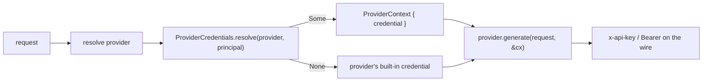

# Provider credentials

A provider needs a secret to call its API — an API key, or an OAuth access
token. Agenkit resolves that credential **per request**, optionally per
**`Principal`** (so each user can bring their own key), and refreshes OAuth
tokens as they expire. It never stores the secret itself: the app owns the
store, and every credential type is host-only and redacted (§D10).

## The model



- The credential is a **`ProviderCredential`** — `ApiKey` (sent via the
  provider's native scheme) or `Bearer` (an OAuth token → `Authorization:
  Bearer`). Its secret is a **`SecretString`**: redacted from `Debug`/`Display`,
  zeroized on drop, reachable only through `expose()`.
- A **`ProviderCredentials`** store resolves the credential. Returning `None`
  falls back to the credential the provider was built with — so a store can
  override only the principals it knows.
- These types are **host-only** and not serializable; they can never appear in a
  client payload, a trace field, or a stream event.

## 1. Env (the default)

Do nothing and Agenkit reads `{PROVIDER}_API_KEY` from the environment
(`EnvCredentials`). First-party provider constructors follow the provider's
native env naming where needed: `AnthropicProvider::from_env` reads
`ANTHROPIC_API_KEY`, and `QwenProvider::from_env` reads `DASHSCOPE_API_KEY`
with `QWEN_API_KEY` as a local-development fallback.

```rust
let agenkit = Agenkit::builder()
    .provider(AnthropicProvider::from_env("anthropic")?)  // ANTHROPIC_API_KEY
    .default_model(models::anthropic::CLAUDE_OPUS_4_8)
    .build()?;
```

## 2. Per-user keys (BYOK)

Implement `ProviderCredentials` and key on the caller `Principal`. The store
lives in *your* app (a DB, a secrets manager); pocopine just calls it.

```rust
use pocopine_agenkit::server::{
    BoxFuture, Principal, ProviderCredential, ProviderCredentials,
};
use pocopine_agenkit_core::AgenkitResult;

struct PerUserKeys { /* a handle to your store */ }

impl ProviderCredentials for PerUserKeys {
    fn resolve<'a>(
        &'a self,
        provider: &'a str,
        principal: &'a Principal,
    ) -> BoxFuture<'a, AgenkitResult<Option<ProviderCredential>>> {
        Box::pin(async move {
            let Some(user) = principal.user() else { return Ok(None) };
            let key = self.lookup(provider, &user.id).await?;        // your store
            Ok(key.map(ProviderCredential::api_key))
        })
    }
}

let agenkit = Agenkit::builder()
    .provider(AnthropicProvider::new("anthropic", "")) // no baked key — BYOK only
    .credentials(std::sync::Arc::new(PerUserKeys { /* … */ }))
    .default_model(models::anthropic::CLAUDE_OPUS_4_8)
    .build()?;
```

The principal is the one in scope for the request (set by the
`agenkit_server_plugin` principal layer). Each user's call carries their own key.

## 3. OAuth (auth-code + PKCE)

For providers behind OAuth, pocopine drives the full flow. Tokens still live in
*your* store — pocopine refreshes them.

**Configure** the provider's endpoints (pocopine doesn't hardcode third-party
OAuth URLs):

```rust
let config = OAuthConfig::public(
    "https://provider.example/oauth/authorize",
    "https://provider.example/oauth/token",
    "your-client-id",
    "https://your-app.example/oauth/callback",
).with_scopes(["models.read"]);
```

**Start** the flow — redirect the user, stash the verifier + state:

```rust
let auth = begin_authorization(&config)?;
// save (auth.pkce_verifier, auth.state) keyed to the user's session, then:
redirect(&auth.authorize_url);
```

**Complete** it at your callback `#[server]` fn — verify `state`, exchange the
code, and save the token in your store:

```rust
#[server(guard = pocopine::auth::require_login)]
pub async fn oauth_callback(code: String, state: String) -> ServerResult<()> {
    let (verifier, expected_state) = load_session()?;       // your store
    if state != expected_state { return Err(ServerError::bad_request("bad state")); }
    let token = complete_authorization(&config(), &code, &verifier).await
        .map_err(|e| to_server_error(&e))?;
    save_oauth_token(current_principal(), token).await?;    // your store
    Ok(())
}
```

**Use** it — `OAuthCredentials` loads the principal's token, refreshes it when
near expiry (saving the result through your `OAuthTokenStore`), and resolves it
to a `Bearer`. The store keys on an opaque `subject` string (the user id), so
the flow + store live in the provider-neutral `pocopine-auth-oauth` crate and
the same OAuth machinery can later back a "Sign in with X" login:

```rust
impl OAuthTokenStore for MyTokenStore {
    fn load<'a>(&'a self, subject: &'a str) -> StoreFuture<'a, Option<OAuthToken>> { … }
    fn save<'a>(&'a self, subject: &'a str, token: OAuthToken) -> StoreFuture<'a, ()> { … }
}

let agenkit = Agenkit::builder()
    .provider(provider)
    .credentials(std::sync::Arc::new(OAuthCredentials::new(config, MyTokenStore::new())))
    .default_model(model)
    .build()?;
```

An `OAuthConfig` authenticates **one** identity provider, so with more than one
provider registered you must scope the resolver — `OAuthCredentials::new(config,
store).for_provider("anthropic")` — or its token would be handed to every
provider (an Anthropic OAuth token sent to the OpenAI endpoint). A request for
any other provider then resolves to `None`, falling back to that provider's own
credential.

## The §D10 boundary

| Guaranteed | How |
| ---------- | --- |
| A credential never reaches the client | host-only types, not serializable; never in `FlowStreamEvent` / trace fields |
| A secret never lands in a log or panic | `SecretString` redacts `Debug`/`Display`, zeroizes on drop |
| A token-endpoint error never echoes the body | `to_server_error`-style collapse to a stable kind (the body can quote a code/secret) |
| Pocopine is not a secret vault | the app owns the store; pocopine resolves + refreshes only |

Deploy-time host credentials (`credentials.toml`, used to authenticate the
*deploy* process to Railway/Render/…) are a **separate** concern and never mix
with these app-runtime provider credentials.
