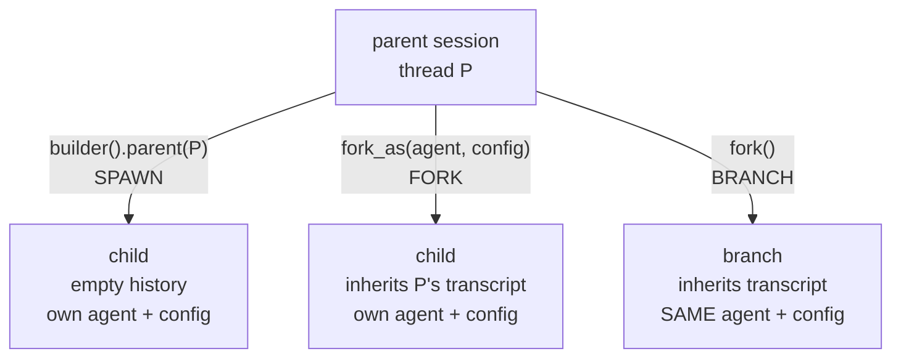

# Delegation and subagents

A long-running agent eventually wants to hand work to a **child**: "go search
the codebase and report back." Done well, the child burns its own context
window and returns a conclusion; the parent's history stays short.

Agenkit ships the **primitives** for that — the thread lineage and the session
plumbing — and deliberately stops there. The tool the model actually calls
(`subagent.run`, a spawn/wait handle pair, whatever suits), the agent catalog,
the budgets and the approval UX are **host concerns**: they are product and
policy decisions, and they live in the app that embeds the runtime, next to its
tool registry. This guide covers both halves: what the framework gives you, and
the rules to follow when you build the rest.

## Two ways to start a child

The choice is what the child inherits:



| | inherits transcript | own identity | use it for |
|---|---|---|---|
| `builder().parent(id)` | no | yes | delegation — a self-contained task |
| `fork_as(agent, config)` | yes | yes | delegation needing the conversation so far |
| `fork()` | yes | no | branching / undo, not delegation |

Both delegation forms record the parent in the **session forest**, so the
delegation tree is walkable afterwards (exports, audits, a UI that shows what
spawned what). That link is not a private attribute you invent — it is the same
`parent` pointer the store already understands.

### Spawn: fresh context, recorded lineage

```rust
let child = AgentSession::builder(&agenkit)
    .agent_id("researcher")
    .config(child_config)          // narrowed tools, own system prompt
    .principal(principal.clone())  // same principal — delegation never escalates
    .parent(parent.id().clone())   // the lineage edge
    .open(None)
    .await?;
```

The child starts with **no history** — that is the point of delegating — while
`parent` is still recorded as its origin. `parent()` applies when the builder
creates a thread; combining it with resuming an existing thread is a config
error rather than a silent no-op, because a resumed thread's lineage is already
fixed and the two intents contradict.

### Fork-as: inherited context, new identity

```rust
let reviewer = parent
    .fork_as("reviewer", AgentConfig::new()
        .system("Review the work above. Report problems only.")
        .tools(["fs.read"]))
    .await?
    .expect("store can branch")
    // A branch inherits the parent's tool hook. Swap in the child's own gate.
    .with_before_tool_call(fail_closed_gate);
```

The child replays everything the parent has seen, then runs under its own
instructions, tools, model and step budget. Use it when the task only makes
sense with the conversation as context; prefer a spawn otherwise, since a fork
pays for the inherited history on every one of the child's model calls.

Both return a plain `AgentSession`. There is no separate "subagent runtime" —
you drive the child with `prompt()`, stop it with `abort_handle()`, and read
`usage()` / `cost()` exactly as you would any session.

## The rules a host must apply

The framework will not enforce these for you. They are what separates
delegation from privilege escalation.

### 1. Attenuate — the child can only narrow

```text
child_tools = (spec_tools if non-empty else parent_tools)
            ∩ parent_tools
            ∩ requested_tools
            − the delegation tools themselves
```

A spec or a model-supplied argument naming a tool the parent does not hold is a
**loud spawn error**, never a silent drop; an empty intersection is an error
too, not a child with no tools. Strip your own delegation tools from the child's
set unless you explicitly allow recursion, and cap the depth when you do.

### 2. Fail closed inside the child

Wire the **same** policy evaluation into the child's `before_tool_call` hook
that the parent uses, and give the child **no approver** by default so every
"ask the operator" decision resolves to a denial. A child can then use only
tools that are already allowed outright. This keeps autonomous fan-out from
stalling on interactive prompts, and makes delegation strictly non-escalating:
nothing a child does could not have been done directly by its parent.

A spawned child takes its hook from the builder. A **forked** child inherits the
parent's — including an interactive approval gate an autonomous child would
block on — so replace it explicitly with `with_before_tool_call`, or clear it
with `without_before_tool_call` before installing your own. Re-hooking a branch
never reaches the parent.

Keep the child on the **same principal**. Owner scoping is what stops one
user's threads from being readable by another; a child that switched principals
would be a hole in it.

### 3. Re-derive per-child state, never share live handles

Anything holding a live connection or a resolved secret is re-derived for the
child, not cloned:

- connection pools and dynamically discovered tool sets: fork the runtime that
  owns them, so no live transport is shared;
- secrets: pass **grants**, never values, and only the ones marked inheritable,
  minting fresh handles on the child's side;
- per-agent memory or scratch namespaces: key them on the child's agent id so
  its writes cannot collide with the parent's.

### 4. Budget everything, and record it

Cap the number of children per session tree, the recursion depth, each child's
wall-clock (a timeout plus `abort_handle()`), and the size of the report you
splice back. Cost ceilings read from the child's own recorded usage — a session
records usage per turn, and a forked thread reports only its **own** turns, so
summing across a tree never double-counts an inherited prefix.

### 5. Return a report, not a transcript

The child's final assistant message — bounded, with a truncation flag — is what
goes back to the parent as the tool result. The full transcript stays in the
child's thread, reachable through the lineage edge. Returning it as ordinary
tool output also means the host's normal redaction applies with no extra work.

## What to persist

Record the delegation in your session metadata as its own event kind at both
ends: the parent gets a "spawned" event carrying the child's thread id, and the
child's own opening event carries the inverse reference. Agenkitty ships
`subagent_started` / `subagent_finished` for exactly this, and its event-kind
decoding tolerates kinds it doesn't know, so an older reader can still open a
log written by a newer build.

## See also

- [Agent threads](threads.md) — ownership, retention and the durable store
- [Streaming and secrets](streaming-and-secrets.md) — the redaction boundary a
  report crosses
- [Parallel fan-out](parallel.md) — the *author-directed* alternative when the
  branches are known at compile time and don't need attenuation
