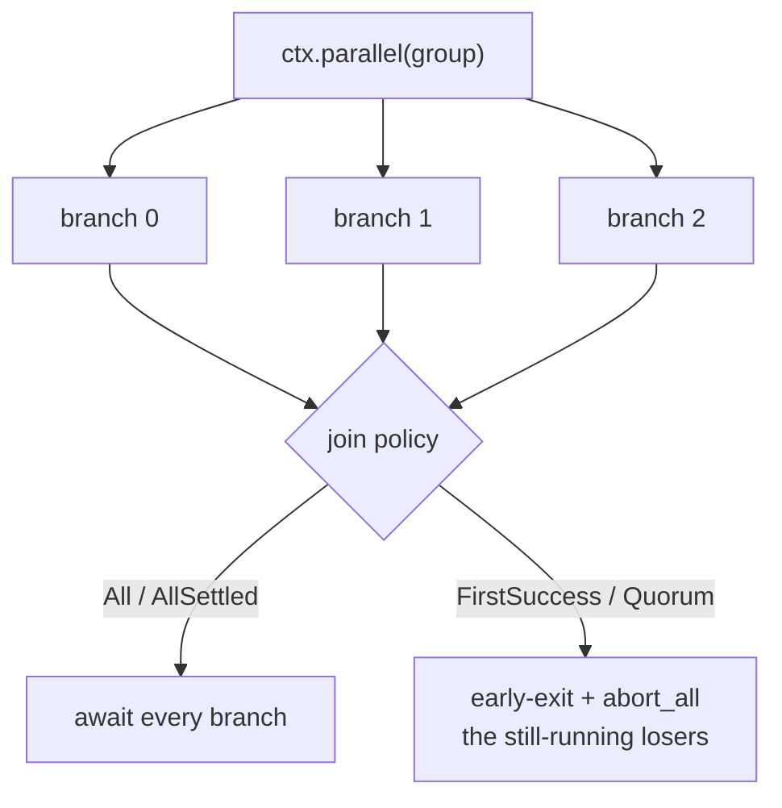

# Parallel, budget & cancellation

`ctx.parallel(group)` runs branches concurrently with a **join policy**, bounded
concurrency, and per-branch timeouts — and, unlike a fire-and-forget fan-out, it
**cancels losing branches in flight** (§D7).

```rust
let candidates = ctx
    .parallel::<CandidateAnswer>("candidate_answers")
    .join(ParallelJoin::AllSettled)
    .min_success(2)
    .max_concurrency(3)
    .branch(ctx.agent::<Researcher>().input(q1).run())
    .branch(ctx.agent::<Researcher>().input(q2).run())
    .branch(ctx.agent::<Researcher>().input(q3).run())
    .run()
    .await?;

// Then combine the survivors — see "Reducing" below.
let answer: FinalAnswer = ctx.reduce("judge", candidates)
    .system("Keep only claims supported by evidence.")
    .schema::<FinalAnswer>()
    .await?;
```

## Join policies

`ParallelJoin` decides when the group is done and what it returns:

| Policy | Waits for | Returns | Cancels losers? |
| ------ | --------- | ------- | --------------- |
| `All` | every branch | all successes, or **fails** on the first failure | on first failure |
| `AllSettled` *(default)* | every branch | the successes; failures recorded | no |
| `FirstSuccess` | the first success | that one success | **yes**, in flight |
| `Quorum(n)` | `n` successes | the successes so far | **yes**, once `n` met |



## Bounds: concurrency, timeout, min-success

- **`.max_concurrency(n)`** caps how many branches run at once (the rest queue);
  defaults to all branches.
- **`.timeout(duration)`** is per-branch — a timed-out branch is a *failure*,
  not a hang.
- **`.min_success(m)`** is a floor that composes with the join: an early-exit
  policy keeps racing until `m` successes are reached rather than returning too
  few. If the floor can't be met, the group fails (it never silently returns
  fewer).

## Cancellation is real

On `FirstSuccess` / `Quorum`, once the target is met the remaining branches are
**aborted in flight** (`JoinSet::abort_all`) — a slow loser stops doing work
immediately; it isn't left running to completion and discarded (§D15 DC-7).
Branches that *had already finished* when the target was met keep their true
terminal (completed/failed); only genuinely-still-running branches are marked
cancelled.

## Failure semantics

A branch that **panics** is a branch *failure*, not a silent skip: `All` aborts
the group, `AllSettled` records it and keeps the survivors. So a partial result
set never hides a crashed branch.

## What the trace shows

A group emits `ai_parallel_started` → per-branch
`ai_step_started` + a terminal (`completed` / `failed` / `cancelled`) →
`ai_parallel_completed { success_count }`. Every started branch reaches exactly
one terminal — the tree never has a dangling open branch under a completed
group, which is what lets a client reconstruct the fan-out faithfully (§D8). The
same events ride the redacted [progress stream](./streaming-and-secrets.md) as
`BranchStarted` / `BranchCompleted` / `BranchFailed` / `BranchCancelled` (ids
and counts only).

## Reducing the survivors

`ctx.reduce(name, candidates)` combines a `Vec<T>` into one result and is the
natural follow-up to a fan-out:

- **Deterministic** — `.fold(|values| Ok(best))` for a pure combine (max, merge,
  vote). Reproducible and free.
- **Model judge** — `.system("…").schema::<O>().await` to have the model pick or
  synthesize a typed result.

Prefer a deterministic `fold` when the combine rule is expressible in code;
reach for the model judge only when the choice genuinely needs judgement. A
reducer emits `ai_reducer_started` / `ai_reducer_completed` in the tree.

## Budget

Bound cost at the edges: `max_steps` on an agent caps its tool loop, `timeout`
caps a branch, and the model allowlist (`builder.allow_models([…])`) keeps a
flow from resolving an unexpected (expensive) model. A flow that fans out
unbounded work is the easy-but-wrong path — cap branches with `max_concurrency`
and gate the floor with `min_success`.
