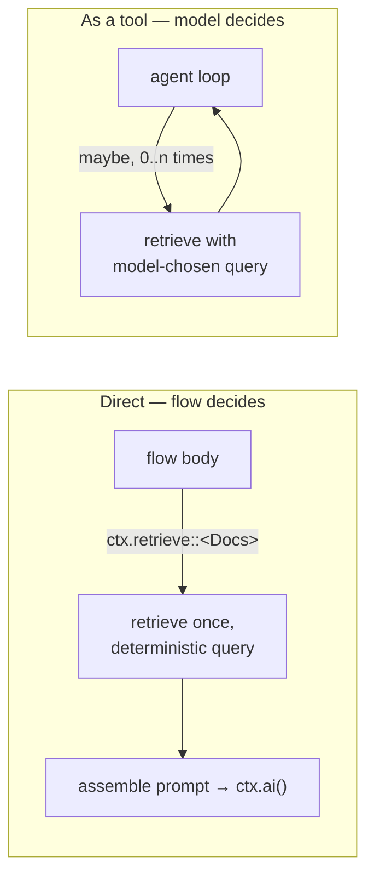

# Retrieval: direct vs. tool

A registered `AiRetriever` can be reached two ways, and the choice is about
**who decides to retrieve** (§D5):

- **Direct** — *the flow* decides. `ctx.retrieve::<R>()` runs a deterministic
  lookup at a point the flow chooses.
- **As a tool** — *the model* decides. The retriever is exposed in an agent's
  tool set; the agent's loop calls it if and when it judges it useful.



## The rule

> **Retrieve directly when retrieval is part of the flow's plan; expose it as a
> tool when retrieval is part of the model's reasoning.**

Use **direct retrieval** when:

- The flow *always* retrieves (classic RAG: fetch context, then answer).
- You want a deterministic, reproducible query (e.g. derived from the input),
  which makes the run easy to evaluate and cache.
- You control assembly — ranking, dedup, truncation — before the model sees it.

Expose retrieval **as a tool** when:

- Whether to look something up depends on the conversation, and the model is
  best placed to decide.
- The query is something the *model* formulates (it may search several times
  with refined queries).
- You're building an agent that interleaves tool calls and reasoning.

If unsure, start **direct** — it's deterministic, cheaper, and easier to trace
and test. Reach for the tool form when you observe the model genuinely needs to
decide.

## Direct retrieval

Define a typed retriever and call it from the flow:

```rust
#[derive(Default)]
struct ProjectDocs;
impl AiRetriever for ProjectDocs {
    const ID: &'static str = "project_docs";
    type Query = DocsQuery;
    fn descriptor() -> RetrieverDescriptor {
        RetrieverDescriptor::new("project_docs", "Search project docs").with_source_kinds(["doc"])
    }
    fn retrieve(&self, q: DocsQuery, _ctx: RetrievalContext) -> BoxFuture<'_, AgenkitResult<RetrievalSet>> {
        Box::pin(async move { /* … */ })
    }
}

// register: .retriever(ProjectDocs)   ·   declare: uses_retriever("project_docs")
#[ai_flow(retrievers("project_docs"))]
async fn answer(input: Question, ctx: AiFlowContext) -> AgenkitResult<Answer> {
    let docs = ctx.retrieve::<ProjectDocs>()
        .query(DocsQuery { question: input.question })
        .top_k(3)
        .run()
        .await?;
    let context = ctx.step("assemble", async move {
        Ok::<_, AgenkitError>(docs.hits.iter().map(|h| h.content.as_text()).collect::<Vec<_>>().join("\n"))
    }).await?;
    ctx.ai().system("Answer using the retrieved docs.").prompt(context)
        .schema::<Answer>().generate_structured().await
}
```

Direct retrieval emits `ai_retrieval_started` / `ai_retrieval_completed` (with a
hit count, never the hit contents) under the flow's tree.

## Retrieval as an agent tool

To let the model invoke retrieval, expose the retriever in an agent's tool set.
`AiRetriever::as_tool()` wraps a (default-constructible) retriever as a tool,
and `builder.tool_dyn(..)` registers it under the same id:

```rust
let agenkit = Agenkit::builder()
    .provider(provider)
    .tool_dyn(ProjectDocs::as_tool())   // the retriever, now callable by the model as "project_docs"
    .build()?;

struct Researcher;
impl AiAgent for Researcher {
    const ID: &'static str = "researcher";
    type Input = Question;
    type Output = Answer;
    fn configure(b: AiAgentBuilder<Self>) -> AiAgentBuilder<Self> {
        b.system("Search the docs as needed, then answer.")
         .tools(["project_docs"])     // the model may call it 0..n times
         .max_steps(4)
    }
}
```

Tool-driven retrieval shows up in the trace as `ai_tool_started` /
`ai_tool_completed` inside the agent's step loop — each call the model chose to
make, bounded by `max_steps`.

## Don't: retrieve outside `ctx`

A raw vector-DB or search call inside a flow body (or a tool body that bypasses
the registry) is the wrong path for the same reasons as any [hidden
read](./traceable-flows.md#why-hidden-reads-are-the-wrong-path): it's untraced,
not principal-scoped, and undeclared. Register the retriever and reach it
through `ctx.retrieve` (direct) or the tool set (model-driven).
