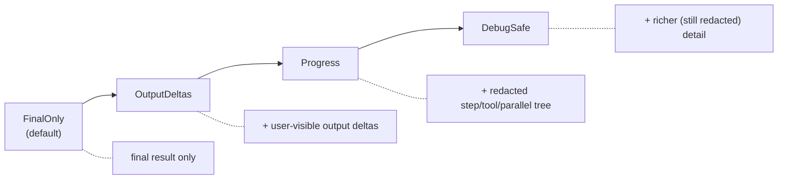

# Streams & secrets

A flow can stream progress to the browser. The design guarantees that nothing
sensitive crosses the wire — but only if you understand what's safe and don't
route around it (§D8/§D10).

## `FlowStreamEvent` is client-safe by construction

The only type that reaches a browser is `FlowStreamEvent`. Its variants carry
**ids, kinds, counts, error *kinds*, and user-visible output** — and nothing
else. There is no variant that can hold a raw prompt, tool arguments, hidden
reasoning, or a provider payload:

| Crosses the wire | Never on the wire |
| ---------------- | ----------------- |
| run/trace ids, step & group ids | the prompt or system text |
| step/tool/parallel/reducer **kinds** and lifecycle | tool-call arguments |
| counts (branches, hits, tokens) | retrieved document contents |
| reasoning **activity** (`ThinkingDelta`, a char *count*) | reasoning text — *unless author allows **and** caller requests* |
| `error_kind` (`"provider"`, `"config"`, …) | provider request/response bodies |
| user-visible output (`OutputDelta`, `ObjectDelta`) | API keys / credentials |

Reasoning ("thinking") content is the one redaction that can be lifted, behind a
**two-part gate**. By default the model's chain of thought rides the assistant
message **server-side** (for replay and observability) and never reaches the
client — only a `ThinkingDelta { chars }` count crosses (under `Progress`+
visibility), enough for a "thinking…" indicator without exposing the text.

Reasoning text crosses the wire only when **both** hold:

1. **The author permits it** (the ceiling) — `#[ai_flow(reasoning)]` or
   `Flow::expose_reasoning`. A flow that never opts in can't have its reasoning
   extracted by any caller.
2. **The caller requests it** (per call) — `.request_reasoning(true)` on the flow
   call. A `#[server]` fn wires this from the client's request (a query flag), so
   a "thinking panel" is shown when the client asks for it and the author allowed
   it.

The effective exposure is the **AND** of the two; either off → `ThinkingDelta`
carries only its char count. Everything else in the right-hand column (prompts,
tool args, retrieved content, credentials) stays redacted regardless.

```rust
// Author opens the ceiling on the flow:
#[ai_flow(public, reasoning, stream = "output_deltas")]
async fn answer(input: Question, ctx: AiFlowContext) -> AgenkitResult<String> { … }

// The streaming #[server] fn relays the client's choice:
#[server(public)]
async fn answer_stream(input: Question, show_thinking: bool)
    -> StreamServerResult<FlowStreamEvent>
{
    active_plugin::<Agenkit>().unwrap()
        .flow(Answer).input(input)
        .request_reasoning(show_thinking) // caller half of the gate
        .stream()
}
```

> The in-process **`stream_into(sink)`** sink is different: it is a *trusted,
> full-fidelity* server-side consumer (for a dev building/observing an agent) and
> applies **no** redaction — it always carries reasoning. Don't forward its
> events to an untrusted client as-is; use `.stream()` for the wire.

Because the contract is structural, you can't accidentally leak by adding a
field to your own type — the stream only ever speaks `FlowStreamEvent`.

## `StreamMode`: the visibility cap

A flow opts **into** exposing progress. `StreamMode` is the cap the author
declares; a client may request *less* visibility, never more (the route clamps
the request to the declared cap).



- **`FinalOnly`** (default) — stream nothing but the final result.
- **`OutputDeltas`** — also stream user-visible output as it's produced.
- **`Progress`** — also stream the redacted step/tool/parallel/reducer tree
  (kinds + counts, no contents).
- **`DebugSafe`** — the most detail, still redacted.

Declare the cap in the attribute (or `Flow::stream_mode`):

```rust
#[ai_flow(public, stream = "progress")]   // or "final_only" / "output_deltas" / "debug_safe"
async fn summarize(input: SummarizeInput, ctx: AiFlowContext) -> AgenkitResult<Summary> { … }
```

## Streaming a flow

A flow streams to the browser through a normal **streaming `#[server]` fn**
(RFC-107) that returns `StreamServerResult<FlowStreamEvent>`. The macro emits the
SSE handler and the typed client stub, so there is no route to mount:

```rust
#[server(public)]
pub async fn summarize_stream(input: SummarizeInput) -> StreamServerResult<FlowStreamEvent> {
    active_plugin::<Agenkit>().unwrap().flow(Summarize).input(input).stream()
}
```

`.stream()` enforces the same boundary as a unary flow call, plus one extra gate:

- **Only `public` flows are reachable.** A flow not marked `.public()` is
  indistinguishable from an unknown one — internal flows are never exposed
  by id (§D9).
- **One redaction chokepoint.** Every event passes through `stream_filter` as
  the last transform before the wire; it enforces the `StreamMode` clamp and is
  the single place that decides what crosses. A new `FlowStreamEvent` variant
  won't compile until its visibility is classified there.

The client consumes it through the macro-generated stub:

```rust
let mut events = summarize_stream(input).await?;     // ServerStream<FlowStreamEvent>
while let Some(event) = events.next().await { /* event: ServerResult<FlowStreamEvent> */ }
```

A **trusted, in-process** consumer that wants the typed result *and* the events on
its own channel can use the lower-level sink form instead. Unlike `.stream()`,
this is **full fidelity** — no redaction or `StreamMode` cap, so the sink sees
raw `ThinkingDelta` text. Use it for a server-side dev tool, not to feed an
untrusted client:

```rust
let (tx, rx) = tokio::sync::mpsc::unbounded_channel();
let _final = agenkit.flow(Summarize).input(input).stream_into(tx).await?; // rx yields raw FlowStreamEvents
```

## Errors never leak internals

A provider error can quote a host, a status, even a credential in its message.
`to_server_error` collapses everything that could carry internals (provider,
config, budget, cancellation, reducer errors) to a **stable kind only** —
`"ai error (provider)"` — and maps validation/tool-policy errors to
`bad_request` / `forbidden`. The same holds on the stream: a failure surfaces as
`FlowFailed { error_kind }`, never the message.

```rust
#[server(public)]
pub async fn summarize(input: In) -> ServerResult<Out> {
    active_plugin::<Agenkit>().unwrap()
        .flow(Summarize).input(input).run().await
        .map_err(|e| to_server_error(&e))   // ← internals dropped here
}
```

## Don't put secrets in trace fields

Trace events take freeform fields (`with_field("name", value)`). These feed
observability, which can surface anywhere — **never** put a prompt, tool args, a
token, or any user content in them. Use ids, kinds, and counts. If you're
emitting your own trace context from a `ctx.step`, the same rule applies: the
field values must be safe to log.
