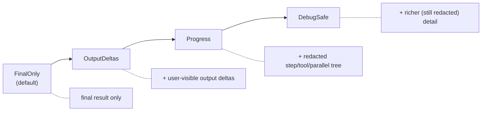

# Streams & secrets

A flow can stream progress to the browser. The design guarantees that nothing
sensitive crosses the wire — but only if you understand what's safe and don't
route around it (§D8/§D10).

## `FlowStreamEvent` is client-safe by construction

The only type that reaches a browser is `FlowStreamEvent`. Its variants carry
**ids, kinds, counts, error *kinds*, and user-visible output** — and nothing
else. There is no variant that can hold a raw prompt, tool arguments, hidden
reasoning, or a provider payload:

| Crosses the wire | Never on the wire |
| ---------------- | ----------------- |
| run/trace ids, step & group ids | the prompt or system text |
| step/tool/parallel/reducer **kinds** and lifecycle | tool-call arguments |
| counts (branches, hits, tokens) | retrieved document contents |
| `error_kind` (`"provider"`, `"config"`, …) | provider request/response bodies |
| user-visible output (`OutputDelta`, `ObjectDelta`) | API keys / credentials |

Because the contract is structural, you can't accidentally leak by adding a
field to your own type — the stream only ever speaks `FlowStreamEvent`.

## `StreamMode`: the visibility cap

A flow opts **into** exposing progress. `StreamMode` is the cap the author
declares; a client may request *less* visibility, never more (the route clamps
the request to the declared cap).



- **`FinalOnly`** (default) — stream nothing but the final result.
- **`OutputDeltas`** — also stream user-visible output as it's produced.
- **`Progress`** — also stream the redacted step/tool/parallel/reducer tree
  (kinds + counts, no contents).
- **`DebugSafe`** — the most detail, still redacted.

Declare the cap in the attribute (or `Flow::stream_mode`):

```rust
#[ai_flow(public, stream = "progress")]   // or "final_only" / "output_deltas" / "debug_safe"
async fn summarize(input: SummarizeInput, ctx: AiFlowContext) -> AgenkitResult<Summary> { … }
```

## The streaming route

Mount the framework's SSE route alongside your app and `Server::with_auth(...)`
so the caller principal is populated:

```rust
use pocopine_agenkit::server::{ai_flow_stream_router, AI_FLOW_STREAM_PATH};
router = router.merge(ai_flow_stream_router(agenkit));   // POST {AI_FLOW_STREAM_PATH}
```

The route enforces the same boundary as a `#[server]` call and one extra gate:

- **Only `public` flows are reachable.** A flow not marked `.public()` is
  indistinguishable from an unknown one (404) — internal flows are never exposed
  by id (§D9).
- **One redaction chokepoint.** Every event passes through `stream_filter` as
  the last transform before the wire; it enforces the `StreamMode` clamp and is
  the single place that decides what crosses. A new `FlowStreamEvent` variant
  won't compile until its visibility is classified there.

From inside the flow, stream by passing a sink to the call builder:

```rust
let (tx, rx) = tokio::sync::mpsc::unbounded_channel();
let _final = agenkit.flow(Summarize).input(input).stream(tx).await?;
// `rx` yields FlowStreamEvents; the route forwards them through stream_filter.
```

## Errors never leak internals

A provider error can quote a host, a status, even a credential in its message.
`to_server_error` collapses everything that could carry internals (provider,
config, budget, cancellation, reducer errors) to a **stable kind only** —
`"ai error (provider)"` — and maps validation/tool-policy errors to
`bad_request` / `forbidden`. The same holds on the stream: a failure surfaces as
`FlowFailed { error_kind }`, never the message.

```rust
#[server(public)]
pub async fn summarize(input: In) -> ServerResult<Out> {
    active_plugin::<Agenkit>().unwrap()
        .flow(Summarize).input(input).run().await
        .map_err(|e| to_server_error(&e))   // ← internals dropped here
}
```

## Don't put secrets in trace fields

Trace events take freeform fields (`with_field("name", value)`). These feed
observability, which can surface anywhere — **never** put a prompt, tool args, a
token, or any user content in them. Use ids, kinds, and counts. If you're
emitting your own trace context from a `ctx.step`, the same rule applies: the
field values must be safe to log.
