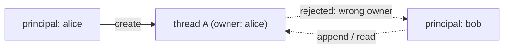

# Agent threads

A **thread** is persistent state for an agent's conversation — the message
history an agent appends to across runs. Threads are opaque, retention-tiered,
and **owned by the principal that created them** (§D5).

## Opening and using a thread

Inside a flow, create or open a thread for an agent and pass it to the run:

```rust
async fn threaded(input: Question, ctx: AiFlowContext) -> AgenkitResult<Answer> {
    let thread = ctx.thread::<Researcher>().create().await?;
    let answer = ctx.agent::<Researcher>()
        .thread(thread.clone())     // the run appends to this thread's history
        .input(input)
        .run()
        .await?;
    // thread.history() reflects the appended exchange
    Ok(answer)
}
```

A run with a thread loads the prior history, runs the agent loop, and appends
the new exchange. Without a thread, an agent run is stateless.

## Opaque ids

Thread ids are **opaque handles** (`AgentThreadId`), not guessable keys. Pass
them between turns as you would any opaque token; never derive them from user
input or expose internal structure through them. The id is what a follow-up
request uses to resume — treat it like a session reference.

## Ownership: a thread belongs to its principal

A thread is bound to the principal that created it. The store enforces this:
reads and appends require the **same owner**, so one caller can never read or
inject into another caller's thread (§D5/§D10). Because flows run under the
caller principal (scoped by the [server plugin](../server/server-plugins.md), or
read directly from a server-supplied [`RequestContext`](../server/server-functions.md)),
this happens automatically — you don't pass identity around.



> This ownership scoping is part of the agenkit hardening work — see the
> thread-ownership fix (issue #214) for the enforcement details and tests.

## Retention

`ThreadRetention` declares how long a thread lives:

| Tier | Lifetime |
| ---- | -------- |
| `Ephemeral` | dropped at the end of the run |
| `Session` | kept for the session |
| `Durable` | persisted durably (a real durable store) |

Pick the shortest tier that fits — `Ephemeral` for a single multi-step run,
`Session` for a conversation, `Durable` only when state must outlive the
session.

## Redacted checkpoints

A thread can carry **checkpoints** — labeled snapshots of progress. Checkpoints
are privacy-labeled and **redacted**: like everything client-facing, they carry
no raw prompts, tool arguments, or provider payloads (§D8/§D10). Don't stash
secrets or user content in a checkpoint expecting it to be private; treat it as
potentially observable.

## Compaction

When a turn's history would overflow the model's context window (the W3 overflow
signal), the agent loop **compacts automatically**: it folds the older prefix
into one summary checkpoint and **keeps the most recent turns verbatim**, so the
model still sees its live, un-paraphrased context. The active context becomes
`[summary, …recent]`; the **full log is untouched** — the kept tail lives only
inside the checkpoint payload, so compaction never duplicates the history it
folds (the failure mode that ballooned other agents' session files). Forks and
audit always replay the complete original history.

The kept tail is bounded by a **token budget**, not a message count: the most
recent turns are kept up to that budget, and a single turn larger than it is
summarized rather than retained — so the kept tail can never itself re-overflow
the window, and an oversized (externalized) turn isn't re-inlined into the
checkpoint.

## Custom stores

Threads run on the durable **session layer** (`server::session`). The default —
`SessionThreadStore::in_memory()` — is dev-only (state is lost on restart). For
durability, back the same `SessionThreadStore` with a durable `SessionStore`:

```rust
use std::sync::Arc;
use pocopine_agenkit::server::{SessionThreadStore, session::SqliteSessionStore};

Agenkit::builder()
    .provider(provider)
    .thread_store(SessionThreadStore::new(Arc::new(
        SqliteSessionStore::open("/var/lib/myapp/threads.db")?,
    )))
    .build()?;
```

The three session stores:

| store | use | `children`/`last_seq` |
| ----- | --- | --------------------- |
| `MemorySessionStore` | tests / dev (lost on restart) | in-memory |
| `JsonlSessionStore` | a cat-able append-only log per thread | scans files (O(n)) |
| `SqliteSessionStore` | **production** (one `.db`, transactional) | indexed |

Threads stay **owner-scoped** across any backend (the owning principal is
persisted on the thread, so the cross-user guard survives a restart). To swap
the persistence wholesale, implement `AgentThreadStore` directly instead.

### Large tool outputs (out-of-line blobs)

A tool that returns a big payload (a fetched document, a base64 blob) would
otherwise inline those bytes into every record — the failure mode that ballooned
other agents' session files. Wrap any store in `ExternalizingSessionStore` to
push payloads over a threshold into a content-addressed `BlobStore`, keeping only
a small ref in the log (rehydrated transparently on read; identical payloads
share one blob):

```rust
use std::sync::Arc;
use pocopine_agenkit::server::session::{
    ExternalizingSessionStore, FsBlobStore, SqliteSessionStore,
};

let store = Arc::new(ExternalizingSessionStore::new(
    Arc::new(SqliteSessionStore::open("/var/lib/app/threads.db")?),
    Arc::new(FsBlobStore::new("/var/lib/app/blobs")),
));
SessionThreadStore::new(store)
```

A custom store must preserve owner-scoping (reject cross-owner access) and the
opaque-id / retention contract — the runtime relies on the store to enforce
them, not just record them.
