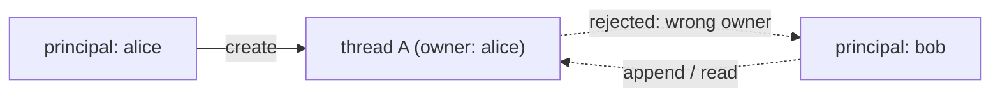

# Agent threads

A **thread** is persistent state for an agent's conversation — the message
history an agent appends to across runs. Threads are opaque, retention-tiered,
and **owned by the principal that created them** (§D5).

## Opening and using a thread

Inside a flow, create or open a thread for an agent and pass it to the run:

```rust
async fn threaded(input: Question, ctx: AiFlowContext) -> AgenkitResult<Answer> {
    let thread = ctx.thread::<Researcher>().create().await?;
    let answer = ctx.agent::<Researcher>()
        .thread(thread.clone())     // the run appends to this thread's history
        .input(input)
        .run()
        .await?;
    // thread.history() reflects the appended exchange
    Ok(answer)
}
```

A run with a thread loads the prior history, runs the agent loop, and appends
the new exchange. Without a thread, an agent run is stateless.

## Opaque ids

Thread ids are **opaque handles** (`AgentThreadId`), not guessable keys. Pass
them between turns as you would any opaque token; never derive them from user
input or expose internal structure through them. The id is what a follow-up
request uses to resume — treat it like a session reference.

## Ownership: a thread belongs to its principal

A thread is bound to the principal that created it. The store enforces this:
reads and appends require the **same owner**, so one caller can never read or
inject into another caller's thread (§D5/§D10). Because flows run under the
caller principal (scoped by the [server plugin](../server/server-plugins.md)),
this happens automatically — you don't pass identity around.



> This ownership scoping is part of the agenkit hardening work — see the
> thread-ownership fix (issue #214) for the enforcement details and tests.

## Retention

`ThreadRetention` declares how long a thread lives:

| Tier | Lifetime |
| ---- | -------- |
| `Ephemeral` | dropped at the end of the run |
| `Session` | kept for the session |
| `Durable` | persisted durably (a real durable store) |

Pick the shortest tier that fits — `Ephemeral` for a single multi-step run,
`Session` for a conversation, `Durable` only when state must outlive the
session.

## Redacted checkpoints

A thread can carry **checkpoints** — labeled snapshots of progress. Checkpoints
are privacy-labeled and **redacted**: like everything client-facing, they carry
no raw prompts, tool arguments, or provider payloads (§D8/§D10). Don't stash
secrets or user content in a checkpoint expecting it to be private; treat it as
potentially observable.

## Custom stores

The default `InMemoryThreadStore` is dev-only (state is lost on restart and not
shared across processes). For anything real, implement `AgentThreadStore`
against your backing store and register it:

```rust
Agenkit::builder()
    .provider(provider)
    .thread_store(MyDurableStore::new(pool))   // implements AgentThreadStore
    .build()?;
```

A custom store must preserve owner-scoping (reject cross-owner access) and the
opaque-id / retention contract — the runtime relies on the store to enforce
them, not just record them.
