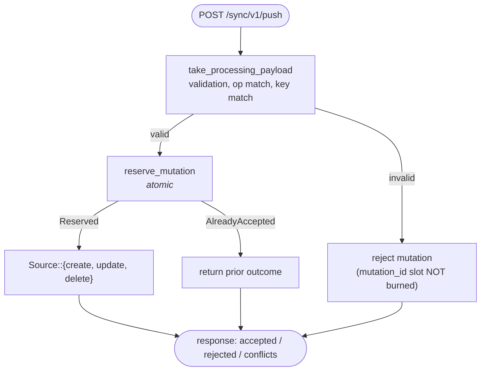
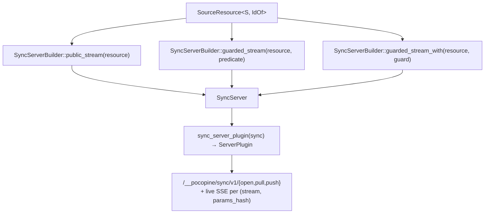

# Sync server contract

What you implement on the host so a sync resource works:

```text
   Source<Row, Id, Draft, Context>      ← your code: DB I/O
            │
            ├── extract_context()       ← typed RequestContext → Self::Context
            ├── list_stream()           ← Stream<Item = SyncResult<Row>>
            ├── get / create / update / delete
            ▼
   SourceResource<S, IdOf>              ← framework wrapper
            ├── version_field?          ← optimistic concurrency
            ├── partition_by?           ← live wake-up precision
            └── mutation_log            ← idempotency (auto-provisioned, dev-warn)
            │
            ▼
   HTTP endpoints                       ← framework provides
       /__pocopine/sync/v1/pull
       /__pocopine/sync/v1/push
       live SSE per (stream, params_hash)
```

The tutorial in [`sync.md`](../../tutorials/issue-tracker-sync.md) walks the full flow. This doc is
the contract reference.

## `Source` trait

```rust
#[allow(async_fn_in_trait)]
pub trait Source: Send + Sync + 'static {
    type Id: SourceId;
    type Row: Clone + Serialize + DeserializeOwned + Send + Sync + 'static;
    type Draft: Clone + Serialize + DeserializeOwned + Send + Sync + 'static;
    type Context: Clone + Send + Sync + 'static;

    fn extract_context<'a>(
        &'a self,
        ctx: pocopine_auth::RequestContext,
    ) -> SourceFuture<'a, SyncResult<Self::Context>>;

    fn list_stream<'a>(
        &'a self,
        ctx: Self::Context,
        query: &'a Query<Self::Row>,
    ) -> SourceStream<'a, Self::Row>;

    fn get<'a>(
        &'a self,
        ctx: Self::Context,
        id: Self::Id,
    ) -> SourceFuture<'a, SyncResult<Option<Self::Row>>>;

    fn create<'a>(
        &'a self,
        ctx: Self::Context,
        id: Self::Id,
        draft: Self::Draft,
    ) -> SourceFuture<'a, SyncResult<Self::Row>>;

    fn update<'a>(
        &'a self,
        ctx: Self::Context,
        id: Self::Id,
        draft: Self::Draft,
        expected_version: Option<RowVersion>,
    ) -> SourceFuture<'a, SyncResult<WriteResult<Self::Row>>>;

    fn delete<'a>(
        &'a self,
        ctx: Self::Context,
        id: Self::Id,
        expected_version: Option<RowVersion>,
    ) -> SourceFuture<'a, SyncResult<DeleteResult<Self::Row>>>;
}
```

### `type Context` + `extract_context`

`Source::Context` is the typed shape your storage methods see —
typically a small struct of `{ tenant_id, user_id, roles, … }`. The
adapter calls `extract_context` once per request before any storage
dispatch; auth failures here short-circuit without touching the
backend.

The `Clone + Send + Sync` bound is required because one push request
can carry multiple mutations and the adapter clones the context into
each. Cheap-to-clone types are the norm; if your context holds
expensive state, wrap the heavy bits in `Arc<…>`.

**Trivial pass-through** — set `type Context = ();`:

```rust
type Context = ();

fn extract_context<'a>(&'a self, _ctx: RequestContext)
    -> SourceFuture<'a, SyncResult<()>>
{
    Box::pin(async { Ok(()) })
}
```

**Typed extractor with auth gating:**

```rust
#[derive(Clone)]
pub struct WorkspaceCtx { pub workspace_id: String, pub user_id: String }

impl Source for IssueStore {
    type Context = WorkspaceCtx;

    fn extract_context<'a>(&'a self, ctx: RequestContext)
        -> SourceFuture<'a, SyncResult<Self::Context>>
    {
        let db = self.db.clone();
        Box::pin(async move {
            let user_id = ctx.user.id_string()
                .ok_or_else(|| SyncError::auth("unauthenticated"))?;
            let workspace_id = ctx.header_str("x-workspace-id")
                .ok_or_else(|| SyncError::client("missing x-workspace-id"))?
                .to_string();
            db.assert_member(&user_id, &workspace_id).await?;
            Ok(WorkspaceCtx { workspace_id, user_id })
        })
    }
    // …list_stream / get / create / update / delete now take WorkspaceCtx
}
```

### `list_stream`

Called by `/pull`. The framework hands you the typed `Query` so you
can push filters down to storage; the return is a boxed stream:

```rust
pub type SourceStream<'a, Row> =
    Pin<Box<dyn futures::stream::Stream<Item = SyncResult<Row>> + Send + 'a>>;
```

The adapter consumes lazily up to `query.limit()` (already clamped to
the resource's `max_snapshot_rows`), then drops the stream. Backends
that yield row-by-row (sqlx `fetch`, IndexedDB cursor) pay only for
the rows the framework keeps. Backends with a `Vec<Row>` in hand wrap
via:

```rust
Box::pin(futures::stream::iter(rows.into_iter().map(Ok)))
```

**Don't ignore `query.limit()`.** The adapter caps the response either
way, but a source that yields beyond `query.limit()` wastes I/O and
trips a one-shot `tracing::warn!`.

### `get`

Called when a client requests a single row by id (detail-view
hydration). `None` covers both not-found and not-visible — the source
decides whether to leak existence.

### `create / update / delete`

Called from `/push` AFTER `MutationLog::reserve_mutation` reserves
the mutation id. Each runs at most once per logical mutation — the
framework handles idempotency on retries.

`update` and `delete` honour optimistic concurrency through
`expected_version`:

```rust
pub enum WriteResult<Row> {
    Applied(Row),
    Conflict(Conflict<Row>),
}

pub enum DeleteResult<Row> {
    Applied,
    Conflict(Conflict<Row>),
}

impl<Row> WriteResult<Row> {
    pub fn into_result(self) -> Result<Row, Conflict<Row>>;
    pub fn as_result(&self)  -> Result<&Row, &Conflict<Row>>;
}
// DeleteResult has the matching pair with `Result<(), …>`.
```

`Conflict::new(server_row, reason)` / `Conflict::stale(server_row)`
build the rejection envelope. The `.into_result()` helper lets you
chain through `?`:

```rust
let row = self.db.try_update(id, draft, expected_version)
    .await
    .map(WriteResult::Applied)?
    .into_result()
    .map_err(SyncError::from)?;
```

### `SourceId`

```rust
pub trait SourceId: Clone + Serialize + DeserializeOwned + Send + Sync + 'static {
    fn to_row_key(&self) -> SyncResult<RowKey>;
}
```

`String` ships with a blanket impl. Custom id types implement this
once.

## `SourceResource` builder

For most `#[query_resource]`-decorated rows the macro emits a
zero-boilerplate convenience constructor:

```rust
use myapp_shared::issue::issues;

let resource = issues::resource(IssueStore::new(db))
    .mutation_log(MemoryMutationLog::with_scope_fn(|ctx| {
        Ok(ctx.tenant_id()?.to_string())
    }));
```

`issues::resource(impl_)` pre-wires three things from the macro
metadata:

| Auto-wired         | Source                                                 |
|--------------------|--------------------------------------------------------|
| `.id(closure)`     | reads `&row.id` (literal field named `id`)              |
| `.version_field`   | reads `&row.version` if the row has one (optional)      |
| `.partition_by`    | `row_to_params_typed` — the typed `RFC 088 §C` projector |

Override any default by chaining the matching setter on the
returned `SourceResource` — e.g. `.id(custom)` for a non-`id`-named
field, `.partition_by(custom)` for a non-standard projector.

The full chain remains available if you don't have a
`#[query_resource]` row, or want explicit control over every
default:

```rust
let resource = source("issues", IssueStore::new(db))?       // 1. name + Source
    .max_snapshot_rows(2_000)?                               //    optional cap
    .schema_version(2)?                                      //    optional bump
    .id(|row: &Issue| row.id.clone())                        // 2. id projector
    .version_field(|row|                                     //    optional: OCC
        Ok(Some(RowVersion::new(&row.version)?)))
    .partition_by(issues::row_to_params_typed)               //    optional: live
    .mutation_log(MemoryMutationLog::with_scope_fn(|ctx| {   //    optional: see note
        Ok(ctx.tenant_id()?.to_string())
    }));
```

| Method                 | Required?     | Purpose                                       |
|------------------------|---------------|-----------------------------------------------|
| `source(name, impl)`   | yes           | Resource name + your `Source`.                |
| `max_snapshot_rows(n)` | no            | Cap per-pull rows; default is generous.       |
| `schema_version(v)`    | no            | Bump to invalidate older client caches.       |
| `id(closure)`          | yes           | Project `&Row → Id`. Finalises the builder.   |
| `version_field(c)`     | no            | Extract `RowVersion` for OCC.                 |
| `partition_by(c)`      | recommended   | Per-(stream, params_hash) live wake-ups.      |
| `mutation_log(impl)`   | **production**| Idempotency log impl (next section).          |

### `.mutation_log()` is "production-required, dev-default"

Omitting `.mutation_log(...)` no longer hard-errors. The `.id(...)`
finalizer defaults to `MemoryMutationLog::new()`; on the first push
under the default, a one-shot `tracing::warn!` fires:

```text
SourceResource using the default in-memory MutationLog. Replays
after process restart will be lost. Production: call
.mutation_log(MemoryMutationLog::with_scope_fn(...)) on the
builder, or attach a durable backend.
```

Explicit `.mutation_log(...)` silences the warn. Match the log's
scope to your tenant boundary — see [Scoping](#scoping) below.

## `MutationLog`

```rust
#[async_trait::async_trait]
pub trait MutationLog<Row>: Send + Sync + 'static
where Row: Clone + Send + Sync + 'static
{
    async fn reserve_mutation(
        &self,
        ctx: &RequestContext,
        candidate: AcceptedMutation,
    ) -> SyncResult<MutationReservation>;

    async fn accepted_mutation(
        &self,
        ctx: &RequestContext,
        mutation_id: &MutationId,
    ) -> SyncResult<Option<AcceptedMutation>>;
}

pub enum MutationReservation {
    Reserved,
    AlreadyAccepted(AcceptedMutation),
}
```

### Invariant: `reserve_mutation` is the ONLY safe primitive

The push handler ONLY calls `reserve_mutation`. A check-then-record
sequence using `accepted_mutation` + (some hypothetical `record`)
would let two concurrent retries both run `Source::create` — that's a
correctness bug. `accepted_mutation` is for replay/diagnostic peek
only.

Production impls implement reservation atomically:

```sql
INSERT INTO mutation_log (scope, mutation_id, …)
VALUES ($1, $2, …)
ON CONFLICT (scope, mutation_id) DO NOTHING
RETURNING …;
```

Insert wins → `Reserved`. Conflict path returns the prior row →
`AlreadyAccepted(prior)`. Same transaction as the
`Source::create/update/delete` below it.

### Scoping

`MemoryMutationLog::with_scope_fn(closure)` projects a scope key from
the `RequestContext`:

```rust
MemoryMutationLog::<Issue>::with_scope_fn(|ctx| {
    Ok(ctx.tenant_id()?.to_string())
});
```

The same `mutation_id` reused across tenant A and tenant B is treated
as TWO different mutations. **Production scope MUST mirror your auth
boundary** — otherwise tenant A can replay tenant B's mutation id.
The log receives the raw `RequestContext` (not `Source::Context`)
because the idempotency boundary is the auth model, not the source's
typed-context view of it.

## `partition_by` and live wake-ups

Auto-wired by `issues::resource(impl_)`; the manual form is:

```rust
.partition_by(issues::row_to_params_typed)
```

The `#[query_resource]`-emitted `row_to_params_typed` extracts the
**required** fields from a row into typed `StreamParams`. On every
accepted mutation the framework hashes those params and publishes to
the topic `(stream, params_hash)`:

```text
mutation accepted: Issue { workspace_id: "W1", … }
        │
        ▼
row_to_params → StreamParams { workspace_id: "W1" }
        │
        ▼
params_hash(W1) = 0xabc…
        │
        ▼
SSE topic: (issues, 0xabc…)
        │
        ├──▶ W1 subscribers wake
        └──✗ W2 subscribers stay silent
```

A resource with zero `#[query_param(required)]` fields collapses to
the bare stream tag (every push wakes every subscriber). The macro
emits a `tracing::warn!` so the trade-off is visible.

## Schema migration

Two knobs:

1. **`schema_version`** on `#[query_resource]` and on `SourceResource`.
   Bump both when the wire shape changes; old clients receive a
   migration hint on `/pull`.
2. **`take_processing_payload()`** on incoming mutations. The framework
   runs any registered migrations BEFORE you decode into your typed
   `Draft`. If migration fails, the mutation is rejected with a clear
   reason and the slot is never burned — so a corrected retry can win
   the reservation.

This means the order at the server is:



Reserving BEFORE validation would leak the mutation id slot on
malformed first tries, so a well-formed retry would be rejected as a
"replay mismatch". The current ordering avoids that.

## Errors

`Source` methods return `SyncResult<...>` = `Result<..., SyncError>`.
Translation:

- `SyncError::Auth(_)` → HTTP 401/403 — returned from `extract_context`
  to short-circuit unauthorised requests.
- `SyncError::Client(_)` → HTTP 400 — bad id format, missing required
  param, etc.
- `SyncError::Backend(_)` → HTTP 500 — unrecoverable storage failures.

Use the matching constructor (`SyncError::auth(msg)`,
`SyncError::client(msg)`, `SyncError::backend(msg)`).

## Mount points: registering a resource on the server

`SourceResource` implements `pocopine_sync::SyncStreamSource`, so it
plugs straight into the existing sync server builder. Three install
shapes — pick the right one for your auth model:



### 1. Public stream

```rust
let sync = SyncServer::builder()
    .public_stream(issues_resource(store)?)
    .events(Arc::new(live_backend()))
    .build();
```

### 2. Predicate-guarded

```rust
let sync = SyncServer::builder()
    .guarded_stream(issues_resource(store)?, Predicate::authenticated())
    .events(Arc::new(live_backend()))
    .build();
```

Evaluated against the `RequestContext` on every `/open`, `/pull`,
`/push`. Good for "any signed-in user" gates that don't need an
async DB lookup.

### 3. Async-context guard

```rust
struct WorkspaceMembershipGuard { db: Db }

#[async_trait]
impl SyncStreamGuard for WorkspaceMembershipGuard {
    async fn check(&self, ctx: &RequestContext) -> SyncResult<()> {
        let workspace_id = ctx.path_param("workspace_id")?;
        self.db.assert_member(ctx.user_id()?, workspace_id).await?;
        Ok(())
    }
}

let sync = SyncServer::builder()
    .guarded_stream_with(issues_resource(store)?, WorkspaceMembershipGuard { db })
    .events(Arc::new(live_backend()))
    .build();
```

Note: `SyncStreamGuard::check` runs BEFORE `Source::extract_context`.
Use the guard for stream-level gating ("is this user a workspace
member?"); use `extract_context` for request-level shape
("which workspace, as a typed handle?"). They're complementary.

### Install on `Server`

```rust
use pocopine_server::Server;

let server = Server::builder()
    .plugin(sync_server_plugin(sync))     // /open, /pull, /push
    .plugin(live_plugin(live_backend()))  // SSE wake-ups
    .build();
```

Routes mounted per stream:

| Route                              | Method | Used by                       |
|------------------------------------|--------|-------------------------------|
| `/__pocopine/sync/v1/open`         | POST   | First subscription open       |
| `/__pocopine/sync/v1/pull`         | POST   | Snapshot + incremental pull   |
| `/__pocopine/sync/v1/push`         | POST   | Typed + raw client writes     |
| `/__pocopine/live/v1/…`            | GET    | SSE wake-up (via live plugin) |

Client posts to these paths by default. Mount under a different
prefix → match via
`query_client_plugin().endpoint("/your/prefix")` on the client.

### Multiple resources

`SyncServerBuilder` accepts one resource per `stream` name. Chain
multiple on the same builder; each `#[query_resource(name = "...")]`
becomes its own stream:

```rust
let sync = SyncServer::builder()
    .guarded_stream_with(issues_resource(store.clone())?,    guard.clone())
    .guarded_stream_with(comments_resource(store.clone())?,  guard.clone())
    .guarded_stream_with(projects_resource(store.clone())?,  guard)
    .events(Arc::new(live_backend()))
    .build();
```

## See also

- Tutorial: [`sync.md`](../../tutorials/issue-tracker-sync.md)
- Client API: [`sync-client.md`](./sync-client.md)
- Selector layer: [`sync-query-selector-mechanism.md`](../../internal/sync-query-selector-mechanism.md)
