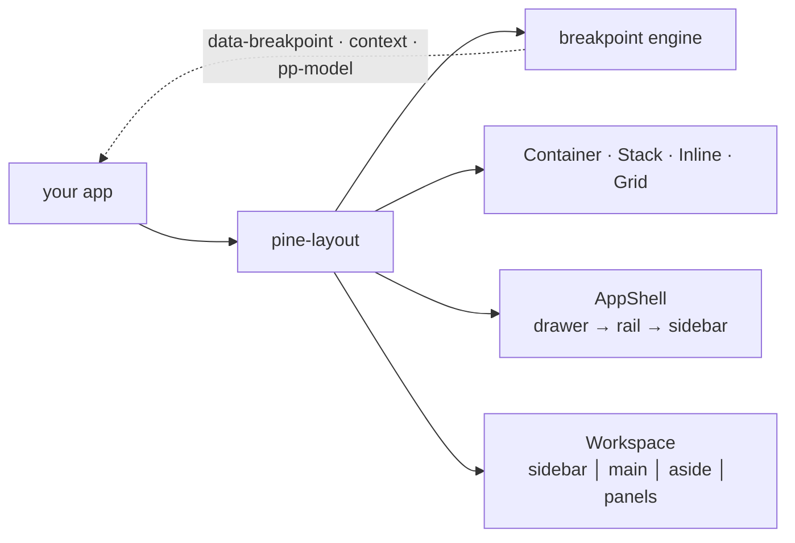

# pine-layout

`pine-layout` is a Pine sub-library for **scaffolding responsive
applications**. It is to *responsiveness* what core Pine is to *behavior*:
it ships **zero CSS**. Every component exposes a semantic class name, a set
of `data-*` state attributes, and — for the one dimension a static
stylesheet can't express (a resizable width/height) — a `--pine-*-size`
custom property. **Your CSS** (hand-written, or Pine Stylekit utilities)
does the actual layout.

What it gives you instead of opinions about how things look:

1. **One canonical breakpoint vocabulary** (`base`/`sm`/`md`/`lg`/`xl`/`2xl`)
   resolved from the viewport, surfaced three ways.
2. **Structural primitives** — `Container`, `Stack`, `Inline`, `Grid`.
3. **`<pine-app-shell>`** — an adaptive `drawer → rail → sidebar`
   navigation shell. *(RFC-103, see [app-shell.md](./app-shell.md).)*
4. **`<pine-workspace>`** — a content-heavy multi-region shell with
   resizable, collapsible regions. *(RFC-105, see [workspace.md](./workspace.md).)*



## Install & register

`pine-layout` ships its components as custom-element tags. Register them
once at startup, before mounting any template that uses them.

```toml
# Cargo.toml
[dependencies]
pine-layout = { path = "../../crates/pine-layout" }
pocopine = { path = "../../crates/pocopine" }
```

```rust
use pocopine::prelude::*;

#[wasm_bindgen(start)]
pub fn main() {
    pine_layout::register_all();        // <pine-app-shell>, <pine-grid>, …
    App::new().register::<MyApp>().run();
}
```

> Apps `use pine_layout::…` directly — the library is **not** re-exported
> through the `pocopine` umbrella while its surface is still settling.

## The headless contract

This is the heart of the library. No component ships a stylesheet or sets
visual styles inline. Instead every component publishes its state four ways
— pick whichever your situation needs:

| # | Mechanism | Looks like | Use it for |
|---|---|---|---|
| 1 | **Semantic class** | `<div class="pine-grid">` | the base CSS target |
| 2 | **`data-*` attributes** | `data-breakpoint="md"`, `data-nav-mode="rail"`, `data-state="open"` | attribute-selector styling (`.pine-app-shell[data-nav-mode="rail"] { … }`) |
| 3 | **CSS custom property** | `style="--pine-sidebar-size: 240px"` | the one *dynamic numeric* dimension (resizable width/height) — author CSS reads it with `var()` |
| 4 | **Reactive state** | `#[model]` (→ `pp:update:*`, `pp-model:`) + context (`#[observe(CTX)]`) | app logic that needs the value, or descendant components that react |

So a grid:

```html
<!-- template -->
<pine-grid cols="12" gap="4">…</pine-grid>
```

```css
/* your CSS — pine-layout ships none of this */
.pine-grid { display: grid; }
.pine-grid[data-cols="12"] { grid-template-columns: repeat(12, 1fr); }
.pine-grid[data-gap="4"]   { gap: 1rem; }
/* …or just drop Stylekit utilities on the element:
   <pine-grid class="grid grid-cols-12 md:grid-cols-6"> */
```

Because Pine Stylekit only scans **app** source (not dependency crates),
`pine-layout` self-contains its contract in `data-*`/custom-properties and
never relies on the app's Stylekit glob picking up the library's templates.

## Breakpoints

The reactive breakpoint resolves to the **same** thresholds Pine Stylekit
uses for its `sm:`/`md:`/`lg:`/`xl:`/`2xl:` utility prefixes — so
`data-breakpoint == "md"` and a `md:` utility class never disagree.

| tier  | min-width | rank |
|-------|-----------|------|
| `base`| 0         | 0    |
| `sm`  | 640px     | 1    |
| `md`  | 768px     | 2    |
| `lg`  | 1024px    | 3    |
| `xl`  | 1280px    | 4    |
| `2xl` | 1536px    | 5    |

### `<pine-breakpoint>` — a standalone provider

Resolves the current tier and exposes it three ways: `data-breakpoint` (for
CSS), the `BREAKPOINT` context (descendants), and a `pp:update:value` model
event (app logic). Ships no layout of its own.

```html
<pine-breakpoint pp-model:value="bp">
  <p>Viewport is at the {{bp}} tier.</p>
</pine-breakpoint>
```

| Field | Kind | Default | Notes |
|---|---|---|---|
| `value` | `#[model]` String | resolves on mount | the tier; emits `pp:update:value` |
| `initial` | `#[prop]` String | `base` | value before `matchMedia` resolves (and the permanent value on non-wasm / SSR) |

### The `Breakpoint` API

For Rust-side logic the `pine_layout::breakpoint` module exposes:

```rust
use pine_layout::breakpoint::Breakpoint;

Breakpoint::from_token("md")      // -> Some(Breakpoint::Md)
Breakpoint::Md.as_str()           // -> "md"
Breakpoint::Md.min_width()        // -> 768
Breakpoint::Xl.rank() >= Breakpoint::Md.rank()   // "is the viewport at least md?"
Breakpoint::TIERS                 // ascending [(Sm,640), (Md,768), …]
```

`breakpoint::install(on_change)` is the engine itself — register a
`matchMedia` watcher for the current scope (used internally by the shells);
`breakpoint::nav_mode(bp, rail_at, sidebar_at)` derives `drawer`/`rail`/
`sidebar` from a tier (shared by AppShell and Workspace).

> **wasm-gated.** On non-wasm / SSR there is no viewport: the breakpoint
> stays at its configured `initial` value, so host builds compile and behave
> deterministically.

## Structural primitives

Thin, headless layout containers — they emit a class + `data-*` mirrors of
their props and nothing else. They give a consistent, documented vocabulary
and styling hooks; you supply the flexbox/grid (or Stylekit utilities).

### `<pine-container>` — max-width content column

| Prop | Type | Surfaced as |
|---|---|---|
| `size` | String (`sm`/`md`/`lg`/… or any token) | `data-size` |
| `safe-area` | bool | `data-safe-area` (present when true) |

```css
.pine-container { margin-inline: auto; width: 100%; }
.pine-container[data-size="lg"] { max-width: 64rem; }
.pine-container[data-safe-area] { padding: env(safe-area-inset-top) env(safe-area-inset-right)
                                          env(safe-area-inset-bottom) env(safe-area-inset-left); }
```

### `<pine-stack>` / `<pine-inline>` — 1-D layout

`Stack` is vertical, `Inline` is horizontal (Atlassian's primitives).

| Prop | Both | `Inline` only |
|---|---|---|
| `gap` | `data-gap` | |
| `align` | `data-align` (cross axis) | |
| `justify` | `data-justify` (main axis) | |
| `wrap` | | `data-wrap` (bool) |

```css
.pine-stack  { display: flex; flex-direction: column; }
.pine-inline { display: flex; flex-direction: row; align-items: center; }
.pine-stack[data-gap="4"]            { gap: 1rem; }
.pine-inline[data-justify="between"] { justify-content: space-between; }
.pine-inline[data-wrap]              { flex-wrap: wrap; }
```

### `<pine-grid>` + `<pine-grid-item>` — 12-column grid

| Component | Prop | Default | Surfaced as |
|---|---|---|---|
| `pine-grid` | `cols` | `12` | `data-cols` |
| | `gap` | | `data-gap` |
| `pine-grid-item` | `span` | | `data-span` |
| | `start` | | `data-start` |

```css
.pine-grid { display: grid; }
.pine-grid[data-cols="12"] { grid-template-columns: repeat(12, 1fr); }
.pine-grid-item[data-span="6"]  { grid-column: span 6; }
.pine-grid-item[data-start="4"] { grid-column-start: 4; }
@media (max-width: 720px) { .pine-grid { grid-template-columns: 1fr; } }
```

Responsive column counts are best expressed in CSS — a media query against
the `data-*` hooks, or Stylekit utilities directly on the element
(`<pine-grid class="grid grid-cols-12 md:grid-cols-6">`).

## Which shell?

| | `<pine-app-shell>` | `<pine-workspace>` |
|---|---|---|
| **For** | sites & apps with a primary nav | content-heavy / productivity apps |
| **Nav** | drawer → rail → sidebar (mobile drawer) | resizable sidebar + rail collapse + flyout |
| **Regions** | header · sidebar · content · footer | + detail aside · outer panels · bottom panel |
| **Resizing** | — | every panel (own resize engine) |
| **Guide** | [app-shell.md](./app-shell.md) | [workspace.md](./workspace.md) |

They're independent families — pick one. (The Workspace is *not* an
extension of the AppShell.)

## Examples

Two runnable demos, each with hand-written CSS that styles the headless
hooks:

```bash
cargo run -p pocopine-cli -- dev --path examples/layout      # AppShell
cargo run -p pocopine-cli -- dev --path examples/workspace   # Workspace
```

## Design notes

- Breakpoint changes mutate `data-*` only — never focus or scroll.
- Animate transitions with **pine-motion** (imperative, toggle-driven), not
  declarative CSS transitions on a property that also reflows at a
  breakpoint — otherwise the reflow animates an unwanted slide. The examples
  show the pattern.
- Background grounding: `docs/internal/research/layout-design-systems.md`
  and `…/workspace-shell-layouts.md` (fact-checked Apple HIG · Material 3 ·
  Atlassian · VS Code · PatternFly · Workday · Dockview).
