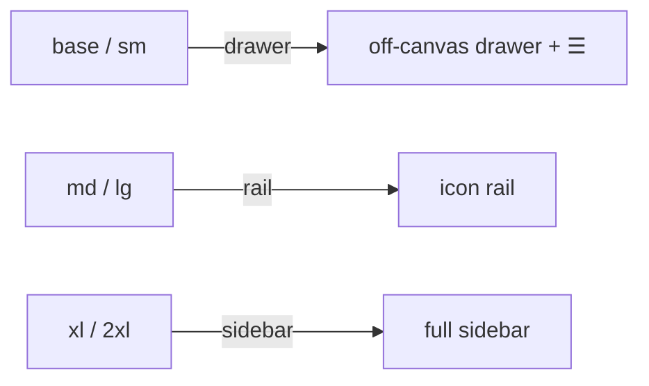

# AppShell

`<pine-app-shell>` is an application scaffold whose primary navigation
adapts to the viewport: a **drawer** (off-canvas, narrow) → a **rail**
(icon-only, medium) → a full **sidebar** (wide). It's **headless** — it
computes the `nav_mode` and manages the modal-drawer *behavior*; **your
CSS** decides what each mode looks like.



## Anatomy

A compound of six custom elements:

| Tag | Role | What it is |
|---|---|---|
| `<pine-app-shell>` | scope | the root: breakpoint engine + nav state machine + `SHELL` context |
| `<pine-app-shell-header>` | `banner` | top bar (sticky) |
| `<pine-app-shell-sidebar>` | `navigation` | the adaptive nav region; modal drawer in drawer mode |
| `<pine-app-shell-content>` | `main` | the page content |
| `<pine-app-shell-footer>` | `contentinfo` | footer |
| `<pine-app-shell-trigger>` | `interactive` (`<button>`) | the hamburger toggle |

Header/content/footer are thin landmark regions (`<div role="…">`). The
shell wires the regions together through the `SHELL` context — you don't
pass props between them.

## Root props & state

| Field | Kind | Default | Surfaced as |
|---|---|---|---|
| `breakpoint` | `#[model]` String | engine-driven | `data-breakpoint` · `pp:update:breakpoint` |
| `nav_open` | `#[model]` bool | `false` | `data-nav-open` · `pp:update:nav_open` |
| `nav_mode` | derived String | — | `data-nav-mode` (`drawer`/`rail`/`sidebar`) |
| `rail_at` | `#[prop]` String | `md` | tier at which nav becomes a rail |
| `sidebar_at` | `#[prop]` String | `xl` | tier at which nav becomes a full sidebar |
| `initial` | `#[prop]` String | `base` | tier before `matchMedia` resolves / on SSR |

**`nav_mode` derivation** (overridable via the two thresholds):

```
breakpoint:  base   sm     md    lg     xl      2xl
nav_mode:    drawer drawer rail  rail   sidebar sidebar      (rail_at=md, sidebar_at=xl)
```

When the viewport grows **out** of drawer mode, an open drawer auto-closes
(so focus/scroll are released).

## The data-* hooks you style against

| Element | Attribute | Values |
|---|---|---|
| root | `data-breakpoint` | `base`…`2xl` |
| root | `data-nav-mode` | `drawer` / `rail` / `sidebar` |
| root | `data-nav-open` | present while the drawer is open |
| sidebar | `data-nav-mode` | mirrors the root |
| sidebar | `data-state` | `open` / `closed` (drawer) |
| trigger | `data-nav-mode` | mirrors the root (hide the ☰ unless `drawer`) |
| trigger | `aria-expanded` | `true` / `false` |

## A complete app shell

The component is pure composition — no Rust state beyond what you want to
bind. Here `bp` is two-way bound so a badge can show the live tier.

```rust
// src/lib.rs
use pocopine::prelude::*;
use serde::{Deserialize, Serialize};

#[derive(Default, Serialize, Deserialize)]
#[component(display = "contents")]
pub struct AppDemo {
    pub bp: String,   // live breakpoint, via pp-model:breakpoint
}

#[handlers]
impl AppDemo {}

#[wasm_bindgen(start)]
pub fn main() {
    pine_layout::register_all();
    App::new().register::<AppDemo>().run();
}
```

```html
<!-- src/AppDemo.poco -->
<div class="demo-root">
  <pine-app-shell class="shell" pp-model:breakpoint="bp">

    <pine-app-shell-header class="shell-header">
      <pine-app-shell-trigger class="burger" aria-label="Toggle navigation">☰</pine-app-shell-trigger>
      <span class="brand">My&nbsp;App</span>
    </pine-app-shell-header>

    <pine-app-shell-sidebar class="shell-sidebar" label="Main">
      <nav>
        <a href="#"><span class="ico">▦</span><span class="nav-label">Dashboard</span></a>
        <a href="#"><span class="ico">◷</span><span class="nav-label">Activity</span></a>
        <a href="#"><span class="ico">⚙</span><span class="nav-label">Settings</span></a>
      </nav>
    </pine-app-shell-sidebar>

    <pine-app-shell-content class="shell-content">…page…</pine-app-shell-content>
    <pine-app-shell-footer class="shell-footer">status</pine-app-shell-footer>

  </pine-app-shell>
  <span class="bp-badge" pp-text="bp"></span>
</div>
```

```css
/* styles.css — the library ships none of this */
.shell {
  display: grid;
  min-height: 100vh;
  grid-template-rows: 3.5rem 1fr auto;
  grid-template-columns: var(--sidebar-w, 16rem) 1fr;
  grid-template-areas: "header header" "sidebar content" "footer footer";
}
.shell[data-nav-mode="rail"]    { grid-template-columns: 4.5rem 1fr; }
.shell[data-nav-mode="drawer"] {
  grid-template-columns: 1fr;
  grid-template-areas: "header" "content" "footer";
}
.shell-header  { grid-area: header; }
.shell-sidebar { grid-area: sidebar; }
.shell-content { grid-area: content; }
.shell-footer  { grid-area: footer; }

/* RAIL: hide the labels */
.shell-sidebar[data-nav-mode="rail"] .nav-label { display: none; }

/* DRAWER: off-canvas; resting position is instant (no CSS transition on
   transform — see "Animating" below) */
.shell-sidebar[data-nav-mode="drawer"] {
  position: fixed; inset: 0 auto 0 0; width: 16rem; z-index: 40;
  transform: translateX(-100%);
}
.shell-sidebar[data-nav-mode="drawer"][data-state="open"] { transform: translateX(0); }

/* the ☰ only appears in drawer mode */
.burger { display: none; }
.burger[data-nav-mode="drawer"] { display: inline-flex; }
```

## How the trigger and drawer work

- **The trigger** is a real `<button>`. Clicking it calls the shell's
  `toggle_nav()` through the `SHELL` context (it only acts in drawer mode);
  `aria-expanded` mirrors `nav_open` and `aria-controls` points at the
  sidebar's generated id.
- **The drawer** (sidebar in `drawer` mode while open) is a modal: focus is
  trapped inside it, page scroll is locked, **Escape closes it**, and focus
  is restored to the trigger on close. This reuses the same overlay runtime
  as Pine's Dialog.

> **No outside-click / scrim dismissal in v1.** A capture-phase
> `@click.outside` on the sidebar treats the hamburger as "outside" and
> cancels the toggle (the known Pine dropdown trigger-while-open bug), so the
> drawer closes via the toggle or **Esc**. A backdrop sub-component is the
> planned addition.

## Binding to app logic

Both `breakpoint` and `nav_open` are `#[model]`s:

```html
<pine-app-shell pp-model:breakpoint="bp" pp-model:nav_open="nav_open">
```

- `pp-model:breakpoint="bp"` keeps an app field in sync with the live tier
  (e.g. to conditionally render).
- `@pp:update:nav_open="on_toggle"` fires whenever the drawer opens/closes.

## Accessibility

- Regions emit landmark roles (`banner` / `navigation` / `main` /
  `contentinfo`); the sidebar is `<… role="navigation" aria-label>`.
- Drawer mode adds dialog semantics: focus trap, Esc, focus restore.
- The trigger is a real `<button>` with `aria-expanded` / `aria-controls`.

## Gotchas

- **Breakpoints are fixed to Stylekit's scale** (640/768/1024/1280/1536).
  Don't invent your own — `data-breakpoint == "md"` is guaranteed to match a
  `md:` utility.
- **Animate the drawer with pine-motion**, fired from the toggle — not a
  declarative `transition: transform` (which would also fire when a
  breakpoint reflow flips the nav into drawer mode, animating an unwanted
  slide-out). See `examples/layout` for the imperative pattern.
- **Don't `pp-show` a component host.** To hide the trigger outside drawer
  mode, style its `data-nav-mode` (as above), not `pp-show`.

See the full demo in [`examples/layout`](../../../examples/layout).
