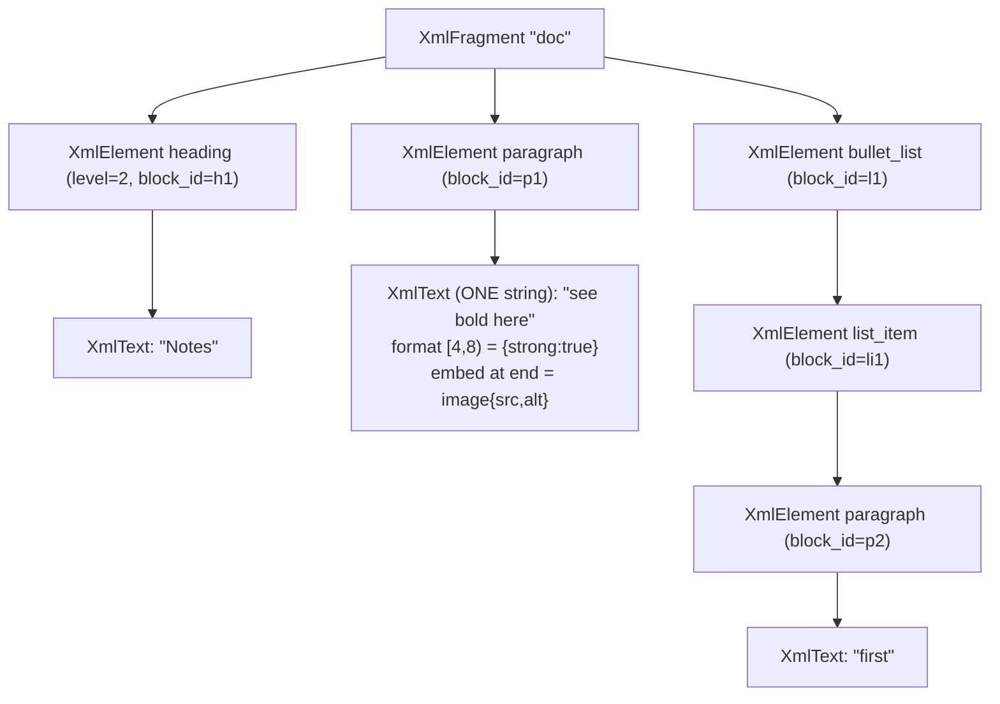

# Scoping — pocopine-collab live-blocks yrs schema

Status: **SCOPING** (design, not implementation). Binds the yrs CRDT substrate
(PR #225 transport) to the `pine-richtext` ProseMirror-model port. Successor work
to RFC-073 Part II; candidate for its own live-blocks RFC.

> Produced by a research → synthesize → adversarial-critique → revise pass. The
> critique corrected a factual error (inline atoms are **embeds inside the single
> `XmlText`**, not sibling elements — verified by the yrs `diff_with_embedded_items`
> doctest at `text.rs:2573-2599`) and tightened the write-path / origin / migration
> sections, where correctness actually lives.

> **DECIDED — full Rust, no JS (Option A).** Per the framework's "replace JS" goal,
> the browser runs `pine-richtext`-wasm + **yrs compiled to wasm32**, never
> Yjs/TipTap. **Q7 (the gating risk) is VERIFIED:** yrs 0.27.2 compiles, links, and
> *runs* on `wasm32-unknown-unknown` with **no `getrandom` / `js-sys`** — its only
> randomness dep is `fastrand`, which self-seeds on wasm. A spike built the block
> substrate (`XmlFragment` → `XmlElement` → `XmlText`) and proved cross-doc
> encode/apply convergence in a WebAssembly runtime, on BOTH the explicit-client-id
> path AND yrs's default random path. Operational notes: build wasm with the pinned
> `nightly-2026-02-21` (yrs needs stable if-let guards); production should assign
> ids via `Doc::with_options(Options::with_guid_and_client_id(guid, client_id))` —
> framework-unique client id (e.g. the realtime `ws-N` session) + per-doc guid — so
> the CRDT touches no RNG at all and ids are guaranteed unique (a random u64 is not).

---

## 1. Recommendation

Adopt a **y-prosemirror-isomorphic nested `Y.XmlFragment` tree**:

- one root `XmlFragmentRef` named `"doc"` (replaces today's `get_or_insert_text("body")`);
- every block `Node` → an `XmlElementRef`, **tag = `Node.type_name()`**, **element attributes = `Node.attrs`** (`serde_json::Value` ↔ yrs `Any` via a binder codec);
- every inline-content block holds **exactly one `XmlTextRef`** carrying its text, with **marks as per-range format attributes** and **inline atoms (`image`/`hard_break`) as `insert_embed` embeds inside that same text** (not element siblings);
- a stable **`block_id`** attribute on every block element (identity + divergence detection + migration seam — **not** move-reconciliation).

**Why decisive:** `pine-richtext` is a literal ProseMirror-model port (`model.rs:1903` `Node{name, attrs, marks, content, text, leaf}`), yrs 0.27.2 exposes exactly this substrate (`get_or_insert_xml_fragment` `doc.rs:334`; `XmlElementRef`/`XmlTextRef`; `Text::insert_embed` `text.rs:301`; `Text::diff` `text.rs:420`), and it is the **only** prior-art family expressible on yrs at all — Automerge (spans+markers) and Loro (Fugue + movable tree) are different CRDT engines that would discard PR #225's transport/convergence/store/eviction wholesale.

**The transport from PR #225 is untouched:** `apply_update`/`state_vector`/`diff`/`full_update` (`sync.rs:48-77`) treat the document as opaque `Update::encode/decode_v1` bytes regardless of root type.

> **Scope boundary (stated up front):** **v1 is single-writer / server-authored
> convergence** (SSR, persistence, server-function-authored docs, one editor at a
> time). The v1 read path is a coarse whole-doc replace that **destroys selection
> on every inbound update** — so simultaneous multi-writer live co-editing is a
> **v2 non-goal**, gated on fine-grained `Step` diffing + `StickyIndex` cursor
> mapping. v1 is the live-blocks *schema* exercised in convergence-only mode.

---

## 2. The schema

### 2.1 Root

```
Doc
└── get_or_insert_xml_fragment("doc")   // replaces get_or_insert_text("body")
```

The root field name is a **permanent wire commitment**, coupled to the interop
decision (Q9): `"doc"` ⇒ native conventions + opaque-binary-relay interop only;
`"prosemirror"` ⇒ off-the-shelf y-prosemirror render compat. Default: `"doc"`.

### 2.2 Mapping table

`Node.attrs: BTreeMap<String, serde_json::Value>` ↔ yrs `Any` via a binder codec
(yrs xml attributes are LWW per key).

| pine-richtext type | yrs representation | tag / key | attrs → yrs | notes |
|---|---|---|---|---|
| `doc` (top) | **root `XmlFragmentRef`** | `"doc"` | — | the fragment, not an element |
| `paragraph` (`inline*`) | `XmlElementRef` | `paragraph` | — | **one `XmlTextRef` child** |
| `heading` (`inline*`) | `XmlElementRef` | `heading` | `level` → `Any::BigInt` | one `XmlTextRef` child |
| `blockquote` (`block+`) | `XmlElementRef` | `blockquote` | — | element children only |
| `code_block` (`text*`, pre, no marks) | `XmlElementRef` | `code_block` | — | one text child; **binder suppresses all `format`**; `\n` preserved |
| `horizontal_rule` (atom) | `XmlElementRef`, no children | `horizontal_rule` | — | block-level atom → element |
| `bullet_list` | `XmlElementRef` | `bullet_list` | — | element children |
| `ordered_list` | `XmlElementRef` | `ordered_list` | `order` → `Any::BigInt` | |
| `list_item` | `XmlElementRef` | `list_item` | — | element children |
| `task_list` | `XmlElementRef` | `task_list` | — | |
| `task_item` | `XmlElementRef` | `task_item` | `checked` → `Any::Bool` | |
| `text` | **chars in parent block's single `XmlTextRef`** | — | — | re-split at mark/embed boundaries on read |
| **`image`** (inline atom) | **`insert_embed` into the parent's `XmlTextRef`** | embed | `src`/`alt`/`title` → `Any::Map` | **embed in the text seq, NOT a sibling** |
| **`hard_break`** (inline atom) | **`insert_embed` into the parent's `XmlTextRef`** | embed | `{type:"hard_break"}` | embed sentinel inside the one text string |
| every block element | `XmlElementRef` attribute | `block_id` | `Any::String(nanoid)` | fresh nanoid per block-creating op; reader tolerates dup ids |
| Mark `link` | `XmlText` format attr | `link` | `Any::Map({href, title})` | inclusivity → assoc policy (§6 / Q10) |
| Mark `em` / `strong` / `code` | `XmlText` format attr | name | **`Any::Bool(true)`** (one canonical shape) | `code`/`excludes` resolved deterministically on read |

**Structural invariants (binder enforces on write; yrs does not):**
- `inline*` block → **exactly one `XmlTextRef`** child (text, marks, atoms all in it).
- `block+`/`block*` block → **only `XmlElement`** children.
- **Mixed text+element children are disallowed**; the reader treats mixed as schema-invalid and repairs deterministically.

**Codec rules:** the `Value`↔`Any` codec must be a **bijection on the PM attr
domain** (small ints → `Any::BigInt`, bools, strings, string-keyed maps), proven by
a `Node → Y → Node` round-trip equal under the derived `PartialEq` (`model.rs:1903`,
`Fragment::eq` `model.rs:2599`) — not eyeballing, because a `2` vs `2.0` drift would
trip the editor's equality guard (`state.rs:1076`) and cause render loops. `null`
is the yrs format-removal sentinel; mark absence = key-not-present. Leaf/atom is a
schema fact re-derived from the tag, never stored.

### 2.3 Worked example

H2 "Notes"; paragraph `see **bold** here` + an inline image; a bullet list item "first":



Reading back, the paragraph's single `XmlText.diff()` yields the ordered runs
`("see ",{})`, `("bold",{strong})`, `(" here",{})`, `(image-map,{})` — the reader
rebuilds one `Fragment`; `normalize_marks` (`model.rs:157`) makes both peers
reconstruct an identical `Node`.

---

## 3. Alternatives considered

| family | substrate | split/merge | move / indent-outdent | concurrent format | on yrs? |
|---|---|---|---|---|---|
| **(A) y-prosemirror nested XmlFragment** *(recommended)* | XmlFragment tree, one XmlText/inline-block | delete+reinsert | delete subtree + insert → concurrent edits to moved block **lost** | independent format keys converge cleanly | **YES — native** |
| (B) BlockNote Block API | **also nested XmlFragment** (corrects "flat Array<Map>") | = (A) | = (A) | = (A) | YES (= A) |
| (C) Automerge spans + block markers | char-seq + markers | 1 op | edit marker `parents`; text survives | Peritext | **NO — different engine** |
| (C′) Loro Fugue + movable tree | Fugue + Kleppmann move-tree | boundary nodes | **true move** (LWW) | Peritext | **NO — different engine** |

**Why (A) wins:** engine lock-in is correct (transport/convergence/store/eviction all assume opaque yrs updates); a mechanical 1:1 fit to `Node`/`Step`/`normalize_marks`; concurrent **formatting** (the highest-frequency op) is (A)'s strong suit.

**Honest cost (permanent, not a v1 wart):** block split/merge/move/indent are delete+insert at the Y-tree write layer, so concurrent edits to a moved/merged subtree, and boundary chars at a concurrent split, **can be lost or duplicated** (y-prosemirror #161/#65/#113). Fine-diffing (v2) improves cursor precision, **not** split/merge convergence — the loss is structural in the CRDT. `block_id` enables *detection* and a *migration seam to (C)*, never reconciliation (yrs has no move primitive; tombstoned ops are unrecoverable). The inline-block-marker model (C) is the "if we outgrow yrs" north star.

**Interop is a binary fork, not a freebie (corrected):** the yrs↔Yjs *binary update format* round-trips, but a stock y-prosemirror JS client only *renders* this doc if root=`"prosemirror"` + y-prosemirror's exact embed/mark shapes. You cannot claim native conventions **and** y-prosemirror render compat. See Q9.

---

## 4. The binding layer

**Where it runs (Option A — pocopine owns both ends):** the browser editor is
Rust/wasm `pine-richtext` (`view` feature; `cdylib`), not Yjs-JS+TipTap. The binder
is written **once in Rust**, compiled twice — host-side over yrs-rust (SSR /
persistence / server-authored), client-side over a wasm CRDT (yrs→wasm32, **gated on
Q7**). Lives in a **new bridge crate `pine-richtext-collab`** (keeps `pocopine-collab`
editor-agnostic and `pine-richtext`'s default build yrs-free).

### 4.1 Read path — remote yrs change → `Transaction`

```
XmlFragment::observe_deep  (one fire per yrs txn over the subtree)
  ├─ read txn.origin() SYNCHRONOUSLY (origin dies if deferred)
  ├─ origin == "pm" (our own write) → EARLY RETURN
  ├─ build the pine-richtext Node tree SYNCHRONOUSLY (XmlElement attrs + children;
  │    XmlText via diff() → embeds interleaved) → normalize_marks → Schema::check_node
  └─ DEFER ONLY apply_transaction to tick::next (on_ready borrow hazard):
       tr.replace(0, content_size, new_content)   // v1 COARSE (single-writer)
       tr.set_meta("collab", ()); state.apply_transaction(tr)
```

Coalesce the *rebuild* (mark-dirty → one rebuild per frame), but read origin + build
the tree synchronously inside the callback (refs/scope die at `tick::next`).

### 4.2 Write path — local `Transaction` → yrs mutation

Subscribe to `Editor.on_update`; if the committed transaction's `meta("collab")` is
**absent** (genuine local edit), translate its **`Step`s** (not a re-diff) into yrs
mutations under `transact_mut_with("pm")`:

- **split** = keep source `XmlText`, `delete(boundary, tail_len)`, create the new sibling element (fresh `block_id`), `insert` tail text + re-apply tail marks/embeds.
- **merge** = `delete` the 2nd element, re-insert its children into the 1st.
- **move / indent / outdent** = delete subtree + insert elsewhere (tombstone + new objects).

Concurrent edits to split-tail / merged-child / moved-subtree can be lost — a
**documented permanent limitation**. The acceptance fuzz harness drives **this write
path**, not the coarse read projection.

### 4.3 Loop avoidance — three origins (cross-crate contract)

| yrs txn origin | set by | observe action |
|---|---|---|
| `"pm"` | local-edit write (`transact_mut_with("pm")`) | **early-return** |
| `"remote"` (or `None`) | inbound network update | **project to editor**, tag `meta("collab")` |
| — | editor's local-emit observer sees `meta("collab")` | **skip Y write** |

**Contract:** `pocopine-collab::apply_update` (`sync.rs:48`) currently uses bare
`transact_mut()` (no origin). It **must** apply inbound updates with a documented
origin (recommend `transact_mut_with("remote")`); the binder early-returns only on
`"pm"`. The origin each call site uses is an RFC-pinned contract between
`pine-richtext-collab` and `pocopine-collab`.

---

## 5. Migration from today's `text("body")` root

**Changes:** one structural call (`get_or_insert_text("body")` → `get_or_insert_xml_fragment("doc")`) + the binder. Today's `insert_text`/`text` helpers (test-only, `sync.rs:82-100`) are dropped/replaced.

**Unchanged (byte-opaque):** `apply_update` / `state_vector` / `diff` / `full_update`, the frame envelope, `CollabStore` snapshots + eviction — all ship opaque `Update` bytes regardless of root.

**The real risk is deploy-window root mixing (yrs roots are first-touch-typed and undeletable):**
1. **Single root by construction** — a `CollabDocument` is pinned to one root; the wrong accessor is an error, not a silent second root (yrs won't enforce this; we must).
2. **Topic schema version** — old (text-root) and new (xml-root) binaries must **not** co-join a topic during a rolling deploy, or they persist a mixed-root zombie doc forever. Block cross-version co-join.
3. **`CollabStore` key includes schema version** — else a stale binary corrupts a v1 snapshot on next write.

`"body"` is test-only today, so live-blocks topics start fresh; the work is guards (1)–(3), not a data migration.

---

## 6. Concurrency semantics

| case | behavior | resolution |
|---|---|---|
| concurrent bold vs italic, same range | converge (independent format keys) | none (strongest case) |
| same-key mark, overlapping ranges | yrs merges; `normalize_marks` on read | deterministic normalize-on-read |
| **insert at mark boundary vs concurrent unmark** | yrs sticky/assoc ≠ PM `inclusive(false)` (`link`/`code`) → peers can disagree | map PM `inclusive` → yrs insertion-assoc per mark (Q10); strip violating marks on read; fuzz it |
| `code` + `excludes("_")` overlap | yrs can store an overlap PM rejects | deterministic read-side resolve on both peers |
| **block split at shared boundary** | write-path delete+reinsert → boundary chars can dup/lose | `block_id` detection; **permanent** limitation; fuzz the write path |
| **block merge vs edit-into-2nd** | delete 2nd + reinsert; concurrent edit to deleted child dropped | `block_id` detection; permanent |
| **move / DnD / indent / outdent** | delete+insert; concurrent edits to moved subtree lost; `block_id` can't reconcile | detection + migration seam only; permanent |
| concurrent attr-delete → schema-invalid node | Y merges; `Node` may fail `check_node` | **reject-and-repair on read, deterministic across replicas** (Q5) |
| inline atom across former boundary | atom is an embed in the one XmlText → typing across it edits one string | the corrected §2.2 mapping |

**Acceptance gate:** a property/fuzz harness driving concurrent split/merge/move at
shared boundaries + insert-at-mark-boundary + attr-delete-to-invalid, asserting (i)
both peers reconstruct `Node == Node` (derived `PartialEq`), (ii) repair is
deterministic, (iii) PM inclusivity holds — driven through the **§4.2 write path**.

---

## 7. Open decisions + phased plan

### Decisions needed

1. **Origin mechanism** — `"collab"` meta key on `Transaction` (no API change) vs a first-class `origin` field. *Recommend meta key.*
2. **`block_id` in v1** — add now (identity + detection + migration seam) vs defer. *Recommend add now.*
3. **Host fidelity** — live-typing participant (needs v2 fine-diff) vs persistence/SSR/server-authored (coarse replace). Coupled to Q8.
4. **Root field name** — `"doc"` (native) vs `"prosemirror"` (compat). *Recommend `"doc"`.* Permanent. Coupled to Q9.
5. **Schema-repair policy** — reject-and-repair a concurrent-merge-invalid tree, **deterministically across replicas**. *Recommend deterministic ordered repair.*
6. **Binder location** — new `pine-richtext-collab` crate vs a `collab` feature on pine-richtext. *Recommend separate crate.*
7. **`yrs` on wasm32 — ✅ VERIFIED (spike passed).** yrs 0.27.2 compiles, links, and runs on `wasm32-unknown-unknown` with no `getrandom`/`js-sys` (only `fastrand`, which self-seeds). The block substrate + cross-doc convergence ran in a WebAssembly runtime. No fallback needed; `y-octo` is off the table. Production uses `with_guid_and_client_id` (no RNG). Build wasm with `nightly-2026-02-21`; the test harness needs node ≥ v24.
8. **v1 multi-writer scope** — v1 coarse replace destroys selection every inbound update ⇒ **v1 = single-writer / convergence-only; multi-writer live co-edit is v2** (fine `Step` diff + `StickyIndex`). *Confirm this boundary.*
9. **Interop fork (binary)** — **I-no (recommended):** root `"doc"`, native conventions, **opaque binary-update relay** compat only (y-sweet/y-redis as dumb relays). **I-yes:** root `"prosemirror"` + y-prosemirror embed/mark shapes + render compat. Cannot claim both.
10. **PM `inclusive` → yrs assoc** — per-mark mapping + read-side inclusivity repair.

### The single most consequential choice — DECIDED

**Client architecture: Option A — full Rust, no JS.** Browser = `pine-richtext`-wasm
+ yrs-wasm; the binder is one Rust crate compiled twice (host + wasm); the schema is
native (`root="doc"`, Q9 = I-no, relay-only interop). This is locked by the
framework's "replace JS" goal and unblocked by the verified Q7 spike. Option B (Yjs
+ TipTap in JS) is **rejected** — it contradicts the project's reason to exist.

This collapses several open questions: **Q4** root = `"doc"`, **Q9** = I-no
(native conventions, opaque-binary-relay interop only). Remaining real decisions are
Q3/Q8 (v1 fidelity / single-writer scope), Q5 (deterministic repair), Q10 (mark
inclusivity → assoc), and Q1/Q2/Q6 (small, with defaults).

### Phased plan

```
Phase 0  ✅ yrs→wasm32 verified (Q7). ✅ client architecture = A (full Rust, no JS) → root "doc", Q9=I-no.
Phase 1  ✅ HOST writer: Node → XmlFragment (encode_doc), root xml_fragment("doc"). Value↔Any codec
         locked as a bijection. Gate met: Node → Y → Update::encode/decode_v1 → Y → Node is Node==Node.
Phase 2  ✅ HOST reader: XmlFragment → Node (decode_doc via diff(); embeds interleaved) + normalize_marks.
         (block_id stripped on read.) Caught + fixed a real format-boundary mark-bleed via insert-all-then-format.
Phase 3  ✅ HOST editor binding (coarse, SINGLE-WRITER): CollabEditor in pine-richtext-collab — set_document
         ("pm" origin) / apply_remote ("remote") / full_update. Two editors converge through updates (tested).
         block_id minted per block (RNG-free). Compiles + clippy-clean for host AND wasm32.
Phase 4  🔄 CLIENT half. ✅ UNBLOCKED: pocopine-realtime now compiles to wasm — protocol + client modules in
         the SAME crate (cfg-gated, no extra crates). ClientSession (host-tested handshake→subscribe→data→
         heartbeat state machine) + RealtimeClient (wasm web_sys::WebSocket shell). ☐ REMAINING: the collab
         bridge — wire RealtimeClient ⇄ CollabEditor (view::on_update → set_document → send_data; inbound Data →
         apply_remote → dispatch) under a collab subprotocol_id — plus an example app to run a two-browser session.
Phase 5  ☐ v2 fine-diff: Step-driven incremental write (replaces the coarse re-encode) + StickyIndex cursor
         preservation → multi-writer co-edit. A substantial algorithm; split/merge/move content-loss stays
         permanent (schema-A property).
```

> Status: **Phases 0–3 done** (the schema, codec, block_id, and a tested live
> binding that converges — all wasm-ready). **Phase 4 in progress**: the realtime
> wasm client landed (pocopine-realtime now builds for wasm via cfg-gated
> `protocol` + `client` modules); what remains is the collab bridge wiring the
> client to `CollabEditor` plus a two-browser example app. **Phase 5** is the
> multi-writer fine-diff algorithm.
