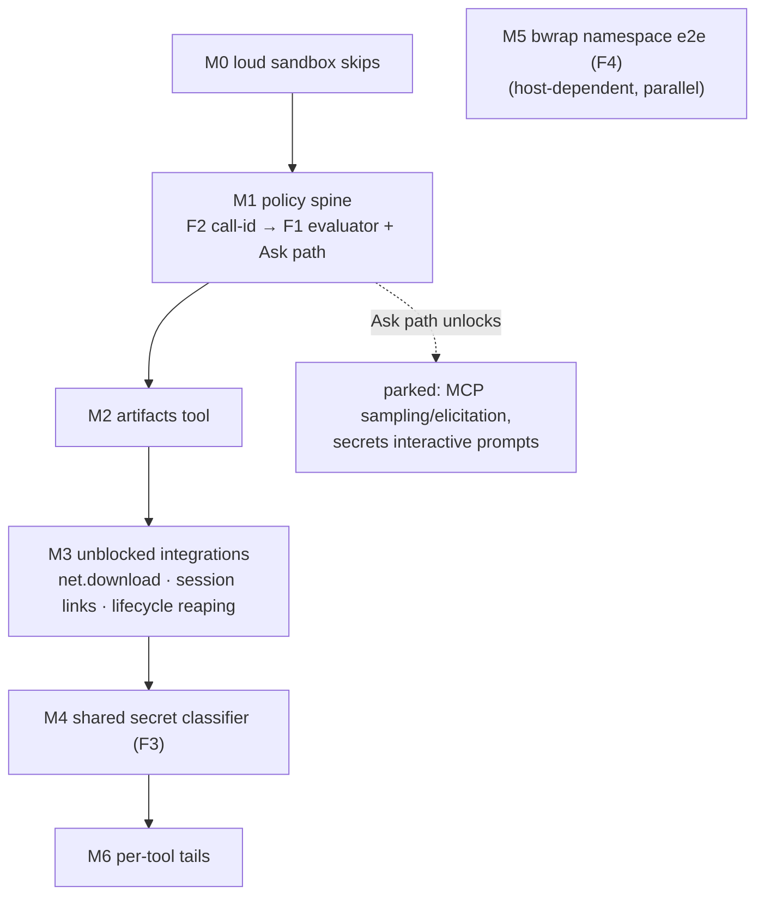

# agenkitty roadmap — completing the harness

Agenkitty today (main, `eec606ed`…`5835ece7`) ships **eight built tool
families** — `fs`, `patch`, `process`, `network`, `memory`, `session`,
`secrets`, `mcp` — in one crate (`crates/agenkitty`), registered through
`register_tools_with_all_runtimes` and driven by the agenkit SDK's agent loop
(~476 tests across `agenkitty` + `agenkitty-core`). Each tool family carries
its contract in a per-tool `README.md`; the public/private boundary is
`crates/agenkitty/src/tools/README.md`.

What remains is not more tools — it is the **cross-cutting spine the tools
already defer to**. Every README that punts a policy question punts it to the
same missing layer: memory's Allow/Ask/Deny prompting, secrets' fail-closed
`Ask`, MCP's admission prompts, the artifacts plan's per-verb defaults. The
enums and contracts for that layer already exist in `agenkitty-core`
(`ToolMode`, `PolicyDecision`, `ToolSpec`, `ToolUseRequest`/`ToolUseOutcome`,
`PolicyConfigSection`) — **none of it is loaded, evaluated, or wired into
dispatch**. That spine, one missing tool family (**artifacts**, plan-only),
and per-tool feature tails are the whole backlog.

> Companion: [roadmap-agenkit.md](./roadmap-agenkit.md) covers the stateless
> SDK underneath (the "separate roadmap" its out-of-scope section names is
> this document). Deferral provenance: the per-tool READMEs on main; the
> `artifacts/plan.md`, `session/TODO.md`, `memory/TODO.md` files survive only
> in the `draft/agenkitty-brainstorm` worktree (cleaned from main's tree) —
> their actionable content is folded in below. **There are no greppable
> `TODO`/`FIXME` markers in either crate; all deferrals are prose.**

| # | milestone | ships | gate |
|---|---|---|---|
| **M0** | **Loud sandbox skips** | bwrap-gated process/network tests report a visible skip (currently `bwrap_usable()` silently early-returns → vacuous green on hosts without user namespaces). | On a host without unprivileged userns, `cargo test -p agenkitty` output names every skipped bwrap test; on a capable host they run. |
| **M1** | **Policy spine** (F2 → F1) | A typed per-invocation call id on `FrameworkEvent` and at the `before_tool_call` seam; a central evaluator (tool id/kind + `CapabilitySet` + `PolicyConfigSection` → `PolicyDecision`) wired into dispatch; project config actually loaded; a host **Ask/approval interface** (TTY prompt; non-interactive fails closed) that MCP admission and secrets route through. | A denied tool class is blocked at dispatch with a reasoned event carrying the call id; flipping `write_mode = "deny"` in project config takes effect without code changes; an `Ask` tool prompts on a TTY and fails closed headless; MCP + secrets prompts flow through the same interface. |
| **M2** | **Artifacts tool** | `artifact.write/read/list/link/delete` over metadata + store traits; durable store under the session root's `artifacts/` (JSONL log + content-addressed blobs); content-hashed (via `pocopine-crypto`), media-typed, provenance-carrying; policy defaults session-write **Allow**, project-write **Ask** (in-tool via the approver — an id-keyed spec can't split on args), delete **Ask** (dispatch gate). First-class `process.run`-output capture rides with the M3 lifecycle items; today the model round-trips the output through `artifact.write`. | Artifacts survive session reload with hash + media type intact; path traversal in names rejected; size limits enforced; `artifact.write` dispatches through the policy gate and lands in the caller's namespace. |
| **M3** ✅ | **Unblocked integrations** | **Done:** `net.download` (guarded engine extracted to `http::GuardedHttp`, shared verbatim by `net.fetch`; body stored as a content-hashed artifact, cap clamped to the artifact limit); session↔artifact provenance round-trip (artifact records its `Thread` source ref; runner `finalize_run` links session artifacts into session metadata, deduped/resume-safe). **Already satisfied:** patch→session refs (every tool call emits a `ToolCall` source ref via M1's call-id plumbing). **Deferred (own unit):** session-close process reaping — needs the process sandbox to become session-aware (thread key + `reap_owned_by` + table exposure); reaping by principal would kill other sessions' processes. Promotion policy recorded as `None`. | A download lands as a citable artifact honoring `NetPolicy` + byte caps; a session-scoped artifact is discoverable via `SessionExport.artifact_links`; a resume does not double-link. |
| **M4** | **Shared secret classifier** (F3) | Memory's `looks_like_secret()` extracted to one shared, conservative content-pattern classifier; adopted by fs, patch, process, session, memory, artifacts on the paths that persist or return content. | One classifier crate-path, zero per-tool forks; memory's existing rejection tests still green; fs/patch/process/session/artifacts each gain a rejection/redaction test through the shared predicate. |
| **M5** | **bwrap namespace e2e** (F4) | Tier-2 egress validation on a real Linux+bubblewrap host: `--unshare-net` + UDS-bound `agenkitty __egress-shim` proven to be the *only* egress path; results recorded (doc note + any fixes). | Inside the namespace, direct egress fails and proxied egress succeeds, end to end — not argv-construction tests; the M0 skip reporting confirms the suite genuinely ran. |
| **M6** | **Per-tool tails** | Priority-ordered per-family features (table below): MCP persistent pin store / admission-inside-lock / binary hash pin / HTTP fixture; network anti-exfil / `net.resolve` / cache / robots; memory SQLite FTS / compaction / contradiction-repair / multi-proc; session search / fork / rewind-as-branch; fs recursive copy+remove. | Each tail item gates independently on its own tests; no tail blocks another milestone. |

**Sequencing.** `M0 → M1 → M2 → M3 → M4 → M6`, with **M5 host-dependent and
parallel to everything**. M1 is the keystone: the Ask path is the
human-in-the-loop primitive that the artifacts defaults (M2), MCP
sampling/elicitation (parked), and secrets prompting all name as their host
layer. M4 runs after M2 so the classifier covers artifacts from day one.

---

## Milestone detail (touchpoints)

### M0 — Loud sandbox skips

- `crates/agenkitty/src/tools/process/run.rs` — `bwrap_usable()` (≈L702) is
  consulted by runtime early-returns at ≈L878/914/955/976/1008. Neither crate
  uses `#[ignore]`; a host without unprivileged userns passes these tests
  vacuously. Emit a per-test skip line (and keep the probe — it is the right
  gate, it is just silent).

### M1 — Policy spine *(keystone)*

**F2 first — the call id.** The per-invocation id already exists at the
agenkit boundary (`AgentEvent::ToolStarted/Completed/Failed/Blocked { id, … }`)
but is demoted on the way in:

- `crates/agenkitty/src/supervisor/runtime.rs` — `map_agent_event`
  (≈L426–455) keeps the id only as untyped `payload.call_id` JSON and as a
  `SessionSourceRef`. Promote it to a **typed field on `FrameworkEvent`**
  (`crates/agenkitty-core/src/events.rs`, which today has only
  `tool: Option<String>` — the *name*, not the invocation).
- `crates/pocopine-agenkit/src/server/loop_core.rs` (≈L33) — the
  `before_tool_call` hook was `Fn(&str, &Value) -> ToolDecision`; **no call id
  reached the policy seam at all.** Fix: the hook takes the existing core
  `&ToolCall` (`{id, tool_id, args}`) — one canonical signature, no new type;
  in-workspace consumers migrate (the SDK is unpublished). agenkit stays a
  stateless SDK; this is a hook-signature enrichment, not state.

**F1 — evaluator + config + wiring.** The parts that exist, unwired:

- `crates/agenkitty-core/src/policy/decision.rs` — `ToolMode {Allow, Ask,
  Deny}` + `PolicyDecision {Allow, Ask{reason}, Deny{reason},
  Rewrite{args}}`.
- `crates/agenkitty-core/src/policy/capabilities.rs` — `CapabilitySet`
  (`filesystem`/`network`/`commands`).
- `crates/agenkitty-core/src/tools/mod.rs` — `ToolSpec { mode, capabilities }`
  + `ToolUseRequest`/`ToolUseOutcome`. Referenced nowhere outside their own
  definitions/tests.
- `crates/agenkitty-core/src/config.rs` (L65–82) — `PolicyConfigSection
  { read_mode=Allow, write_mode=Ask, command_mode=Ask }`. **Never loaded,
  never read** outside its own unit test; the intent is the "Phase 7
  plumbing" prose at `crates/agenkitty/src/tools/mod.rs:196-205`.

Work: (a) a central evaluator in `agenkitty-core` mapping tool id/kind +
`CapabilitySet` + `PolicyConfigSection` → `PolicyDecision`; (b) per-family
`ToolSpec` metadata at registration (`register_*_tools`); (c) load
`AgenkittyConfig` from the project; (d) invoke the evaluator from the
`before_tool_call` seam (`supervisor/runtime.rs` ≈L294 — today it only
injects session/memory `context_token`s) and translate: Deny→`Block`,
Rewrite→`ReplaceArgs`, Allow→`Proceed`.

**The Ask path.** A host approval interface (trait + CLI TTY prompt in the
`agenkitty` bin; non-interactive default **fails closed**). Route the two
existing subsystem-local Ask flows through it: MCP's real one
(`mcp/call.rs` `admit()` ≈L136 + `adapter.rs` `build_ask_prompt` ≈L231) and
secrets' fail-closed stub (`secrets/runtime.rs` L220–225). This interface is
the HITL primitive later work cites (MCP sampling/elicitation, artifacts
project-write/delete defaults).

### M2 — Artifacts tool

Plan provenance: `artifacts/plan.md` (brainstorm worktree). Durable run
outputs (reports, logs, build products, command outputs) — separate from
workspace edits. Five verbs: `artifact.write` / `read` / `list` / `link`
(attach an existing workspace file by reference) / `delete`. Contract:
stable citable ids; name/media-type/size/hash/provenance/scope metadata;
large binaries out-of-band by reference; session- or project-scoped. Policy
defaults (needs M1): session writes **Allow**, project writes **Ask**,
deletes **Ask**; secret-like artifacts need explicit policy + redaction
review. Order: metadata + store traits → session store
(`.agenkitty/sessions`) → project store (`.agenkitty/artifacts`) → verbs +
policy → `process` output references. Hashing through `pocopine-crypto`
(never a direct `sha2` dep). The plan's toolsmith linkage is dropped —
toolsmith is retired.

### M3 — Unblocked integrations

All small once M2 lands; each is an existing prose deferral:

- **`net.download`** — network README "Roadmap (deferred)": bounded binary →
  artifact store, content-hashed; honors `NetPolicy` + the SSRF guard +
  decompression caps that `net.fetch` already enforces.
- **session ↔ artifacts** — session README Deferred Work: `link_artifact`
  with source refs + promotion policy.
- **session ↔ process lifecycle** — reap/close owner-scoped process handles
  on session close (session README; process handles are already
  session-scoped).
- **patch → session** — cite `patch.apply` metadata as checkpoint/event refs
  (avoid a second session log).
- **cleanup-hook adapters** — the generic session-close hook the two items
  above hang off.

### M4 — Shared secret classifier (F3)

- Source of truth today: `crates/agenkitty/src/tools/memory/common.rs` —
  `looks_like_secret()` (≈L673) with the deferral note directly above it
  (≈L670): *"A shared classifier across fs/patch/process/artifacts/session/
  memory is a deferred follow-up."*
- Extract to one shared module (likely `agenkitty-core`); adopt on the paths
  that persist or return content in fs, patch, process, session, memory,
  artifacts. Content-pattern matching (bearer/PEM/key-assignment shapes),
  conservative by design. Distinct from the secrets tool (known-handle
  grants + redaction) — this classifies *unknown* secrets in arbitrary
  content.

### M5 — bwrap namespace e2e (F4)

- The deferral is verbatim at
  `crates/agenkitty/src/tools/process/egress_shim.rs:11-14`: the full
  namespace integration (bwrap `--unshare-net` + bound UDS) must be
  validated on a real Linux+bubblewrap host.
- Much existing bwrap coverage is argv-construction only
  (`process/sandbox.rs`); the runtime-gated tests need a host with
  unprivileged userns. First step: probe the dev machine (`bwrap` present +
  userns enabled); if capable, this milestone is mostly *running* the suite
  and fixing what falls out, plus recording the validated-on note the
  network README asks for.

### M6 — Per-tool tails (priority-ordered within each family)

| family | items, in order |
|---|---|
| **mcp** | project-persistent TOFU pin store (pairs with M1 config loading) → fold admission inside the rediscovery lock (IMPL_NOTES residual) → binary-content hash pin (T5 deepening) → hyper-based HTTP/SSE test fixture |
| **network** | URL-in-context anti-exfiltration (pairs with M4) → `net.resolve` → response cache → robots.txt |
| **memory** | SQLite FTS store adapter → JSONL log compaction → contradiction-repair policy (the `contradicts` relation exists; the repair flow doesn't) → multi-process writer coordination |
| **session** | search over transcript/events → model-facing `session.fork` (after fork UX is proven host-side) → `session.rewind` as *new branch from checkpoint*, never in-place mutation |
| **fs** | recursive `fs.copy` + `fs.remove` behind an explicit recursive/symlink policy |

Cross-family stragglers, placed where their dependency lands: memory ↔
agenkit-checkpoint cross-refs (after agenkit exposes checkpoint ids);
session compaction-checkpoint source refs (blocked on host
compaction-checkpoint metadata); MCP live-repin description surfacing
(polish); vector/graph memory adapters (after SQLite FTS proves the adapter
seam).

---

## Parked — deliberately not planned

- **git tool** and **toolsmith / generated-tool registry** — retired
  *decisions*, not backlog: MCP (durable typed tools) + `process` (ephemeral
  scripts) span the space. Never re-propose. (`tools/README.md` records
  both.)
- **Hosted/product layer** — dashboards, vault approval UIs, team memory,
  review UIs, importers, tenant policy, billing. Behind the trait seams
  (`AgentSecretResolver`, `SessionMetadataStore`, memory stores), out of the
  public crates.
- **MCP sampling/elicitation** — denied today (D11); parked *until the M1
  Ask path exists*, then cheap to enable behind it.
- **fs `openat2`/descriptor-relative hardening** — trigger-gated: only if
  the fs layer must itself become a security boundary (the OS sandbox is the
  boundary today).
- **agenkitty-as-MCP-server** and **MCP Tasks** — revisit after M1.
- **Interactive OAuth executor (MCP)** — the shapes + audience validation
  ship; the browser/DCR/refresh executor waits until a remote-server user
  exists. Static secret-handle bearer is the supported path.

## Standing constraints (binding)

- **The public/private boundary does not move.** Hosted orchestration,
  control planes, tenant policy, and billing stay out of these crates;
  everything here lands behind the existing trait seams.
- **agenkit stays a stateless SDK.** M1's hook enrichment is additive
  signature surface, never conversation or policy *state* in agenkit.
- **Opt-in stays opt-in.** `net.fetch`, `mcp.*`, `memory.*`, `secret.*`, and
  fs mutation tools do not silently join default tool sets; M1's config
  layer is how a project widens its set.
- **Fail closed.** Every Ask without a host approver is a Deny; the M1
  interface formalizes what secrets/MCP already do.
- **Unsafe stays local.** `agenkitty` allows `unsafe` for sandbox work
  (pre_exec rlimits, Landlock/seccomp/cgroups) — each block stays small with
  a `// SAFETY:` note.
- **Shared primitives.** Hashing/encoding through `pocopine-crypto` /
  `pocopine-codec`; logging through `tracing` targets per RFC-069 — no raw
  stdio in framework code.
- **Opinionated.** One canonical mechanism per capability; no parallel
  policy layers, no plugin protocols.
