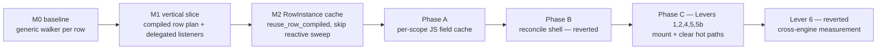
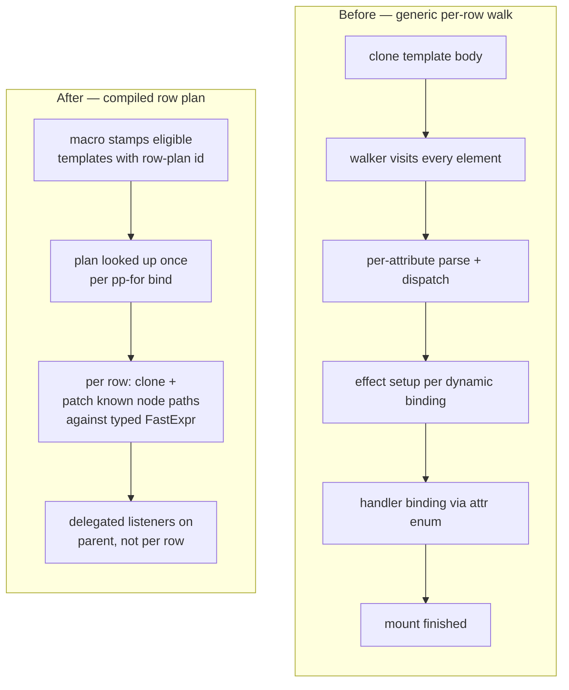
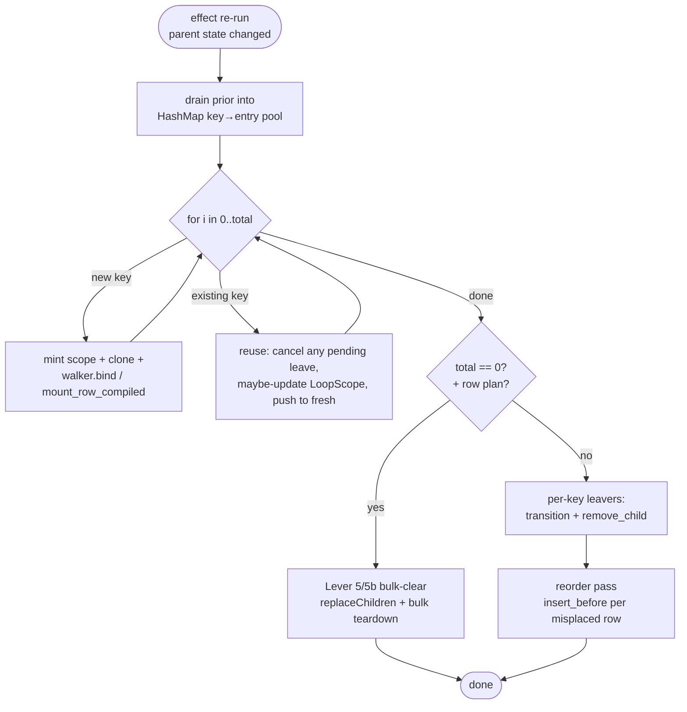
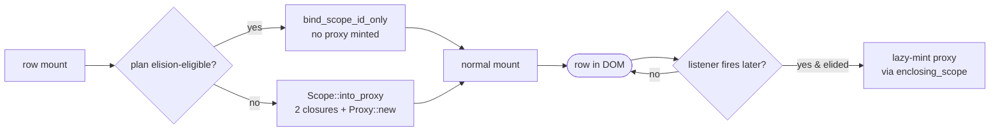

# Performance — what we shipped, how, and why

A retrospective on the keyed-list performance work tracked under
RFC 054. Sister document to
[`performance-strategy.md`](./performance-strategy.md) (forward
plan) and [`jsbench/RESULTS.md`](../jsbench/RESULTS.md) (latest
numbers). This file is the **reference** for what changed and the
patterns it left behind for future work.

Branch: `rfc-054-compiled-row-plans`. Commits referenced inline.

## Headline

`runLots(10000)` on the `pp-for` benchmark harness, mean of 5
measured runs:

| engine    | M0 baseline | shipped | speed-up |
|-----------|------------:|--------:|---------:|
| Firefox   |    2 179 ms |  849 ms |    2.6 × |
| Chromium  |    2 179 ms |  747 ms |    2.9 × |

```mermaid
gantt
  title runLots(10000) — pocopine M0 baseline → shipped
  dateFormat X
  axisFormat %s
  section Firefox
  shipped 849ms          :done,  fa, 0,   849
  removed by RFC 054     :crit,  fb, 849, 1330
  section Chromium
  shipped 747ms          :done,  ca, 0,   747
  removed by RFC 054     :crit,  cb, 747, 1432
```

Pocopine moved from ~2.2 seconds to under one — roughly tied with
leptos and yew on Chromium, mid-pack with vue/vanilla on Firefox.
All numbers in [`jsbench/RESULTS.md`](../jsbench/RESULTS.md).

## How the work decomposed

Every box is a commit range on `rfc-054-compiled-row-plans`; the
two reverts are as instructive as the wins.

---

## 1. The diagnostic infrastructure came first

Optimizing without instrumentation produced two false starts (Phase
B and Lever 6, both reverted). Once the per-phase profiler landed,
each subsequent change had a falsifiable predicted delta.

What got built:

- **`pocopine-core/mount-profiler` cargo feature** — gated behind
  a feature so release binaries don't pay the timing cost.
- **`window.__POCOPINE_MOUNT_PROFILE = true`** — page-side opt-in.
  When set, the runtime emits one
  `POCOPINE_MOUNT_PROFILE { … }` JSON line per benchmark action.
- **Per-phase + per-sub-phase counters** — `mount_*`,
  `reconcile_*`, `state_sync_*`, `unmount_*` plus an
  `unaccounted_ms` residual so we always knew when a phase split
  was incomplete.
- **`measure.py --profile-bench`** — full bench plan with
  per-action JSON, prints the slowest run's phase breakdown
  alongside the wall distribution. The slowest-run view (not the
  mean) was where the long-tail bugs lived.

The profiler is what made the M0→M1 narrative legible — it
showed the per-row attribute walk dominating mount, the
`LIST_WATCHERS.members.retain` dominating clear, and so on.

---

## 2. The compiled-row-plan fast path (M1, M2)

The architectural shift. Generic `pp-for` cloned a `<template>`
body per row and ran the directive walker over each clone. The
walker's per-element work — attribute scan, expression parse,
effect setup, scope minting — is fine for typical UI but at 10k
rows it dominates everything else.

What that translated to:

- **`#[component]` macro analyses the template at compile time**
  and stamps simple-enough row bodies with
  `data-pp-row-plan="<id>"`. Eligibility means: flat keyed table
  rows, no nested directives, bindings + listeners that fit the
  supported envelope.
- **`CompiledRowPlan`** — a runtime struct holding pre-resolved
  node paths into the row root, the binding kind for each (text /
  attribute / class), and the listener routes. Looked up once per
  `pp-for` directive bind, not per row.
- **`FastExpr`** — typed expression evaluator that bypasses the
  full `expr::parse` interpreter for the binding shapes the row
  plan supports.
- **Delegated listeners** — one parent-level listener per event
  type instead of N per-row listeners.

The *reuse* path (M2, commit `fdfc29c`) is the other half:

- **`RowInstance` cache** — pre-allocated binding-cache slots per
  row. On reconcile reuse, evaluate each plan binding directly
  against the mutated `LoopScope` and write to DOM only on cache
  miss.
- **`reuse_row_compiled` skips `trigger_scope`** — compiled rows
  have no reactive effects of their own, so the generic
  effect-resweep is a no-op for them. We skip it entirely and
  patch DOM via the binding cache.

---

## 3. The pp-for reconcile loop

For context on where the levers below intervene, this is the
shape of one `pp-for` effect run:

The Levers 1–5b each shaved time off a specific edge:

---

## 4. Levers shipped

### Lever 1 — bulk-clear via `replaceChildren` (`4ea2eae`)

Per-row `parent.remove_child(&el) × N` was the dominant cost of
`clear`. For 10k rows the diagnostic profile pinned **387 ms** in
that single loop — bridge-call overhead, not actual work.

When the new list is empty, every entry in the pool is a sync
leaver (no transitions), and parent's children are exactly
clones + template, do `parent.replace_children_with_node_1(template)`.
One call instead of N.

Two follow-ups tightened the guard:

- **`bulk_clear_safe` walker** — rejects parents containing
  comments, non-whitespace text, or unrelated elements before the
  `replaceChildren` would nuke them.
- **Compiled-row gate** — the bulk teardown
  (`unmount_rows_bulk` + `Scope::remove_compiled_rows`) skips the
  per-scope side-table sweeps that compiled rows are guaranteed
  not to need. Generic rows can register refs / slots / tasks /
  context / model state, so they fall through to the per-row
  path.

### Lever 2 — pool-empty mount short-circuit (`4ea2eae`)

When there's no prior pool, every row is a "new" — the
`item_signature` JSON.stringify, the dedup `seen.insert`, and
the `pool.remove` lookup are all pure overhead in that case.
Skip them on cold mount; saves 30–50 ms on `runLots(10000)`'s
initial mount.

Subtle: `seen.insert` had to stay even on cold mount, otherwise
duplicate keys silently overwrite each other when the next
reconcile drains `prior` into `pool` via `HashMap::insert`. Fixed
in `0e168e6` after a Codex review caught the regression.

### Lever 4 — proxy elision for FastExpr-only plans (`5e95c95`)

Every row scope minted a `js_sys::Proxy` to expose its `LoopScope`
to the JS-side expression evaluator. Allocating that proxy is
~24K bridge ops on `runLots(10000)`:

- `Object::new` × 2 (target + handler)
- `Closure::wrap` × 2 (get / set traps)
- `Proxy::new`
- `Reflect::set` × 2 (wire traps to handler)

Compiled row plans whose every binding routes through the typed
`FastExpr` evaluator never read the proxy on the hot path —
bindings evaluate against the row's typed `LoopScope` directly.
So if `is_proxy_elision_eligible() == true`, skip
`Scope::into_proxy` entirely and call `walker::bind_scope_id_only`
instead of `bind_scope_to`.

Lazy-mint hook: if a delegated listener actually fires on a row,
`enclosing_scope` / `instance_proxy` mints the proxy on demand.
Rare interactive cases still work; the common bulk-mount path
pays nothing.

### Lever 5 — bulk Scope::remove + watcher drop (`e766e13`)

Per-row unmount called `LIST_WATCHERS.members.retain(|id| id != scope_id)`
— O(N) over the list, run N times = O(N²). For 10k rows the
slowest-run profile pinned **358 ms** here alone.

`unmount_rows_bulk` drops the entire watcher in one
`LIST_WATCHERS.with` borrow. `Scope::remove_compiled_rows`
drains every per-scope side-table once over the whole slice
instead of paying `N × thread_local::with` per table. Compiled
rows are guaranteed not to register most side-tables, so those
clears collapse to a no-op for known-empty maps.

### Lever 5b — parent-level bulk-release marker (`a836353`)

The framework's `MutationObserver` runs `release_subtree` on every
removed element, walking each sub-element's side-tables. After
`replaceChildren` removes 10k rows in one DOM op, the observer
processes all 10k removals in one batch — and the per-element
walk meant tens of thousands of `Reflect::get` calls.

Stamp **one marker** on the parent before the bulk DOM mutation
(`__pp_bulk_release` via `Reflect::set`). The observer callback
checks the marker on `rec.target()` and short-circuits the entire
batch's `release_subtree` sweep, then clears the marker.

One `Reflect::set` per clear instead of N per-row stamps.

---

## 5. Lever 6 — the revert that taught us the most (`0ed2ad5`)

The setup: build the row outerHTML × N as one bulk string, parse
via a detached `<template>.innerHTML`, attach the parsed fragment
in one `insert_before`. The hypothesis was that one parse + one
attach beats N `cloneNode` calls + N fragment appends.

Firefox: −33 ms on `runLots(10000)`. **Chromium: +52 ms.**

The diagnostic profile pinned the regression: V8 elements
produced by the HTML parser pay a ~12× attach-time penalty vs
`createElement`-built elements. `mount.dom_insertion` jumped from
11 ms to 138 ms in the slowest-run profile under Chromium.

Lessons:

1. **Always measure both engines.** Spidermonkey and V8 have
   meaningfully different costs for attach, layout, and the
   wasm↔JS bridge. A win on one can be a loss on the other.
2. **The detailed profile told us *where* it regressed.** Without
   the per-sub-phase counters we'd have had only "mount got
   slower on Chrome" with no signal on which DOM op to blame.
3. **Reverting cleanly is part of the work.** The Lever 6 commit
   stayed in history; the function got removed in `0e168e6` after
   review. The "Lever 6 reverted" comment in `for_.rs` keeps
   future devs from re-attempting the same experiment without
   reading the postmortem first.

---

## 6. Patterns to keep using

A short list distilled from the wins (and the reverts):

- **Add the profiler before the optimization.** Phase B and Lever
  6 each took ~a day to revert because we shipped on Firefox-only
  numbers. Compare that to Levers 1/2/5/5b which had predicted
  deltas matching reality within run-to-run noise.
- **Bridge ops dominate hot loops.** WASM↔JS calls are ~50–100 ns
  each on Chromium and worse on Firefox. N×K bridge calls is
  almost always the cost peak in a directive hot path, not the
  Rust side. Look for the "× N rows" multipliers first.
- **Side-table thread_locals are fine in the cold path,
  catastrophic in hot loops.** `LIST_WATCHERS.with` × N per
  unmount cost a third of `clear`'s budget. Bulk variants that
  drain the whole slice in one borrow collapsed it.
- **Compile, don't interpret.** The macro-stamped row plans are
  the largest single contributor to the speed-up. Anywhere the
  framework is doing per-row work that depends only on the
  template shape, that work can move to compile time.
- **Eliding allocations beats reusing them.** Lever 4's proxy
  elision was a pure subtraction — no proxy is faster than any
  proxy pool, and lazy-minting on the rare listener path keeps
  semantics intact.
- **Cross-engine measurement is non-negotiable.** Lever 6.
  `./jsbench/benchmark.sh --all --browser firefox` then
  `--browser chromium`. Neither alone is enough.

---

## 7. Where the remaining gap lives

From the post-revert numbers vs vanilla on `runLots(10000)`:

```mermaid
gantt
  title runLots(10000) — Chromium budget vs vanilla
  dateFormat X
  axisFormat %s
  section vanilla
  baseline 628ms       :0, 628
  section pocopine
  shared with vanilla  :done, a, 0, 628
  framework overhead   :crit,    b, 628, 119
```

That **+119 ms** on Chromium (and roughly +250 ms on Firefox) is
where the next round of work sits. Per the diagnostic profile,
the remaining costs split roughly:

- ~half is **layout + paint after attach** — browser work, not
  ours. Bringing this down means smaller per-row DOM (fewer
  elements / attributes per row) or batching layout reads.
- ~quarter is **Spidermonkey wasm↔JS bridge tax** — uniform
  ~50 ms tax over vanilla on Firefox that hits every WASM
  framework on the chart, not just us.
- ~quarter is **residual Rust-side work** — `KeyResolver::resolve`
  per row, `item_signature` JSON.stringify on reuse, the
  `MutationObserver` ack/release on bulk paths. Each individual
  one is small; collapsing them needs whole-loop redesign rather
  than another pointwise lever.

`docs/performance-strategy.md` carries the forward roadmap for
those.

---

## Reference

- RFC: [`rfcs/rfc-054-compiled-pp-for-row-plans.md`](../rfcs/rfc-054-compiled-pp-for-row-plans.md)
- Strategy: [`docs/performance-strategy.md`](./performance-strategy.md)
- Latest numbers: [`jsbench/RESULTS.md`](../jsbench/RESULTS.md)
- Driver: [`jsbench/benchmark.sh`](../jsbench/benchmark.sh)
- Hot-path code: `crates/pocopine-core/src/directives/for_.rs`
  + `crates/pocopine-core/src/directives/for_plan.rs`
- Profiler feature: `pocopine-core/mount-profiler`
  (toggle on the page with `window.__POCOPINE_MOUNT_PROFILE = true`)
