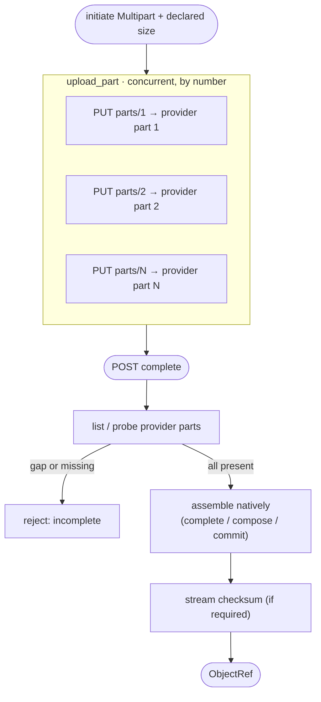
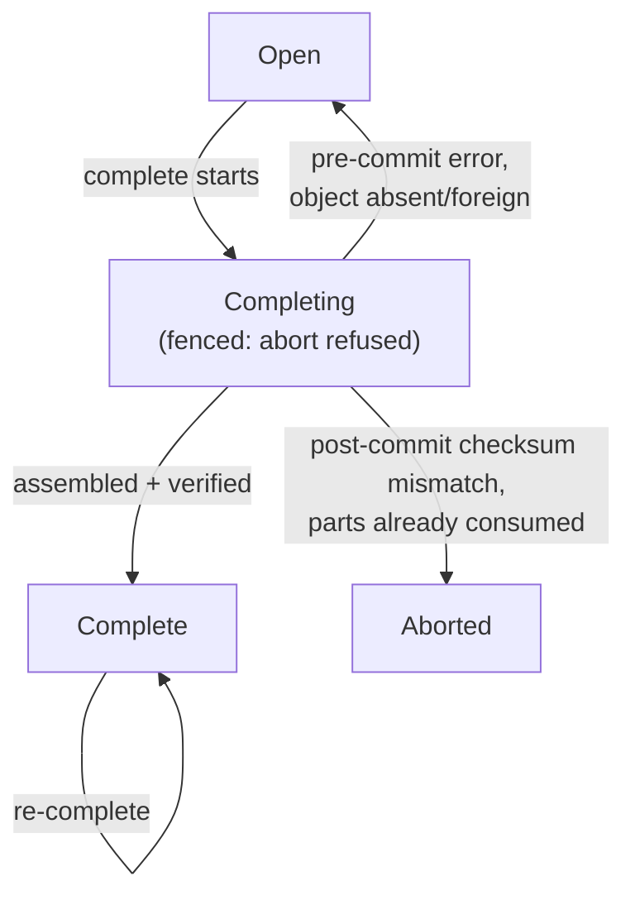

# Object storage uploads

How `pocopine-storage` moves bytes from a browser into S3, GCS, or Azure
Blob Storage: a **server-mediated, proxy-like** upload path that streams
each byte to the provider exactly once, with O(1) server memory per
in-flight part. This is the architecture reference for the upload
runtime (issue #176). For the small typed-`localStorage` helper, see
[`browser-storage.md`](./browser-storage.md) instead — different feature,
same crate name prefix.

## Why proxy-like

The server is the credential boundary: provider keys never reach the
browser. So the bytes flow *through* the server. The risk in that design
is the server itself — a naive proxy buffers or rewrites the object and
falls over under load. The whole upload runtime is built to avoid that:

- **Stream, don't buffer.** A part is forwarded to the provider as it
  arrives; the server never holds a whole object (or, on S3, even a whole
  part) in memory.
- **Write each byte once.** No "download the staged object, append, re-up­
  load" rewrite loop (which is O(n²) in bytes for an n-chunk upload).
- **Let the provider assemble.** Parts are committed with the provider's
  native multipart primitive (`CompleteMultipartUpload` / `ComposeObject`
  / `Put Block List`), never reassembled by the server.

## Layers

```text
  browser UploadClient                         ← Phase 4 (roadmap)
        │  HTTP, bytes stream through the server
        ▼
  axum routes (server.rs)                       ← per-request plumbing
     POST   /uploads                 initiate
     PATCH  /uploads/:s              sequential chunk   (Upload-Offset header)
     PUT    /uploads/:s              multipart part     (Upload-Part header)  ← Phase 2
     POST   /uploads/:s/complete     assemble
     GET/DELETE /uploads/:s          inspect / abort
        ▼
  StorageServer                                 ← auth, scope policy, ownership
     require_bound_actor · authorize_write · scope policy
        ▼
  StorageBackend trait                          ← one impl per provider
     capabilities() · initiate · append_upload_bytes(Bytes)
     upload_part(UploadBody) · complete · abort
        ▼
  S3 / GCS / Azure                              ← native multipart assembly
     (memory + local-fs backends for tests/dev)
```

Everything above `StorageBackend` is provider-neutral. Each backend
crate (`pocopine-storage-s3`, `-gcs`, `-azure`) maps the contract onto
one provider; shared session bookkeeping lives in
`pocopine-storage/src/backend_common.rs`.

## Two transports

A scope's backend advertises which transports it can serve, and the
client's requested [`UploadStrategy`] is negotiated against that.

| Strategy | Route | How the server handles bytes |
|----------|-------|------------------------------|
| `Sequential` | `PATCH …/uploads/:s` + `Upload-Offset` | Ordered chunks; the server coalesces them into a **bounded tail** and flushes provider-sized parts. One chunk in flight. |
| `Multipart` | `PUT …/uploads/:s` + `Upload-Part: n` | Parts addressed **by number**, uploaded **concurrently**; each streams straight to a provider part. |
| `SingleRequest` / `Auto` | — | `Auto` resolves to the most capable advertised mode; `SingleRequest` is reserved. |

Both transports converge on the same native provider assembly at
`complete`. `Sequential` is the default and exists so an upload works
even when the client can't or won't do multipart; `Multipart` is the
fast path for large files.

### Capability negotiation

```rust
pub struct BackendCapabilities {
    pub sequential_proxy: bool,   // PATCH-chunk proxy (default true)
    pub native_multipart: bool,   // by-number part route
    pub single_request: bool,
    pub signed_direct: bool,      // Phase 3 (roadmap)
}
```

A backend opts in by overriding `StorageBackend::capabilities()`:

```rust
fn capabilities(&self) -> BackendCapabilities {
    BackendCapabilities::default().with_native_multipart()
}
```

`backend_common::select_upload_mode(requested, caps)` resolves the
session's concrete strategy: `Auto` picks the best advertised mode, a
specific request that the backend can't satisfy is rejected as
`Unsupported`. The default capabilities are sequential-proxy-only, so a
backend that does nothing keeps working exactly as before. The
`/scopes/:scope` descriptor derives its advertised `strategies` from the
backend's capabilities, so client-side discovery matches what `initiate`
will actually accept.

## The streaming part path

A multipart part must reach the provider without the server buffering
the whole thing. The request body is wrapped, not collected:

```rust
pub struct UploadBody { /* axum Body + declared Content-Length */ }

impl UploadBody {
    pub fn content_length(&self) -> Option<u64>;
    pub fn into_byte_stream(self) -> UploadByteStream;        // Stream<Result<Bytes, io::Error>>
    pub async fn collect_capped(self, max: u64) -> StorageResult<Bytes>;
}
```

The part handler (`PUT …/uploads/:session`, part number in the `Upload-Part`
header) never calls `to_bytes`; it builds an `UploadBody` from the live axum
body and hands it to:

```rust
fn upload_part(&self, ctx, session, number: u32, body: UploadBody)
    -> StorageBoxFuture<UploadSession>;
```

`upload_part` defaults to `Unsupported`, so only backends that advertise
`native_multipart` implement it. How the body reaches the provider
depends on the provider's part API:

- **S3 — true streaming.** The part streams to `UploadPart` with O(1)
  memory. The inbound axum body is `Send` but not `Sync`, while the S3
  `ByteStream` body requires `Send + Sync`, so a bounded channel bridges
  the two (a pump task forwards frames, blocking on backpressure). The
  body is produced lazily, so its hash can't be precomputed; the part is
  signed with `UnsignedPayload` (and request checksums set to
  `WhenRequired`) to avoid an `x-amz-content-sha256` mismatch.
- **GCS / Azure — bounded collect.** A GCS *compose component* and an
  Azure *block* are written as one bounded object/block per part, which
  their SDKs don't stream a single shot without a seekable source. So the
  part is collected with `collect_capped(part_size)` — peak memory is one
  part per concurrent upload, the same profile as the sequential path's
  per-chunk buffer. S3 is the only backend that streams a part with no
  buffering.

### Provider mapping

| | S3 | GCS | Azure |
|---|----|----|-------|
| Part unit | `UploadPart` (part number) | component object | `Put Block` (block id) |
| Assembly | `CompleteMultipartUpload` | `ComposeObject` | `Put Block List` |
| Part discovery | `ListParts` | probe component keys | `GetBlockList` (uncommitted) |
| Provider limit | 10 000 parts, 5 MiB floor | 32 compose sources | 50 000 blocks |
| Per-part memory | O(1) streamed | one component | one block |

The part/component/block **size is pinned by the server** at `initiate`
(advertised as `min == preferred == max` in the [`TransferPlan`]) and the
part count is capped to the provider's assembly limit, so a valid upload
always assembles in a single provider operation.

## Completion is race-free

Parts arrive concurrently and out of order. The design that makes this
safe: **the server does not track parts in session state.** Per-part
receipts live on the provider, so concurrent parts never contend on a
shared session record.



At completion the backend lists what the provider actually holds (S3
`ListParts`, GCS component-key probes, Azure `GetBlockList`) and
assembles from that. Several invariants make the result trustworthy:

- **Declared length required.** A multipart session must declare its size
  at `initiate`. Parts stream without the session lock, so a `complete`
  racing an in-flight part would otherwise assemble a truncated object;
  the declared total catches that (`total != size → incomplete`).
- **Exact per-part length.** Parts `1..N-1` must be exactly the pinned
  part size and part `N` the remainder, enforced in `upload_part`. The
  assembled object's size then equals the declared total by
  construction — no need to trust provider metadata sizes (some emulators
  report them as zero).
- **Contiguity.** A gap (parts 1 and 3, no 2) is rejected as incomplete
  rather than silently concatenated.
- **No overwrite + ownership.** Assembly uses `If-None-Match: *` (or the
  provider equivalent) so it never clobbers an existing key, and stamps an
  ownership marker (`pocopine-upload-session`) in the object's custom
  metadata.
- **Idempotent re-complete.** If our own marked object already exists, a
  retry adopts it; a foreign object at the key is rejected.
- **Checksum before observable.** When a checksum policy is set, the
  assembled object is streamed and verified; a mismatch deletes it.

## Concurrency and fencing

`max_concurrent_parts` (from the scope policy) is enforced **server-side**
by a per-session semaphore in
`backend_common::UploadConcurrencyRegistry`, not left as a client hint.
A part acquires a permit for the duration of its provider write; excess
parts wait. Because the permit wait can outlast the session's expiry, the
captured `expires_at` is re-checked after the permit is granted.

For GCS and Azure, the part write also re-reads the session and
re-validates `Open` **while holding the session lock**, so a part can't
land a component/block after a concurrent `complete` or `abort` has
cleaned up. The slow client→server transfer happens *before* the lock, so
this fence doesn't serialize the upload — only the bounded provider write.

## Failure and recovery

The session moves `Open → Completing → Complete`, and the runtime is built
to survive a crash at any point:



- The session is persisted as `Completing` **before** the object is
  published, so a concurrent `abort` is refused and a crash leaves a
  recoverable session (a retry adopts the owner-marked object).
- A **pre-commit** failure (a missing part, a foreign object winning the
  key) reopens the session to `Open` — but only when the destination is
  definitively absent or foreign, never on an indeterminate lookup, so a
  retry can't change bytes a prior completion already published.
- A **post-commit** checksum mismatch is terminal: the parts are already
  consumed by the commit and can't be re-assembled, so the invalid object
  is deleted and the session is marked `Aborted` (the client must
  re-initiate). The concurrency pool is released on this terminal path
  too, not just on success.
- `abort` closes the concurrency pool (so queued/late parts fail instead
  of writing after cleanup) and removes provider state (S3 `Abort­Multi­
  partUpload`; GCS deletes the component range, tolerating gaps; Azure
  relies on uncommitted-block GC).

Legacy sessions created before native multipart deserialize as a
`LegacyProxy` variant and keep using the staged-object rewrite path until
they drain — additive `#[serde(default)]` fields, no migration.

## Memory profile

| Path | Peak server memory |
|------|--------------------|
| S3 multipart | O(1) — the part streams through a bounded channel |
| GCS / Azure multipart | one part per concurrent upload (`part_size × max_concurrent`) |
| Sequential (any backend) | one coalescing tail (≤ one provider part) |
| Legacy rewrite (draining only) | O(object size) — the path this work replaced |

For a 64 MiB upload the old sequential rewrite did ~63 full-object
re-uploads (O(n²) bandwidth); the native paths send each byte to the
provider exactly once.

## Source map

- `pocopine-storage/src/protocol.rs` — `UploadStrategy`,
  `BackendCapabilities`, `TransferPlan`, `UploadSession`, `UploadPolicy`.
- `pocopine-storage/src/server.rs` — routes, `StorageServer`,
  `StorageBackend` trait, `UploadBody` / `UploadByteStream`.
- `pocopine-storage/src/backend_common.rs` — `select_upload_mode`,
  `UploadSessionLockRegistry`, `UploadConcurrencyRegistry`, shared
  size/owner/open guards.
- `pocopine-storage-{s3,gcs,azure}/src/storage.rs` — per-provider
  `initiate` / `append_upload_bytes` / `upload_part` / `complete` /
  `abort`, plus native helpers and emulator-backed integration tests.

## Roadmap

- **Signed direct-to-provider** (`UploadPolicy.allow_signed_direct`): the
  server issues short-lived signed part URLs and the browser uploads
  straight to the provider, bypassing the proxy. Opt-in per scope;
  everything else (complete, abort, validation) is unchanged.
- **Browser client + Pine UI**: a `send_multipart` branch in the browser
  `UploadClient` that drives the part endpoints with bounded concurrency,
  per-part progress, and retry, plus the Pine upload component retarget.
