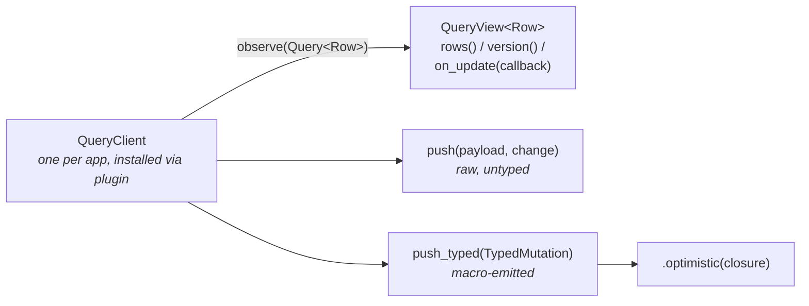
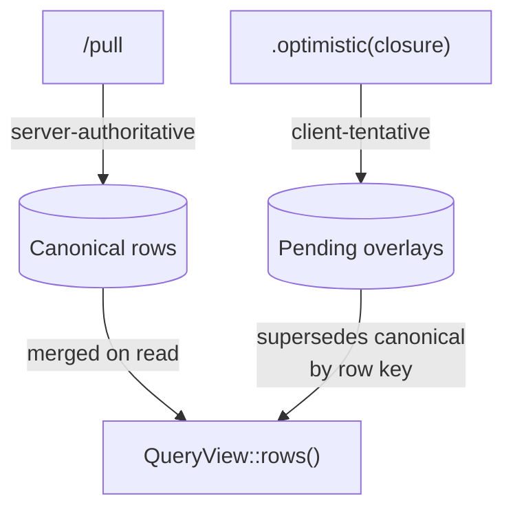

# Sync client API

What you use in wasm to subscribe to queries, render rows, and push
typed mutations.



The tutorial in [`sync.md`](./sync.md) walks the end-to-end flow. This
doc is the reference for the client surface.

## Install the plugin

`QueryClient` is provided as an app plugin — install once at app
startup, and every `#[component]` in the tree can request it via
`self.plugin::<Rc<QueryClient>>()`.

```rust
use pocopine::prelude::*;
use pocopine_sync_query::query_client_plugin;

fn app(app: App) -> App {
    app
        .register::<crate::IssueList>()
        .plugin(query_client_plugin())              // defaults to /sync/v1
}
```

Override the endpoint or driver config on the builder:

```rust
use std::time::Duration;
use pocopine_sync_query::QueryClientConfig;

app.plugin(
    query_client_plugin()
        .endpoint("/my-api/sync/v1")
        .config(QueryClientConfig {
            endpoint: "/my-api/sync/v1".into(),
            poll_interval: Some(Duration::from_secs(15)),
            disable_live: false,
            with_credentials: true,
            local_store: None,           // or Some(Rc::new(my_local_store))
        })
);
```

For tests that don't run an `App`, build the runtime client directly:

```rust
let client = query_client_plugin().into_client();   // bypasses the App
```

### `QueryClient` constructors (advanced)

```rust
impl QueryClient {
    pub fn new() -> Self                              // default config
    pub fn with_endpoint(endpoint: String) -> Self    // override /sync
    pub fn with_config(config: QueryClientConfig) -> Self
    pub fn without_driver() -> Self                   // tests: no SSE
}
```

`QueryClient::new()` enables the background driver: per-subscription
`/pull` cycles and live SSE wake-ups. `without_driver()` is for tests
that drive the routing engine manually. App code should prefer the
plugin — these constructors exist for harnesses and benches that bypass
the `App` lifecycle.

## The `Query<Row>` DSL

`#[query_resource]` emits `Issue::query()` pre-filled with the stream
name. Chain filters and finish with `.observe(&client)`:

```rust
use myapp_shared::issue::{Issue, issues};
use pocopine_sync_query::Order;

let view = Issue::query()
    .eq(issues::field::workspace_id, "W1")
    .eq(issues::field::status, "open")
    .any_of(issues::field::assignee, ["alice", "bob"])?
    .range(issues::field::priority, 1..=3)
    .contains(issues::field::title, "auth")?
    .order_by("created_at", Order::Desc)
    .limit(50)
    .observe(&client);
```

### Method surface

| Method                          | Behavior                                                       |
|---------------------------------|----------------------------------------------------------------|
| `.eq(field, value)`             | Exact match. Always available on `#[query_param]` fields.      |
| `.any_of(field, iter)`          | Set membership. Returns `SyncResult` (empty set is rejected).  |
| `.range(field, range)`          | Closed/half-open range. Numeric/ordered types only.            |
| `.contains(field, needle)`      | Case-insensitive substring. String fields only.                |
| `.contains_exact(field, needle)`| Case-sensitive substring.                                      |
| `.order_by(field, Order::…)`    | Sort. Backend honours via `query.order_by()` in `Source::list`.|
| `.limit(n)`                     | Cap row count. Default: backend's `max_snapshot_rows`.         |
| `.observe(&client)`             | Finalise + subscribe. Returns `QueryView<Row>`.                |
| `.build()`                      | Finalise without subscribing. Returns `Query<Row>`.            |

The `field::*` markers are typed: `field::workspace_id` only accepts
`String`-shaped values; using an integer there is a build error. The
type comes from your `#[query_param]` field's Rust type.

### Stable identity

Two queries with the same stream + params + order + limit produce the
same `QueryKey`. `client.observe(...)` deduplicates against that key —
two `observe(...)` calls for the same logical query share one
underlying subscription, refcounted independently.

## `QueryView<Row>`

```rust
impl<Row: 'static> QueryView<Row> {
    pub fn rows(&self) -> Vec<Row>;
    pub fn len(&self) -> usize;
    pub fn is_empty(&self) -> bool;
    pub fn version(&self) -> u64;
    pub fn on_update<F: Fn() + 'static>(&self, callback: F) -> UpdateToken<Row>;
}
```

### Reactive listener (raw)

```rust
let view = Issue::query().eq(field::workspace_id, "W1").observe(&client);

let _token = view.on_update({
    let view = view.clone();
    move || {
        // app-defined: refresh whatever consumes view.rows()
    }
});
```

`on_update` fires on:
- `/pull` returns new canonical rows
- An optimistic overlay is added or rolled back
- A live SSE wake-up triggers a re-pull
- A matching mutation is routed through (typed write from this client)

The returned `UpdateToken` unregisters on drop. Hold it as long as you
care about updates.

### Wiring a QueryView into a `#[component]`

`QueryView` is an external reactive source — it doesn't live in the
component's reactive graph by default. Bridge it via the
`scope::notify` / `effect` + `track` pair documented on
[`QueryView::on_update`](../crates/pocopine-sync-query/src/client.rs):

```rust
// IssueList.rs
use std::rc::Rc;
use pocopine::prelude::*;
use pocopine_sync_query::QueryClient;
use myapp_shared::issue::{Issue, issues};

#[derive(Default, Serialize, Deserialize)]
#[component(style = "issue_list.css")]
pub struct IssueList {
    #[prop]
    pub workspace_id: String,

    // Reactive state the template reads. Updated by the effect below.
    pub rows: Vec<Issue>,
    pub loading: bool,
    pub error: String,
}

#[handlers]
impl IssueList {
    pub fn on_mount(&mut self) {
        self.loading = true;

        let qc = self.plugin::<Rc<QueryClient>>();

        let view = Issue::query()
            .eq(issues::field::workspace_id, &self.workspace_id)
            .eq(issues::field::status, "open")
            .order_by("created_at", Order::Desc)
            .limit(50)
            .observe(&qc);

        // Bridge external updates → component scope.
        let scope = pocopine_core::current_scope_id()
            .expect("on_mount runs inside a component scope");
        let token = view.on_update(move || {
            pocopine_core::scope::notify(scope, "issues_view");
        });

        // Effect: react to either initial mount or any notify, copy
        // rows() into the component's reactive field. Capture `view`
        // AND `token` by move so they're owned by the effect closure
        // — when the component unmounts, the effect is released, the
        // closure drops, which drops `token` (unregistering on_update)
        // and the last `view` clone (releasing the subscription).
        let this = pocopine::this::<Self>();
        pocopine_core::effect(move || {
            pocopine_core::track(scope, "issues_view");
            let rows = view.rows();
            // `token` only needs to stay alive; force the closure to
            // own it so it can't be dropped at the end of on_mount.
            let _ = &token;
            this.update(|s: &mut Self| {
                s.loading = false;
                s.error.clear();
                s.rows = rows;
            });
        });
    }
}
```

```html
<!-- IssueList.poco -->
<section class="issues">
  <header>
    <h1>Issues — {{ workspace_id }}</h1>
    <span class="count" pp-text="rows.length"></span>
  </header>

  <p pp-show="loading" class="empty">Loading…</p>
  <p pp-show="error" class="error" pp-text="error"></p>
  <p pp-show="!loading && !rows.length && !error" class="empty">No open issues.</p>

  <ol class="issues__list" pp-show="rows.length">
    <template pp-for="row in rows" pp-key="row.id">
      <li class="issue">
        <h2 pp-text="row.title"></h2>
        <span class="status" pp-text="row.status"></span>
      </li>
    </template>
  </ol>
</section>
```

The flow:

1. `on_mount` runs in the component's scope.
2. `self.plugin::<Rc<QueryClient>>()` resolves the app-installed client.
3. `view.on_update(...)` fires `scope::notify(scope, "issues_view")` on
   every state change in the view.
4. `effect + track(scope, "issues_view")` re-runs whenever that key is
   notified, copying `view.rows()` into `self.rows`.
5. The reactive `self.rows` write triggers the template's `pp-for` to
   reconcile.

The bridge is one-time scaffolding — the goal is to make
`QueryView::rows()` look like any other reactive field on the component.

### `rows()` vs `len()` vs `version()`

- `rows()` clones — call sparingly inside render.
- `len()` and `is_empty()` use a counter; cheap.
- `version()` is an opaque token; compare to a saved value to skip
  redundant work when the view hasn't changed.

## Typed writes

`#[query_resource(name = "issues", draft = IssueDraft)]` emits typed
methods on `Issue`:

```rust
Issue::create(id, draft)                                   -> TypedMutation
Issue::update(id, draft, expected_version: Option<…>)      -> TypedMutation
Issue::delete(id, expected_version: Option<…>)             -> TypedMutation
```

Returned builder:

```rust
impl<Row, Id, Draft> TypedMutation<Row, Id, Draft> {
    pub fn optimistic<F>(self, build: F) -> Self
        where F: FnOnce(&MutationPayload<Id, Draft>) -> Row + 'static;
    pub fn payload(&self) -> &MutationPayload<Id, Draft>;
    pub fn wire_row_key(&self) -> Option<&RowKey>;
}
```

### Pushing from a component handler

```rust
// IssueComposer.rs
use std::rc::Rc;
use pocopine::prelude::*;
use pocopine_sync::{MutationId, SyncStreamName};
use pocopine_sync_query::QueryClient;
use myapp_shared::issue::{Issue, IssueDraft};

#[derive(Default, Serialize, Deserialize)]
#[component]
pub struct IssueComposer {
    #[prop]
    pub workspace_id: String,

    pub title: String,
    pub saving: bool,
    pub error: String,
}

#[handlers]
impl IssueComposer {
    pub async fn create(&mut self) {
        if self.title.trim().is_empty() {
            return;
        }
        self.saving = true;
        self.error.clear();

        let qc = self.plugin::<Rc<QueryClient>>();
        let row_id = format!("iss_{}", uuid::Uuid::new_v4());
        let draft = IssueDraft {
            workspace_id: self.workspace_id.clone(),
            status: "open".into(),
            title: std::mem::take(&mut self.title),
        };

        let mutation = Issue::create(row_id.clone(), draft)
            .optimistic({
                let row_id = row_id.clone();
                move |payload| Issue {
                    id: row_id.clone(),
                    version: String::new(),
                    workspace_id: payload.draft().workspace_id.clone(),
                    status: payload.draft().status.clone(),
                    title: payload.draft().title.clone(),
                }
            });

        let mutation_id = MutationId::new(uuid::Uuid::now_v7().to_string()).unwrap();

        let result = qc.push_typed(
            SyncStreamName::new("issues").unwrap(),
            mutation_id,
            mutation,
            "/sync/v1/push",
        ).await;

        match result {
            Ok(()) => { self.saving = false; }
            Err(err) => {
                self.saving = false;
                self.error = err.to_string();
            }
        }
    }
}
```

```html
<!-- IssueComposer.poco -->
<form class="composer" pp-on:submit.prevent="create">
  <label>
    <span>Title</span>
    <input type="text" pp-model="title" autocomplete="off" />
  </label>

  <p pp-show="error" class="error" pp-text="error"></p>

  <button type="submit" pp-show="!saving">Create</button>
  <button type="button" disabled pp-show="saving">Working…</button>
</form>
```

### What `.optimistic(...)` does

```mermaid
sequenceDiagram
    participant App as caller
    participant Client as QueryClient
    participant View as QueryView
    participant Server as SourceResource

    App->>Client: Issue::create(id, draft).optimistic(build).push_typed(...)
    Client->>Client: build(&payload) → Issue
    Client->>View: route through pending overlay
    View-->>App: on_update fires (instant)

    Client->>Server: POST /sync/v1/push
    Server->>Server: take_processing_payload<br/>reserve_mutation<br/>Source::create

    alt Accepted
        Server-->>Client: { accepted: [...] }
        Note over View: overlay stays;<br/>next /pull replaces with canonical
    else Rejected / conflict
        Server-->>Client: { rejected: [...] }
        Client->>View: RollbackGuard removes overlay
        View-->>App: on_update fires; caller gets SyncError
    else Transport error
        Server--xClient: network error
        Client->>View: RollbackGuard removes overlay
        View-->>App: on_update fires; caller gets SyncError
    end
```

Without `.optimistic(...)`, `push_typed` skips the local routing engine
and just POSTs the wire envelope. The view updates on the next `/pull`.

### When NOT to use optimistic

- Writes whose canonical shape you can't predict (server-assigned
  fields beyond `id` + `version`).
- Writes where showing a brief flicker is better than showing a
  rolled-back row.

## `MutationId`

```rust
// opaque-string newtype
pub struct MutationId(String);

impl MutationId {
    pub fn new(value: impl Into<String>) -> SyncResult<Self>;
    pub fn as_str(&self) -> &str;
}
```

The client owns the id. It MUST be stable across retries — if the user
reloads mid-flight, a replay with the same id collapses to one logical
write at the `MutationLog`. Use UUIDv7 (`uuid::Uuid::now_v7()`) or a
durable client-persisted counter:

```rust
let id = MutationId::new(uuid::Uuid::now_v7().to_string())?;
```

The framework's pending-overlay store persists the in-flight mutation
+ id across reloads; on next online tick it re-pushes with the same id.

## Pending overlay vs canonical



`rows()` returns the merged view. A pending overlay supersedes a
canonical row of the same key until the canonical version overrides it
on the next `/pull`. Rejected mutations remove the overlay and restore
the displaced canonical (if any).

## Lower-level `push` (advanced)

```rust
pub async fn push<P, Row>(
    &self,
    stream: SyncStreamName,
    mutation_id: MutationId,
    payload: P,
    change: RowChange<Row>,
    push_url: &str,
) -> SyncResult<()>
where P: Serialize, Row: Clone + Serialize + 'static;
```

`RowChange::Upsert(row)` or `RowChange::Delete(key)`. Use this when you
need to ship a payload shape `#[query_resource]` doesn't model
(e.g. a `MoveIssueBetweenColumns { ... }` payload that touches the
`Issue` collection but isn't a plain create/update). For typed writes,
prefer `push_typed`.

## Live wake-up config

Live wake-up is on by default. The driver opens one SSE stream per
active `(stream, params_hash)` topic and triggers `/pull` on the
matching subscription when an event arrives. Subscriptions are
partitioned by the macro's `partition_for_topic`, so a workspace-W1
subscriber only wakes on W1 mutations.

Disable it (offline-only flows, tests):

```rust
app.plugin(
    query_client_plugin().config(QueryClientConfig {
        disable_live: true,
        poll_interval: Some(Duration::from_secs(5)),  // poll only
        ..Default::default()
    })
);
```

The SSE endpoint is derived from the sync endpoint by the underlying
`pocopine-live` plugin — install `live_plugin()` alongside
`query_client_plugin()` if your app doesn't already.

## Cleanup

`QueryView` holds one `Rc` to its subscription. Dropping the last view
+ all `UpdateToken`s releases the subscription, cancels its driver, and
unsubscribes from live topics. The component bridge above ties view
lifetime to the effect closure, which the framework drops on
component unmount — so unmounting a component automatically tears down
its subscription. Don't leak views into globals.

## See also

- Tutorial: [`sync.md`](./sync.md)
- Server side: [`sync-server.md`](./sync-server.md)
- Selector layer: [`sync-query-selector-mechanism.md`](./sync-query-selector-mechanism.md)
