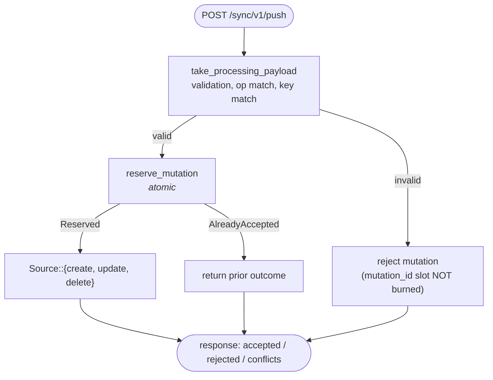
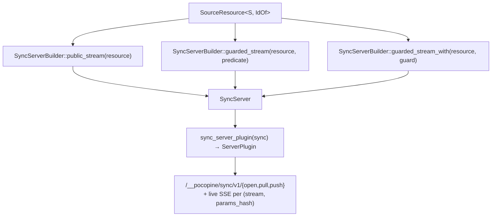

# Sync server contract

What you implement on the host so a sync resource works:

```text
   Source<Row, Id, Draft>           ← your code: DB I/O
            │
            ▼
   SourceResource<S, IdOf>          ← framework wrapper
            ├── version_field?      ← optimistic concurrency
            ├── partition_by?       ← live wake-up precision
            └── mutation_log        ← idempotency + atomicity
            │
            ▼
   HTTP endpoints                   ← framework provides
       /__pocopine/sync/v1/pull
       /__pocopine/sync/v1/push
       live SSE per (stream, params_hash)
```

The tutorial in [`sync.md`](./sync.md) shows the full flow. This doc is
the contract reference.

## `Source` trait

```rust
#[async_trait::async_trait]
pub trait Source: Send + Sync + 'static {
    type Id: SourceId;
    type Row: Clone + Serialize + DeserializeOwned + Send + Sync + 'static;
    type Draft: Clone + Serialize + DeserializeOwned + Send + Sync + 'static;

    async fn list(&self, ctx: RequestContext, query: &Query<Self::Row>)
        -> SyncResult<Vec<Self::Row>>;

    async fn get(&self, ctx: RequestContext, id: Self::Id)
        -> SyncResult<Option<Self::Row>>;

    async fn create(&self, ctx: RequestContext, id: Self::Id, draft: Self::Draft)
        -> SyncResult<Self::Row>;

    async fn update(
        &self,
        ctx: RequestContext,
        id: Self::Id,
        draft: Self::Draft,
        expected_version: Option<RowVersion>,
    ) -> SyncResult<WriteResult<Self::Row>>;

    async fn delete(
        &self,
        ctx: RequestContext,
        id: Self::Id,
        expected_version: Option<RowVersion>,
    ) -> SyncResult<DeleteResult<Self::Row>>;
}
```

### `list`

Called by `/pull`. The framework hands you the typed `Query` so you can
push filters down to your storage layer:

```rust
async fn list(&self, ctx: RequestContext, q: &Query<Issue>) -> SyncResult<Vec<Issue>> {
    let params = q.params();          // typed StreamParams
    let limit  = q.limit();           // Option<u32>
    let order  = q.order_by();        // Option<&OrderBy>
    self.db.fetch(&ctx, params, limit, order).await
}
```

The framework re-applies `q.matches(row)` on your returned rows, so a
naive impl that returns the whole tenant works correctly — it's just
slower. Treat the query as a **hint** at the storage layer.

### `get`

Called when a client requests a single row by id (e.g. for hydration of
a detail view). Returns `None` for not-found; surface auth failures via
`SyncError` rather than `None`.

### `create / update / delete`

Called from `/push` AFTER `MutationLog::reserve_mutation` reserves the
mutation id. Each is invoked at most once per logical mutation — the
framework guarantees idempotency on retries (see [MutationLog](#mutationlog)).

`update` and `delete` honour optimistic concurrency through
`expected_version`:

```rust
pub enum WriteResult<Row> {
    Applied(Row),                     // success; row is post-write state
    Conflict(Conflict<Row>),          // server_row + reason
}

pub enum DeleteResult<Row> {
    Applied,
    Conflict(Conflict<Row>),
}
```

`Conflict<Row>::new(server_row, reason)` and `Conflict::stale(server_row)`
build the rejection envelope. The client surfaces it to the caller.

### `SourceId`

```rust
pub trait SourceId: Clone + Serialize + DeserializeOwned + Send + Sync + 'static {
    fn to_row_key(&self) -> SyncResult<RowKey>;
}
```

`String` ships with a blanket impl. Custom id types (typed UUID, i64,
…) implement this once. The framework uses `to_row_key` server-side to
key the mutation log and the per-row addressing on the wire.

## `SourceResource` builder

Chain order:

```rust
let resource = source("issues", IssueStore::new(db))?      // 1. name + Source
    .max_snapshot_rows(2_000)?                              //    optional limit
    .schema_version(2)?                                     //    optional bump
    .id(|row: &Issue| row.id.clone())                       // 2. id projector
    .version_field(|row|                                    //    optional: OCC
        Ok(Some(RowVersion::new(&row.version)?)))
    .partition_by(issues::row_to_params)                    //    optional: live precision
    .mutation_log(MemoryMutationLog::with_scope_fn(…));     // 3. idempotency
```

| Method                 | Required? | Purpose                                       |
|------------------------|-----------|-----------------------------------------------|
| `source(name, impl)`   | yes       | Resource name + your `Source`. Returns builder. |
| `max_snapshot_rows(n)` | no        | Cap per-pull rows; default is generous.       |
| `schema_version(v)`    | no        | Bump to invalidate older client caches.       |
| `id(closure)`          | yes       | Project `&Row → Id`. Finalises the builder.   |
| `version_field(c)`     | no¹       | Extract `RowVersion` for OCC.                 |
| `partition_by(c)`      | no¹       | Per-(stream, params_hash) live wake-ups.      |
| `mutation_log(impl)`   | yes²      | Idempotency log impl (next section).          |

¹ Optional but recommended: skipping `partition_by` downgrades live
wake-ups to the bare stream tag (every client wakes on every push).
² Required to accept `/push` — without it, push handlers reject with a
clear "no MutationLog wired" error.

## `MutationLog`

```rust
#[async_trait::async_trait]
pub trait MutationLog<Row>: Send + Sync + 'static
where Row: Clone + Send + Sync + 'static
{
    async fn reserve_mutation(
        &self,
        ctx: &RequestContext,
        candidate: AcceptedMutation,
    ) -> SyncResult<MutationReservation>;

    async fn accepted_mutation(
        &self,
        ctx: &RequestContext,
        mutation_id: &MutationId,
    ) -> SyncResult<Option<AcceptedMutation>>;
}

pub enum MutationReservation {
    Reserved,                                  // caller won; proceed to Source
    AlreadyAccepted(AcceptedMutation),         // replay: short-circuit
}
```

### Invariant: `reserve_mutation` is the ONLY safe primitive

The push handler ONLY calls `reserve_mutation`. A check-then-record
sequence using `accepted_mutation` + (some hypothetical `record`) would
let two concurrent retries both run `Source::create`. That's a
correctness bug. `accepted_mutation` is for replay/diagnostic peek
only.

Production impls (sqlx, etc.) implement reservation atomically:

```sql
INSERT INTO mutation_log (scope, mutation_id, …)
VALUES ($1, $2, …)
ON CONFLICT (scope, mutation_id) DO NOTHING
RETURNING …;
```

If the insert won, return `Reserved`. If the conflict path returned the
prior row, return `AlreadyAccepted(prior)`. Same transaction as the
`Source::create/update/delete` call below it.

### Scoping

`MemoryMutationLog::with_scope_fn(closure)` projects a scope key from
the `RequestContext`:

```rust
MemoryMutationLog::<Issue>::with_scope_fn(|ctx| {
    Ok(ctx.tenant_id()?.to_string())
});
```

The same `mutation_id` used by tenant A and tenant B is treated as TWO
different mutations. **Production scope MUST mirror your auth boundary**
— otherwise tenant A can replay tenant B's mutation id.

## `partition_by` and live wake-ups

```rust
.partition_by(issues::row_to_params)
```

The `#[query_resource]`-emitted `row_to_params` extracts the
**required** fields from a row into typed `StreamParams`. On every
accepted mutation, the framework hashes those params and publishes to
the topic `(stream, params_hash)`:

```text
mutation accepted: Issue { workspace_id: "W1", … }
        │
        ▼
row_to_params → StreamParams { workspace_id: "W1" }
        │
        ▼
params_hash(W1) = 0xabc…
        │
        ▼
SSE topic: (issues, 0xabc…)
        │
        ├──▶ W1 subscribers wake
        └──✗ W2 subscribers stay silent
```

If the resource has zero `required` fields (`HAS_PER_PARAMS_LIVE_ROUTING
== false`), partitioning collapses to the bare stream tag — correct
but every push wakes every subscriber. The macro emits a tracing warning
in that case so the trade-off is visible.

## Schema migration

Two knobs:

1. **`schema_version`** on `#[query_resource]` and on `SourceResource`.
   Bump both when the wire shape changes; old clients receive a
   migration hint on `/pull`.
2. **`take_processing_payload()`** on incoming mutations. The framework
   applies any registered migrations BEFORE you decode into your typed
   `Draft`. If migration fails, the mutation is rejected with a clear
   reason and the slot is never burned (so a corrected retry can win
   the reservation).

This means the order at the server is:



Reserving BEFORE validation would leak the mutation id slot on
malformed first tries, so a well-formed retry would be rejected as a
"replay mismatch". The current ordering avoids that.

## Errors

`Source` methods return `SyncResult<...>` = `Result<..., SyncError>`.
The framework translates `SyncError::Backend` → HTTP 500,
`SyncError::Client` → HTTP 400, and surfaces structured rejection
reasons in the `/push` response so clients can roll back overlays
deterministically.

Use `SyncError::backend(msg)` for unrecoverable storage failures and
`SyncError::client(msg)` for caller mistakes (bad id format, missing
required field, etc.).

## Mount points: registering a resource on the server

`SourceResource` implements `pocopine_sync::SyncStreamSource`, so it
plugs straight into the existing sync server builder. Three install
shapes — pick the right one for your auth model:



### 1. Public stream (no auth gate)

```rust
use pocopine_sync::{SyncServer, sync_server_plugin};

let sync = SyncServer::builder()
    .public_stream(issues_resource(store)?)
    .events(Arc::new(live_backend()))     // bridges to pocopine-live SSE
    .build();
```

### 2. Predicate-guarded stream (sync auth predicate)

```rust
use pocopine_auth::Predicate;

let sync = SyncServer::builder()
    .guarded_stream(
        issues_resource(store)?,
        Predicate::authenticated(),       // anything Predicate-shaped
    )
    .events(Arc::new(live_backend()))
    .build();
```

The predicate is evaluated against the `RequestContext` on every
`/open`, `/pull`, and `/push`. Use this for "any signed-in user" type
gates that don't need async DB lookups.

### 3. Async-context guard (for DB / external auth)

```rust
use async_trait::async_trait;
use pocopine_sync::SyncStreamGuard;

struct WorkspaceMembershipGuard { db: Db }

#[async_trait]
impl SyncStreamGuard for WorkspaceMembershipGuard {
    async fn check(&self, ctx: &RequestContext) -> SyncResult<()> {
        let workspace_id = ctx.path_param("workspace_id")?;
        self.db.assert_member(ctx.user_id()?, workspace_id).await?;
        Ok(())
    }
}

let sync = SyncServer::builder()
    .guarded_stream_with(
        issues_resource(store)?,
        WorkspaceMembershipGuard { db },
    )
    .events(Arc::new(live_backend()))
    .build();
```

### Install on the `Server`

```rust
use pocopine_server::Server;

let server = Server::builder()
    .plugin(sync_server_plugin(sync))     // mounts /open, /pull, /push
    .plugin(live_plugin(live_backend()))  // if you use SSE wake-ups
    .build();
```

The sync server plugin mounts these routes for every registered stream:

| Route                              | Method | Used by                    |
|------------------------------------|--------|----------------------------|
| `/__pocopine/sync/v1/open`         | POST   | First subscription open    |
| `/__pocopine/sync/v1/pull`         | POST   | Snapshot + incremental pull |
| `/__pocopine/sync/v1/push`         | POST   | Typed + raw client writes  |
| `/__pocopine/live/v1/...`          | GET    | SSE wake-up (via live plugin) |

The client's `QueryClient` posts to these paths by default. If you need
to mount them under a different prefix (multi-tenant routing,
microservice path-stripping), set
`query_client_plugin().endpoint("/your/prefix")` to match.

### Multiple resources

`SyncServerBuilder` accepts one resource per `stream` name. Chain
multiple registrations on the same builder:

```rust
let sync = SyncServer::builder()
    .guarded_stream_with(issues_resource(store.clone())?,    WorkspaceGuard::new(store.clone()))
    .guarded_stream_with(comments_resource(store.clone())?,  WorkspaceGuard::new(store.clone()))
    .guarded_stream_with(projects_resource(store.clone())?,  WorkspaceGuard::new(store.clone()))
    .events(Arc::new(live_backend()))
    .build();
```

Each `#[query_resource(name = "...")]` becomes its own stream — clients
subscribe to them independently. They can share a `RequestContext`
guard pattern (as above) without sharing state.

## See also

- Tutorial: [`sync.md`](./sync.md)
- Client side: [`sync-client.md`](./sync-client.md)
- Selector layer: [`sync-query-selector-mechanism.md`](./sync-query-selector-mechanism.md)
