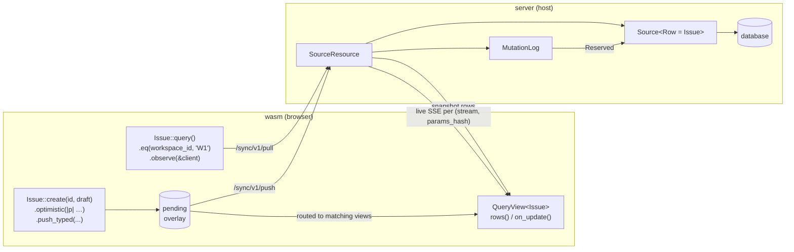

# Sync: build an issue tracker

End-to-end tutorial for `pocopine-sync-query`. By the end you have a
reactive, filtered, mutation-routed issue tracker scoped per workspace
with optimistic writes and live wake-ups.

For the server-side trait surface (Source, MutationLog, SourceResource)
read [`sync-server.md`](./sync-server.md). For the client-side runtime
(QueryClient, Query DSL, QueryView, typed writes) read
[`sync-client.md`](./sync-client.md). This doc reuses both ends in one
worked example.

## What you build



Three pieces share one row type:

| Layer       | Crate                          | Role                                         |
|-------------|--------------------------------|----------------------------------------------|
| Server      | `pocopine-sync-query` (host)   | `Source` trait → `SourceResource` endpoint   |
| Wire        | `pocopine-sync`                | `/sync/v1/pull`, `/sync/v1/push`, SSE topics |
| Client      | `pocopine-sync-query` (wasm)   | `QueryClient` + `QueryView<Row>`             |

## Step 1 — Shared row + draft

Declared once, used by both ends.

```rust
// crates/myapp-shared/src/issue.rs
use pocopine_sync_query::query_resource;
use serde::{Deserialize, Serialize};

#[query_resource(name = "issues", schema_version = 1, draft = IssueDraft)]
#[derive(Clone, Debug, Eq, PartialEq, Serialize, Deserialize)]
pub struct Issue {
    pub id: String,
    pub version: String,

    #[query_param(required)]
    pub workspace_id: String,

    #[query_param]
    pub status: String,

    #[query_param]
    pub title: String,
}

#[derive(Clone, Debug, Serialize, Deserialize)]
pub struct IssueDraft {
    pub workspace_id: String,
    pub status: String,
    pub title: String,
}
```

What `#[query_resource]` emits:

```rust
impl Issue {
    pub fn query() -> QueryBuilder<Self>             // entry to the DSL
    pub fn create(id, draft) -> TypedMutation<…>     // typed writes
    pub fn update(id, draft, expected) -> Typed…
    pub fn delete(id, expected) -> TypedMutation<…>
}

pub mod issues {                                     // resource module
    pub const NAME: &str = "issues";
    pub const SCHEMA_VERSION: u32 = 1;
    pub const HAS_PER_PARAMS_LIVE_ROUTING: bool;     // true → has `required` field
    pub fn matches(q, row) -> bool;
    pub fn row_to_params(row) -> StreamParams;       // server live wake-up projector
    pub fn partition_for_topic(p) -> Option<u64>;    // client subscribe hash
    pub mod field { /* one marker per #[query_param] */ }
}
```

`#[query_param(required)]` marks `workspace_id` as a **tenant gate**:
predicates without it are rejected and every subscription is partitioned
by its value. Bare `#[query_param]` is filterable but optional.

## Step 2 — Server: implement `Source` + mount

```rust
// crates/myapp-server/src/issues.rs
use async_trait::async_trait;
use myapp_shared::issue::Issue;
use pocopine_auth::RequestContext;
use pocopine_sync::{RowVersion, SyncResult};
use pocopine_sync_query::{
    DeleteResult, MemoryMutationLog, Query, Source, SourceResource, WriteResult, source,
};

pub struct IssueStore { /* db handle */ }

#[async_trait]
impl Source for IssueStore {
    type Id = String;
    type Row = Issue;
    type Draft = myapp_shared::issue::IssueDraft;

    async fn list(&self, ctx: RequestContext, q: &Query<Issue>) -> SyncResult<Vec<Issue>> {
        // `q.params()` exposes the typed filter; backends can push it
        // down to SQL. The framework re-applies `q.matches()` on the
        // result so naive impls can return more than necessary.
        self.db_list(&ctx, q.params()).await
    }

    async fn get(&self, ctx: RequestContext, id: String) -> SyncResult<Option<Issue>> {
        self.db_get(&ctx, &id).await
    }

    async fn create(&self, ctx: RequestContext, id: String, draft: IssueDraft)
        -> SyncResult<Issue>
    {
        self.db_insert(&ctx, id, draft).await
    }

    async fn update(
        &self,
        ctx: RequestContext,
        id: String,
        draft: IssueDraft,
        expected_version: Option<RowVersion>,
    ) -> SyncResult<WriteResult<Issue>> {
        self.db_update(&ctx, id, draft, expected_version).await
    }

    async fn delete(
        &self,
        ctx: RequestContext,
        id: String,
        expected_version: Option<RowVersion>,
    ) -> SyncResult<DeleteResult<Issue>> {
        self.db_delete(&ctx, id, expected_version).await
    }
}
```

Wire it to a `SourceResource`:

```rust
pub fn issues_resource(store: IssueStore) -> SyncResult<SourceResource<IssueStore, _>> {
    let resource = source("issues", store)?
        .id(|row: &Issue| row.id.clone())
        .version_field(|row| Ok(Some(RowVersion::new(&row.version)?)))
        .partition_by(myapp_shared::issue::issues::row_to_params)
        .mutation_log(MemoryMutationLog::<Issue>::with_scope_fn(|ctx| {
            // scope mutation idempotency per tenant
            Ok(ctx.tenant_id()?.to_string())
        }));
    Ok(resource)
}
```

The builder is opinionated about chain order — see [sync-server.md
§SourceResource](./sync-server.md#sourceresource-builder).

Mount it on the pocopine server as a `Resource` (host wiring is
covered in `pocopine-server` docs).

## Step 3 — Client: subscribe + render

```rust
// crates/myapp-wasm/src/issues_view.rs
use myapp_shared::issue::{Issue, issues};
use pocopine_sync_query::QueryClient;

pub fn open_workspace(client: &QueryClient, workspace_id: &str) {
    let view = Issue::query()
        .eq(issues::field::workspace_id, workspace_id)
        .eq(issues::field::status, "open")
        .order_by("created_at", Order::Desc)
        .limit(50)
        .observe(client);

    // Subscribe to updates and re-render.
    let _token = view.on_update({
        let view = view.clone();
        move || render_issue_list(&view.rows())
    });

    // Initial render.
    render_issue_list(&view.rows());
}
```

`Issue::query()` pre-fills the stream name. The `field::*` markers are
type-checked at compile time: `field::workspace_id` only accepts a
`String`-shaped value because `workspace_id: String` on the row. Passing
an integer there is a build error, not a runtime mismatch.

## Step 4 — Client: typed write with optimistic overlay

```rust
use pocopine_sync::MutationId;

async fn create_issue(client: &QueryClient, id: MutationId, draft: IssueDraft)
    -> SyncResult<()>
{
    let row_id = format!("iss_{}", uuid::Uuid::new_v4());

    let mutation = Issue::create(row_id.clone(), draft)
        .optimistic(|payload| Issue {
            id: row_id.clone(),
            version: String::new(),       // server fills on confirm
            workspace_id: payload.draft().workspace_id.clone(),
            status: payload.draft().status.clone(),
            title: payload.draft().title.clone(),
        });

    client.push_typed(
        SyncStreamName::new("issues")?,
        id,
        mutation,
        "/sync/v1/push",
    ).await
}
```

What the client does:

```mermaid
sequenceDiagram
    participant App as caller
    participant Client as QueryClient
    participant View as QueryView (W1)
    participant Server as SourceResource
    participant Log as MutationLog
    participant Source as Source::create
    participant Other as other clients (W1)

    App->>Client: Issue::create(id, draft).optimistic(build).push_typed(...)
    Client->>Client: run build(&payload) → tentative Issue
    Client->>View: route through pending overlay
    View-->>App: on_update fires (UI updates instantly)

    Client->>Server: POST /sync/v1/push
    Server->>Log: reserve_mutation
    Log-->>Server: Reserved
    Server->>Source: create(ctx, id, draft)
    Source-->>Server: canonical Issue

    alt accepted
        Server-->>Client: { accepted: [mutation_id] }
        Note over View: overlay stays;<br/>next /pull replaces with canonical
        Server->>Other: live SSE on (issues, W1-hash)
    else rejected / conflict
        Server-->>Client: { rejected: [...] }
        Client->>View: RollbackGuard drops overlay
        View-->>App: on_update fires (UI rolls back)
    end
```

`MutationId` should come from a durable client-side counter so retries
across reloads collapse to the same logical write.

## Step 5 — Live wake-ups

Server publishes to topics shaped by the resource's
`row_to_params` projector. With `workspace_id` as the required param,
every accepted mutation on workspace W1 wakes only W1 subscribers — W2
clients stay silent.

Client setup (one-liner on `QueryClient` config):

```rust
let client = QueryClient::with_config(QueryClientConfig {
    live_endpoint: Some("/live/v1/issues".to_string()),
    ..Default::default()
});
```

The driver opens one SSE stream per active partition and re-pulls the
matching subscription on each event.

## Where to next

- **Server contract:** [`sync-server.md`](./sync-server.md)
- **Client API:** [`sync-client.md`](./sync-client.md)
- **Selectors (derived queries):**
  [`sync-query-selector-mechanism.md`](./sync-query-selector-mechanism.md)
