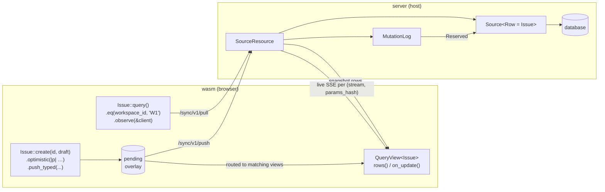

# Sync: build an issue tracker

End-to-end tutorial for `pocopine-sync-query`. By the end you have a
reactive, filtered, mutation-routed issue tracker scoped per workspace
with optimistic writes and live wake-ups.

For the server-side trait surface (Source, MutationLog, SourceResource)
read [`sync-server.md`](./sync-server.md). For the client-side runtime
(QueryClient, Query DSL, QueryView, typed writes) read
[`sync-client.md`](./sync-client.md). This doc reuses both ends in one
worked example.

## What you build



Three pieces share one row type:

| Layer       | Crate                          | Role                                         |
|-------------|--------------------------------|----------------------------------------------|
| Server      | `pocopine-sync-query` (host)   | `Source` trait → `SourceResource` endpoint   |
| Wire        | `pocopine-sync`                | `/sync/v1/pull`, `/sync/v1/push`, SSE topics |
| Client      | `pocopine-sync-query` (wasm)   | `QueryClient` + `QueryView<Row>`             |

## Step 1 — Shared row + draft

Declared once, used by both ends.

```rust
// crates/myapp-shared/src/issue.rs
use pocopine_sync_query::query_resource;
use serde::{Deserialize, Serialize};

#[query_resource(name = "issues", schema_version = 1, draft = IssueDraft)]
#[derive(Clone, Debug, Eq, PartialEq, Serialize, Deserialize)]
pub struct Issue {
    pub id: String,
    pub version: String,

    #[query_param(required)]
    pub workspace_id: String,

    #[query_param]
    pub status: String,

    #[query_param]
    pub title: String,
}

#[derive(Clone, Debug, Serialize, Deserialize)]
pub struct IssueDraft {
    pub workspace_id: String,
    pub status: String,
    pub title: String,
}
```

What `#[query_resource]` emits:

```rust
impl Issue {
    pub fn query() -> QueryBuilder<Self>             // entry to the DSL
    pub fn create(id, draft) -> TypedMutation<…>     // typed writes
    pub fn update(id, draft, expected) -> Typed…
    pub fn delete(id, expected) -> TypedMutation<…>
}

pub mod issues {                                     // resource module
    pub const NAME: &str = "issues";
    pub const SCHEMA_VERSION: u32 = 1;
    pub const HAS_PER_PARAMS_LIVE_ROUTING: bool;     // true → has `required` field
    pub fn matches(q, row) -> bool;
    pub fn row_to_params(row) -> StreamParams;       // server live wake-up projector
    pub fn partition_for_topic(p) -> Option<u64>;    // client subscribe hash
    pub mod field { /* one marker per #[query_param] */ }
}
```

`#[query_param(required)]` marks `workspace_id` as a **tenant gate**:
predicates without it are rejected and every subscription is partitioned
by its value. Bare `#[query_param]` is filterable but optional.

## Step 2 — Server: implement `Source` + mount

```rust
// crates/myapp-server/src/issues.rs
use async_trait::async_trait;
use myapp_shared::issue::Issue;
use pocopine_auth::RequestContext;
use pocopine_sync::{RowVersion, SyncResult};
use pocopine_sync_query::{
    DeleteResult, MemoryMutationLog, Query, Source, SourceResource, WriteResult, source,
};

pub struct IssueStore { /* db handle */ }

#[async_trait]
impl Source for IssueStore {
    type Id = String;
    type Row = Issue;
    type Draft = myapp_shared::issue::IssueDraft;

    async fn list(&self, ctx: RequestContext, q: &Query<Issue>) -> SyncResult<Vec<Issue>> {
        // `q.params()` exposes the typed filter; backends can push it
        // down to SQL. The framework re-applies `q.matches()` on the
        // result so naive impls can return more than necessary.
        self.db_list(&ctx, q.params()).await
    }

    async fn get(&self, ctx: RequestContext, id: String) -> SyncResult<Option<Issue>> {
        self.db_get(&ctx, &id).await
    }

    async fn create(&self, ctx: RequestContext, id: String, draft: IssueDraft)
        -> SyncResult<Issue>
    {
        self.db_insert(&ctx, id, draft).await
    }

    async fn update(
        &self,
        ctx: RequestContext,
        id: String,
        draft: IssueDraft,
        expected_version: Option<RowVersion>,
    ) -> SyncResult<WriteResult<Issue>> {
        self.db_update(&ctx, id, draft, expected_version).await
    }

    async fn delete(
        &self,
        ctx: RequestContext,
        id: String,
        expected_version: Option<RowVersion>,
    ) -> SyncResult<DeleteResult<Issue>> {
        self.db_delete(&ctx, id, expected_version).await
    }
}
```

Wire it to a `SourceResource`:

```rust
pub fn issues_resource(store: IssueStore) -> SyncResult<SourceResource<IssueStore, _>> {
    let resource = source("issues", store)?
        .id(|row: &Issue| row.id.clone())
        .version_field(|row| Ok(Some(RowVersion::new(&row.version)?)))
        .partition_by(myapp_shared::issue::issues::row_to_params)
        .mutation_log(MemoryMutationLog::<Issue>::with_scope_fn(|ctx| {
            // scope mutation idempotency per tenant
            Ok(ctx.tenant_id()?.to_string())
        }));
    Ok(resource)
}
```

Mount it on the `Server`:

```rust
use pocopine_server::Server;
use pocopine_sync::{SyncServer, sync_server_plugin};

let sync = SyncServer::builder()
    .guarded_stream_with(issues_resource(store)?, WorkspaceGuard::new(...))
    .events(Arc::new(live_backend()))
    .build();

let server = Server::builder()
    .plugin(sync_server_plugin(sync))
    .plugin(live_plugin(live_backend()))
    .build();
```

`public_stream` / `guarded_stream` / `guarded_stream_with` are the three
registration shapes — see
[sync-server.md §Mount points](./sync-server.md#mount-points-registering-a-resource-on-the-server)
for the full picture.

## Step 3 — Client: install + render in a component

Install the client plugin once at app startup:

```rust
// crates/myapp-wasm/src/lib.rs
use pocopine::prelude::*;
use pocopine_sync_query::query_client_plugin;

#[wasm_bindgen(start)]
pub fn start() {
    App::new()
        .register::<IssueList>()
        .register::<IssueComposer>()
        .plugin(query_client_plugin())
        .run();
}
```

Then a component requests `Rc<QueryClient>` via `self.plugin::<...>()`,
subscribes in `on_mount`, and binds the rows to a `.poco` template:

```rust
// crates/myapp-wasm/src/IssueList.rs
use std::rc::Rc;
use pocopine::prelude::*;
use pocopine_sync_query::{Order, QueryClient};
use myapp_shared::issue::{Issue, issues};

#[derive(Default, Serialize, Deserialize)]
#[component(style = "issue_list.css")]
pub struct IssueList {
    #[prop] pub workspace_id: String,

    pub rows: Vec<Issue>,
    pub loading: bool,
    pub error: String,
}

#[handlers]
impl IssueList {
    pub fn on_mount(&mut self) {
        self.loading = true;

        let qc = self.plugin::<Rc<QueryClient>>();
        let view = Issue::query()
            .eq(issues::field::workspace_id, &self.workspace_id)
            .eq(issues::field::status, "open")
            .order_by("created_at", Order::Desc)
            .limit(50)
            .observe(&qc);

        let scope = pocopine_core::current_scope_id().unwrap();
        let token = view.on_update(move || {
            pocopine_core::trigger(scope, "issues_view");
        });

        let this = pocopine::this::<Self>();
        pocopine_core::effect(move || {
            pocopine_core::track(scope, "issues_view");
            let rows = view.rows();
            let _ = &token;          // keep token alive with the effect
            this.update(|s: &mut Self| {
                s.loading = false;
                s.error.clear();
                s.rows = rows;
            });
        });
    }
}
```

```html
<!-- IssueList.poco -->
<section class="issues">
  <header>
    <h1>Issues — {{ workspace_id }}</h1>
    <span class="count" pp-text="rows.length"></span>
  </header>

  <p pp-show="loading" class="empty">Loading…</p>
  <p pp-show="error" class="error" pp-text="error"></p>
  <p pp-show="!loading && !rows.length && !error" class="empty">No open issues.</p>

  <ol class="issues__list" pp-show="rows.length">
    <template pp-for="row in rows" pp-key="row.id">
      <li class="issue">
        <h2 pp-text="row.title"></h2>
        <span class="status" pp-text="row.status"></span>
      </li>
    </template>
  </ol>
</section>
```

`Issue::query()` pre-fills the stream name. The `field::*` markers are
type-checked at compile time. Passing an integer to
`field::workspace_id` is a build error, not a runtime mismatch.

The `on_update` → `trigger` → `effect + track` triangle is the
canonical bridge from any external reactive source (QueryView, custom
signals, etc.) into the component's reactive graph — once `rows` is on
the component, the template treats it like any other reactive field.

## Step 4 — Client: typed write with optimistic overlay

Same component pattern; the handler runs the write and the framework
re-renders the template when the optimistic overlay or the rejection
roll-back arrives.

```rust
// crates/myapp-wasm/src/IssueComposer.rs
use std::rc::Rc;
use pocopine::prelude::*;
use pocopine_sync::{MutationId, SyncStreamName};
use pocopine_sync_query::QueryClient;
use myapp_shared::issue::{Issue, IssueDraft};

#[derive(Default, Serialize, Deserialize)]
#[component]
pub struct IssueComposer {
    #[prop] pub workspace_id: String,
    pub title: String,
    pub saving: bool,
    pub error: String,
}

#[handlers]
impl IssueComposer {
    pub async fn create(&mut self) {
        if self.title.trim().is_empty() { return; }
        self.saving = true;
        self.error.clear();

        let qc = self.plugin::<Rc<QueryClient>>();
        let row_id = format!("iss_{}", uuid::Uuid::now_v7());
        let draft = IssueDraft {
            workspace_id: self.workspace_id.clone(),
            status: "open".into(),
            title: std::mem::take(&mut self.title),
        };

        let mutation = Issue::create(row_id.clone(), draft)
            .optimistic({
                let row_id = row_id.clone();
                move |payload| Issue {
                    id: row_id.clone(),
                    version: String::new(),
                    workspace_id: payload.draft().workspace_id.clone(),
                    status: payload.draft().status.clone(),
                    title: payload.draft().title.clone(),
                }
            });

        let id = MutationId::new(uuid::Uuid::now_v7().to_string()).unwrap();
        let result = qc.push_typed(
            SyncStreamName::new("issues").unwrap(),
            id, mutation, "/sync/v1/push",
        ).await;

        match result {
            Ok(()) => self.saving = false,
            Err(err) => { self.saving = false; self.error = err.to_string(); }
        }
    }
}
```

```html
<!-- IssueComposer.poco -->
<form class="composer" pp-on:submit.prevent="create">
  <label>
    <span>Title</span>
    <input type="text" pp-model="title" autocomplete="off" />
  </label>
  <p pp-show="error" class="error" pp-text="error"></p>
  <button type="submit" pp-show="!saving">Create</button>
  <button type="button" disabled pp-show="saving">Working…</button>
</form>
```

What the client does:

```mermaid
sequenceDiagram
    participant App as caller
    participant Client as QueryClient
    participant View as QueryView (W1)
    participant Server as SourceResource
    participant Log as MutationLog
    participant Source as Source::create
    participant Other as other clients (W1)

    App->>Client: Issue::create(id, draft).optimistic(build).push_typed(...)
    Client->>Client: run build(&payload) → tentative Issue
    Client->>View: route through pending overlay
    View-->>App: on_update fires (UI updates instantly)

    Client->>Server: POST /sync/v1/push
    Server->>Log: reserve_mutation
    Log-->>Server: Reserved
    Server->>Source: create(ctx, id, draft)
    Source-->>Server: canonical Issue

    alt accepted
        Server-->>Client: { accepted: [mutation_id] }
        Note over View: overlay stays; next /pull replaces with canonical
        Server->>Other: live SSE on (issues, W1-hash)
    else rejected / conflict
        Server-->>Client: { rejected: [...] }
        Client->>View: RollbackGuard drops overlay
        View-->>App: on_update fires (UI rolls back)
    end
```

`MutationId` should come from a durable client-side counter so retries
across reloads collapse to the same logical write.

## Step 5 — Live wake-ups

Server publishes to topics shaped by the resource's
`row_to_params` projector. With `workspace_id` as the required param,
every accepted mutation on workspace W1 wakes only W1 subscribers — W2
clients stay silent.

Live wake-up is on by default. Server side: install `live_plugin(...)`
alongside `sync_server_plugin(...)` and pass the same backend via
`.events(...)` on the `SyncServerBuilder` (see Step 2). Client side:
nothing to do — `query_client_plugin()` opens an SSE stream per active
`(stream, params_hash)` topic and re-pulls the matching subscription.

Disable it (offline-only, tests):

```rust
app.plugin(
    query_client_plugin().config(QueryClientConfig {
        disable_live: true,
        ..Default::default()
    })
);
```

## Where to next

- **Server contract:** [`sync-server.md`](./sync-server.md)
- **Client API:** [`sync-client.md`](./sync-client.md)
- **Selectors (derived queries):**
  [`sync-query-selector-mechanism.md`](./sync-query-selector-mechanism.md)
