# jsbench results

Cross-framework benchmarks of the same `pp-for`-style keyed table
under four runtimes — pocopine, leptos, yew, and a vanilla Vue
harness — driven by Playwright over a temporary HTTP server.

Last measured: **2026-04-25** at commit
`0ed2ad5 perf(rfc-054): revert Lever 6 — V8 attach penalty makes
it net negative`.

## Methodology

- **Driver.** `./benchmark.sh [<harness>] [--browser <name>]`.
  Wraps `python3 measure.py`, which serves the chosen
  `jsbench/<harness>/` over a loopback HTTP server and steers a
  Playwright page at it.
- **Plan per run.** 2 warmups + 5 measured passes through this
  action sequence: `run · clear · run · update · swaprows · clear ·
  runlots · update · add · clear`. Settle delays per action are
  fixed (50–250ms) so DOM mutations are quiesced before the next
  click.
- **Timing.** Wall-clock between click dispatch and the post-
  settle snapshot. Reported as mean / p50 / p95 / max across the
  five measured passes; tables below show **mean ms**.
- **Browsers.** Headless Firefox (Spidermonkey) and headless
  Chromium (V8). One bench run per engine per harness — no
  warm-Browser sharing across harnesses.
- **Hardware/OS.** Linux 6.17, single-machine local run. No
  thermal throttling controls — relative ordering is what
  matters; absolute numbers will drift on other hardware.
- **Build flags.** `wasm-pack build --release --target web` for
  every Rust harness. The pocopine `--profile-*` modes
  additionally enable the `pocopine-core/mount-profiler` cargo
  feature (skip when only timing).

Reproduce a single engine end-to-end:

```bash
./jsbench/benchmark.sh --all --browser firefox
./jsbench/benchmark.sh --all --browser chromium
```

The two acceptance gates for the pocopine fast-path work are
**runLots(10000)** and **update every 10th**; everything else is
context.

## Results

### Firefox (Spidermonkey, headless)

| action                | pocopine | vanilla |  vue  | leptos |  yew  |
|-----------------------|---------:|--------:|------:|-------:|------:|
| run(1000)             |      209 |     173 |   195 |    208 |   198 |
| **runLots(10000)**    |  **849** |     594 |   708 |    905 |   806 |
| add(1000)             |      501 |     300 |   360 |    341 |   434 |
| **update every 10th** |      291 |     208 |   231 |    186 |   255 |
| swapRows              |      217 |     143 |   146 |    143 |   154 |
| clear                 |      208 |     159 |   164 |    193 |   220 |

`runLots(10000)` ordering vs vanilla (594 ms = 1.00×):

```mermaid
gantt
  title runLots(10000) — Firefox (ms vs vanilla baseline)
  dateFormat X
  axisFormat %s
  section vanilla
  baseline 594ms       :v,         0,   594
  section vue
  shared with vanilla  :done,  a1, 0,   594
  +114ms overhead      :crit,  b1, 594, 114
  section yew
  shared with vanilla  :done,  a2, 0,   594
  +212ms overhead      :crit,  b2, 594, 212
  section pocopine
  shared with vanilla  :done,  a3, 0,   594
  +255ms overhead      :crit,  b3, 594, 255
  section leptos
  shared with vanilla  :done,  a4, 0,   594
  +311ms overhead      :crit,  b4, 594, 311
```



### Chromium (V8, headless)

| action                | pocopine | vanilla |  vue  | leptos |  yew  |
|-----------------------|---------:|--------:|------:|-------:|------:|
| run(1000)             |      166 |     153 |   153 |    167 |   163 |
| **runLots(10000)**    |  **747** |     628 |   674 |    739 |   740 |
| add(1000)             |      524 |     377 |   389 |    401 |   437 |
| **update every 10th** |      278 |     237 |   240 |    213 |   245 |
| swapRows              |      163 |     133 |   136 |    131 |   134 |
| clear                 |      160 |     133 |   144 |    149 |   148 |

`runLots(10000)` ordering vs vanilla (628 ms = 1.00×):

```mermaid
gantt
  title runLots(10000) — Chromium (ms vs vanilla baseline)
  dateFormat X
  axisFormat %s
  section vanilla
  baseline 628ms       :v,         0,   628
  section vue
  shared with vanilla  :done,  a1, 0,   628
  +46ms overhead       :crit,  b1, 628,  46
  section leptos
  shared with vanilla  :done,  a2, 0,   628
  +111ms overhead      :crit,  b2, 628, 111
  section yew
  shared with vanilla  :done,  a3, 0,   628
  +112ms overhead      :crit,  b3, 628, 112
  section pocopine
  shared with vanilla  :done,  a4, 0,   628
  +119ms overhead      :crit,  b4, 628, 119
```



## Notes

- On Chromium, pocopine ties leptos and yew on `runLots(10000)`
  (747 vs 739, 740) within run-to-run variance, trailing vue by
  73 ms. `clear` (160 ms) and `run(1000)` (166 ms) are within a
  few ms of every other WASM framework on the chart.
- On Firefox, every WASM framework pays a uniform ~50 ms tax over
  vanilla / vue from Spidermonkey's wasm↔JS bridge. pocopine sits
  between yew (806 ms) and leptos (905 ms) on `runLots(10000)`.
