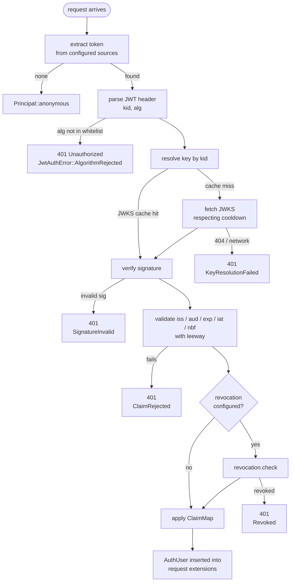

# RFC 068 - JWT-based authentication verification

| Field | Value |
|---|---|
| **Status** | Draft |
| **Author** | pocopine team |
| **Created** | 2026-05-03 |
| **Related** | [`rfc-066-server-function-auth.md`](./rfc-066-server-function-auth.md) |
| **Supersedes** | RFC-066 §5.4's "first-party Firebase/Clerk integrations are out of scope" disclaimer |

## 1. Summary

Pocopine ships **one** JWT verification engine that handles every
mainstream identity provider plus DIY token issuance:

```rust
// Firebase
App::new().auth(JwtVerifier::firebase("my-project-id"))

// Clerk
App::new().auth(JwtVerifier::clerk("https://my-app.clerk.accounts.dev"))

// Auth0
App::new().auth(JwtVerifier::auth0("tenant.auth0.com",
                                    "https://api.example.com"))

// Supabase
App::new().auth(JwtVerifier::supabase(env!("SUPABASE_JWT_SECRET")))

// Anything else (custom OIDC issuer, internal IdP, etc.)
App::new().auth(JwtVerifier::custom(JwtConfig { /* ... */ }))

// Pocopine-issued tokens for first-party credential flows
let secret = JwtSecret::from_env("POCOPINE_JWT_SECRET");
App::new().auth(JwtVerifier::pocopine(secret.clone()));
let issuer = JwtIssuer::pocopine(secret);
```

The engine lives in a new `pocopine-auth-jwt` crate and implements the
`TokenVerifier` trait from `pocopine-auth`. Provider differences are
**declarative configuration**, not separate implementations. There is
no first-party Firebase / Clerk / Auth0 / Supabase crate; the framework
only knows about JWT, JWKS, and OIDC-shaped claims.

## 2. Motivation

RFC-066 deliberately deferred first-party provider integrations. The
practical consequence has been: every "build me an app with auth" user
either rolls their own JWT verifier (often insecurely — `alg: none`
and JWT-confusion are still common bugs) or hand-wires a third-party
crate that has its own opinions about request types and middleware
shapes.

The shared shape is hidden in plain sight: Firebase, Clerk, Auth0,
Supabase, and most internal IdPs all issue OIDC-style JWTs. The
verification flow is identical across providers; only the JWKS URL,
expected `iss`/`aud`, allowed algorithms, claim layout, and token
sources vary. A correctly written verifier supports all of them.

The framework's job is therefore not to integrate with each provider
individually — it's to ship one well-tested verifier and a small
handful of preset configs.

## 3. Goals

- One implementation of JWT verification that every provider preset
  shares. ~400–500 LOC of meaningful security-critical code, audited
  once.
- Algorithm pinning so common JWT bugs (`alg: none`, RS256→HS256
  confusion) are impossible by construction.
- Provider presets that fit on one screen each (Firebase, Clerk,
  Auth0, Supabase, plus pocopine's own).
- Drop-in onboarding: the user supplies a project ID / domain / shared
  secret and the framework wires verification, token extraction, and
  `RequestContext` population.
- A symmetric `JwtIssuer` for the credential-provider path so
  pocopine-issued tokens reuse the same key and claim machinery as
  third-party verification.
- Stateless by default; revocation and stateful sessions are opt-in.

## 4. Non-goals

- Not a wrapper around vendor SDKs. No first-party Firebase Admin or
  Clerk Backend crate.
- Not a refresh-token implementation. Refresh is a wasm/client-side
  concern; the verifier sees only access tokens / ID tokens.
- Not an OAuth client. Sign-in flows that redirect to the IdP are
  delivered by Tier-4 UI components; this RFC stops at "verify the
  token presented by the request."
- Not an authorization framework. Roles and permissions are extracted
  from claims; policy decisions ("can user X edit post Y?") belong to
  app code or a future RFC on RBAC/ABAC.
- Not a CSRF or rate-limit layer. Those belong in host middleware.

## 5. Design

### 5.1 Crate layout

A new crate, `pocopine-auth-jwt`, depends on `pocopine-auth`
(contracts only) and on `jsonwebtoken` for signature verification.

```
crates/pocopine-auth-jwt/
├── Cargo.toml
└── src/
    ├── lib.rs
    ├── config.rs       // JwtConfig / KeySource / ClaimMap
    ├── verifier.rs     // JwtVerifier (impl TokenVerifier)
    ├── issuer.rs       // JwtIssuer (HS256 / RS256 issuance)
    ├── jwks.rs         // JwksResolver + cache
    ├── presets.rs      // firebase / clerk / auth0 / supabase
    └── error.rs        // JwtAuthError taxonomy
```

The `pocopine` umbrella re-exports `JwtVerifier`, `JwtIssuer`, and the
preset constructors behind a `jwt-auth` feature flag so apps that
don't want the verifier dep don't pay for it.

### 5.2 `JwtConfig`

```rust
pub struct JwtConfig {
    /// Where signing keys come from.
    pub keys: KeySource,
    /// Required `iss` claim. None means skip issuer validation
    /// (rarely correct — preset constructors always set this).
    pub issuer: Option<String>,
    /// Required `aud` claim. Strings accepted in the JWT may be a
    /// single string or an array; validation is "intersection
    /// nonempty" against this list.
    pub audience: Option<Vec<String>>,
    /// Algorithms accepted on a verified token. Pinned per-config so
    /// a token signed with `alg: none` or the wrong family is rejected
    /// before signature verification.
    pub algorithms: Vec<Algorithm>,
    /// Clock skew tolerance for `exp`/`iat`/`nbf`.
    pub leeway: Duration,
    /// Where to look for the token. Bearer header is universal; some
    /// providers also use cookies (Firebase `__session`).
    pub sources: Vec<TokenSource>,
    /// Optional revocation hook. None = stateless verification, the
    /// default. Some apps want to consult a denylist or the IdP's
    /// revocation API on every request.
    pub revocation: Option<Arc<dyn RevocationCheck>>,
    /// How to project claims onto AuthUser fields. Default works for
    /// OIDC; provider presets override paths for non-standard claims
    /// (e.g. Clerk's `org_role`).
    pub claim_map: ClaimMap,
    /// Required scope. None = skip scope validation. When set, the
    /// `scope` claim (space-separated) must contain every entry.
    pub required_scopes: Vec<String>,
}
```

### 5.3 `KeySource`

Three shapes cover the entire mainstream provider list plus DIY:

```rust
pub enum KeySource {
    /// Fetch JWKS from a URL, cache, refresh on `kid` miss.
    /// Used by Firebase, Clerk, Auth0, and any standards-compliant
    /// OIDC issuer.
    Jwks {
        url: String,
        /// Default cache TTL when the response has no
        /// `Cache-Control: max-age`. Refreshed on `kid` miss.
        cache_ttl: Duration,
        /// Min interval between refreshes triggered by `kid` miss,
        /// to defend against attacker-driven thrash.
        refresh_cooldown: Duration,
    },
    /// Static JWKS; useful for offline tests and air-gapped fleets.
    StaticJwks(JwkSet),
    /// HMAC shared secret. Supabase is the notable mainstream
    /// outlier; also the substrate for `pocopine-auth-credentials`.
    Hmac { secret: SecretBytes },
}
```

`SecretBytes` is a wrapper around `Vec<u8>` with `Drop` zeroing and
without `Debug` / `Display`.

### 5.4 `ClaimMap`

Different providers put the same logical data in different places.
`ClaimMap` declares paths so the verifier can populate `AuthUser`
without per-provider switch statements:

```rust
pub struct ClaimMap {
    /// Path to user id. Default: `"sub"`.
    pub id: ClaimPath,
    /// Path to email. Default: `"email"`.
    pub email: Option<ClaimPath>,
    /// Path to email-verified flag.
    pub email_verified: Option<ClaimPath>,
    /// Path to display name. Default: `"name"`, fallback `"given_name"`.
    pub name: Option<ClaimPath>,
    /// Path(s) to roles. May be a single string, an array, or absent.
    pub roles: Option<ClaimPath>,
    /// Path to permissions or scopes used as permissions. The `scope`
    /// claim (space-separated) and the `permissions` array
    /// (Auth0 RBAC) are both common.
    pub permissions: Option<ClaimPath>,
}

pub struct ClaimPath {
    /// Dotted path: `["firebase", "sign_in_provider"]`.
    pub segments: Vec<String>,
}
```

The verifier walks the path through the claims object; all
unrecognized claims are preserved verbatim in `AuthUser.claims`.

### 5.5 `TokenSource`

```rust
pub enum TokenSource {
    /// `Authorization: Bearer <token>` — universal.
    Bearer,
    /// Named cookie. Firebase SSR uses `__session`; pocopine's own
    /// credential provider uses `pocopine_session` by default.
    Cookie(Cow<'static, str>),
}
```

The verifier tries each source in order, first match wins. If a
config has both `Bearer` and `Cookie`, a request supplying both is
verified against the bearer token; the cookie is ignored. This
matches OIDC's "bearer wins" convention and avoids consuming-vs-not
ambiguity.

### 5.6 Verification flow



The middleware runs this flow before any `#[server(guard = ...)]`
fires. A failed verification yields `Principal::anonymous` for the
guard to inspect (so a `#[server(public)]` route still works for
unauthenticated callers); a malformed-but-present token yields 401
short-circuited by the middleware so guards never run on garbage
input.

### 5.7 JWKS caching

```
JwksResolver:
    cache: HashMap<JwkId, CachedKey>
    last_refresh: Instant
    refresh_cooldown: Duration

    on resolve(kid):
        if cache hit: return key
        if elapsed since last_refresh < refresh_cooldown:
            return Err(KeyResolutionFailed("rate-limited"))
        last_refresh = now
        fetch JWKS, replace cache, return key or NotFound
```

The cooldown defends against adversarial clients trying to drive
unbounded JWKS fetches by sending tokens with random `kid` values.
Default cooldown is 30 seconds — much longer than legitimate key
rotation needs, much shorter than the cache TTL.

The cache TTL is initialized from the response's `Cache-Control:
max-age` header if present, else from `JwtConfig.cache_ttl`. Either
way, the cache is refreshed on the next `kid` miss after expiry, not
on a timer (lazy invalidation).

### 5.8 Algorithm pinning — the security-critical part

Two classes of bug this design eliminates by construction:

1. **`alg: none`**: a token signed without a signature. Always rejected
   because `Algorithm::None` is not in any preset's whitelist. The
   `Algorithm` enum doesn't even include `None` as a variant.

2. **JWT confusion**: a token signed with HS256 using the verifier's
   public RSA key as the HMAC secret. The verifier's
   `KeySource::Jwks` and `KeySource::StaticJwks` only accept
   `Rs256`/`Rs384`/`Rs512`/`Es256`/`Es384` algorithms; HS256 is
   rejected before the key is fetched. `KeySource::Hmac` only
   accepts HS256/HS384/HS512.

   The check is at config-construction time: `JwtConfig::validate()`
   panics if `algorithms` and `keys` are an incompatible mix. Preset
   constructors are guaranteed-correct.

Tests in `pocopine-auth-jwt`:

- A token with `alg: none` is rejected with `AlgorithmRejected`.
- A JWKS-keyed config rejects `alg: HS256` tokens.
- An HMAC-keyed config rejects `alg: RS256` tokens.
- A token signed by a `kid` not in the JWKS triggers a refresh; if
  still absent, returns `KeyResolutionFailed`.
- A revoked token (per the `RevocationCheck` impl) is rejected.

### 5.9 Provider presets

Each preset is a one-screen function. Concrete shapes:

#### 5.9.1 Firebase

```rust
impl JwtVerifier {
    pub fn firebase(project_id: &str) -> JwtConfig {
        JwtConfig {
            keys: KeySource::Jwks {
                url: format!(
                    "https://www.googleapis.com/service_accounts/\
                     v1/jwk/securetoken@system.gserviceaccount.com"
                ),
                cache_ttl: Duration::from_secs(3600),
                refresh_cooldown: Duration::from_secs(30),
            },
            issuer: Some(format!(
                "https://securetoken.google.com/{project_id}"
            )),
            audience: Some(vec![project_id.into()]),
            algorithms: vec![Algorithm::Rs256],
            leeway: Duration::from_secs(60),
            sources: vec![
                TokenSource::Bearer,
                TokenSource::Cookie("__session".into()),
            ],
            revocation: None,
            claim_map: ClaimMap::firebase(),
            required_scopes: Vec::new(),
        }
    }
}
```

`ClaimMap::firebase()` maps:
- `id` ← `sub`
- `email` ← `email`
- `email_verified` ← `email_verified`
- `name` ← `name`
- `roles` ← (none — Firebase puts custom roles under user-defined
  custom-claim paths; apps either use `JwtConfig::claim_map.roles`
  to override or read raw claims from `AuthUser.claims`)

#### 5.9.2 Clerk

```rust
pub fn clerk(frontend_api: &str) -> JwtConfig {
    JwtConfig {
        keys: KeySource::Jwks {
            url: format!("{frontend_api}/.well-known/jwks.json"),
            cache_ttl: Duration::from_secs(3600),
            refresh_cooldown: Duration::from_secs(30),
        },
        issuer: Some(frontend_api.into()),
        audience: None,           // Clerk session tokens have no `aud`
        algorithms: vec![Algorithm::Rs256],
        leeway: Duration::from_secs(60),
        sources: vec![TokenSource::Bearer],
        revocation: None,
        claim_map: ClaimMap::clerk(), // org_role → roles
        required_scopes: Vec::new(),
    }
}
```

#### 5.9.3 Auth0

```rust
pub fn auth0(domain: &str, audience: &str) -> JwtConfig {
    JwtConfig {
        keys: KeySource::Jwks {
            url: format!("https://{domain}/.well-known/jwks.json"),
            cache_ttl: Duration::from_secs(3600),
            refresh_cooldown: Duration::from_secs(30),
        },
        issuer: Some(format!("https://{domain}/")),
        audience: Some(vec![audience.into()]),
        algorithms: vec![Algorithm::Rs256],
        leeway: Duration::from_secs(60),
        sources: vec![TokenSource::Bearer],
        revocation: None,
        claim_map: ClaimMap::auth0(), // permissions → permissions
        required_scopes: Vec::new(),
    }
}
```

#### 5.9.4 Supabase

```rust
pub fn supabase(jwt_secret: impl Into<SecretBytes>) -> JwtConfig {
    JwtConfig {
        keys: KeySource::Hmac { secret: jwt_secret.into() },
        issuer: None,
        audience: Some(vec!["authenticated".into()]),
        algorithms: vec![Algorithm::Hs256],
        leeway: Duration::from_secs(60),
        sources: vec![TokenSource::Bearer],
        revocation: None,
        claim_map: ClaimMap::supabase(), // app_metadata.role → roles
        required_scopes: Vec::new(),
    }
}
```

#### 5.9.5 Pocopine (DIY)

```rust
pub fn pocopine(secret: impl Into<SecretBytes>) -> JwtConfig {
    JwtConfig {
        keys: KeySource::Hmac { secret: secret.into() },
        issuer: Some("pocopine".into()),
        audience: Some(vec!["pocopine".into()]),
        algorithms: vec![Algorithm::Hs256],
        leeway: Duration::from_secs(60),
        sources: vec![
            TokenSource::Bearer,
            TokenSource::Cookie("pocopine_session".into()),
        ],
        revocation: None,
        claim_map: ClaimMap::pocopine(),
        required_scopes: Vec::new(),
    }
}
```

#### 5.9.6 Custom

`JwtConfig` is a public struct; users construct it directly for
non-mainstream providers. `JwtVerifier::custom(config)` is just a
constructor that calls `validate()` to enforce the algorithm-pinning
invariants documented in §5.8.

### 5.10 `JwtIssuer`

For the credential-provider path. Mirrors `JwtVerifier` but signs
instead of verifies, and reuses the same `KeySource`:

```rust
pub struct JwtIssuer {
    keys: SigningKeySource,
    issuer: String,
    audience: Vec<String>,
    algorithm: Algorithm,
    default_ttl: Duration,
}

pub enum SigningKeySource {
    Hmac(SecretBytes),
    Rsa { private_key: PrivateKeyDer<'static>, key_id: String },
    Ec { private_key: PrivateKeyDer<'static>, key_id: String },
}

impl JwtIssuer {
    pub fn pocopine(secret: impl Into<SecretBytes>) -> Self { /* ... */ }
    pub fn rs256(private_key: PrivateKeyDer, key_id: String,
                 issuer: String, audience: Vec<String>) -> Self { /* ... */ }

    pub fn sign(&self, claims: Claims) -> Result<String, JwtAuthError> {
        // sets exp = now + default_ttl unless overridden,
        // sets iat = now, fills iss/aud from config, signs.
    }
}
```

A `pocopine-auth-credentials` crate (separate RFC, follow-up) builds
on top: argon2 password verification, then `issuer.sign(...)`,
returns the token to the wasm client which stores it in a cookie or
localStorage.

### 5.11 Tier-1 contract changes

This RFC requires three breaking changes to `pocopine-auth`:

1. **`Role` no longer has hardcoded `Admin/Staff/User` enum variants.**

   ```rust
   // before
   pub enum Role { Admin, Staff, User, Named(String) }

   // after
   pub struct Role(Cow<'static, str>);

   impl Role {
       pub const fn admin() -> Self { Role(Cow::Borrowed("admin")) }
       pub const fn staff() -> Self { Role(Cow::Borrowed("staff")) }
       pub const fn user() -> Self { Role(Cow::Borrowed("user")) }
       pub fn named(s: impl Into<String>) -> Self { Role(Cow::Owned(s.into())) }
   }
   ```

   Closes the magic-string deserialization footgun (RFC-066 retro
   point) — a JWT claim of `"admin"` no longer auto-promotes to a
   privileged variant.

2. **`AuthUser` gains a `claims: HashMap<String, serde_json::Value>` field.**

   The verifier dumps unrecognized claims here so app code can read
   provider-specific fields without losing data. The five named
   fields (`id`, `email`, `name`, `roles`, `permissions`) remain for
   convenient access and continue to be populated by `ClaimMap`.

3. **`Principal::user` becomes `Option<Arc<AuthUser>>`.**

   Cheap clone across guards and middleware. One-line type change;
   `.user()`, `.has_role()`, `.has_permission()` accessors keep the
   same signature.

The `AuthProvider` trait is unchanged; `JwtVerifier` implements
`TokenVerifier` which is the verification half. `SessionResolver`
remains for opaque-cookie session schemes.

### 5.12 Error taxonomy

```rust
pub enum JwtAuthError {
    /// No token in any configured source.
    Missing,
    /// Token present but malformed (not three base64 segments,
    /// header doesn't parse, etc.).
    Malformed { reason: &'static str },
    /// Header alg not in the configured whitelist.
    AlgorithmRejected { got: String, allowed: Vec<String> },
    /// JWKS fetch failed or `kid` not found after refresh.
    KeyResolutionFailed { reason: String },
    /// Cryptographic verification failed.
    SignatureInvalid,
    /// One of `iss`/`aud`/`exp`/`iat`/`nbf` violated.
    ClaimRejected { claim: &'static str, reason: String },
    /// Required scope absent.
    ScopeMissing { required: String },
    /// `RevocationCheck` returned `revoked = true`.
    Revoked,
    /// The configured `ClaimMap` couldn't extract `id` from claims.
    ClaimMapFailed { path: String },
}

impl From<JwtAuthError> for ServerError { /* maps to Unauthorized */ }
```

Errors are intentionally specific so operators can alert on classes
(spike in `KeyResolutionFailed` = JWKS rotation issue; spike in
`SignatureInvalid` = possible attack).

Production logging should hash or omit the actual token in error
messages. The `Display` impls do not include token text.

## 6. Security

The verifier is the single piece of code in pocopine that decides
"this request is authenticated." It deserves the most careful code
review.

### 6.1 Threats addressed by construction

- **`alg: none` acceptance.** `Algorithm` enum has no `None` variant;
  the whitelist cannot include it.
- **JWT confusion (RS256 ↔ HS256).** `JwtConfig::validate()` rejects
  HS256 + JWKS or RS256 + HMAC at construction; preset constructors
  are guaranteed correct.
- **Replay before `nbf` / after `exp`.** Validated with explicit
  leeway bounded by `JwtConfig.leeway`.
- **Issuer/audience confusion.** Required `iss` and `aud` checks fail
  closed when the config sets them; preset constructors always set
  them.
- **JWKS thrash.** Rate-limited JWKS refresh cooldown.
- **Token smuggling via `Principal` deserialization.** `Principal`
  enters `RequestContext` only via `Extensions` written by the
  verifier middleware. The struct's deserialization path is not
  reachable from request bodies on guarded routes (RFC-066 §5.7).

### 6.2 Threats deferred

- **Stolen tokens.** A leaked bearer token is valid until expiry. The
  optional `RevocationCheck` hook lets apps consult a denylist or
  IdP API; default config does not call it for performance.
  Recommended mitigation: short token TTLs with refresh on the
  client.
- **CSRF on cookie-source tokens.** Cookies sent to `#[server(...)]`
  POST endpoints can be CSRF-attacked. The framework relies on host
  middleware (e.g. `tower_http::cors` and standard `SameSite=Lax`
  cookie flags) plus the existing custom `Content-Type` requirement
  on `/_pocopine/*` routes. CSRF helpers may be a future RFC.
- **Side-channel leaks.** The verifier uses constant-time signature
  comparison via `jsonwebtoken`. HMAC secrets live in `SecretBytes`
  with `Drop` zeroing; logs do not include token text.

### 6.3 Operator obligations

The framework documents these in the verifier's module docs and the
`#[server(guard = ...)]` rustdoc:

1. Set `iss` and `aud` correctly. Preset constructors do this; custom
   configs must.
2. Use HTTPS in production. Token interception over plaintext defeats
   every other guarantee.
3. Pin token TTLs short (≤ 1 hour for access tokens) unless you
   configure revocation.
4. Treat the JWT secret (HS256) or private key (RS256) as a hosting
   secret — env var, secret manager, never committed.

## 7. Migration

This RFC introduces breaking changes to `pocopine-auth` types
(§5.11). Migration plan:

1. Land Tier-1 changes (Role / AuthUser / Principal) as a 0.2 minor
   version. Existing apps must update enum-match expressions and
   `Principal::user()` users.
2. Land `pocopine-auth-jwt` as a new crate. No migration impact for
   existing apps; opt-in via `pocopine = { features = ["jwt-auth"] }`.
3. Examples (`blog`, `site`) gain JWT verifier wiring with a stub
   provider for end-to-end tests.

Existing apps using the previous `Role::Admin` variant rewrite to
`Role::admin()`. The migration should be a `sed` away.

## 8. Open questions

1. **Where does the verifier middleware live?** RFC-066's generated
   route helpers run guards against `RequestContext`; the verifier
   needs to populate `Extensions` before that. Two options: (a) ship
   the middleware as a `tower::Layer` users compose into their axum
   `Router`; (b) make `App::auth(verifier)` install it for them.
   Recommend (b) for the vibe-coder onboarding shape, with (a)
   available for advanced users who want explicit composition order.

2. **Revocation API shape.** `RevocationCheck::check(&AuthUser) -> bool`
   is the simplest. Should it have access to the raw claims or just
   the mapped `AuthUser`? Recommend `&Claims` so apps can use the
   `jti` claim if present.

3. **Multi-issuer support in one verifier.** A single deployment that
   accepts tokens from multiple IdPs (e.g. internal SSO + external
   partners) needs either multiple `JwtVerifier` instances composed
   in middleware order, or a single config with `Vec<TrustedIssuer>`.
   Recommend the composition route — keeps the per-config invariants
   simple.

4. **`SecretBytes` source.** `from_env`, `from_file`, `from_aws_kms`,
   etc. are useful but each adds dependencies. Ship `from_env` and
   `from_bytes` in `pocopine-auth-jwt` core; defer cloud-specific
   loaders to optional crates.

5. **Should `Principal::has_role` be configurable per-app?** Currently
   it's a Vec scan; some apps want hierarchy (`admin` implies
   `staff`). Recommend keeping flat semantics here and adding a
   higher-level RBAC RFC later if needed — JWT verification stops at
   "what claims does this token carry."
