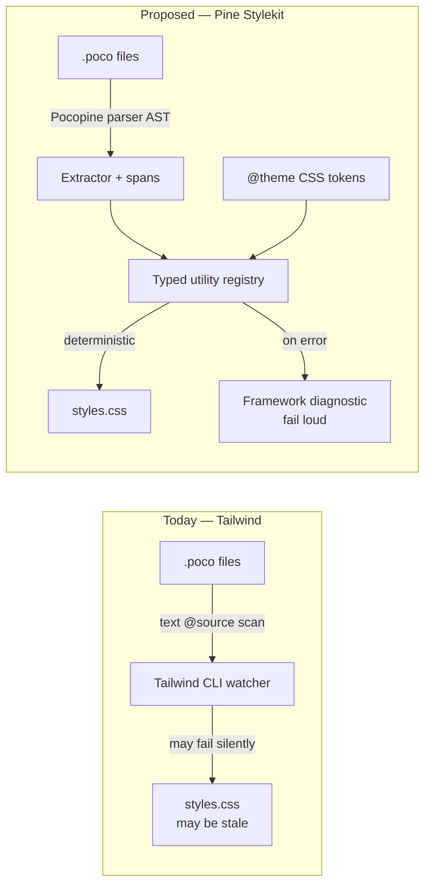
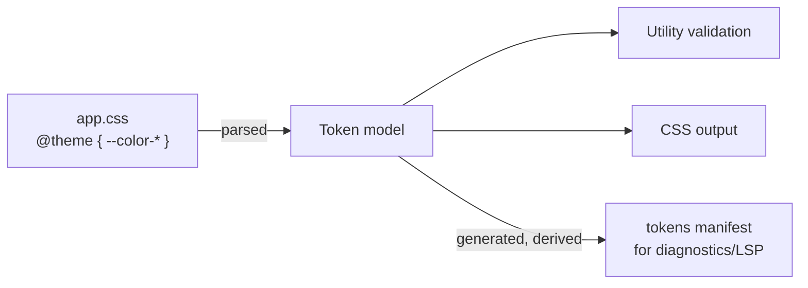
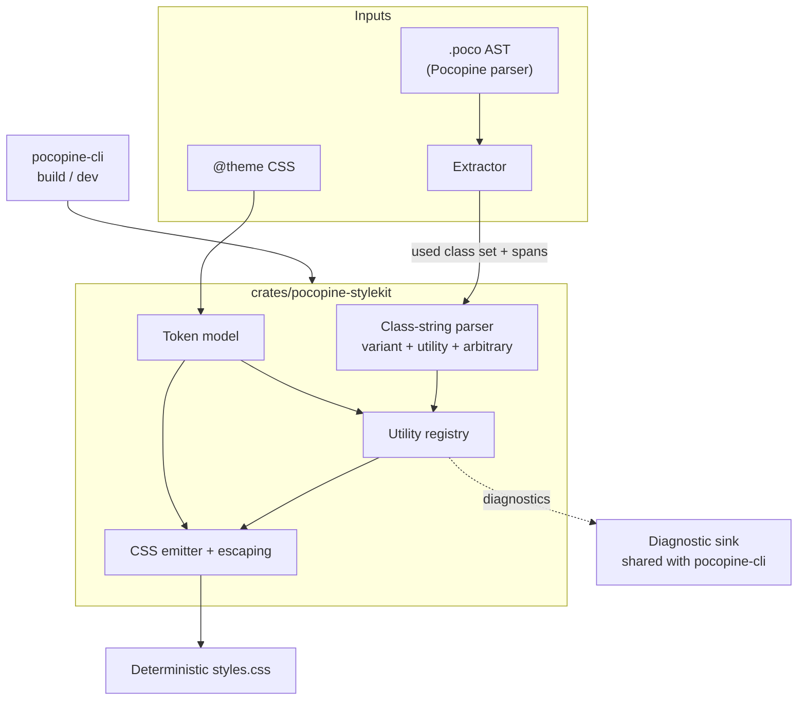

# RFC 092 — Pine Stylekit utility compiler

* **Status:** Draft
* **Author:** Pine design-system working group
* **Tracking branch:** `rfc/pine-stylekit`
* **Tracking issue:** [#169](https://github.com/mambisi/pocopine/issues/169)
* **Related:** [RFC 081 (component handle refs)](./rfc-081-component-handle-refs.md),
  [RFC 084 (typed slot props)](./rfc-084-typed-slot-props.md)

## Summary

Add **Pine Stylekit**: a Pocopine-native utility-CSS compiler that
replaces Tailwind as the example styling engine. It accepts a
Tailwind-*shaped* class grammar (`variant:utility-scale`, arbitrary
`[…]` values), but compiles against a typed Rust utility registry and
extracts classes through the **Pocopine parser** rather than text
scanning. The output is deterministic static CSS — there is **no
browser-side style runtime** in v1.

The bet: Tailwind gives us a familiar authoring model for humans and
LLMs, but it scans `.poco` as opaque text, can go silently stale, and
cannot speak Pocopine semantics. Because the framework already parses
`.poco`, Stylekit can offer a stronger contract — real source spans,
typed arbitrary values, stale-CSS detection, and framework-owned
diagnostics — without giving up the utility syntax people already know.

This RFC is the **decision artifact**: it settles naming, crate/CLI
placement, the compatibility promise, the token model, the `.poco`
extraction contract, dev-mode stale-CSS behavior, the first example to
port, and the first shippable milestone. It does **not** specify the
line-by-line implementation; that lives in tracking PRs under §10.

## Motivation

Every Pocopine example today does this:

```css
/* examples/file-browser/app.css */
@import "tailwindcss";
@source "./src/**/*.poco";
@theme { --color-surface: #ffffff; --color-ink-100: #18171a; /* … */ }
```

That works, but it has four sharp edges:

1. **Stale-CSS risk.** `pocopine dev` supervises an external Tailwind
   watcher. If generation fails — or a workflow rebuilds WASM without
   rebuilding CSS — the browser keeps serving the last good (now
   stale) stylesheet. Nothing in the pipeline *fails loud*.

2. **Text-only extraction.** Tailwind scans `.poco` as text via
   `@source`. It cannot tell a real `class="flex"` from `flex` inside
   a comment or a string literal, and it has no idea what a Pine
   compound's class prop means.

3. **No framework diagnostics.** A typo like `bg-surafce` or a
   type error like `w-[red]` is invisible until you notice the missing
   style at runtime. There is no span, no suggestion, no build error.

4. **Dynamic classes are unvalidated.** `bg-{color}-500`-style
   construction is neither caught nor guided toward a static form.

Stylekit closes all four by owning the compiler and reusing the parser
we already run.



## Decisions

The issue's "Acceptance Criteria for the RFC" map 1:1 to the decisions
below. Each is opinionated per Pocopine's "one canonical pattern"
stance; the trade-off is noted where the call is close.

### D1 — Naming and crate placement

* **Product / docs name:** **Pine Stylekit** (the brand the issue
  already uses).
* **Crate:** `crates/pocopine-stylekit` — **not** `crates/pine-stylekit`.

  Rationale: the `pine-*` crates (`pine`, `pine-charts`, `pine-icons`,
  `pine-motion`, `pine-richtext`) are **browser-runtime component
  libraries** an app depends on at runtime. Stylekit is a **build-time
  compiler** that is a dependency of `pocopine-cli` and never ships to
  the browser (see the no-runtime non-goal). It belongs with the
  framework-infrastructure family (`pocopine-macros`,
  `pocopine-client-codegen`, `pocopine-cli`). Putting a compiler in
  `pine-*` would muddy the runtime/infra split that RFC-era layering
  has otherwise kept clean.

  This is the closest call in the RFC. The counter-argument is brand
  cohesion ("Pine" is the design language). It is resolved by keeping
  the *product name* "Pine Stylekit" while the *crate* sits in
  `pocopine-*`. The token vocabulary lives in the app's CSS `@theme`,
  not in the crate, so there is no design/runtime coupling lost.

### D2 — CLI placement

No new top-level user verb in v1. Stylekit is a **stage of the existing
pipeline**, gated opt-in:

* `pocopine build --stylekit` — generate CSS as a build stage.
* `pocopine dev` — when `--stylekit` (or config) is set, runs the
  generator in-process instead of supervising Tailwind.
* `pocopine stylekit …` — a **hidden / debug** subcommand only, for
  `--dump-css`, `explain <class>`, and `--check`. Not advertised as the
  primary entry point.

Once the porting experiment (§10, step 5) concludes, promote Stylekit
from `--stylekit` opt-in to the default build stage. Keeping the
surface to one flag now honors "minimize user-facing choices."

### D3 — Tailwind compatibility promise

**"Tailwind-shaped, not Tailwind-compatible."** We promise:

* The same **class grammar**: `variant:variant:utility-scale` and
  arbitrary `utility-[value]`.
* A documented **catalog** of supported families (§6) that covers what
  the examples already use.

We explicitly do **not** promise: class-for-class parity with Tailwind,
`tailwind.config` compatibility, or plugin compatibility. The catalog
*is* the contract; if a class isn't in it, it isn't supported.

### D4 — Token / theme model

**CSS is the single source of truth.** Tokens are declared in an
`@theme { --color-…: …; --spacing: … }` block in app CSS — exactly the
shape examples already use. The compiler reads `@theme`, and **emits a
generated Rust manifest** as a *derived* artifact for diagnostics and
future autocomplete. The manifest is never hand-authored.



This avoids a second source of truth and means porting an example is
mostly *deleting* `@import "tailwindcss"` and `@source` while keeping
`@theme`.

### D5 — `.poco` extraction & diagnostic contract

Extraction runs on the **Pocopine parser AST**, not text. v1
recognizes:

* Static `class="…"` attributes.
* Component class props Pocopine already treats as class-like.
* Static class maps in supported binding forms.
* `pp-bind:class` **only** when the class set is statically
  discoverable (literal map / literal alternatives).

Opaque dynamic construction (string concat, interpolated fragments)
produces a **diagnostic with a migration path to a static class map**,
not a silent miss.

Diagnostic severities:

| Case | Severity | Behavior |
|------|----------|----------|
| Unknown utility (`bg-surafce`) | **error** | suggest nearest (`bg-surface`) via edit distance |
| Wrong arbitrary type (`w-[red]`) | **error** | "width expects a length/percentage/size token" |
| Unknown token (`text-brand-primary`, no `--color-brand-primary`) | **error** | list defined tokens in family |
| Opaque dynamic class | **error** | suggest static map |
| Conflicting classes (`p-2 p-4`) | **warning** | keep last-wins; warn |

During the port experiment a `--stylekit-compat=warn` mode downgrades
unknown-utility **errors** to warnings so a half-ported example still
builds. Default is **error**.

### D6 — Stale-CSS behavior in dev

**Fail loud. Never silently serve stale CSS.**

* On a compile error, `pocopine dev` stops updating the generated
  stylesheet and surfaces a Stylekit diagnostic inline alongside
  Pocopine diagnostics (and an in-browser error overlay).
* The previous good stylesheet is *not* re-served as if current unless
  the user explicitly opts into `--stylekit-fallback=last-good`.
* `pocopine build` fails the build on any error-severity diagnostic
  before packaging assets.

### D7 — Third-party utilities / tokens

v1 has **no plugin protocol**. Third-party Pine components extend
styling two ways, both already-canonical Pocopine patterns:

* **Add tokens** via their own `@theme` CSS (merged into the model).
* **Author component CSS** for anything utilities don't express
  (the normal escape hatch).

Registering *new utility families* is deferred. If a family is broadly
useful it lands in the core registry by PR — "PR welcome," not a
scriptable adapter format.

### D8 — First example to port

**`examples/file-browser`.** It is already isolated, already declares
its tokens in `@theme`, and the issue nominates it. Tailwind stays as a
fallback during the experiment (parallel build, byte-diff the output).

### D9 — First milestone

Milestone 1 lands when, behind `--stylekit`:

* the registry + parser + emitter + escaping + unit tests exist,
* static `.poco` extraction with source-span diagnostics works,
* `examples/file-browser` builds **byte-stable** CSS covering its used
  classes, with Tailwind retained as a fallback.

Explicitly **out** of Milestone 1: dev incremental rebuild watching,
LSP/autocomplete, responsive/arbitrary completeness beyond what
file-browser uses.

## Architecture



### Utility registry (internal API sketch)

The registry is Rust-internal, not user-facing. Shape per the issue:

```rust
utility!("flex" => "display: flex");
scale!("p", spacing => ["padding"]);
scale!("gap", spacing => ["gap"]);
color!("bg", color => ["background-color"]);
color!("text", color => ["color"]);
arbitrary!("w", CssType::Length => ["width"]);
variant!("hover" => ":hover");
variant!("data-[active=true]" => "[data-active=\"true\"]");
```

The key property: each family declares its **expected value type**, so
`w-[red]` is a type error and `bg-surafce` is an unknown-token error,
both with spans.

## Initial utility coverage

Grounded in an inventory of current example `.poco` files. The most-used
utilities today are `items-center` (52), `flex` (31), `inline-flex`
(27), `font-medium` (25), `rounded-md` (21), `justify-center` (21),
`text-ink-50` (19), arbitrary `text-[13px]` (16), `border-line` (16),
plus heavy `data-[…]`, `hover:`, `focus-visible:`, and `disabled:`
variant use. v1 must emit at least:

| Group | Utilities |
|-------|-----------|
| Display | `block`, `inline-flex`, `flex`, `grid`, `hidden` |
| Layout | `items-*`, `justify-*`, `content-*`, `self-*`, `flex-1`, `shrink-0`, `grow-*` |
| Spacing | `p*-*`, `m*-*`, `gap-*`, `space-y-*` |
| Sizing | `w-*`, `h-*`, `size-*`, `min-*`, `max-*` |
| Typography | `text-*`, `font-*`, `leading-*`, `tracking-*`, `truncate`, `uppercase` |
| Color | `bg-*`, `text-*`, `border-*`, `ring-*` (token-backed) |
| Border/radius/shadow | `border`, `rounded-*`, `shadow-*` |
| Positioning | `relative`, `absolute`, `inset-*`, `top/right/bottom/left-*`, `z-*` |
| State variants | `hover:`, `focus:`, `focus-visible:`, `disabled:`, `active:`, `data-[…]`, `aria-[…]` |
| Responsive | `sm:`, `md:`, `lg:`, `xl:` |
| Arbitrary | typed `[…]` for a small property set (`w`, `h`, `text`, `grid-cols`, …) |

Component-level classes (`ic-btn`, `chart-card`, `pm-stagger-cell`, …)
remain authored CSS — Stylekit does not try to own them.

## Open questions resolved

The issue's six open questions are answered by D1–D7 above:

* Crate placement → **D1** (`pocopine-stylekit`).
* First command → **D2** (build stage + hidden debug verb).
* Tailwind compat promise → **D3** (shaped, not compatible).
* Unsupported classes error vs warn → **D5** (error by default,
  `--stylekit-compat=warn` for migration).
* Third-party registration → **D7** (no plugin protocol in v1).
* Token source → **D4** (CSS canonical, Rust manifest generated).

## Phased plan

1. **Inventory** example utility classes; lock the minimum registry to
   emit them. *(Inventory done in this RFC; refine in code.)*
2. **Core compiler:** parser, registry, emitter, escaping, unit tests.
3. **`.poco` extraction** with source-span diagnostics.
4. **CLI integration:** `pocopine build --stylekit` / `pocopine dev`
   behind the opt-in flag; shared diagnostic sink.
5. **Port `examples/file-browser`**, Tailwind kept as fallback; byte-diff.
6. **Recipes, generated utility docs, LSP/autocomplete metadata.**
7. **Decide** Tailwind's long-term fate: drop fallback, default for new
   examples, or support both.

Milestones 2–5 constitute Milestone 1 of D9; 6–7 follow.

## Non-goals (v1)

* Full Tailwind compatibility.
* Tailwind plugin compatibility.
* Runtime CSS-in-JS / browser style engine.
* Validated dynamic construction like `bg-{color}-500`.
* Replacing authored component CSS where plain CSS is clearer.
