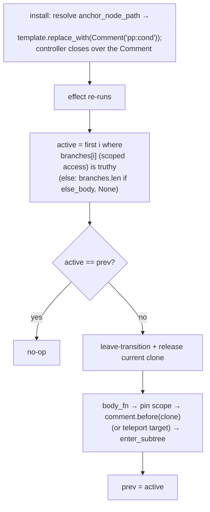

# RFC 094 - Conditional chains, enum matching, and comment anchors

| Field | Value |
|---|---|
| **Status** | IMPLEMENTED (Phases 0–4; Phase 5 docs tracked separately) — chains (`StaticCondPlan`, comment-anchored, access-based), `pp-match`/`pp-case`/`pp-let` (`StaticMatchPlan` + `PayloadScope`, in-place payload updates), `pp-for` anchor migration with parent-proxy elision. Benchmarked perf-neutral (geomean within noise, `runLots` flat). Rev 2 was rewritten after RFC-095/096 landed; the controllers are access-based from day one, closing RFC-096's structural tail. |
| **Author** | pocopine team |
| **Created** | 2026-06-10 (rev 2 same day, after the `perf-reactive-dirty-tracking` branch) |
| **Related** | [`rfc-001-components.md`](./rfc-001-components.md) (pp-if), [`rfc-004-pp-for.md`](./rfc-004-pp-for.md), [`rfc-005-pp-transition.md`](./rfc-005-pp-transition.md), [`rfc-006-pp-teleport.md`](./rfc-006-pp-teleport.md), [`rfc-058-compiled-views-walker-removal.md`](./rfc-058-compiled-views-walker-removal.md), [`rfc-084-typed-slot-props.md`](./rfc-084-typed-slot-props.md) (pp-let), [`rfc-092-pocopine-stylekit.md`](./rfc-092-pocopine-stylekit.md), [`rfc-095-reactive-core-de-alpine.md`](./rfc-095-reactive-core-de-alpine.md), [`rfc-096-signals-first-reactive-core.md`](./rfc-096-signals-first-reactive-core.md) |
| **Supersedes** | rev 1 of this RFC |

## 1. Summary

`pp-if` is a lone boolean toggle. Authoring "exactly one of these
branches" means manually negated chains, and matching a Rust enum
means stringly comparing serialized discriminants with no payload
access at all. This RFC adds two constructs, one shared runtime
controller, and one anchor-representation change:

1. **`pp-else-if` / `pp-else`** — Vue-style chains of sibling
   `<template>`s, collapsed at compile time into a single
   `StaticCondPlan`; one effect computes the first-truthy branch
   index and swaps clones at a single anchor. Malformed chains
   are **build errors**.

2. **`pp-match` / `pp-case`** — container-and-cases dispatch on a
   value, designed for Rust enums. State crosses into the runtime
   via `serde_wasm_bindgen`, so serde's externally-tagged enum
   encoding *is* the discriminant protocol: unit variants arrive
   as `"Loading"`, payload variants as `{ "Ready": { count: 3 } }`.
   `pp-case="Ready"` matches the tag; `pp-let="r"` binds the
   payload; `pp-case="_"` is the wildcard arm.

```html
<!-- chain -->
<template pp-if="count > 5"><p>big</p></template>
<template pp-else-if="count > 0"><p>small</p></template>
<template pp-else><p>zero</p></template>

<!-- enum dispatch -->
<template pp-match="status">
  <template pp-case="Idle | Loading"><pine-spinner /></template>
  <template pp-case="Ready" pp-let="r"><p>{{ r.count }} items</p></template>
  <template pp-case="Error" pp-let="msg"><p class="err">{{ msg }}</p></template>
  <template pp-case="_"><p>unknown</p></template>
</template>
```

3. **Comment anchors** — structural `<template>` elements stop
   posing as element siblings in the live DOM. The cond/match
   controllers anchor on a `Comment` node from day one, and
   `pp-if`/`pp-for` migrate to the same scheme. An immediate
   Phase 0 stamps `hidden` on structural templates in cleaned
   HTML, fixing the Stylekit `space-*`/`divide-*` phantom-sibling
   bug for every existing app in one serializer line.

**What rev 2 changes:** the controllers are specced on the
RFC-095/096 substrate — branch expressions evaluate through the
**scoped access** (`scoped_static_evaluator`), body fragments
install through scope-id-based helpers, and no controller
captures a proxy. Structural plans therefore leave the
`needs_proxy` list, closing RFC-096's documented tail: after
Phase 2/4, only slot outlets, child mounts, and opaque directives
force an eager proxy mint.

## 2. Motivation

### 2.1 The gap

Alpine — the runtime ancestor — has no `x-else`; it is one of its
most-requested features (declined for core twice; the community
answer is a plugin doing runtime sibling-scanning). Pocopine
inherits the gap. Today's idioms and their failure modes:

- **Negated chains**: every branch re-states and re-evaluates the
  negation of every earlier condition — N effects, O(n²)
  condition text, and a silent two-branches-mounted bug the
  moment one negation drifts.
- **Per-element `pp-show`**: right for show/hide of independent
  siblings (and stays the recommendation there), wrong for
  exclusive branches where remount-on-switch is wanted.
- **Enum state**: unit variants serialize to their names, so
  `pp-if="status === 'Loading'"` works — but payload variants
  serialize externally tagged and there is no way to reach the
  payload from a template at all.

### 2.2 Prior art (surveyed and verified, rev 1)

| Shape | Exemplars | Grouping | One-branch invariant |
|---|---|---|---|
| Sibling-chained attributes | Vue `v-if/v-else-if/v-else` | compiler scans siblings, skipping whitespace/comments | chain collapses to one node; orphan else = compile error |
| Container + cases | Angular `@switch/@case`, Solid `<Switch>/<Match>` | containment — no adjacency rules | container owns one "active case" memo; `===`, first match wins |
| Function/expression | Lit `when()/choose()`, Leptos/Dioxus `match` | host language | rustc gives exhaustiveness + payloads — but our expressions evaluate against runtime state, so this shape doesn't transfer |
| Block syntax | Svelte `{#if}{:else if}`, Angular `@if` | grammar delimiters | unavailable to an attribute DSL |

Load-bearing details adopted: Vue's tolerance rules (skip
whitespace/comments between branches, hard error on orphan or
double else, auto-keyed branches → index change always remounts);
Angular/Solid's container semantics (first match wins, no
fallthrough, nothing renders without a default); Svelte's
`{:then value}` as the payload-binding precedent; Angular's
`@default never` as the exhaustiveness follow-up (§7).

### 2.3 Why comment anchors, and why now

Stylekit's `space-y-*` emits
`.space-y-4 > :not([hidden]) ~ :not([hidden])`
(`registry.rs:145`). A structural `<template>` is an element
without the `hidden` *attribute* (it is UA-hidden), so it matches
both sides:

```
<ul class="space-y-4">              ;; branch unmounted
  <li>first</li>
  <template pp-if="x"></template>   ← counts as a sibling
  <li>phantom margin-top!</li>
</ul>
```

The same phantom element miscounts `odd:`/`even:`/`first:`/
`last:` (`:nth-child`-family) and occupies an `Element.children`
index. Comments are invisible to CSS selectors and to
`Element.children` — which is why Vue Vapor and Svelte anchor
fragments on comments. Performance is *not* the motivation
(a `<template>` is `display:none` and costs nothing measurable);
selector correctness in the default styling path is.

Defining the new controllers' anchor as a comment from day one
avoids migrating them later; `pp-if` is subsumed by the cond
controller and `pp-for` migrates in its own phase.

## 3. Goals

1. **Exclusive branching with one source of truth.** A chain or
   match is one plan entry, one effect, one active index; at most
   one branch subtree exists, by construction.
2. **First-class enum dispatch** on serde's default encoding —
   no new derives, attributes, or wire protocol — with payload
   binding through the existing `pp-let` vocabulary.
3. **Build errors for malformed structures** (orphan/double/
   misplaced else, case outside match, duplicate or unreachable
   arms) — the proc macro can do what Vue's runtime cannot.
4. **Proxy-free controllers** (rev 2): branch evaluators ride the
   scoped access; body fragments install via scope ids; the
   controller closes over a `Comment` anchor and an
   `Option<Element>` clone slot — no proxy capture anywhere.
   Acceptance: `plan_needs_proxy` drops `if_plans`/`for_plans`/
   cond/match from its list, and a chain-only component passes
   the `proxies_minted_count == 0` gate.
5. **Structural anchors stop perturbing CSS and element
   indices** — comment anchors for cond/match at birth, `pp-for`
   migrated, `hidden` stamped as the immediate stopgap.
6. **Registry/LSP parity** — `DirectiveSpec` entries, hover docs,
   adjacency/containment diagnostics at edit time.

## 4. Non-goals

1. **`pp-either`.** Two branches = `pp-if` + `pp-else`.
2. **Expression-level matching** (`pp-if="status is Ready as r"`)
   — structure belongs in template structure; no surveyed
   framework smuggles binding into expressions.
3. **An else for `pp-show`** — chains are a mount/unmount
   feature; per-element `pp-show` guidance is unchanged.
4. **`Option<T>` matching** — serde encodes `Option` as
   `null`/value, not externally tagged; `pp-if="field"` covers it.
5. **Internally-tagged enums in v1** (`#[serde(tag = "type")]`) —
   one canonical state shape; escape hatch sketched in §7.
6. **Exhaustiveness checking in v1** — needs variant-name
   registration (a small derive); staged in §7.
7. **Comment markers in served/cleaned HTML** — the swap is
   install-time; serializer-emitted comments would force
   `childNodes`-based plan paths (§7).

## 5. Design

### 5.1 `pp-else-if` / `pp-else` — authoring rules

- Both `<template>`-only. A chain is the maximal run of sibling
  templates: `pp-if`, zero or more `pp-else-if`, zero or one
  `pp-else`. Whitespace-only text and comments between members
  are tolerated; any element (or non-blank text) terminates the
  chain.
- `pp-else-if` requires an expression; `pp-else` forbids one.
  Branch bodies follow the `pp-if` rule: exactly one element.
- `pp-teleport` only on the chain head, applying to all branches.
- A chain member carrying `pp-for` or `pp-match` is a build error.

Build errors (macro expansion, pointing at the offending
template): orphan `pp-else`/`pp-else-if`; member after `pp-else`;
double `pp-else`; `pp-else="expr"`; `pp-teleport` on a non-head
member.

### 5.2 Chain association — classifier sibling scan

The Phase 4.1b classifier (`template_plan.rs`) gains a forward
scan: after classifying a `<template pp-if>`, consume every
contiguous `pp-else-if`/`pp-else` sibling (skipping blank text
and comments) into one plan entry. Consumed templates are removed
from the cleaned HTML (the chain head is the only template the
serializer keeps — the anchor site until the install-time comment
swap) and produce no independent plan entries or node paths.
Association is entirely compile-time; the runtime sees one entry
per chain.

### 5.3 `StaticCondPlan` — subsumes `StaticIfPlan`

```rust
/// One conditional chain: pp-if [pp-else-if…] [pp-else].
/// A bare pp-if is the branches.len() == 1, else_body: None case
/// — StaticIfPlan is retired, not kept alongside.
pub struct StaticCondPlan {
    /// Path to the chain head <template> (the anchor site).
    pub anchor_node_path: &'static [u16],
    pub branches: &'static [CondBranch],
    pub else_body: Option<CondBodyFn>,
    pub teleport_selector: Option<&'static str>,
}

pub struct CondBranch {
    pub expr_src: &'static str,
    pub compiled: Option<&'static expr::StaticExpr>,
    pub body: Option<CondBodyFn>,
}
```

`install_static_if_plan` generalizes to
`install_static_cond_plan(el, scope_id, proxy, entry, name)` —
the `scope_id` parameter and the access-based evaluator are
already how every install works post-RFC-096; branch evaluators
come from `scoped_static_evaluator(scope_id, …)` and never touch
the proxy for reads or `$`-roots (the access is read-complete
since 096-S2). Per the RFC-058 size discipline, the controller
body is one non-generic function shared by every cond AND match
site; branch selection is the only difference, passed as a
selector closure.

`CondBodyFn` keeps the established fragment shape
(`fn(scope_id, proxy: &JsValue, ctx_parent_id) -> Option<Element>`);
the proxy argument is pass-through plumbing for nested
structural plans and is `UNDEFINED` on elided components — body
installs are scope-id-based since 095-W1/096-S2, so nothing
inside a fragment dereferences it.

### 5.4 Runtime controller — one effect, one active index, one comment anchor



Properties:

- **Exactly one clone** per chain, inserted before the shared
  comment anchor — stable DOM position regardless of branch.
- **Same index ⇒ no DOM work**; conditions after the active
  branch are not evaluated and not tracked (Vue's semantics, and
  the reason chains beat N independent `pp-if`s).
- **Index change ⇒ remount** (auto-keyed-by-index semantics).
  State that must survive a switch belongs on the component.
- **Transitions** simultaneous in v1 (Vue's default); the
  existing enter/leave cancel machinery carries over; `out-in`
  is future work (§7).
- **Anchor lifecycle**: the comment is created at install AFTER
  all node-path resolution (see ordering below); it dies with its
  parent's teardown recursion like any node. The anchor label
  (`pp:cond` / `pp:match` / `pp:for`) is always present — bytes
  in a comment for debuggability in every bug report.
- Scope pinning and the RFC-027 inject-chain override are
  inherited verbatim from today's `if_::install_eval`.

**Install-ordering invariant** (sharpened from rev 1): no
install's DOM mutation (anchor swap or a first-run clone mount)
may precede the resolution of any node path it can shift. The
specialized mount body already installs structural plans after
leaf installs; this RFC additionally mandates **reverse document
order** among structural installs and adds the
two-chains-plus-a-`pp-for`-under-one-parent regression test. The
known latent hole — interps/native-models resolving after
structural installs — must be fixed in the same phase by moving
their *resolution* into the resolve-only rows (their installs may
stay late; the slot-outlet capture/materialize split is the
precedent).

### 5.5 `pp-match` / `pp-case` — authoring rules

- `pp-match="expr"` on a `<template>`; direct children of its
  content must be `<template pp-case>` (blank text/comments
  tolerated; anything else is a build error — a match template
  has no body of its own).
- `pp-case` takes a **literal arm**, not an expression: one or
  more `|`-separated variant names, or `_` (final, at most once,
  matches anything including null and non-conforming shapes).
- First matching case wins; `===` on the extracted tag; no
  fallthrough; **no match and no `_` ⇒ nothing renders**.
- `pp-let="name"` binds the payload (§5.7); on `_` it binds the
  whole matched value.
- `pp-teleport` on the match template only.

Build errors: `pp-case` outside `pp-match`; non-case child;
duplicate variant across arms; arm after `_`; duplicate `_`;
non-literal arm.

### 5.6 Discriminant protocol — serde externally tagged

```rust
enum Status { Idle, Loading, Ready { count: u32 }, Error(String) }
```

| Rust value | runtime value | tag | payload |
|---|---|---|---|
| `Status::Idle` | `"Idle"` | `"Idle"` | – |
| `Status::Ready { count: 3 }` | `{ Ready: { count: 3 } }` | `"Ready"` | `{ count: 3 }` |
| `Status::Error("boom".into())` | `{ Error: "boom" }` | `"Error"` | `"boom"` |

Tag extraction, in order: string ⇒ the tag is the value (plain
`String` fields match for free — the Angular `@switch` use-case);
object with exactly one own key ⇒ tag is the key, payload the
value; anything else ⇒ only `_` matches.

The matched expression resolves through the scoped access like
any binding; for the dominant single-field case
(`pp-match="status"`) the controller reads the field's versioned
projection — one serde projection per change, shared with every
other reader of the field (096-S3 storage).

### 5.7 Payload binding via `pp-let`

A matched case with `pp-let="r"` materializes its body against a
compound scope layering `{ r: payload }` over the parent — the
same mechanism scoped slots use (and post-096-S2, that mechanism
is proxy-free: `SlotScope`-style derived scopes chain by scope
id). Same-tag payload changes do **not** remount — the binding
layer updates and the body's own effects re-run (Solid's
non-keyed `Match`); only a tag change swaps branches.

### 5.8 `StaticMatchPlan` — same controller, different selector

```rust
pub struct StaticMatchPlan {
    pub anchor_node_path: &'static [u16],
    pub expr_src: &'static str,
    pub compiled: Option<&'static expr::StaticExpr>,
    pub cases: &'static [MatchCase],
    pub default_body: Option<CondBodyFn>,
    pub default_bind: Option<&'static str>,
    pub teleport_selector: Option<&'static str>,
}

pub struct MatchCase {
    pub tags: &'static [&'static str],   // ["Idle", "Loading"]
    pub bind_name: Option<&'static str>, // pp-let
    pub body: Option<CondBodyFn>,
}
```

The match effect evaluates once, extracts `(tag, payload)`, and
selects the first case whose `tags` contains the tag (or `_`).
Mount/unmount, pinning, transitions, teleport: byte-identical to
§5.4 — one shared controller body, two thin selector front-ends.
Unliftable case bodies surface via `record_plan_failure`, the
established Phase 6.5 semantics.

### 5.9 Anchor semantics — template vs fragment, resolved

A `<template>` is two things stapled together: an inert
parse-time container (its `content` `DocumentFragment` — the
useful half) and a placeholder **element** that stays in the live
tree (the troublesome half: it matches CSS structural selectors
and occupies an `Element.children` index). A fragment cannot be
the anchor — it dissolves on insertion and has no position. A
`Comment` is the right third thing: a real node with a stable
tree position, invisible to selectors and element-indexed
traversal.

**Phase 0 stopgap (ships first, independently):** the
cleaned-HTML serializer stamps `hidden` on every structural
`<template>` it keeps. Stylekit's `space-*`/`divide-*` selectors
exclude `:not([hidden])` members, so the phantom spacing/border
bug disappears for every existing site immediately. (`hidden` on
a template is visually inert.) This does not fix the
`:nth-child` family — comments do.

**Target state:** at install, after all path resolution:

```
resolve anchor_node_path → the <template>
  └─ (pp-for only) move content fragment + row-plan id onto the
     controller
template.replace_with(Comment("pp:cond" | "pp:match" | "pp:for"))
controller closes over the Comment; clones via comment.before(…)
no path is ever resolved against the site again
```

**Compatibility** (unchanged from rev 1, validated by audit): no
user-facing surface changes — `<template>` stays the authoring
syntax, Rust code untouched, served HTML byte-identical (Phase
0's `hidden` aside). Code that can notice: CSS that *compensated*
for the phantom sibling double-compensates once fixed (one-line
cleanup; Phase 0 surfaces this class early); unsupported DOM
spelunking for `template[pp-if]` breaks (no supported API ever
exposed it); app DOM-shape snapshots churn mechanically. Pre-1.0:
changelog entry plus a "phantom-sibling CSS workarounds can be
removed" note, not a deprecation cycle.

### 5.10 Directive registry & LSP

| name | host | expression | notes |
|---|---|---|---|
| `else-if` | TemplateOnly | required | hover: chain rules + adjacency |
| `else` | TemplateOnly | forbidden | |
| `match` | TemplateOnly | required | |
| `case` | TemplateOnly | literal arm | hover documents `\|` and `_` |

LSP diagnostics mirror the §5.1/§5.5 build errors at edit time.

### 5.11 What stays the same

`pp-show` guidance unchanged. Unit-variant equality
(`pp-if="status === 'Loading'"`) keeps working; `pp-match` is
the recommendation once there's more than one branch or any
payload access. A bare `pp-if` compiles to a one-branch
`StaticCondPlan` with identical runtime behavior — no authored
template changes meaning.

## 6. Implementation phasing

### Phase 0 — `hidden` stamp (independent, one line)

Serializer stamps `hidden` on retained structural templates.
Stylekit integration test: `space-y-*` container with an
unmounted branch shows no phantom margin.

### Phase 1 — registry + diagnostics

`else-if`/`else`/`match`/`case` specs, parser acceptance, LSP
hover + adjacency/containment diagnostics. Using the directives
before Phase 2/3 is a clean "not implemented until Phase N"
build error.

### Phase 2 — chains, access-based, comment-anchored (the big one)

Classifier sibling scan; `StaticCondPlan` subsuming
`StaticIfPlan`; the shared controller built on the scoped access
with the comment anchor from birth; reverse-document-order
structural installs + the interp/native-model resolve-early fix;
build-error cases. **This phase closes RFC-096's `pp-if` tail:**
`plan_needs_proxy` drops `if_plans`/cond plans. Existing pp-if
tests migrate to the cond shape.

*Gates:* the W0 harness (already landed on the perf branch)
extends with a chain oracle — random condition flips across a
3-branch chain, asserting exactly-one-mounted and active-index
== first-truthy after every flush; the multi-controller
index-shift regression test; `proxies_minted_count == 0` for a
chain-only component.

### Phase 3 — `pp-match`

Case classification + arm parsing, tag extraction, `pp-let`
payload scope, `StaticMatchPlan` + selector front-end. Gates:
enum-state oracle (unit/newtype/struct variants, multi-arm, `_`,
no-match-renders-nothing, same-tag-payload-updates-in-place
asserted by clone identity).

### Phase 4 — `pp-for` anchor migration

Content fragment + row-plan id move onto the for controller; the
template is replaced by `<!--pp:for-->`; `for_plans` leave
`plan_needs_proxy`. DOM-shape tests update; devtools learns the
anchor labels. Phase 0's stamp becomes redundant for migrated
sites and is removed with the templates.

### Phase 5 — docs + style-guide sweep

`docs/guides/components/` gains chain & match sections (the
`pp-show` vs chain decision rule; the enum-state pattern);
`docs/components/` examples adopt `pp-match` where they chain
negations today.

## 7. Open questions / staged follow-ups

1. **Internally-tagged enums** — possible `pp-match.tagged:type`
   modifier if real apps arrive with `#[serde(tag = …)]` state.
2. **Exhaustiveness** — an opt-in derive registering variant
   names would let `#[component]` verify a `pp-match` covers
   every variant or has `_` (Angular's `@default never`, checked
   in rustc). After v1 stabilizes.
3. **`out-in` transition mode** — `pp-if.out-in` on the chain
   head if simultaneous swap proves visually wrong.
4. **Comment markers in cleaned HTML** — would remove the
   install-time swap but forces `childNodes`-based paths;
   revisit only if SSR/streaming needs anchor identity before
   install.
5. **Match-arm destructuring** (`pp-let="{ count }"`) —
   deliberately absent; revisit only in lockstep with RFC 084
   Phase 3 typed-`pp-let`.

## 8. Verification

Built on the W0 harness landed in RFC-095/096 (differential
fuzz + fast-path symmetry gates + the `proxies_minted_count` /
`serde_projection_count` counters), in
`crates/pocopine/tests/template_plan.rs` unless noted:

**Chains (Phase 2)** — one `cond_plans` entry per chain, consumed
templates absent from cleaned HTML; blank/comment tolerance vs
element termination; exactly-one-mounted under the fuzz oracle;
same-index re-run is DOM-no-op; conditions after the active
branch untracked; bare-pp-if regression on the cond shape;
trybuild compile-fail set (orphan else, member after else,
`pp-else="x"`, teleport on non-head); chain-only component mints
zero proxies; comment anchor present, `Element.children` of the
parent contains only live content; the multi-controller
reverse-order regression.

**Match (Phase 3)** — variant selection across all three variant
kinds + plain strings; multi-arm; `_` and absent-`_`; payload
binding updates without remount (clone identity); tag change
remounts; compile-fail set (case outside match, duplicate
variant, arm after `_`, expression-shaped arm).

**Anchors (Phases 0/4)** — Stylekit no-phantom-margin render
test (Phase 0); `:nth-child`/`last:`-variant correctness over
live elements (Phase 4); teleport cleanup cascade with comment
anchors; pp-for migration under the existing keyed fast-path
symmetry gate.

**Size & speed** — twiggy delta for the shared controller vs
today's `StaticIfPlan` machinery (budget: no regression for
templates using no chains, since bare `pp-if` rides the same
controller); jsbench back-to-back pair, expectation neutral (the
keyed-table workload exercises rows, not chains).

## 9. Alternatives considered

### 9.1 `x-else`-style negation synthesis
Runtime sibling-scan with synthesized negations — N effects per
chain, every branch re-evaluates upstream conditions, racy
transition coordination. The single active-index controller is
strictly better and barely harder with compile-time association.

### 9.2 Dedicated `pp-default` directive
Rejected for `pp-case="_"`: one less directive, and `_` is the
Rust wildcard every user already knows.

### 9.3 Sibling-chained `pp-case` (no container)
Containment needs no adjacency rules, makes the container's
ownership of the tag computation structural, and keeps the two
constructs shape-distinct.

### 9.4 Value-equality cases (`pp-case="status === 'x'"`)
That's what `pp-else-if` chains are for; literal arms keep match
machine-checkable (duplicates, unreachability, future
exhaustiveness).

### 9.5 Keeping `<template>` anchors + documenting the CSS caveat
"`space-y` silently misbehaves around conditionals" is not a
documentable caveat in a Stylekit-default framework; it is a
correctness bug in the default configuration. The `hidden`-stamp-
forever variant fixes only the selector family, not `:nth-child`
or `Element.children`.

### 9.6 `pp-await`
The Query direction (RFC 086+) models request state as data; a
`pp-match` over a status enum covers the template side.

### 9.7 Porting the controller proxy-captured, de-proxying later
Rejected in rev 2: the controller is being rewritten anyway, the
access-based evaluators already exist, and building it
proxy-captured would *re-open* RFC-096's closed tail. Build it
right once.

## 10. Risks

1. **Index-shift regressions** around install-time DOM mutation —
   mitigated by reverse document-order installs, the resolve-early
   fix for interps/native-models, and the dedicated
   multi-controller regression test (§5.4).
2. **Subsuming `StaticIfPlan` touches every pp-if site's emitted
   code** — mechanical but wide; Phase 2 lands behind the full
   existing suite before Phase 3/4 build on it.
3. **Tag extraction misfiring** on one-key objects that aren't
   enums — acceptable: `pp-match` is opt-in per site and a case
   name would have to coincide with the key.
4. **Rapid branch-switch transition races** ("leave A, enter B,
   switch to C mid-flight") — covered by a dedicated test on the
   existing cancel/resume machinery rather than new machinery.
5. **wasm size** from the second selector front-end — mitigated
   by the single shared controller body and the §8 twiggy gate.
