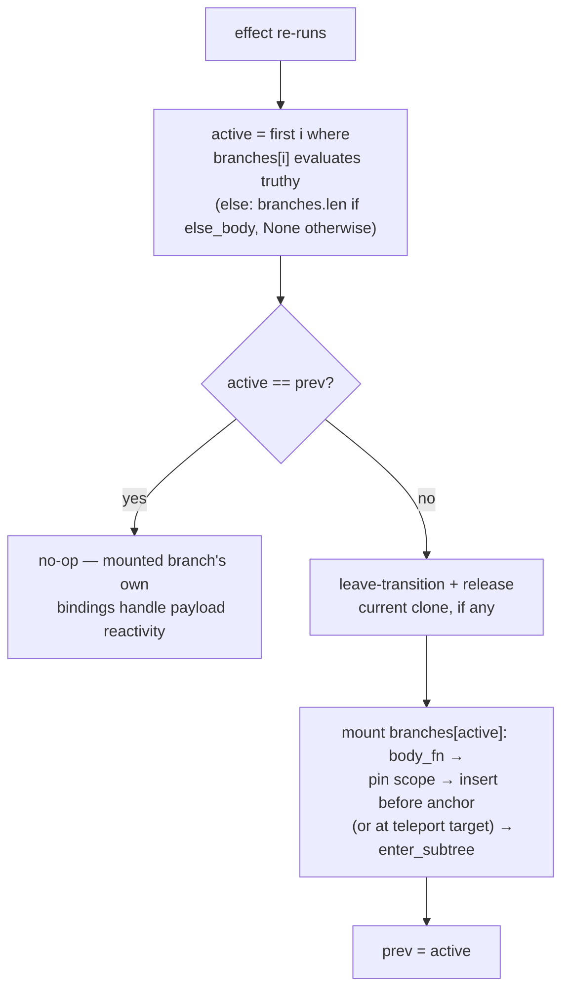

# RFC 094 - Conditional chains, enum matching, and comment anchors

| Field | Value |
|---|---|
| **Status** | Draft |
| **Author** | pocopine team |
| **Created** | 2026-06-10 |
| **Related** | [`rfc-001-components.md`](./rfc-001-components.md) (pp-if), [`rfc-004-pp-for.md`](./rfc-004-pp-for.md), [`rfc-005-pp-transition.md`](./rfc-005-pp-transition.md), [`rfc-006-pp-teleport.md`](./rfc-006-pp-teleport.md), [`rfc-058-compiled-views-walker-removal.md`](./rfc-058-compiled-views-walker-removal.md), [`rfc-084-typed-slot-props.md`](./rfc-084-typed-slot-props.md) (pp-let), [`rfc-092-pocopine-stylekit.md`](./rfc-092-pocopine-stylekit.md) |
| **Supersedes** | - |

## 1. Summary

`pp-if` is a lone boolean toggle. Authoring "exactly one of these
branches" today means manually negated chains
(`pp-if="a"` / `pp-if="!a && b"` / `pp-if="!a && !b"`), and
matching a Rust enum means stringly comparing the serialized
discriminant per branch. This RFC adds two constructs, one shared
runtime controller, and one anchor-representation change:

1. **`pp-else-if` / `pp-else`** — Vue-style chains of sibling
   `<template>`s. The macro collapses a chain into a single
   `StaticCondPlan`; one effect computes the first-truthy branch
   index and swaps clones at a single anchor. Malformed chains
   (orphan `pp-else`, double `pp-else`, `pp-else-if` after
   `pp-else`) are **build errors**.

2. **`pp-match` / `pp-case`** — container-and-cases dispatch on a
   value, designed for Rust enums. State already crosses into the
   scope proxy via `serde_wasm_bindgen`, so serde's
   externally-tagged enum encoding *is* the discriminant
   protocol: unit variants arrive as `"Loading"`, payload
   variants as `{ "Ready": { count: 3 } }`. `pp-case="Ready"`
   matches the tag; `pp-let="r"` binds the payload into the
   branch scope. `pp-case="_"` is the wildcard arm.

```html
<!-- chain -->
<template pp-if="count > 5"><p>big</p></template>
<template pp-else-if="count > 0"><p>small</p></template>
<template pp-else><p>zero</p></template>

<!-- enum dispatch -->
<template pp-match="status">
  <template pp-case="Idle | Loading"><pine-spinner /></template>
  <template pp-case="Ready" pp-let="r"><p>{{ r.count }} items</p></template>
  <template pp-case="Error" pp-let="msg"><p class="err">{{ msg }}</p></template>
  <template pp-case="_"><p>unknown</p></template>
</template>
```

3. **Comment anchors** — structural `<template>` elements stop
   posing as element siblings. Today the `<template>` stays in
   the DOM as the controller's anchor; because it is an element,
   it corrupts Stylekit's sibling-combinator utilities
   (`space-*` / `divide-*` emit
   `> :not([hidden]) ~ :not([hidden])`, which a `<template>`
   matches), miscounts `odd:` / `even:` / `first:` / `last:`
   variants, and occupies an `Element.children` index. The
   controllers introduced here anchor on a `Comment` node
   instead, and `pp-if` / `pp-for` migrate to the same scheme.
   An immediate Phase 0 stamps `hidden` on structural templates
   in cleaned HTML, which fixes the `space-*` / `divide-*` class
   of breakage for every existing site in one serializer line.

## 2. Motivation

### 2.1 The gap

Alpine — our runtime ancestor — has no `x-else`; it is one of the
most-requested features in that ecosystem (declined for core
twice; the community answer is a plugin that reads the previous
sibling's `x-if` and synthesizes its negation). Pocopine inherits
the gap. Today's idioms and their failure modes:

- **Negated chains**: every branch re-states (and re-evaluates)
  the negation of every earlier condition. N effects, O(n²)
  condition text, and a silent two-branches-mounted bug the
  moment one negation drifts.
- **Per-element `pp-show`**: right for show/hide of independent
  siblings (and stays the recommendation there — see §4), but
  wrong for exclusive branches where remount-on-switch is the
  desired semantics, and it keeps all branches in the DOM.
- **Enum state**: a unit variant serializes to its name, so
  `pp-if="status === 'Loading'"` works today — but payload
  variants serialize externally tagged
  (`{ "Error": "boom" }`), and there is no way to reach the
  payload from a template at all.

### 2.2 Prior art

Surveyed across Vue, Alpine, Solid, Leptos, Dioxus, Sycamore,
Svelte, Angular, and Lit, four shapes exist:

| Shape | Exemplars | Grouping | One-branch invariant |
|---|---|---|---|
| Sibling-chained attributes | Vue `v-if/v-else-if/v-else` | compiler scans siblings, skipping whitespace/comments | chain collapses to one node; orphan else = compile error |
| Container + cases | Angular `@switch/@case`, Solid `<Switch>/<Match>` | containment — no adjacency rules | container owns one "active case" computation; `===`, first match wins, no fallthrough |
| Function/expression | Lit `when()/choose()`, Leptos/Dioxus `match` | host language | single expression; rustc gives exhaustiveness + payload binding |
| Block syntax | Svelte `{#if}{:else if}`, Angular `@if` | grammar delimiters | parser yields one branch list |

Block syntax is unavailable to an attribute DSL. The
function shape does not transfer: `.poco` expressions evaluate
against a JS proxy at runtime, so rustc cannot see them — which
is exactly why Leptos-style "just use `match`" is not an answer
here. That leaves the two shapes this RFC adopts, each where it
is strongest: **sibling chains for boolean branching** (Vue
proved the semantics and the edge-case set) and **container +
cases for value dispatch** (containment is whitespace-immune and
the container is the natural owner of the single tag
computation). Svelte's `{:then value}` is the precedent for
payload binding; Angular's `@default never` is the precedent for
the exhaustiveness follow-up in §7.

### 2.3 Why comment anchors, and why now

The anchor question is forced by Stylekit (RFC 092). `space-y-*`
emits `.space-y-4 > :not([hidden]) ~ :not([hidden])`
(`registry.rs:145`). A `<template pp-if>` is an element and does
not carry the `hidden` *attribute* (it is hidden by the UA
stylesheet), so it matches both sides of that selector:

```
<ul class="space-y-4">           ;; branch unmounted
  <li>first</li>
  <template pp-if="x"></template>   ← counts as a sibling
  <li>phantom margin-top!</li>      ← gets spacing for a
</ul>                                  child that isn't there
```

The same phantom-element problem miscounts `odd:` / `even:`
(`:nth-child`), `first:` / `last:`, and `divide-*` borders — and
in a `pp-for` list the trailing template anchor breaks `last:` on
the real last row. Comment nodes are invisible to CSS selectors
and to `Element.children`, which is why Vue Vapor and Svelte both
anchor fragments on comments. Performance, for the record, is
*not* the motivation: a `<template>` is `display: none`, costs no
layout or paint, and its retained memory (an element plus its
content `DocumentFragment`) is a few hundred bytes per site —
negligible. Post-RFC-058 the compiled path doesn't even read
`template.content` when a body fragment exists, so the element is
pure dead weight; but the reason to remove it is selector
correctness, not speed.

Defining the new controllers' anchor semantics *now* avoids
migrating them later: this RFC specifies comment anchors as the
contract for `StaticCondPlan` / `StaticMatchPlan` from day one
and migrates `pp-if` / `pp-for` in the same series.

## 3. Goals

1. **Exclusive branching with one source of truth.** A chain or
   match is one plan entry, one effect, one active index. At most
   one branch's subtree exists at any time, by construction.
2. **First-class enum dispatch.** Match on any expression whose
   value is a serde-serialized Rust enum (or a plain string);
   bind payloads with the existing `pp-let` vocabulary. No new
   serde attributes, derives, or wire protocol.
3. **Build errors for malformed structures.** Orphan `pp-else`,
   `pp-else-if` after `pp-else`, duplicate `pp-else`, `pp-case`
   outside `pp-match`, duplicate `_`, unreachable cases after
   `_` — all macro-expansion errors, not runtime warnings.
4. **Stay inside the RFC-058 envelope.** Branch and case bodies
   lift through the existing `IfBodyFn` fragment machinery;
   unliftable bodies surface through the existing
   `record_plan_failure` counter. No walker resurrection.
5. **Structural anchors stop perturbing CSS and element
   indices.** Comment anchors for cond/match from v1; `pp-if`
   and `pp-for` migrated; `hidden` stamped as the immediate
   stopgap.
6. **Registry/LSP parity.** New directives carry
   `DirectiveSpec` entries with hover docs and adjacency /
   containment diagnostics.

## 4. Non-goals

1. **`pp-either`.** A two-branch conditional is `pp-if` +
   `pp-else`. A dedicated directive would be a second way to
   write the same thing.
2. **Expression-level matching** (`pp-if="status is Ready as r"`).
   Smuggles binding into the expression grammar; less
   discoverable; no surveyed framework does it. The structure
   belongs in template structure.
3. **An else for `pp-show`.** Same position as Vue: chains are a
   mount/unmount feature. Independent show/hide siblings keep
   per-element `pp-show` (the established guidance is
   unchanged).
4. **`Option<T>` matching.** serde serializes `Option` as
   `null` / value, not externally tagged; `pp-if="field"` already
   covers it. `pp-match` on an `Option` field is a build error
   only when detectable, otherwise the null value matches `_`.
5. **Internally-tagged enums in v1** (`#[serde(tag = "type")]`).
   One canonical state shape: serde's default. §7 keeps the door
   open.
6. **Exhaustiveness checking in v1.** Angular's `@default never`
   shows it's worth having; it needs variant-name registration
   (a small derive) and is staged as follow-up work, not a v1
   blocker (§7).
7. **Comment markers in served/cleaned HTML.** v1 swaps
   template → comment at install time. Emitting comments
   directly in cleaned HTML would force `childNodes`-based plan
   paths; out of scope (§7).

## 5. Design

### 5.1 `pp-else-if` / `pp-else` — authoring rules

- Both are `<template>`-only, like `pp-if`.
- A chain is the maximal run of sibling templates:
  `pp-if`, zero or more `pp-else-if`, zero or one `pp-else`.
- Whitespace-only text nodes and comment nodes between chain
  members are tolerated and left in place. Any element (or
  non-blank text) terminates the chain.
- `pp-else-if` requires an expression; `pp-else` forbids one.
- Each branch body follows the `pp-if` body rule: exactly one
  element child.
- `pp-teleport` may sit only on the chain head and applies to
  every branch (all branches render at the same target).
  `pp-teleport` on a non-head member is a build error.
- A chain member carrying `pp-for` or `pp-match` is a build
  error (one structural directive per template).

Build errors (macro expansion, pointing at the offending
template):

| Input | Error |
|---|---|
| `pp-else` / `pp-else-if` with no adjacent chain | `pp-else has no preceding pp-if or pp-else-if sibling` |
| member after `pp-else` | `pp-else must be the final branch of its chain` |
| two `pp-else` | same as above |
| `pp-else="expr"` | `pp-else takes no expression (use pp-else-if)` |

### 5.2 Chain association — classifier sibling scan

The Phase 4.1b classifier today classifies each
`<template pp-if>` independently
(`pocopine-macros/src/template_plan.rs:1624-1687`). It gains a
forward scan: after classifying a `pp-if` template, walk
following siblings, skipping blank text and comments, consuming
every contiguous `pp-else-if` / `pp-else` template into the same
plan entry. Consumed templates are:

- removed from the cleaned HTML entirely (the chain head is the
  only template the serializer keeps — it is the anchor until
  Phase 4 replaces it with a comment), and
- recorded so no independent plan entry, stripped-attr entry, or
  node path is emitted for them or their descendants.

Removing the consumed templates shifts the element indices of
*later* siblings in the cleaned DOM; the classifier already
recomputes node paths against the cleaned tree when serializing,
and that machinery is reused unchanged.

Because association happens at macro time against the template
AST, there is no runtime adjacency logic at all — the runtime
sees one plan entry per chain.

### 5.3 `StaticCondPlan` — subsumes `StaticIfPlan`

```rust
/// One conditional chain: pp-if [pp-else-if…] [pp-else].
/// A bare pp-if is the branches.len() == 1, else_body: None
/// case — StaticIfPlan is retired rather than kept alongside.
pub struct StaticCondPlan {
    /// Path to the chain head <template> (the anchor site).
    pub anchor_node_path: &'static [u16],
    /// pp-if + each pp-else-if, in authored order.
    pub branches: &'static [CondBranch],
    /// pp-else body, if authored.
    pub else_body: Option<IfBodyFn>,
    pub teleport_selector: Option<&'static str>,
}

pub struct CondBranch {
    pub expr_src: &'static str,
    pub compiled: Option<&'static expr::StaticExpr>,
    /// Macro-emitted body fragment (RFC-058 Phase 4.1d).
    pub body: Option<IfBodyFn>,
}
```

`install_static_if_plan` (`templates_plan.rs:409`) generalizes to
`install_static_cond_plan`; the plan vec renames
`if_plans` → `cond_plans`. Per the RFC-058 Phase 6.5 size
discipline (the `effect_with_dyn` consolidation precedent), the
controller body is a single non-generic function shared by every
cond site *and* every match site (§5.8) — branch selection is the
only part that differs, passed as a selector closure.

### 5.4 Runtime controller — one effect, one active index



Properties:

- **Exactly one clone** exists per chain at any time; it is
  inserted immediately before the shared anchor, so DOM position
  is stable regardless of which branch is live (the invariant
  `if_.rs:173-176` relies on today).
- **Same index ⇒ no DOM work.** The effect re-runs whenever any
  tracked dependency of any *evaluated* branch changes, but a
  recomputed identical index is a no-op. Note the evaluation
  order consequence: conditions after the active branch are not
  evaluated and therefore not tracked — same as Vue, and the
  reason chains are cheaper than N independent `pp-if`s.
- **Index change ⇒ remount.** Branches are identified by index;
  switching always tears down and rebuilds (Vue's auto-keyed
  branches behave identically). State that must survive a branch
  switch belongs on the component, not in branch-local DOM.
- **Transitions** run simultaneously in v1: the old clone's
  leave transition overlaps the new clone's enter
  (Vue's default mode). The existing enter/leave cancel
  machinery (`if_.rs` mid-leave resume) carries over. An
  `out-in` modifier is future work (§7).
- Scope pinning, RFC-027 inject-chain override, and teleport
  resolution are inherited verbatim from the current
  `install_eval` setup (`if_.rs:75-103`).

### 5.5 `pp-match` / `pp-case` — authoring rules

- `pp-match="expr"` on a `<template>`; the expression is any
  `.poco` expression (typically a state field path).
- Direct children of the match template's content must be
  `<template pp-case>` elements (blank text / comments
  tolerated). Anything else is a build error: a match template
  has no body of its own.
- `pp-case` takes a **literal arm**, not an expression:
  - one or more variant names separated by `|`
    (`pp-case="Idle | Loading"`), each a Rust-identifier-shaped
    token;
  - or the wildcard `_`, which must be the final case if
    present, may appear at most once, and matches any value
    including null/undefined and non-conforming shapes.
- First matching case wins; `===` semantics on the extracted
  tag; no fallthrough. **No match and no `_` ⇒ nothing
  renders** (Angular semantics; a default is not required).
- `pp-let="name"` on a `pp-case` binds the branch payload
  (§5.7). On a multi-variant arm it binds whichever variant's
  payload matched; on `_` it binds the whole matched value.
- Case bodies follow the one-element body rule.
- `pp-teleport` sits on the match template only, applying to all
  cases.

Build errors: `pp-case` outside a `pp-match` parent; non-case
element child of `pp-match`; duplicate variant name across arms;
case after `_`; duplicate `_`; `pp-case` with an arbitrary
expression (anything not `Ident ( "|" Ident )*` or `_`).

### 5.6 Discriminant protocol — serde externally tagged

State crosses into the scope proxy through
`serde_wasm_bindgen::to_value` (`scope.rs:259,483`), so an enum
field is already wire-encoded with serde's default
(externally-tagged) representation:

```rust
enum Status { Idle, Loading, Ready { count: u32 }, Error(String) }
```

| Rust value | proxy value | tag | payload |
|---|---|---|---|
| `Status::Idle` | `"Idle"` | `"Idle"` | – |
| `Status::Ready { count: 3 }` | `{ Ready: { count: 3 } }` | `"Ready"` | `{ count: 3 }` |
| `Status::Error("boom".into())` | `{ Error: "boom" }` | `"Error"` | `"boom"` |

Runtime tag extraction, in order:

1. string ⇒ tag is the value, no payload. (This also makes
   `pp-match` work on plain `String` fields — the Angular
   `@switch`-on-a-string use-case falls out for free.)
2. object with **exactly one** own enumerable key ⇒ tag is the
   key, payload is the value under it.
3. anything else (number, bool, null, array, multi-key object)
   ⇒ no tag; only `_` can match.

No derive, no serde attribute, no protocol negotiation: the
default representation users already have is the contract.

### 5.7 Payload binding via `pp-let`

`pp-let` is already the "bind a name into this subtree's scope"
vocabulary (scoped slots, RFC 084). A matched case with
`pp-let="r"` materializes its body against a compound scope
layering `{ r: payload }` over the parent proxy — the same
mechanism slot fragments use, so `{{ r.count }}`, `pp-show`,
`pp-bind`, and handlers inside the case body resolve `r`
without new plumbing.

Reactivity: a payload change that keeps the same tag
(`Ready { count: 3 }` → `Ready { count: 4 }`) does **not**
remount — the binding layer updates and the body's own effects
re-run (Solid's non-keyed `Match` semantics). Only a tag change
swaps branches.

### 5.8 `StaticMatchPlan` — same controller, different selector

```rust
pub struct StaticMatchPlan {
    pub anchor_node_path: &'static [u16],
    /// The matched expression.
    pub expr_src: &'static str,
    pub compiled: Option<&'static expr::StaticExpr>,
    pub cases: &'static [MatchCase],
    /// `_` arm, if authored.
    pub default_body: Option<IfBodyFn>,
    /// pp-let name on the `_` arm.
    pub default_bind: Option<&'static str>,
    pub teleport_selector: Option<&'static str>,
}

pub struct MatchCase {
    /// `["Idle", "Loading"]` for `pp-case="Idle | Loading"`.
    pub tags: &'static [&'static str],
    /// pp-let name, if authored.
    pub bind_name: Option<&'static str>,
    pub body: Option<IfBodyFn>,
}
```

The match effect evaluates the expression once, extracts
`(tag, payload)` per §5.6, and selects the first case whose
`tags` contains the tag (or the `_` arm). Mount/unmount, scope
pinning, transitions, and teleport are byte-identical to §5.4 —
one shared controller body, two thin selector front-ends. This
is deliberate wasm-size hygiene, not just code aesthetics.

The classifier lifts each case body exactly as it lifts a
`pp-if` body today (`analyze_lift_body`); an unliftable case
surfaces through `record_plan_failure` at install time and
renders empty, per Phase 6.5 semantics.

### 5.9 Anchor semantics — comment anchors

**Phase 0 stopgap (independent, one line, ships first):** the
cleaned-HTML serializer stamps `hidden` on every structural
`<template>` it keeps (`pp-if` today, plus `pp-for`). Stylekit's
`space-*` / `divide-*` selectors exclude `:not([hidden])`
members, so the phantom-sibling spacing/border bug disappears
for every existing site immediately. `hidden` on a `<template>`
is visually inert (already `display: none`). This does *not* fix
`:nth-child`-family miscounts — comments do.

**Target state:** a structural controller's anchor is a
`Comment` node, created at install time:

```
install_static_cond_plan:
  1. resolve anchor_node_path → the chain-head <template>
  2. create Comment("pp:cond")        ("pp:match" / "pp:for")
  3. template.replace_with(&comment)
  4. controller closes over the Comment — no path is ever
     resolved against this site again
```

Clones insert via `comment.before(&clone)`. The comment is
labeled always (not just in dev) — the cost is bytes in a
comment node; the benefit is debuggability in every bug report.

Integration constraints, in order of sharpness:

- **Mutate only after all paths are resolved.** Replacing an
  element with a comment removes an entry from
  `Element.children`, shifting later sibling indices — the same
  hazard as a controller's first effect synchronously mounting a
  clone. The specialized mount body already installs structural
  plans last (`template_plan.rs:680-692`: slots, refs, bindings,
  listeners, child mounts, then for/teleport/cond). This RFC
  makes the remaining intra-structural ordering explicit:
  **structural installs must run in reverse document order** so
  that no install's DOM mutation (anchor swap or first-run
  clone) can shift an index a later install still needs. A
  regression test with two chains plus a `pp-for` under one
  parent locks this in.
- **`pp-for` keeps its template element** until its own
  migration phase: `ForTemplate` reads `template.content` for
  cloning and `data-pp-row-plan` for registry lookup. Migration
  moves both onto the controller (the row-plan id is in the
  static plan already; the content fragment moves into the
  controller's captured state at install, after which the
  template is replaced).
- **Teleport cleanup cascade**: `if_.rs:197` stashes the live
  clone on the template element for the removal cascade; the
  stash moves to the controller's `Rc` state (where `current`
  already lives).
- **Tests and devtools** that assert on `<template>` presence
  (`tests/template_plan.rs` DOM shape assertions) update to
  expect comments. The devtools tree printer learns the
  `pp:cond` / `pp:match` / `pp:for` comment labels.

**Verdict on "is it worth it":** yes for correctness, no-op for
performance — and the cost is small precisely because the
controllers introduced here define their anchor contract fresh.
Authors using `space-y-*`, `divide-*`, `odd:` / `even:` /
`first:` / `last:` around conditional content currently get
silently wrong styling; that is a Stylekit-default framework
shipping a footgun in its default styling path.

### 5.10 Directive registry & LSP

Four `DirectiveSpec` entries in
`pocopine-directives/src/lib.rs`:

| name | host | expression | notes |
|---|---|---|---|
| `else-if` | TemplateOnly | required | hover: chain rules + adjacency |
| `else` | TemplateOnly | forbidden | |
| `match` | TemplateOnly | required | |
| `case` | TemplateOnly | literal arm, not expression | hover documents `\|` and `_` |

The LSP (shared registry) gains diagnostics mirroring the §5.1 /
§5.5 build errors so authors see them at edit time, not build
time: orphan else, member after else, case outside match,
unreachable case after `_`.

### 5.11 What stays the same

- `pp-show` guidance is unchanged: independent siblings that
  toggle visibility keep per-element `pp-show`; chains are for
  exclusive branches where remount is wanted.
- Unit-variant equality (`pp-if="status === 'Loading'"`) keeps
  working; `pp-match` is the recommended form once there is more
  than one variant branch or any payload access.
- `StaticIfPlan` call sites migrate mechanically; no `.poco`
  template authored today changes meaning. A bare `pp-if`
  compiles to a one-branch `StaticCondPlan` with identical
  runtime behavior.

## 6. Implementation phasing

### Phase 0 — `hidden` stamp (ships independently)

Serializer stamps `hidden` on retained structural `<template>`s.
Stylekit integration test: a `space-y-*` container with an
unmounted `pp-if` branch shows no phantom margin.

### Phase 1 — registry + diagnostics

`else-if` / `else` / `match` / `case` specs, parser acceptance,
LSP hover + adjacency/containment diagnostics. No behavior yet:
using the new directives without Phase 2/3 is a clean
"not implemented until Phase N" build error, not silence.

### Phase 2 — chains

Classifier sibling scan (§5.2), `StaticCondPlan` subsuming
`StaticIfPlan` (§5.3), shared controller (§5.4), reverse
document-order structural installs (§5.9), build-error cases,
tests (§8). Existing pp-if tests migrate to the cond plan shape.

### Phase 3 — `pp-match`

Case classification + arm parsing, tag extraction, `pp-let`
payload scope, `StaticMatchPlan` + selector front-end, tests.

### Phase 4 — comment anchors

Cond/match controllers swap template → comment at install;
`pp-for` migrates (content fragment + row-plan id move onto the
controller); devtools labels; DOM-shape test updates. Phase 0's
`hidden` stamp becomes redundant for migrated sites and is
removed with the templates themselves.

### Phase 5 — docs + style-guide sweep

`docs/guides/components/` gains the chain & match sections,
including the `pp-show` vs chain decision rule and the
enum-state pattern (model exclusive UI states as one enum field,
match on it). `docs/components/` examples adopt `pp-match` where
they currently chain negations.

## 7. Open questions

1. **Internally-tagged enums.** Users with
   `#[serde(tag = "type")]` get `{ type: "Ready", count: 3 }`.
   Tag extraction *could* probe a `type` key as rule 2.5. v1
   says no — one canonical shape — but if real apps arrive with
   internally-tagged state, a `pp-match` modifier
   (`pp-match.tagged:type`) is the escape hatch to evaluate.
2. **Exhaustiveness.** The macro knows the matched *expression*,
   not its Rust type. A small opt-in derive
   (`#[derive(Matchable)]` registering variant names) would let
   `#[component]` verify a `pp-match` over a field of that type
   covers every variant or has `_` — Angular's `@default never`,
   but checked in rustc. Staged after v1 lands and the authoring
   pattern stabilizes.
3. **`out-in` transition mode.** Simultaneous swap may look
   wrong for crossfading content of different heights. If
   needed: `pp-if.out-in` on the chain head, deferring the new
   branch's mount to the old branch's leave-transition end.
4. **Comment markers in cleaned HTML.** Emitting `<!--pp:cond-->`
   directly from the serializer would remove the install-time
   swap but forces `childNodes`-based plan paths (comments are
   invisible to `Element.children`). Revisit if SSR/streaming
   ever needs anchor identity before install.
5. **Match-arm payload destructuring** (`pp-let="{ count }"`).
   Deliberately absent; `r.count` is fine. Only revisit if RFC
   084 Phase 3 typed-`pp-let` lands a destructuring form first —
   the two must not diverge.

## 8. Verification

All in `crates/pocopine/tests/template_plan.rs` unless noted.

**Chains (Phase 2)**
- chain of if/else-if/else emits exactly one `cond_plans` entry;
  consumed templates absent from cleaned HTML; head retained
  (pre-Phase-4) with `hidden`.
- blank text + comment between members: still one chain;
  intervening element: two independent plans.
- runtime: index switching mounts exactly one branch; same-index
  re-run is DOM-no-op (assert via mutation counting); condition
  after active branch not tracked (flip its dep → no re-run).
- bare `pp-if` regression: existing
  `macro_emitted_pp_if_body_fragment_installs_directives` and
  lifted-body tests green on `StaticCondPlan`.
- compile-fail (trybuild ui tests): orphan else, member after
  else, `pp-else="x"`, `pp-teleport` on non-head member.

**Match (Phase 3)**
- unit / newtype / struct variants select correct case; plain
  `String` field matches; multi-key object and number fall to
  `_`; absent `_` renders nothing.
- `Idle | Loading` multi-arm; payload via `pp-let` renders and
  updates without remount on same-tag payload change (assert
  clone identity across update); tag change remounts.
- compile-fail: case outside match, duplicate variant, case
  after `_`, expression-shaped case value.

**Anchors (Phases 0/4)**
- Phase 0: stylekit render test — `space-y` container, unmounted
  branch, adjacent sibling has no margin.
- Phase 4: anchor is a comment; `Element.children` of the parent
  contains only live content; `:nth-child` / `last:`-variant
  selector matches live elements correctly; two chains + one
  `pp-for` under one parent install correctly (reverse-order
  regression); teleport cleanup cascade with comment anchor.

**Size** — per RFC-058 measurement discipline: twiggy delta for
the shared controller before/after subsuming `StaticIfPlan`;
budget is "no regression vs. today's pp-if" for templates that
use no chains, since bare `pp-if` rides the same controller.

## 9. Alternatives considered

### 9.1 `x-else`-style negation synthesis

The Alpine community plugin reads the previous sibling's `x-if`
and registers an independent directive with the negated
expression. Rejected: N effects per chain, every branch
re-evaluates all upstream conditions, and transition
coordination between independently-toggling branches is racy.
The single active-index controller is strictly better and barely
harder once the classifier does the association.

### 9.2 Dedicated `pp-default` directive

Angular's `@default` as a fifth registry entry. Rejected for
`pp-case="_"`: one less directive, and `_` is the Rust wildcard
every pocopine user already knows. (Considered confusion with
attribute-less defaults: none — `pp-case` always has a value.)

### 9.3 Sibling-chained `pp-case` (no container)

`<template pp-match="e">` followed by sibling case templates,
Vue-style. Rejected: containment needs no adjacency rules, makes
"the container owns the tag computation" structural, and leaves
sibling-chain semantics exclusively to the boolean chain — two
constructs, two distinct shapes, no overlap.

### 9.4 Value-equality cases (`pp-case="status === 'x'"`)

Solid's boolean `<Match when>` generality. Rejected: that is
exactly what `pp-else-if` chains are for. `pp-case` holding a
literal arm keeps match machine-checkable (duplicate/unreachable
arms, future exhaustiveness) — expressions would forfeit all of
it.

### 9.5 Keeping `<template>` anchors + documenting the CSS caveat

Rejected: Stylekit is the default styling path (RFC 092);
"`space-y` silently misbehaves around conditionals" is not a
documentable caveat, it is a correctness bug in the default
configuration. The `hidden` stamp alone (Phase 0 forever) was
also considered: it fixes the selector family but leaves
`:nth-child` miscounts and a permanent phantom entry in
`Element.children`.

### 9.6 `pp-await` (Svelte-style 3-state construct)

A purpose-built pending/ok/err construct. Out of scope: the
Query direction (RFC 086+) models request state as data, and a
`pp-match` over a status enum covers the template side without a
new construct.

## 10. Risks

1. **Index-shift regressions** around install-time DOM mutation
   (§5.9). Mitigated by reverse document-order structural
   installs + the dedicated multi-controller regression test.
2. **Subsuming `StaticIfPlan` touches every pp-if site's emitted
   code.** Mechanical, but wide; mitigated by landing Phase 2
   behind the existing template-plan test suite before Phase 3/4
   build on it.
3. **Tag extraction guesses wrong** on user state that happens to
   be a one-key object but isn't an enum. Acceptable: `pp-match`
   is opt-in per site, and rule 2 misfiring just means a case
   name would have to coincide with the object's key.
4. **Transition edge cases** when branches switch faster than
   leave transitions complete. The existing cancel/resume
   machinery covers the two-state case; the N-branch case adds
   "leave A, enter B, immediately switch to C" — covered by a
   dedicated test rather than new machinery (the controller
   cancels the in-flight enter the same way `pp-if` cancels
   mid-leave today).
5. **wasm size** from a second selector front-end. Mitigated by
   the single shared controller body (§5.8) and the §8 twiggy
   gate.
