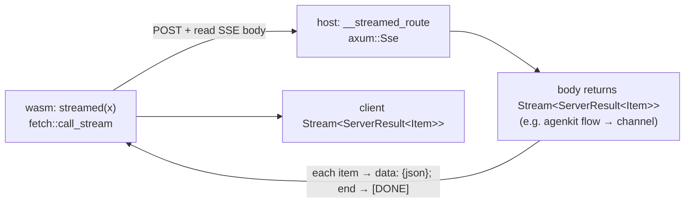

# RFC-107: Streaming server functions

**Status:** Draft (design note)
**Crates:** `pocopine-macros`, `pocopine-server`, `pocopine-core` (`fetch`)
**Relates to:** RFC-073 (realtime), RFC-093 (agenkit), the live/events spine

## Summary

Add a **request-scoped streaming response** to `#[server]`: a server function
that returns *many* values over one call, streamed to the caller as they're
produced. The function's `#[server]` shape is unchanged — **streaming is
inferred from the return type**, not a new attribute flag. On the host the body
returns a `Stream`; the macro serves it over SSE; on wasm the generated stub
returns a `Stream` the caller `.next()`s.

This fills the one missing cell in pocopine's client-comms taxonomy:

| | 1 client → 1 response (request-scoped) | 1 event → N clients (broadcast) |
|---|---|---|
| **unary** | `#[server] -> ServerResult<T>` | — |
| **stream** | **`#[server] -> StreamServerResult<T>`  ← this RFC** | `pocopine-live` (SSE invalidation) |
| **bidirectional** | — | `pocopine-realtime` (WS, RFC-073) |

## Motivation

Several features want "one call, a stream of results back to *that* caller":

- **Agenkit flow progress** (`FlowStreamEvent` trace tree) — today served by a
  bespoke SSE route (`pocopine-agenkit::server::stream_route`) that reinvents
  transport. It should be a streaming `#[server]` fn (RFC-093 Model B: flows are
  internal; `#[server]` is the boundary).
- **LLM token streaming**, progress bars, `tail -f`-style log views.

Crucially this is **not** what `pocopine-live`/`pocopine-realtime` do. Those are
*broadcast*: a client subscribes to topics, the server publishes, events fan out
(via the events spine / Redis) to *every* subscriber across processes. A
streaming response is **1:1 and request-scoped** — it runs in the handler of the
call that started it, on the same process, and never needs the fan-out spine.
Routing it through live/realtime would mean inventing a per-call topic and
paying the broadcast machinery to deliver to a single subscriber. Different
pattern; different primitive.

## Design

### Inference from the return type (no `stream` flag)

`#[server]` already pattern-matches the **return type's head identifier** to
decide framing (`ServerResult<T>` / `Result<T, ServerError>`). We extend that:

```rust
#[server(public)]
async fn unary(x: In) -> ServerResult<Out> { ... }            // unary  (today)

#[server(public)]
async fn streamed(x: In) -> StreamServerResult<Item> { ... }  // streaming (this RFC)
```

The macro is syntactic — it sees tokens, not resolved types — so "infer from the
output type" means: **recognize the return type's outer name.** If the head path
is `StreamServerResult` (or `ServerStream<T>`), emit the streaming variant;
otherwise the unary one. No `#[server(stream)]` flag, no mode argument — the
return type is the single source of truth, exactly as it already is for the
error type. (A misspelled wrapper just compiles as unary and fails type-check,
which is the desired "say what you mean" failure.)

```rust
/// The streaming counterpart of `ServerResult<T>`.
/// Outer `Result` = the setup/handshake (auth, bad input) failed before any
/// item; each `Item` carries its own `ServerResult` so mid-stream errors are
/// in-band and terminal.
pub type StreamServerResult<T> =
    ServerResult<futures::stream::BoxStream<'static, ServerResult<T>>>;
```

### Server architecture — axum `Sse` + a `Stream`

The body returns a `Stream<Item = ServerResult<Item>>`. The generated host
handler adapts it to an SSE response with `axum::response::Sse` (the same
machinery `pocopine-live` and the agenkit stream route already use):

```rust
// generated (host)
#[cfg(not(target_arch = "wasm32"))]
pub fn __streamed_route(router: Router) -> Router {
    router.route(__streamed_path(), post(|req: Request| async move {
        // (guard/principal handled exactly as for unary #[server] — extensions)
        let input: In = /* deserialize body */;
        match streamed(input).await {                      // user body → Ok(stream) | Err(setup)
            Err(e) => sse_error_only(e),                   // one terminal error frame
            Ok(stream) => Sse::new(
                stream
                    .map(|item| Ok::<_, Infallible>(to_frame(&item)))   // item → data: {json}
                    .chain(once(async { Ok(done_frame()) })),           // terminal `[DONE]`
            ).keep_alive(KeepAlive::default()).into_response(),
        }
    }))
}
```

- **`tokio-stream` / `futures::StreamExt`** drive the adaptation (`map`,
  `chain`, the `mpsc::UnboundedReceiverStream` a producer task feeds). The body
  is free to build its stream however it likes — e.g. agenkit spawns the flow
  and pipes `FlowStreamEvent`s through a channel, identical to today's route.
- **Framing:** each `Ok(item)` → `data: {json}\n\n`; an `Err(item)` → a terminal
  `data: {"error": ...}` frame; end-of-stream → `data: [DONE]\n\n`. (The exact
  wire frame is shared with `fetch::call_stream` below; one decoder, one
  encoder.)
- **Backpressure:** the producer feeds a *bounded* channel; a slow client
  applies backpressure to the body (or the channel drops with a `lagged`
  terminal frame, configurable).
- **Cancellation:** client disconnect drops the SSE body → drops the producer
  task's `tx` → the flow/stream future is cancelled. No extra wiring.

### Client architecture — `fetch::call_stream`

`pocopine_core::fetch` gains a streaming sibling of `call`:

```rust
pub async fn call_stream<A: Serialize, R: DeserializeOwned>(
    url: &str,
    args: &A,
) -> ServerResult<impl Stream<Item = ServerResult<R>>>;
```

On wasm it `fetch`es the POST, takes the response `ReadableStream`, and decodes
SSE frames into items. The decoder is **the same blank-line-delimited SSE
reassembly** the OpenAI/Anthropic providers already use (buffer bytes, split on
`\n`, join multi-line `data:` fields on the blank-line boundary, parse each
`data:` payload; `[DONE]` ends; an `error` frame yields a terminal `Err`).
Network/parse failures surface as `ServerError::Network`.

The generated wasm stub:

```rust
#[cfg(target_arch = "wasm32")]
pub async fn streamed(x: In) -> StreamServerResult<Item> {
    Ok(::pocopine::fetch::call_stream::<In, Item>(__streamed_path(), &x).await?.boxed())
}
```

So both ends keep the typed signature; the caller just does
`while let Some(item) = s.next().await { … }`.



### Why SSE (not chunked JSON, not WS)

- **SSE** is unidirectional server→client — matches a response stream exactly,
  is the same transport `pocopine-live` and the providers use, and frames
  cleanly (`data:` + blank line). One decoder serves providers, live, and this.
- **WS** (`pocopine-realtime`) is bidirectional — overkill; reserved for
  client-push (collab, chat).
- **Chunked NDJSON** is viable but loses the shared SSE decoder and keep-alive.

## Migration: agenkit flow streaming

Once this lands, agenkit's bespoke `ai_flow_stream_router` retires. Flow
streaming becomes a normal streaming `#[server]` fn:

```rust
#[server(public)]
pub async fn summarize_stream(input: SummarizeInput) -> StreamServerResult<FlowStreamEvent> {
    let (tx, rx) = mpsc::unbounded_channel();
    let agenkit = active_plugin::<Agenkit>().unwrap();
    tokio::spawn(async move { let _ = agenkit.flow("summarize").input(input).stream(tx).await; });
    Ok(UnboundedReceiverStream::new(rx).map(Ok).boxed())   // FlowStreamEvent is client-safe by construction (§D8)
}
```

`StreamMode`/`.public()`/`flow_is_public` and the §D8 redaction `stream_filter`
move with it (the filter stays the chokepoint applied before items hit the SSE
frame).

## Non-goals / open questions

- **Not** a broadcast/subscription mechanism — use `pocopine-live` (invalidation)
  or `pocopine-realtime` (bidirectional). This is strictly request-scoped.
- **Resume/replay** across reconnect (live/realtime have sequence numbers) — out
  of scope; a streaming response is tied to its call.
- Exact **wrapper type name** (`StreamServerResult<T>` vs `ServerStream<T>`) and
  whether to also accept a bare `impl Stream<…>` return — to settle in review.
- **Terminal-frame contract** (`[DONE]` vs an explicit `{"end":true}`; how
  per-item `Err` vs setup `Err` are distinguished on the wire) — to settle with
  the encoder/decoder pair.
- Interaction with `#[server(idempotent)]` / replay-safe semantics.
