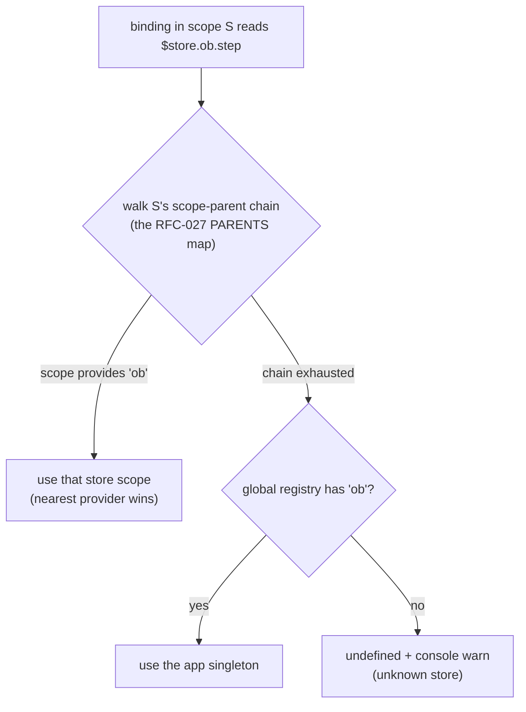

# RFC-108: Scoped stores

**Status:** Draft
**Crates:** `pocopine-macros` (`#[store]`, `#[component]`), `pocopine-core` (`store`, `scope`, `magics`, `reactive`)
**Relates to:** RFC-002 (app stores), RFC-027 (provide/inject), RFC-096 (signals-first core), RFC-024 §7 update (deep write-back), RFC-097 (field handles)

## Summary

A **scoped store** is a `#[store]` owned by a component subtree instead of the
app: instantiated when its *provider component* mounts, dropped when that
component unmounts, and resolved by the same `$store.<name>` template syntax
through the scope-parent chain — nearest provider wins, global registry as the
fallback. Handlers, `#[computed]`, `#[watch]`, field handles, `pp-model`
(including the RFC-024 §7 deep paths), and the `Handle<T>` Rust surface are
all unchanged; the only new things are one word in the store attribute and one
arg on the provider component:

```rust
#[derive(Serialize, Deserialize, Default)]
#[store(name = "ob", scoped)]           // ← scoped, not an app singleton
pub struct OnboardingStore {
    pub step: i32,
    pub business: String,
    pub kitty: KittyThread,             // nested structs bind fine post-RFC-024-§7
}

#[component(template = "TtOnboarding.poco", provides = [OnboardingStore])]
pub struct TtOnboarding { ... }
```

Everything inside `<tt-onboarding>` reads and writes `$store.ob.*` exactly as
if it were global. When the wizard unmounts, the store dies with it.

## Motivation

The evidence is a real app (team-tusk, a chat workspace): its single global
`#[store(name = "ws")]` grew to **~90 fields across ten unrelated domains**.
A field census shows why:

| category | fields | consumers |
|---|---|---|
| truly app-global (chat core, identity, gates) | ~22 | 5–10+ components across subtrees |
| feature-scoped (onboarding wizard, invite-accept, login, admin dialog) | ~45 | **exactly one** template consumer each |
| flat mirrors of nested state | ~25 (overlaps above) | forced by the pre-RFC-024-§7-update one-level `pp-model` ceiling |
| cross-tree dialog open-flags | ~7 | trigger and mount in different subtrees |

Two framework forces created this. The second — deep `pp-model` writes being
silently lost, forcing flat mirrors — is fixed (RFC-024 §7 update). This RFC
addresses the first: **`$store` is the only template-readable, cross-tree
reactive surface**, so feature state with a single consumer subtree still ends
up in an app-lifetime singleton. The costs are concrete:

- **Manual lifecycle.** App-lifetime state for a screen-lifetime feature means
  hand-written reset actions and "play once" guards (`kitty_started`), and
  stale state parked in memory after the feature closes.
- **Unenforced reach.** Any component anywhere can poke `$store.ob.*`;
  keeping the boundary is discipline, not mechanism.
- **No instancing.** Singletons can't model "one per thing" — per-open-thread
  composer state, per-tab board state.

Splitting into multiple *global* stores (already supported) fixes file
organization and invalidation blast radius, but none of the three above.
The app's own code shows developers know the local-state alternative and use
it wherever a subtree suffices — they reach for the global store only when
the framework gives them nothing else.

## Design

### Declaration: `#[store(..., scoped)]`

`StoreArgs` gains a bare `scoped` flag. A scoped store type:

- emits the same `ComponentState` impl, `#[computed]` install, field handles,
  and `Store` trait impl as today;
- does **not** register into the global registry. `App::store::<T>()` on a
  scoped store is a **boot-time panic** with a message naming the type and the
  fix ("scoped store — provide it from a component via `provides = [...]`").
  Fail loud, per the config-typo doctrine.

### Provision: `provides = [Type, ...]` on `#[component]`

`ComponentArgs` gains `provides = [StoreType, ...]` (same path-array grammar
as `uses` / `extends`). When the provider component's scope is created, the
runtime instantiates each listed store (`Default`), wraps it in a `Scope`, and
deposits it in a scope-keyed registry:

```rust
thread_local! {
    /// (provider scope, store name) → store scope.
    static SCOPED_STORES: RefCell<HashMap<(ScopeId, &'static str), Scope>> = ...;
}
```

Creation happens at **provider scope creation, before children walk** — so
every child binding that evaluates during mount already resolves. Teardown
rides `reactive::clear_scope`: removing the provider scope removes its store
scopes, their signals, projections, and context entries. No reset actions, no
"started" guards — remount = fresh `Default`.

Declarative provision (not an imperative `provide_store()` call in `on_mount`)
is deliberate: children's bindings evaluate during the mount walk, so the
store must exist before any imperative parent hook could reliably run.

### Resolution: nearest provider wins, global fallback

`$store.<name>` resolution today is one global map lookup
(`store::store_scope(name)`). It becomes a chain walk:



- The walk uses the **scope-parent chain** RFC-027's provide/inject already
  maintains — so slotted and teleported children resolve against their
  *authoring* parent, the same rule context follows.
- **Reader scope:** template reads carry the reading scope id today
  (`magics::resolve(key, scope_id)`); the write path
  (`path::write_segments_with` → `magic_scope_access`) uses the ambient
  `current_scope_id` that directives already set around evaluation.
  `magic_scope_access` gains the reader scope as an argument; the ambient id
  is the source at the two path call sites.
- **Determinism:** a binding site's position in the tree is fixed, so
  resolution is stable for the binding's lifetime. Children of a provider are
  torn down with (and before) the provider, so a live binding can never
  outlive the store it resolved to.

### Shadowing, collisions, instancing

- **Scoped name == global name → registration-time panic.** If `ob` could be
  both an app singleton and a scoped store, the same template line would mean
  different things in different subtrees with no local signal. Forbidden.
- **Scoped shadowing scoped is allowed** — it *is* the instancing mechanism:
  two sibling `<tt-thread-pane>` providers each get their own `ComposerStore`;
  a provider inside a keyed `pp-for` gets one instance per row. An inner
  provider of the same name shadows an outer one, exactly like nested
  `provide` in RFC-027.
- **Per-route stores** fall out for free: provide from the route's root
  component. No separate router integration.

### Rust access

`pocopine::store::<T>()` stays global-only (it has no scope context) and
panics for scoped types with a pointer to the new API:

```rust
// In handlers / lifecycle of the provider or any descendant:
let ob = pocopine::scoped_store::<OnboardingStore>();   // Handle<OnboardingStore>
ob.update(|s| s.step += 1);
```

`scoped_store::<T>()` resolves via the ambient current scope, walking the
same chain as the template path; it panics outside a handler/lifecycle
context and when no provider is in scope (mirrors `inject`'s contract, with
an `Option`-returning `try_scoped_store` alongside). The returned `Handle<T>`
is the ordinary scope-bound handle — field handles (RFC-097) included.

### What is explicitly unchanged

- Template syntax: zero new grammar. `$store.ob.step`, `pp-model`, deep
  paths, `pp-text`, expressions — identical.
- Store authoring: `#[handlers]` actions, `#[computed]` fields, `#[watch]`.
- Reactivity granularity: per-field, per RFC-096. A scoped store is its own
  scope, so its invalidation blast radius is naturally isolated from the
  global store and from other instances.
- Persistence: none. Serde derives remain JS-boundary plumbing only.

## Migration sketch (team-tusk)

| today (global `ws` fields) | after |
|---|---|
| `ob_step ob_business ob_size ob_canvas ob_integrations ob_api_key ob_generating ob_name ob_notif_preset onboarding_kind` + `kitty_*` (17 fields) | `#[store(name = "ob", scoped)]` provided by `<tt-onboarding>`; kitty thread a nested struct |
| `invite_token invite_state invite_ws_* invite_email invite_role ...` (9) | scoped `InviteStore` at `<tt-invite-accept>`; only `invite_token` (the URL gate) stays global |
| `ws_settings_* ws_invite_policy ws_allow_* ...` (18, all flat mirrors) | scoped `SettingsStore` at the dialog, holding the **nested** `api::WorkspaceSettings` directly — deep `pp-model` binds it since the RFC-024 §7 update |
| `login_view login_error reset_token` | scoped `LoginStore` at `<tt-login>` |
| chat core, identity, `authed`/`booting`/`onboarded` gates, dialog open-flags | stay in the global `ws` store (correctly) |

Net: the ~90-field singleton shrinks to the ~22 fields that are genuinely
app-global, each feature gets a store file that lives and dies with its
screen, and no reset actions survive.

## Non-goals

- **Template-readable context (`$ctx`).** Considered and rejected: scoped
  stores subsume the use case with syntax authors already know. RFC-027
  provide/inject stays what it is — a Rust-side dependency channel.
  One canonical pattern per decision.
- **Sibling / cross-tree resolution.** A store resolves up the chain only.
  Cross-tree dialog open-flags (trigger in the sidebar, dialog in the shell)
  remain global-store state; a dedicated overlay-controller primitive is a
  possible future RFC, not this one.
- **Keep-alive / state survival across remounts.** Unmount drops the store by
  design; state that must survive belongs in a global store (or the server).
- **Lazy/async store construction, `on_provide` hooks.** `Default` at
  provider mount is v1. Seeding from props or a fetch happens in the
  provider's own lifecycle via `scoped_store::<T>().update(...)`.

## Open questions

- **Devtools:** how to render N instances of one scoped store type (label by
  provider scope id / tag?).
- **SSR / hydration (RFC-099):** scoped stores are created during the mount
  walk, which hydration replays — expected to fall out, needs a test once
  structural hydration lands.
- **`#[observe]` / cross-store computed:** a scoped store's `#[computed]` can
  read the global store today (magics resolve inside computed bodies); the
  reverse (global reading scoped) is meaningless and should probably warn.

## Implementation sketch

1. `pocopine-macros`: `StoreArgs.scoped` flag; skip global registration and
   emit a `SCOPED` marker const + panic body for `__register_store`;
   `ComponentArgs.provides` (reuse the `extends` path-array parser); provider
   registration emitted into the component's scope-creation path.
2. `pocopine-core/store.rs`: `SCOPED_STORES` registry;
   `resolve_store_scope(reader: ScopeId, name: &str)` chain walk + global
   fallback; teardown hook in `clear_scope`.
3. `pocopine-core/scope.rs` + `magics.rs` + `path.rs`: thread the reader
   scope into `magic_scope_access`; `stores_object()` (the bare `$store`
   proxy container) stays global-only — bare `$store` enumeration of scoped
   instances is not supported (and not needed by any template form).
4. `scoped_store::<T>()` / `try_scoped_store::<T>()` in `pocopine-core`,
   re-exported by `pocopine` (deferred umbrella polish until the API locks).
5. Tests: wasm battery — provider mount/unmount lifecycle, nearest-wins
   shadowing, sibling instancing, pp-for per-clone instances, deep `pp-model`
   into a scoped store, global-fallback, collision panic, `scoped_store`
   handle access, teardown leak check (signals + projections purged).
