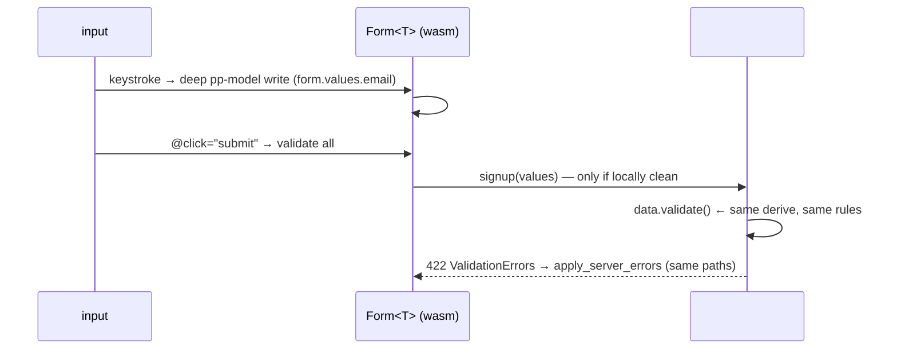

# RFC-109: pocopine-forms — typed forms with validation

**Status:** Draft (exploration — options weighed, recommendation made, API not final)
**Crates:** new `pocopine-forms`; touches nothing in core
**Relates to:** RFC-024 §7 update (deep write-back — the enabling change), RFC-044 (model fields), RFC-108 (scoped stores), RFC-031 (prop vs state)

## Summary

Forms are the most hand-rolled corner of every pocopine app: a pile of
per-field `String`s, ad-hoc checks in submit handlers, and error strings
managed by hand. Now that dotted `pp-model` paths write back into Rust state
(RFC-024 §7 update), a form can be **one typed struct bound directly**:

```rust
#[derive(Serialize, Deserialize, Validate, Default)]
pub struct Signup {
    #[validate(length(min = 1, message = "required"))]
    pub name: String,
    #[validate(custom(function = "pocopine_forms::rules::email"))]
    pub email: String,
    #[validate(nested)]
    pub limits: Limits,
}

#[component(template = "SignupForm.poco")]
pub struct SignupForm {
    pub form: Form<Signup>,          // values + errors + touched + phase
}
```

```html
<input pp-model="form.values.email" @blur="touch('email')" />
<span class="error" pp-show="form.errors.email" pp-text="form.errors.email"></span>
<button @click="submit">Sign up</button>
```

**Recommendation:** build a *thin* `pocopine-forms` crate on top of
[Keats `validator`](https://github.com/Keats/validator) rather than inventing
a validation DSL — with one opinionated twist: ship regex-free default rules,
because the measured wasm cost of validator's regex-backed rules is ~600 KB.

The strategic win is **one schema, both sides**: the same
`#[derive(Validate)]` struct validates in the browser for UX and in the
`#[server]` fn for trust. Client validation is a convenience; the server call
is the gate — and in a Rust-both-sides framework they are literally the same
code, not a JS schema and a Rust schema drifting apart.

## Why now: the enabling change

Before the RFC-024 §7 update, `pp-model="form.values.email"` silently lost
every keystroke (dotted writes mutated a throwaway projection snapshot). That
is why team-tusk's login/invite/create-channel forms are flat per-field store
entries. Deep write-back made nested binding reliable — including Vec index
paths (`form.values.members.0.email`) — so a typed `values` struct is now the
natural shape, and this RFC is unblocked.

## Verified facts (spike, 2026-07-02)

A throwaway crate against `validator 0.20` established:

1. **Compiles to `wasm32-unknown-unknown`** with `features = ["derive"]`,
   no patches.
2. **Error paths align with our template path grammar exactly.**
   `ValidationErrors` is a tree (`Field` / `Struct` / `List` kinds); a
   30-line walk flattens it to dotted paths — `email`, `password`,
   `limits.max`, and `List` yields `items.0.label`, byte-identical to the
   paths `pp-model` writes. The two systems were made for each other.
3. **Size is a two-regime story** (raw cdylib, `opt-level = "s"`, LTO):
   - `length` / `range` / `nested` / `custom` rules: **72 KB**
   - add one `email` rule: **676 KB** — the `regex` engine dominates at
     ~600 KB raw, linked only when a regex-backed rule (`email`, `url`,
     `regex(...)`) is used.

Fact 3 drives the main opinion below.

## Design (recommended shape)

### `Form<T>` — the reactive form state

One component field wraps the whole form lifecycle:

```rust
pub struct Form<T: Validate + Serialize + DeserializeOwned + Default> {
    pub values: T,
    errors: BTreeMap<String, String>,   // dotted path → first message
    touched: BTreeSet<String>,          // dotted paths the user has visited
    phase: FormPhase,                   // Pristine | Editing | Submitting | Submitted
}
```

- **Custom `Serialize`**: emits `{ values, errors, touched, phase }` with
  `errors` as a **plain JS object** (a `BTreeMap` through serde_wasm_bindgen
  would become an ES `Map`, which template paths cannot walk — a known hole;
  `Form`'s manual Serialize sidesteps it). Top-level field errors read as
  `form.errors.email` directly. Errors on nested fields have dotted keys
  (`limits.max`), which are not a single template path segment — the
  ergonomics for those are an Open question below; v1 promises clean access
  for top-level fields, which covers the overwhelmingly common form shape.
- **`Deserialize`**: the deep write-back writes the *whole* `form` field back
  on every keystroke; `Form`'s Deserialize round-trips all four parts, so
  nothing is lost in the serde bounce.
- **Revalidation**: a `#[watch(form)]` in the component calls
  `self.form.revalidate()`, which re-runs `values.validate()` and re-derives
  `errors`, filtered to `touched` paths (plus everything once submit was
  attempted). `#[watch]` fires on distinct fingerprints, so
  validate-after-write converges instead of looping. Sugar for this watch is
  an open question (a `#[form]` field attribute could emit it).
- **API**:

```rust
impl<T> Form<T> {
    fn touch(&mut self, path: &str);            // @blur="touch('email')"
    fn submit(&mut self) -> Option<&T>;         // validate all; Some(values) if clean
    fn set_submitting(&mut self, on: bool);
    fn apply_server_errors(&mut self, errs: &ValidationErrors);  // merge, same paths
    fn reset(&mut self);
}
```

### Regex-free default rules

`pocopine-forms::rules` ships `custom`-compatible validators that do **not**
pull the regex engine: `email` (structural HTML5-style check: one `@`,
non-empty local/domain parts, a dot in the domain, no whitespace), `url_ish`,
and re-exports of the regex-free built-ins (`length`, `range`, `required`,
`must_match`, `nested`, `custom`). Apps that want validator's full
regex-backed rules just use them — and knowingly buy the ~600 KB engine. The
docs state the price; the default path doesn't pay it.

### Server side: the same struct is the gate

```rust
#[server(public)]
async fn signup(data: Signup) -> ServerResult<SignupOk> {
    data.validate().map_err(ServerError::validation)?;   // helper: 422 + error tree
    ...
}
```

`ServerError::validation(ValidationErrors)` serializes the error tree into
the error payload; on the client, `form.apply_server_errors(...)` merges them
into the **same dotted-path error map** the local validation writes — one
rendering path for both local and server-rejected errors (uniqueness checks,
race losses). Per the traits-not-bundled-stores doctrine, that helper is the
entire server surface: no plugin, no storage, pure mechanism.



## Options considered

| option | verdict |
|---|---|
| **A. `Form<T>` wrapper over Keats `validator`** | **Recommended.** Thin, typed, one schema both sides, error paths already match ours. |
| B. No crate — document the pattern (values struct + errors map + flatten helper) | Fallback; zero maintenance but every app re-implements touched/phase/server-merge. The helper fns alone are 80% of A — so ship A. |
| C. Own validation derive/DSL | Rejected. Reinvents validator's rule set, violates the use-existing-crates doctrine, and orphans us from the ecosystem (axum-valid etc. speak `Validate`). |
| D. Validation in `pine-*` form components (validate in the UI layer) | Rejected as the *source of truth* — rules must live on the data struct or the server can't reuse them. Pine components stay presentational consumers of `Form` state (future RFC). |

## Relationship to RFC-108 (scoped stores)

Complementary, not competing. `Form<T>` is a component field — right for a
form owned by one component. A multi-screen wizard whose steps are separate
components (team-tusk onboarding) puts `Form<T>` **inside a scoped store**:
`#[store(name = "ob", scoped)] struct Ob { form: Form<Onboarding> }` — the
subtree binds `$store.ob.form.values.business`, and the form dies with the
wizard. Nothing in either RFC special-cases the other.

## Non-goals (v1)

- Async/debounced validators (server-side uniqueness rides submit +
  `apply_server_errors`, not per-keystroke RPC).
- File inputs, multipart (storage crate territory).
- Form-array ergonomics beyond what paths give (`values.members.0.email`
  binds today; add/remove-row helpers can come later).
- Message i18n (validator's `message` is already author-supplied; localizing
  is an app concern).
- A `pine-form` / `pine-field` component family — worth doing, separate RFC
  once `Form` is proven.

## Open questions

- **Nested error keys in templates.** `errors` keys like `limits.max` are not
  single template path segments. Candidates: (a) nest the errors object
  mirroring the values shape (walkable: `form.errors.limits.max`) with leaf
  strings — likely the winner, costs a small tree-build in Serialize;
  (b) `#[computed]` accessors; (c) leave flat and only promise top-level
  ergonomics. Decide with the first real consumer.
- **Touched sugar.** `@blur="touch('email')"` stringly repeats the path a
  directive already knows. A `pp-model.touch` modifier (model directive marks
  the path touched on blur) would remove the duplication — needs a small
  core change, evaluate after v1 proves the shape.
- **`Validated<T>` extractor** for `#[server]` fns (validate before the body
  runs) vs the explicit `map_err` line. Explicit line first; extractor if it
  earns its keep.
- **Where `rules::email` stops.** Structural check accepts some invalid
  addresses full RFC-5321 regex rejects — deliberately: the server (or the
  verification email) is the real arbiter. Document rather than chase.

## Next step

Build the spike into `crates/pocopine-forms` behind the recommended shape:
`Form<T>`, the error flattener (exists, tested in the spike), `rules::email`,
`ServerError::validation` + `apply_server_errors`, and a `SignupForm` example
under `examples/` driven by a Playwright check — then revisit the open
questions with that consumer in hand.
