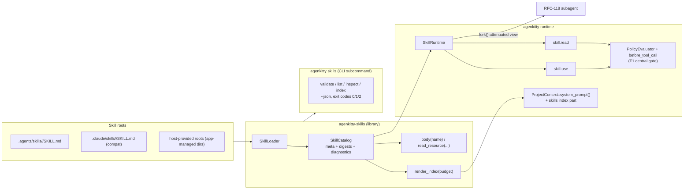
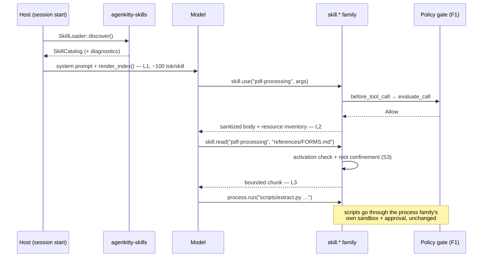

# RFC-121: agenkitty skills — an Anthropic-compatible skill loader

**Status:** Implemented (P1–P3 on this branch; P4 marketplace resolver remains a future RFC)
**Crates:** `agenkitty-skills` (new: loader library), `agenkitty` (new `skill.*` tool family + `agenkitty skills` CLI subcommand), `agenkitty-core` (`[skills]` config section)
**Revision (post-merge):** the CLI shipped initially as a standalone `agenkitty-skills` binary behind a `cli` feature; it has since been folded into the `agenkitty` binary as the `skills` subcommand — one binary to install, same four commands, same JSON envelope (`agenkitty-skills/v1`) and exit-code contract. References to "the binary" below read as `agenkitty skills`.
**Relates to:** the plugin-marketplace research verdict (2026-07-06; phase 1 = SKILL.md loader), the earlier plugin-package draft (tentatively RFC-114, uncommitted — phase 2 territory), RFC-118 (subagent primitives, attenuation recipe), RFC-093 (agenkit), RFC-069 (logging)

## Summary

agenkitty gains first-class support for **Agent Skills** — the open standard
(agentskills.io) that Anthropic's products implement — via one new subsystem with two
consumption modes:

1. **Library mode.** A new, dependency-light crate `agenkitty-skills` that any Rust host
   (the agenkitty runtime, the downstream AgenKitty app, CI tooling) embeds directly:
   discover skill directories, validate `SKILL.md` against the spec, render a
   byte-budgeted index for system-prompt injection, and serve skill bodies and bundled
   resources on demand.
2. **Binary execution mode.** The same loader from the command line — the
   `agenkitty skills` subcommand (revised from an initial standalone binary; see the
   Revision note above) with `validate` / `list` / `inspect` / `index` and stable,
   versioned `--json` output — usable from shells, CI gates, editors, and non-Rust
   tooling. Unlike `run`/`doctor` it resolves no project config: a pure function over
   the directories it is pointed at.

The agenkitty runtime consumes the library through a new `skill.*` tool family
(`skill.use`, `skill.read`) that implements the standard's **progressive disclosure**:
skill names + descriptions ride in the system prompt (~100 tokens each), the full
`SKILL.md` body loads only when the model activates a skill, and bundled
`references/` / `assets/` files load only when read. Both the top-level agent and
RFC-118 subagents use the same runtime through an attenuation-only view: a child can
see a subset of its parent's skills, never more.

Compatibility target: a skill directory that validates under Anthropic's `skills-ref`
reference tool loads in agenkitty unchanged, and Claude Code extension frontmatter is
parsed and surfaced without ever being a privilege-escalation channel (§ Compatibility
matrix).

## Motivation

The July research settled the direction: adopt the Agent Skills open standard first
(vendor-neutral, ~40 runtimes, Apache-2.0 spec), with the decentralized git-repo
marketplace as a later phase. The runtime already has the hard part — capability-scoped
default-deny admission, secret handles, per-principal isolation, the `AiTool` /
`register_dyn` seam — but no packaging layer: today there is no way to hand agenkitty a
folder of procedures and have agents discover and use them. Meanwhile the downstream
AgenKitty app already ships "Skills" UI stubs (a prefs rail entry and a composer menu
item, both wired to "coming soon") waiting on exactly this subsystem.

The two-mode requirement is load-bearing, not incidental:

- **Library mode** is how the runtime and the app consume skills in-process, and how the
  app's Skills prefs pane lists/inspects them without shelling out.
- **Binary mode** is how everything else consumes them: CI validation of a repo's
  skills, editor integrations, the app's task runners, and any non-Rust host that can
  parse JSON. It is also the evaluation harness for this RFC — every loader behavior is
  observable from the CLI before any runtime wiring exists.

## Architecture



### Crate placement

Following the established split (portable data in `agenkitty-core`, host execution in
`agenkitty`), with one addition justified by the two-mode requirement:

| Crate | Contents | Why here |
|---|---|---|
| `agenkitty-skills` (new) | `SkillLoader`, `SkillCatalog`, `LoadedSkill`, `SkillMeta`, `SkillDiagnostic`, index rendering, body/resource reads, digesting | Library mode must not drag the runtime's dependency tree (tokio, rmcp, provider stacks). Mirrors the standard's own `skills-ref` reference-library shape. The CLI surface lives in `agenkitty` as the `skills` subcommand (post-merge revision). |
| `agenkitty-core` | `SkillsConfigSection` in `AgenkittyConfig` | `AgenkittyConfig` is `#[serde(deny_unknown_fields)]` — a `[skills]` table in `.agenkitty/config.toml` hard-errors unless the section exists here. Pure serde data, wasm-safe. |
| `agenkitty` | `src/tools/skills/` family: `SkillRuntime`, `skill.use`, `skill.read`, registry, specs, README | Needs `AiTool`, the admission stack, the fs confinement helpers (`pub(crate)` in `tools/fs/common.rs`), and the prompt-composition seam — all host-layer. |

`agenkitty` depends on `agenkitty-skills`. Nothing else in the workspace does
until it wants to.

## Format contract (normative)

### Open-standard frontmatter — implemented in full

`SKILL.md` = YAML frontmatter + Markdown body. The loader enforces exactly the
agentskills.io rules:

| Field | Required | Validation (loader-enforced) |
|---|---|---|
| `name` | yes | 1–64 chars; lowercase `a-z`, `0-9`, `-` only; no leading/trailing hyphen; no `--`; **must equal the parent directory name** |
| `description` | yes | 1–1024 chars, non-empty after trim |
| `license` | no | free string, preserved |
| `compatibility` | no | 1–500 chars if present |
| `metadata` | no | map of string → string; non-map or non-string values downgraded to a diagnostic, field dropped (Claude Code parity) |
| `allowed-tools` | no | space-separated string per the standard; comma-separated string and YAML list also accepted (Claude Code parity). Semantics in § Security (S5). |

Violations are **per-skill diagnostics, never loader failures**: a broken skill is
excluded from the catalog with a structured `SkillDiagnostic { skill_dir, field, rule,
message }`; the rest of the catalog loads. This is the macro-hardening posture — loud,
attributable errors, no silent drops (every exclusion is enumerable via `list --json`
and logged).

Optional directories (`scripts/`, `references/`, `assets/`) are conventions, not
schema: the loader treats every non-`SKILL.md` file uniformly as a *resource*
addressable by relative path.

### Claude Code extension fields — parsed, surfaced, bounded

Unknown frontmatter fields never error (the standard requires tolerance). Fields Claude
Code defines get typed parsing into `SkillMeta.ext` so hosts can act on them, but the
**loader and the framework tool family never execute policy from them**. Disposition of
each:

| Field | v1 disposition |
|---|---|
| `when_to_use` | **Honored.** Appended to `description` in the rendered index, combined cap 1536 bytes (Claude Code parity). |
| `disable-model-invocation` | **Honored.** Skill is excluded from the injected index and `skill.use` refuses model-initiated activation; host-initiated activation (slash-style UX) still works. |
| `user-invocable` | **Surfaced.** Framework has no `/` surface; the app's composer does. Exposed as `ext.user_invocable` for the host to honor. |
| `allowed-tools` / `disallowed-tools` | **Honored, attenuation-only** — see S5. Never widens the session's admitted toolset. |
| `context: fork`, `agent`, `background` | **Surfaced** as `ext.execution_hint`. Subagent orchestration is app territory (RFC-118 decision); `skill.use` never auto-forks. The app maps the hint onto its own orchestrator via `fork_as` / `ParentLink::spawn`. |
| `model`, `effort` | **Surfaced.** Model/effort overrides are host `AgentConfig` decisions. |
| `paths` | **Surfaced.** Activation gating on touched files requires session file-tracking the framework doesn't own. |
| `arguments`, `argument-hint` | **Honored** for substitution (§ skill.use) and surfaced for host autocomplete UX. |
| `hooks`, `shell` | **Preserved raw, ignored, diagnostic emitted** (info-level "unsupported extension"). agenkitty has no general hook dispatch; silently pretending would be worse than declining loudly. |

Raw frontmatter is retained on `LoadedSkill` (`raw: BTreeMap<String, yaml::Value>`) so
hosts and future phases can read fields this RFC doesn't model, and `inspect --json`
round-trips authored content faithfully.

### Argument substitution

When an activation carries arguments (from the host or the model's `skill.use` call),
the body is rewritten with Claude Code semantics: `$ARGUMENTS` (full string),
`$ARGUMENTS[N]` and `$N` (0-based, shell-style quoting for multi-word values), named
`arguments` mapped by position, backslash-escape for literal `$`, and the trailing
`ARGUMENTS: <value>` line appended when arguments are supplied but no placeholder
exists. No other substitution happens in v1 — in particular no `${…}` environment or
plugin-root expansion (phase 2, alongside `${AGENKITTY_PLUGIN_ROOT}`).

## Discovery

Roots are an **ordered list**; earlier roots win name collisions (the shadowed skill is
kept in the catalog as `shadowed_by` and reported, not silently dropped). Defaults for
the agenkitty runtime, relative to project root:

1. `.agents/skills/` — the vendor-neutral standard path (primary; what we recommend
   authors use)
2. `.claude/skills/` — Claude Code compatibility, read-only, on by default so existing
   corpora (including this repo's own vendored skills) light up with zero migration

There is deliberately **no** `.agenkitty/skills/` root in v1: two well-known paths are a
compatibility story, three is a fragmentation story. (Open question Q1 if you disagree.)
Hosts pass arbitrary absolute roots in library mode — this is how the app wires its
managed/synced skills directory — and the binary takes repeatable `--root` flags. The
`[skills].roots` config key overrides the default pair per project.

A root entry may be a symlink; the loader resolves it once and the **resolved**
directory becomes the confinement root for all subsequent reads (S3). Per-skill
subdirectory symlinks resolve the same way, deduplicated by resolved path.

Loading is a scan at construction plus an explicit `refresh()`; each `LoadedSkill`
carries a `digest` (SHA-256 of `SKILL.md` bytes via `pocopine-crypto`) so hosts get
cheap change detection. Filesystem watching is a non-goal in v1.

## Library mode — API sketch

```rust
// agenkitty-skills — no tokio, no runtime deps. Sync fs; callers wrap as needed.
pub struct SkillLoader { /* roots: Vec<PathBuf>, limits: SkillLimits */ }

impl SkillLoader {
    pub fn new(roots: Vec<PathBuf>, limits: SkillLimits) -> Self;
    /// Scan all roots. Infallible at the catalog level: per-skill failures
    /// become diagnostics, IO failure of a whole root becomes a root diagnostic.
    pub fn discover(&self) -> SkillCatalog;
}

pub struct SkillCatalog {
    // BTreeMap for deterministic ordering everywhere (index, list, JSON).
    skills: BTreeMap<String, LoadedSkill>,
    diagnostics: Vec<SkillDiagnostic>,
}

impl SkillCatalog {
    pub fn get(&self, name: &str) -> Option<&LoadedSkill>;
    /// The L1 index: one sanitized line per model-invocable skill,
    /// `- <name>: <description [+ when_to_use]>` capped per entry, truncated to
    /// whole lines within `budget` bytes (MemoryHost::bootstrap_index discipline).
    pub fn render_index(&self, budget: usize) -> String;
    /// L2: read + sanitize + bound the body, apply argument substitution.
    pub fn body(&self, name: &str, args: Option<&SkillArgs>) -> Result<SkillBody, SkillError>;
    /// L3: confined resource read (offset/limit paged, byte-bounded).
    pub fn read_resource(&self, name: &str, rel: &str, opts: ReadOpts)
        -> Result<ResourceChunk, SkillError>;
}

pub struct LoadedSkill {
    pub meta: SkillMeta,          // validated standard fields
    pub ext: ClaudeExt,           // typed extension fields (§ compat matrix)
    pub raw: BTreeMap<String, serde_yaml::Value>,
    pub root: PathBuf,            // resolved skill directory
    pub digest: [u8; 32],         // sha256(SKILL.md) via pocopine-crypto
    pub shadowed_by: Option<PathBuf>,
}
```

Design notes:

- **Sync, not async.** Discovery is a bounded directory scan; bodies are small files.
  Hosts that need async wrap with `spawn_blocking`. This keeps the crate embeddable
  anywhere (including the CLI binary) with zero executor opinions.
- **Deterministic.** `BTreeMap` ordering, stable index rendering, stable JSON — the
  binary's output is diffable in CI and the injected index is cache-friendly.
- **Sanitization lives in the library**, not the runtime: `render_index`, `body`, and
  `read_resource` outputs are already control-character-stripped and byte-bounded, so
  every consumer (runtime, app, CLI) gets the safe form by construction (S4).

## Binary execution mode — CLI contract

`agenkitty skills <command>` (post-merge revision; originally a standalone
binary). Subcommands:

| Command | Behavior |
|---|---|
| `validate <dir>...` | Validate one or more skill directories (or roots with `--root` semantics) against the format contract. Human diagnostics by default; `--json` for structured. **This is the `skills-ref validate` counterpart** and must agree with it on the standard fields (T-int below). |
| `list [--root R]... [--json]` | The catalog: name, description, source root, digest (short), shadowed/excluded status with reasons. |
| `inspect <name> [--root R]... [--json]` | Full parsed `SkillMeta` + `ClaudeExt` + raw frontmatter + body stats (bytes, lines, resource file inventory). |
| `index [--budget N] [--root R]...` | Render the exact L1 index string the runtime would inject. Evaluation harness for prompt-injection review and budget tuning. |

Contract:

- `--json` output is a versioned envelope: `{"schema":"agenkitty-skills/v1", ...}` —
  additive evolution only within v1.
- Exit codes: `0` success, `1` validation errors present (validate) / skill not found
  (inspect), `2` usage error. `list`/`index` exit 0 even with per-skill diagnostics
  (they report state; validate judges it).
- No default roots in the binary: roots come from `--root` flags or positional dirs.
  The binary is a pure function over what you point it at (no config-file magic — the
  runtime owns config resolution).

## Runtime integration (`agenkitty`)

### The `skill.*` tool family

New family at `crates/agenkitty/src/tools/skills/`, following the memory-family
template exactly: private `mod` decls + explicit `pub use` block in `mod.rs`;
`common.rs` holding `SkillRuntime`, `CurrentSkillContext`, and the context-token
plumbing; one file per tool; `registry.rs` with `register_skill_tools(builder,
runtime)`, `known_skill_tool_ids()`, `resolve_skill_tool_ids()`; a family `README.md`;
entries added to `tools/mod.rs` (aggregator + `is_known_tool_id`),
`tools/specs.rs::builtin_tool_specs()`, and `tools/README.md`.

Two tools. Deliberately no `skill.list` — the index in the system prompt *is* the list,
and a listing tool would just duplicate it as a token sink.

**`skill.use`** — `{ name: String, arguments: Option<String> }` →
`{ name, body, truncated: bool, resources: Vec<String> }`

- Looks up the skill in the session's `SkillView` (see subagents); refuses names
  outside the view and `disable-model-invocation` skills with a `tool_policy` error
  naming the rule.
- Returns the sanitized, argument-substituted body (bounded by
  `body_byte_limit`, default 64 KiB, `truncated` flagged loudly) plus the relative
  paths of bundled resource files so the model knows what `skill.read` can fetch.
- Records the activation in `CurrentSkillContext` — the per-session/per-principal
  gate for `skill.read`.
- Descriptor: non-side-effecting; spec'd read-only class, filesystem capability
  scoped to the skill roots, default mode `Allow` (it can only reveal content the
  loader already admitted; the F1 central gate still evaluates every call).

**`skill.read`** — `{ name: String, path: String, offset?: u64, limit?: u64 }` →
`{ content, truncated, eof }`

- Only valid for skills **activated in this session** via `skill.use` (or
  host-preactivated); otherwise `tool_policy`.
- Path is confined to the activated skill's resolved root with the fs family's
  double-check discipline: validate-relative → join + canonicalize → ensure-inside-root
  → re-check resolved path (symlink-escape defense), plus secret-path rejection
  (`.env*`, key material, etc. — same denylist as `fs.*`). Reuses the `pub(crate)`
  helpers in `tools/fs/common.rs` directly since the family lives in `agenkitty`.
- Byte-bounded, paged like `fs.read`.

`scripts/` execution is **not** a skill-family capability: a skill body that says "run
`scripts/extract.py`" leads the model to the `process.*` family, where the existing
sandbox, capability, and approval machinery applies unchanged. The skill loader never
executes anything, ever.

### System-prompt injection

`ProjectContext::system_prompt()` (today: preamble + `AGENTS.md` +
`.agenkitty/instructions.md`) gains a fourth part when `[skills].enabled` and the
catalog is non-empty:

```text
## Skills
The following skills are available. Load one with the skill.use tool when its
description matches the task; read its bundled files with skill.read.
- <name>: <description [+ when_to_use]>
- ...
```

Rendered by `SkillCatalog::render_index` under `[skills].index_byte_budget` (default
16 KiB, per-entry cap 1536 bytes), whole-line truncation with an explicit final line
`(… N more skills omitted — raise skills.index_byte_budget)` so nothing is silently
invisible. Library hosts composing their own prompts (typed agents via
`AiAgentBuilder::system`, the app) call `render_index` themselves; the framework does
not reach into `AgentConfig` behind the host's back.

### Progressive disclosure, end to end



### Subagents (RFC-118)

`SkillRuntime` follows the per-child fork boundary the RFC-118 recipe names for
`McpRuntime` and `SecretRuntime`:

- `SkillRuntime::fork(narrow: Option<&BTreeSet<String>>) -> SkillRuntime` produces a
  child runtime over an attenuated `SkillView`:
  `child_visible = parent_visible ∩ narrow` (or `= parent_visible` when `None`).
  Requesting a name outside the parent's view is a **loud spawn error**, mirroring the
  `child_tools` rule — attenuation only, never widening, no silent empty sets.
- The host building the child's `AgentConfig` renders the child's index from the forked
  runtime's view, so a subagent's prompt only advertises what its `skill.use` will
  actually serve — prompt and enforcement can't disagree.
- Activations do **not** inherit: a child must `skill.use` for itself (its transcript
  should be self-contained; L2 bodies are cheap relative to the confusion of invisible
  parent state).
- Skill frontmatter `context: fork` remains a host-mapped hint (§ compat matrix): the
  app's orchestrator spawns via `fork_as`/`ParentLink::spawn` and hands the child a
  one-skill-narrowed view. The framework provides the mechanism, the app the policy —
  the RFC-118 division.

## Security model

Skills are instructions from disk — by design they steer the model, so the trust
boundary is *which directories may steer* and *what a skill can smuggle beyond prose*.
Numbered requirements, in the family README style:

- **S1 — Provenance = roots.** Only configured roots are scanned. Project-root skills
  sit inside the existing workspace trust boundary (the same one that already injects
  `AGENTS.md` into the prompt verbatim). Host-provided roots are the host's trust
  decision. Marketplace installs (phase 2) additionally get digest pinning + TOFU
  approval, PinStore-style (D8/T2 analogues); the `digest` field exists now so that
  layer bolts on without reshaping v1.
- **S2 — Frontmatter is untrusted display text.** Everything from `SKILL.md` that
  reaches a prompt, descriptor, log, or approval dialog passes the MCP T1/D9 treatment:
  ANSI/CSI/OSC + control-char stripping (`sanitize_description` semantics; `\n`/`\t`
  preserved in bodies only), secret-heuristic redaction (`looks_like_secret` /
  `Redactor`), and byte bounds. A skill description cannot line-jump a terminal or echo
  an injected secret into context.
- **S3 — Reads are root-confined.** All L3 access goes through the fs family's
  double-canonicalization + `ensure_inside_root` + resolved-path re-check + secret-path
  denylist. A `references/creds.md → ~/.aws/credentials` symlink reads as a refusal,
  not a file.
- **S4 — Safe-by-construction outputs.** Sanitization and bounding live in
  `agenkitty-skills` itself, so no consumer can accidentally obtain the raw form
  through a convenience path. (`raw` frontmatter is the deliberate exception: typed
  YAML values for tooling, never rendered into prompts by the framework.)
- **S5 — `allowed-tools` never widens.** A skill's `allowed-tools` is resolved via
  `resolve_tool_ids` and intersected with the session's already-admitted toolset; the
  surviving subset is surfaced to the host as a *pre-approval hint* (an `Ask`-mode host
  may choose to auto-approve those ids for the activating turn). Ids outside the
  session set produce a visible diagnostic and nothing else. `disallowed-tools`
  likewise only ever removes. The F1 central policy gate and the approver flow apply to
  every induced call regardless — same doctrine as MCP annotation hints: untrusted
  metadata may only tighten.
- **S6 — No execution surfaces in v1.** No hook dispatch, no auto-fork, no script
  execution, no shell substitution (`` !`cmd` `` blocks are inert text). Every one of
  these is either app territory or a later, separately-reviewed phase.
- **S7 — Isolation follows existing seams.** Activation state lives in
  `CurrentSkillContext` keyed like the memory family's context token
  (per-session/per-principal, injected via `inject_context_args`); subagent views are
  attenuation-only (§ Subagents). No cross-principal probe: an out-of-view name and a
  nonexistent name return the same error shape.
- **S8 — Observability without leakage.** `tracing` target `pocopine.log`, RFC-069
  discipline: log skill name, digest prefix, root tier, outcome, byte counts — never
  descriptions, bodies, or arguments.

## Configuration

```toml
# .agenkitty/config.toml
[skills]
enabled = true                                # default
roots = [".agents/skills", ".claude/skills"]  # default, ordered, project-relative
index_byte_budget = 16384                     # L1 index cap
entry_byte_cap = 1536                         # per-skill desc(+when_to_use) cap
body_byte_limit = 65536                       # L2 cap, truncation flagged
```

`SkillsConfigSection` in `agenkitty-core::config` with `#[serde(default,
deny_unknown_fields)]`, matching `AgentConfigSection`. Absolute paths allowed in
`roots` for app-managed directories.

## Non-goals (v1)

- Marketplace client, plugin manifests, `AKPKG`, git resolvers, `${AGENKITTY_PLUGIN_ROOT}` —
  phase 2, on the uncommitted plugin-package draft's territory.
- Hook dispatch, output styles, slash-command UX — app/product territory.
- Filesystem watching / live reload — `refresh()` + digests are the v1 seam.
- A registry server — never (settled).
- Executing anything.

## Test plan

**Conformance fixtures** (`agenkitty-skills/tests/fixtures/`): valid minimal; every
`name` rule violation (case, hyphens, length, dir mismatch); description bounds;
non-string `metadata` downgrade; `allowed-tools` in all three accepted shapes; unknown
fields preserved through `inspect --json`; every Claude extension field parsed to its
§-matrix disposition; shadowing across roots; symlinked skill dir; symlink escape
attempt (S3); ANSI/control chars in description (S2); secret-looking frontmatter value
redacted (S2); index budget whole-line truncation + omission line; argument
substitution incl. quoting and `\$` escapes.

**Interop (T-int):** run `skills-ref validate` and `agenkitty-skills validate` over the
fixture corpus and over two real corpora — this repo's vendored `.claude/skills/` and a
checkout of `anthropics/skills` — and assert accept/reject agreement on standard-field
rules. Divergences are spec bugs.

**Runtime integration** (`crates/agenkitty`): registry tests per family convention (ids
namespaced + unique, `skill.*` non-side-effecting, `is_known_tool_id` accepts them);
`skill.use` on an out-of-view / `disable-model-invocation` skill fails with
`tool_policy`; `skill.read` before activation fails; confinement + secret-path
refusals; subagent fork narrowing (loud error on widening); prompt part present iff
enabled + non-empty catalog.

**Binary goldens:** `--json` snapshots for all four subcommands over the fixture tree;
exit-code matrix.

**Acceptance:** a Claude-Code-authored skill directory dropped into `.agents/skills/`
(a) validates identically under both validators, (b) appears in the injected index,
(c) round-trips L1→L2→L3 in a live `agenkitty` session with all S-requirements
enforced, and (d) is fully inspectable via the binary with no runtime built.

## Open questions (for evaluation)

- **Q1 — Roots.** Is `.agents/skills` + `.claude/skills` (no native third path) the
  right default set? Should `.claude/skills` compat be opt-in instead of default-on?
- **Q2 — User tier.** Skip `~/.agenkitty/skills` until the user-level config tier
  exists (current draft), or ship it now as a hardcoded third root?
- **Q3 — `skill.read` vs fs.** Separate confined tool (current draft) vs granting the
  activated skill root to the `fs.*` family as an additional root. Separate tool keeps
  the fs root story simple and the audit trail skill-attributed, at the cost of one
  more tool def.
- **Q4 — S5 strength.** Should `allowed-tools` pre-approval hints be honored by the
  built-in `TtyApprover` in v1, or surfaced-only until there's marketplace provenance?
  Draft says surfaced-only is safer to ship first.
- **Q5 — Index placement for typed agents.** Framework-injected for the agenkitty CLI
  runtime but host-composed for `AiAgentBuilder` users (current draft) — acceptable
  asymmetry, or should `pocopine-agenkit` grow a first-class prompt-parts seam first?

## Phasing

1. **P1** — `agenkitty-skills` crate: loader, validation, index, bodies/resources,
   digests, CLI + JSON. (Fully evaluable standalone via the binary.)
2. **P2** — `agenkitty-core` config section; runtime family (`skill.use`, `skill.read`),
   specs, admission wiring, prompt part.
3. **P3** — `SkillRuntime::fork` + subagent view narrowing; app handoff notes
   (prefs pane data source = library mode; composer skills menu = host-invocation
   path).
4. **P4** *(separate RFC/landing)* — marketplace resolver + pinning on the digest
   field; `${AGENKITTY_PLUGIN_ROOT}`; hook story if ever.
