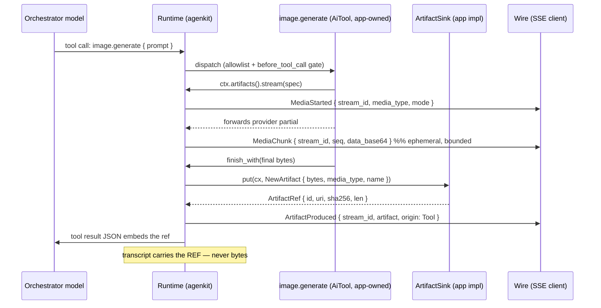

# RFC-122: AI-produced artifacts — implementor-owned capture and image output streaming

**Status:** Draft
**Crates:** `pocopine-agenkit` (`ArtifactSink`, `AiContext`, runtime, loop), `pocopine-agenkit-core` (`ArtifactRef`, `AgentWireEvent`, redaction), `pocopine-agenkit-oai` / `pocopine-agenkit-qwen` (image-output response mapping), catalog
**Relates to:** model-caps (PR #270, input-image media + work-or-loud gates), W7 session layer (`BlobStore`, `$session_blob`), RFC-093 §D5/§D10, agenkitty `docs/design/thread-filesystem.md` §7/§11 (prior art), `pocopine-storage` `StorageBackend` (trait template)

## Summary

An agent tool cannot hand the user an image today, and a model that *generates*
images cannot be used at all. Both failures are by construction, and both end at
the same missing piece: the framework has no contract for "the AI produced
bytes; put them somewhere the application owns, and give everyone — model,
wire, transcript — a small reference instead."

This RFC adds that contract:

1. **`ArtifactSink`** — a trait the embedding application implements to capture
   AI-produced bytes into *its* storage, returning an **`ArtifactRef`** it
   minted. The framework never stores artifact bytes and never invents a
   serving scheme; both are implementor authority.
2. **A tool surface** — `ctx.artifacts().put(...)`, so any `AiTool` can produce
   an artifact without protocol changes.
3. **A wire contract** — three additive `AgentWireEvent` variants
   (`MediaStarted`, `MediaChunk`, `ArtifactProduced`) so clients get a typed,
   streamed signal. One byte-stream shape covers two declared modes:
   replace-semantics **previews** (progressive image fidelity) and bounded
   append-semantics **chunks** (audio/video live view), plus a group
   correlator for multi-output generations.
4. **Generation as a tool, streaming included** — a streaming capture handle
   (`ctx.artifacts().stream(...)`) so an app-owned tool wrapping any
   generative API drives the same stream. Model-native image output is a
   **backstop, deliberately not the primary path** (§4): the catalog gains an
   `image_output` flag and the runtime a never-drop capture rule, but
   response-side wire mapping is deferred until a shipped wire can actually
   carry it.

Artifacts travel as **references, not payloads**. Bytes cross exactly one
boundary — into the sink — and everything else (model transcript, wire events,
session log) carries a ref of ~100 bytes. The one deliberate exception is the
ephemeral live-view stream (previews / bounded byte chunks), which is
size-bounded and never persisted.

## The problem, with the receipts

A tool returns `serde_json::Value`. That value takes two paths, and both
destroy an image:

- **To the model** it is stringified into a `tool`-role *text* message
  (`loop_core.rs:324`). Base64 image bytes become text the model cannot see as
  pixels — at catastrophic token cost. Constructing a `ContentPart::Media` in a
  tool or assistant message instead is a hard error at the provider boundary:
  `ensure_media_support` rejects media outside user messages
  (`provider.rs:180`, "assistant/tool media has no wire mapping yet").
- **To the client** it rides `AgentWireEvent::ToolCompleted { output }` through
  the §D10 `Redactor`, which caps every JSON string at 2048 bytes
  (`pocopine-agenkit-core/src/redact.rs`). A ~100 KB base64 image is truncated
  to garbage. This cap is correct — it exists so tool payloads cannot flood or
  exfiltrate through the wire — which is exactly why the fix is not "raise the
  cap."

Model-generated images are worse than lossy: they are unreachable. The provider
wires map `MediaPart` on the **request** side only (user-message image input,
PR #270); no wire parses image output from a response, and the catalog has no
flag to say a model produces images. A host that points an `AgentSession` at an
image-generation model gets nothing, silently.

Meanwhile the *shipped* workaround in agenkitty shows both the demand and the
shape of the answer. `pdf.write` stores bytes through an app service, then
returns `[name](ak:file/<key>)` markdown in its tool output
(`agenkitty/src/server/assistant/tools/pdf_write.rs:150`); the model copies the
link into prose; the client lifts `ak:file/...` links into file cards and
renders images in a lightbox from a signed URL. It works — because a textual
reference survives every projection that drops structured parts — but it is an
untyped convention that depends on the model cooperating, is invisible to the
event stream, and is unavailable to any other embedder of the framework.

## Prior art this design copies deliberately

- **`BlobStore` + `$session_blob`** (`pocopine-agenkit/src/server/session/blob.rs:42`):
  a framework trait for implementor-owned bytes, plus a *reserved reference
  shape* rehydrated on read. Artifact capture is the same move one level up —
  semantic ("a deliverable the user should see") instead of mechanical ("this
  payload is big").
- **`pocopine_storage::StorageBackend`** (`pocopine-storage/src/server.rs:451`):
  the trait-shape template. Defaulted methods return `unsupported`, a
  `capabilities()` method negotiates, and the app wraps a provider backend to
  layer its own metadata (`agenkitty .../files/api/storage.rs:336`).
- **`AgentThreadStore` conformance** (`agenkitty .../thread/repository/store_contract.rs:27`):
  an executable suite the implementor runs against its own impl. `ArtifactSink`
  ships one.
- **agenkitty's thread-filesystem spec** (`docs/design/thread-filesystem.md`
  §7.2, §11): `tool_output` is already a first-class artifact origin there,
  with provenance = (owner, producing thread, durable tool invocation, output
  ordinal), and the rule that the framework never accepts a raw backend
  path/object locator as authority. This RFC adopts that vocabulary rather than
  inventing a parallel one.

## Design overview



A tool with nothing to stream just calls `ctx.artifacts().put(...)` — one
`ArtifactProduced`, no preview prelude. The model-native backstop (§4) is the
same tail of the picture with the runtime itself standing where the tool does.

## §1 The `ArtifactSink` contract

Client-safe shapes live in `pocopine-agenkit-core` (the ref rides the wire);
the trait is server-side in `pocopine-agenkit`.

```rust
// pocopine-agenkit-core
/// A reference to AI-produced bytes captured in implementor storage. Small by
/// contract: every field is wire- and transcript-safe.
#[derive(Clone, Debug, PartialEq, serde::Serialize, serde::Deserialize)]
pub struct ArtifactRef {
    /// Implementor-minted opaque id, stable for the artifact's lifetime.
    pub id: String,
    /// Implementor's reference scheme (e.g. agenkitty's `ak:file/<key>`),
    /// suitable for embedding in prose/markdown. `None` when the sink has no
    /// addressing scheme; consumers must then resolve by `id` out of band.
    pub uri: Option<String>,
    /// IANA media type of the stored bytes.
    pub media_type: String,
    /// Optional display name.
    pub name: Option<String>,
    /// SHA-256 (hex) of the stored bytes (via `pocopine-crypto`).
    pub sha256: String,
    /// Byte length of the stored bytes.
    pub len: u64,
}
```

```rust
// pocopine-agenkit (server)
pub struct NewArtifact {
    pub media_type: String,
    pub name: Option<String>,
    pub bytes: Vec<u8>,
}

/// Provenance the framework attaches to every capture. Mirrors the
/// thread-filesystem group identity: who, which thread, which producer.
pub struct ArtifactCx {
    pub principal: Principal,
    pub thread: Option<ThreadId>,
    pub origin: ArtifactOrigin,
}

pub enum ArtifactOrigin {
    /// Produced by a tool during dispatch.
    Tool { call_id: String, tool_id: String, output_ordinal: u32 },
    /// Produced by the model itself (image output).
    Model,
}

#[non_exhaustive]
#[derive(Clone, Debug, Default)]
pub struct ArtifactSinkCapabilities {
    /// Largest artifact the sink accepts, if bounded.
    pub max_bytes: Option<u64>,
}

pub trait ArtifactSink: Send + Sync {
    fn capabilities(&self) -> ArtifactSinkCapabilities {
        ArtifactSinkCapabilities::default()
    }

    /// Store the bytes under the caller's authority and mint a reference.
    fn put<'a>(&'a self, cx: &'a ArtifactCx, artifact: NewArtifact)
        -> AgenkitFuture<'a, ArtifactRef>;
}
```

Contract semantics:

- **The sink owns identity and addressing.** `id` and `uri` are minted by the
  implementor; the framework never parses them, never derives them, and never
  accepts a raw backend path as authority (thread-fs §11 discipline).
- **Digest honesty.** The returned `sha256`/`len` MUST match the stored bytes;
  the conformance suite checks this. Content-addressed dedup is the sink's
  choice, not a requirement — a re-`put` of identical bytes under the same
  `ArtifactCx` MUST succeed (idempotent or a fresh version, but never an
  error).
- **Principal scoping is the sink's job**, exactly as it is for
  `SessionStore`: the framework hands it the `Principal` (§D5) and the sink
  enforces its own ownership rules.
- **Bytes flow one way.** There is deliberately no `get` on this trait. Reads
  happen through the implementor's own serving path (signed URLs, app routes).
  A retrieval method would turn the framework into a byte proxy and reopen the
  §D10 wire-flood problem the ref shape exists to close.

Shipped impls, per the traits-not-bundled-stores doctrine: `MemoryArtifactSink`
(tests/dev) and `BlobArtifactSink` (delegates bytes to any W7 `BlobStore`,
minting `artifact:<sha256>` uris) — enough to run examples without an app.

A `verify_artifact_sink(&dyn ArtifactSink)` conformance suite ships in the same
module (template: `verify_owner_semantics`): digest/length honesty, oversize
rejection when `max_bytes` is declared, idempotent re-put.

## §2 The tool surface: `ctx.artifacts()`

```rust
impl AiContext {
    /// The artifact capture surface, or a loud config error if the host wired
    /// no sink. Tools that can degrade should treat the error as "artifacts
    /// unavailable" and fall back to text.
    pub fn artifacts(&self) -> AgenkitResult<Artifacts>;
}

/// How a stream's chunks relate to each other and to the final bytes (§5).
pub enum MediaStreamMode {
    /// Each chunk is a COMPLETE low-fidelity encoding that REPLACES the
    /// previous one (progressive-fidelity image partials). Chunks are never
    /// the authoritative bytes; `finish_with` is required.
    Preview,
    /// Chunks CONCATENATE into the byte stream in order (audio/video live
    /// view). `finish()` may use the concatenation as the final bytes.
    Append,
}

pub struct MediaStreamSpec {
    pub media_type: String,
    pub name: Option<String>,
    pub mode: MediaStreamMode,
}

impl Artifacts {
    pub async fn put(&self, artifact: NewArtifact) -> AgenkitResult<ArtifactRef>;

    /// Open a streamed capture: live chunks out, one final artifact in.
    /// Emits `MediaStarted` (with a runtime-minted `stream_id`) immediately,
    /// and drives the rest of the §3 stream without the tool ever touching
    /// the event surface.
    pub fn stream(&self, spec: MediaStreamSpec) -> AgenkitResult<MediaStream>;

    /// Open a multi-output group (n-variant sampling, storyboard batches):
    /// streams and puts opened through it share a runtime-minted group id
    /// and auto-increment their index. `expected` is the declared output
    /// count when the producer knows it up front (UI placeholders), a hint
    /// rather than a promise (§5.3).
    pub fn group(&self, expected: Option<u32>) -> ArtifactGroup;
}

impl MediaStream {
    /// Emit one live chunk under the stream's declared mode. Ephemeral; a
    /// chunk over the mode's byte bound (§5) is dropped with a warning,
    /// never truncated.
    pub fn chunk(&mut self, data: &[u8]) -> AgenkitResult<()>;

    /// Capture explicit authoritative bytes through the sink and emit
    /// `ArtifactProduced`. Valid in both modes; required in `Preview`.
    pub async fn finish_with(self, bytes: Vec<u8>) -> AgenkitResult<ArtifactRef>;

    /// `Append` mode only: capture the concatenation of the appended chunks
    /// as the final bytes. Errors in `Preview` mode (previews are not the
    /// artifact).
    pub async fn finish(self) -> AgenkitResult<ArtifactRef>;

    /// Abandon the stream: no artifact event is emitted; consumers discard
    /// its chunks when the tool completes/fails without a matching
    /// `ArtifactProduced`. Dropping the handle without finishing is `abort`.
    pub fn abort(self);
}
```

This is how a tool wrapping any streaming generative API delivers the same
live UX native model streaming would: an image tool forwards each
progressive partial as a `Preview` chunk and hands the final bytes to
`finish_with`; a video/audio tool (a Seedance-class wrapper) appends real
byte chunks and calls `finish`. The generation *prompt* stays visible in the
tool's `args`, gated by `before_tool_call`, and metered as its own call —
none of which a model-native generation would pass through.

`Artifacts` is constructed per tool call by the dispatcher, carrying the
`ArtifactCx` (principal, thread, `ArtifactOrigin::Tool` with the live call id
and an auto-incremented output ordinal) **and** an event emitter, so every
successful `put` surfaces as `ArtifactProduced` on the firehose without tool
cooperation. The tool then embeds the ref in its normal JSON output — no
change to `AiTool`, no change to the tool-result message shape, nothing new
for `ensure_media_support` to reject.

For structured embedding, the reserved shape `{"$artifact": { ...ArtifactRef
}}` is defined (sibling of `$session_blob`): a JSON object with exactly that
single key is an artifact reference. Tool payloads must not use a top-level
`$artifact` key for anything else. Clients MAY lift it; the prose convention
(`[name](uri)` in output text, as `pdf.write` does today) remains valid and is
the recommended belt-and-braces, since a textual ref survives every text-only
projection.

### §2.1 Artifacts as tool inputs: chaining specialized models

Refs make AI-produced bytes *addressable*, and addressable output is input:
an artifact produced in one turn is a handle the orchestrator can pass to a
specialized generator in the next — an image artifact into an image-to-video
tool (Seedance-class models), a generated image back into an editing tool, a
rendered chart into a document tool. Whether the consuming side is a plain
`AiTool` or an app-composed subagent behind one is orchestration the
framework does not model (subagent composition is app territory, RFC-118);
the artifact contract only cares that the ref is the handle.

- **Passing is just arg passing.** The model already holds the ref — it saw
  it in the producing tool's output and can cite its `uri` in prose — so
  "animate the image you just made" is an ordinary JSON argument, visible in
  `args`, gated by `before_tool_call`, allowlisted like everything else.
- **Resolution is the implementor's, by design.** The framework never
  dereferences a ref — `ArtifactSink` has no `get` (§1). The app tool
  wrapping the specialized model reads bytes from the app's own storage via
  the app's own scheme (`ak:file/<key>` → files plane), enforcing the same
  principal scoping the sink applied at capture. A framework-level resolver
  would turn agenkit into a byte broker and reopen the boundary §1 closed.
- **Origins compose.** A model-backstop artifact (§4.1) chains into a
  consuming tool exactly like a tool-produced one; the ref shape is the
  contract, not the producer. And the consumer is usually also a producer —
  the Seedance tool captures its video through the same sink, so chains of
  arbitrary depth never put bytes on the transcript or the wire.

With the §9 companion (`prompt(Content)`), the same handle loops back a third
way — as user-message image media to a vision orchestrator — closing the
generate → inspect → regenerate loop.

## §3 The wire contract

Three additive variants on `AgentEvent` (trusted firehose) and
`AgentWireEvent` (redacted wire). Additivity is safe by construction:
`AgentWireEvent` is `#[non_exhaustive]` with a `#[serde(other)] Unknown`
decode fallback, and agenkitty's event fold already ends in `_ => {}`
(`agenkitty/src/app/agent.rs:1328`).

```rust
/// A streamed media capture began (a tool's `MediaStream`, or the model
/// backstop of §4).
MediaStarted {
    /// Correlates this stream's chunks and its terminal artifact event.
    stream_id: String,
    media_type: String,
    name: Option<String>,
    /// How chunks compose: `preview` (replace) or `append` (§5). Declared
    /// once per stream; a consumer's fold is chosen here.
    mode: WireMediaMode,
    /// Multi-output correlation (§5.3), absent for a lone output.
    group: Option<MediaGroupRef>, // { id: String, index: u32, expected: Option<u32> }
},
/// One live chunk of a streamed capture. **Ephemeral** — never persisted,
/// exactly like `AssistantDelta`. Its meaning follows the stream's declared
/// mode: a `preview` chunk is a COMPLETE low-fidelity encoding replacing the
/// previous one; an `append` chunk concatenates onto its predecessors.
MediaChunk {
    stream_id: String,
    /// Monotonic per stream_id from 0.
    seq: u32,
    /// Chunk payload, base64. Bounded per mode (§5).
    data_base64: String,
},
/// Terminal, persisted: AI-produced bytes were captured into the
/// implementor's sink. The one artifact event for BOTH origins.
ArtifactProduced {
    /// Present when a chunk stream preceded this (`stream` or the model
    /// backstop); absent for a plain `put`.
    stream_id: Option<String>,
    artifact: ArtifactRef,
    /// Mirrors `MediaStarted.group` so a consumer that missed the start
    /// still slots the artifact (§5.3).
    group: Option<MediaGroupRef>,
    origin: WireArtifactOrigin, // Model | Tool { id, tool }
},
```

The streaming symmetry the contract already has, extended:

| | ephemeral (live view) | terminal (persisted) |
|---|---|---|
| text | `AssistantDelta` (append) | `AssistantText` → text part |
| media | `MediaChunk` (mode-declared: replace or append) | `ArtifactProduced` → ref |

Redaction (§D10): `ArtifactRef` string fields (`id`, `uri`, `name`,
`media_type`) pass through `Redactor::text_to_limit` with the standard caps —
they are small by contract, so this is enforcement, not ceremony.
`MediaChunk.data_base64` is exempt from the JSON string cap and from the
secret classifier: it is framework-generated binary payload with its own byte
bounds (§5), not tool/model text. The exemption is per-field and bounded, not
a policy hole.

## §4 Model-native image output: a backstop, deliberately not the primary path

The primary integration for image *generation* is an app-owned tool (e.g.
`image.generate`, the `pdf.write` pattern) using §2's `stream`. That is
a design position, not an accident of sequencing:

- **It decouples two model choices.** Model-native output couples "best
  orchestrator" to "can draw" — and no frontier orchestrator model draws,
  while no image model runs a good agent loop. A tool lets any `tools: true`
  orchestrator drive any image model, including ones with no chat wire at all
  (dedicated endpoints, local diffusion).
- **It inherits the entire §D5/§D10 machinery for free.** Allowlist,
  `before_tool_call` approval (image generation costs money and carries
  content-policy risk), error-feedback-and-retry instead of a failed turn,
  per-call usage provenance, and an inspectable/replaceable prompt in the
  tool's `args`. Model-native generation bypasses every one of these.
- **No shipped wire can carry it today.** The OAI crate targets
  chat-completions-shaped gateways (which do not emit images), DashScope's
  image models live on a separate async endpoint, and the anthropic wire has
  no image output. Response-side mapping would be speculative plumbing with
  zero grounding providers — colliding with this RFC's own non-goals.

What model-native support would add over the tool — single-generation
text/image interleaving with full conversational context (Gemini-style
editing loops) — is real, and is exactly what the **deferred** part below
picks up when a wire exists to ground it.

### §4.1 What ships now (the backstop)

**Catalog.** Models gain `image_output: bool`, alongside `vision`/`tools`.
Consulted, not just stored:

- Request-time gate (mirrors the vision gate in `ensure_media_support`): a
  resolved model **positively** marked `image_output: true` with **no
  `ArtifactSink` configured** is a config error before the first provider
  call — "model `x` produces images but no artifact sink is configured; wire
  one with `.artifact_sink(...)`". Unlisted aliases pass; the capture-time
  backstop below still protects them.
- Capture-time backstop: any wire that surfaces inline media in an assistant
  response captures through the sink if one exists, and otherwise fails the
  turn loudly. Silently dropping generated bytes is never an option
  (work-or-loud, PR #270 doctrine).

**Capture rule.** When a model step's assembled response contains media parts
(inline `data_base64`, runtime-internal only — never persisted, never
emitted, never re-sent), the runtime — before persisting the assistant
message or emitting `AssistantText` — routes each one through the sink
(`ArtifactOrigin::Model`) and **replaces it in the message content** with the
persisted ref form:

```rust
ContentPart::Media(MediaPart {
    media_type,                  // from the provider
    url: Some(ref.uri or "artifact:<id>"),
    data_base64: None,           // bytes live in the sink, full stop
    name: ref.name,
})
```

**Replay.** History containing url-form assistant media must be re-sendable.
`ensure_media_support`'s rule evolves by one clause: assistant/tool media with
*inline bytes* remains a hard error (unchanged — no wire accepts it), while a
**url-only assistant media part is mapped to a deterministic text placeholder**
at wire build: `[generated image: <name> (<uri>)]`. This is a documented
transformation, not a silent drop: the model keeps a stable handle it can cite
in later prose, and the transcript keeps replaying losslessly from the user's
point of view. A future wire that genuinely accepts assistant image input can
declare it via a capability and receive the real part; nothing in the
persisted shape has to change.

### §4.2 What is deferred until a wire grounds it

Response-side wire parsing of image output (OAI/Qwen adapters) and the
`LoopObserver` media-stream plumbing that would let the *model's* stream
drive `Preview` chunks. When a provider wire this workspace ships can
genuinely interleave text and image output, this section graduates: the
capture rule, persistence shape, replay mapping, and §3 wire events above are
already the contract, so graduating is wiring work, not a redesign. Providers
without partial streaming will emit zero chunks and degrade to
`MediaStarted` → `ArtifactProduced`, which clients must already handle.

## §5 Streaming semantics

These rules bind every producer identically — a tool's `MediaStream` today,
the model backstop when §4.2 graduates.

### §5.1 Shared rules (both modes)

- **Ordering.** For one `stream_id`: `MediaStarted` strictly precedes any
  `MediaChunk`; `seq` is monotonic from 0; `ArtifactProduced` (with that
  `stream_id`) is last. `stream_id` is the correlation key.
- **Interleaving.** Chunks of different streams may interleave with each
  other and with text deltas — concurrent generations are legal. Placement
  in prose is not a wire concern: the persisted assistant `Content` keeps
  parts in final order (§6), and a live consumer folds events in arrival
  order.
- **Abort.** A turn aborted mid-generation emits no `ArtifactProduced`; the
  sink is not called; chunks already emitted are the consumer's to discard.
  (`Stopped { reason: Aborted }` is already the terminal signal.)
- **Persistence.** Chunks are never written to the session log, mirroring
  `AssistantDelta`'s documented ephemerality. An older client, or one that
  ignores chunks entirely, sees exactly the pre-RFC behavior plus one final
  typed event. The live view is a courtesy; the artifact is the source of
  truth.

### §5.2 The two modes

- **`Preview` (replace).** Each chunk is a complete low-fidelity encoding; a
  consumer renders the highest `seq` and discards the rest. Matches
  progressive-fidelity image partials, and makes a dropped preview lossless.
  Bound: a chunk over `MAX_PREVIEW_CHUNK_BYTES` (1 MiB base64) is dropped
  with a `tracing` warning, not truncated — a truncated image is garbage.
- **`Append` (concatenate).** Chunks concatenate in `seq` order into the
  byte stream; a consumer may begin progressive playback (audio, video).
  Bounds: `MAX_APPEND_CHUNK_BYTES` (256 KiB base64) per chunk, plus a
  per-stream ephemeral budget `MAX_APPEND_STREAM_BYTES` (8 MiB default,
  host-tunable) after which further chunks are dropped (warn) and consumers
  wait for the ref. The agent wire is deliberately **not** a media-delivery
  protocol: a 100 MB video belongs on the implementor's serving surface
  (a progressive URL behind the `ArtifactRef`), not on base64 SSE. The
  budget keeps the live view honest for short media without turning the
  event stream into a CDN.

### §5.3 Multi-output generations

Some producers emit several outputs per invocation — n-variant image
sampling, storyboard batches, a model interleaving multiple images with
prose. The contract composes this from primitives already defined instead of
inventing a multiplexed stream object:

- **One stream per output.** Every output gets its own `stream_id` (or a
  plain `put` when there is nothing to stream). "Multi-image stream" on the
  wire is `stream_id` interleaving, nothing more.
- **Grouping.** Outputs of one invocation share a
  `MediaGroupRef { id, index, expected }`: a runtime-minted group id, this
  output's dense index from 0 (matching `ArtifactOrigin`'s
  `output_ordinal`), and the declared count when the producer knows it up
  front — `n = 4` sampling lets a UI render four placeholders immediately.
  `expected` is intent, not promise: one variant can fail and its stream
  abort while its siblings complete, so a consumer treats the group as done
  when the producing tool call completes, not when `expected` is reached.
  `ArtifactProduced` mirrors the group, so a consumer that missed
  `MediaStarted` still slots the artifact correctly.
- **Interleaved text-and-image output** (Gemini-style storybooks, via the §4
  backstop when it graduates) needs nothing extra: each image is one stream
  opened and finished in sequence between text deltas, and the persisted
  message keeps every part at its position (§6).

## §6 Persistence and replay

Artifact bytes never enter the session log, so the `ExternalizingSessionStore`
threshold is never in play for them — the log stays small *by shape*, not by
externalization:

- **Tool-origin refs** ride where tool output already rides: inside the
  stringified tool-result message and the persisted `ToolCompleted` record.
- **Model-origin refs** persist as url-form `MediaPart`s in the assistant
  `Message` (§4), which round-trips through `agent_records.data` as opaque
  JSONB — no store migration anywhere.

One consequence is inherited, not introduced: `Content::as_text()` skips media
parts, and text-only transcript projections (agenkitty's `display_turns`,
`transcript.rs:11`) will not surface a model-origin image on reload until they
learn to project media parts or lift `$artifact` refs. The prose convention
covers tools today; for model output this is a **required consumer change**,
called out in §9. The framework-side guarantee is that the ref is durably
*there*, in a stable documented shape.

## §7 Security (§D10 / §D5)

- **Principal-scoped capture.** Every `put` carries the turn's `Principal`;
  an anonymous flow captures as anonymous and the sink applies its policy.
- **No byte egress through the framework.** The wire never carries stored
  artifact bytes; it carries refs and bounded ephemeral previews. Serving
  bytes — auth, signing, expiry — is entirely the implementor's surface,
  which is where credentials and ownership checks already live.
- **Refs are size-honest.** All `ArtifactRef` fields pass the standard
  redactor caps; a sink minting a pathological multi-KB uri gets truncated at
  the wire, and the conformance suite flags it earlier.
- **Reserved shapes are verified, not trusted.** `$artifact` follows the
  `$session_blob` rule: exact single-key match, and consumers treat contents
  as data. Nothing in a ref is executable or resolved by the framework.
- **Previews and visual secrets.** The secret classifier is text-shaped and is
  not run on image payloads; a model can draw a secret it was shown. This is
  an accepted, documented residual risk — the same one `attachment.read`
  already carries in text form — not a new class.

## §8 Failure modes (work-or-loud)

| Condition | Behavior |
|---|---|
| `image_output` model resolved, no sink wired | Config error at request build, names `.artifact_sink(...)` |
| Provider returns an image, catalog unknown, no sink | Turn fails loudly at capture; never silently dropped |
| `sink.put` fails (tool origin) | Follows `ToolErrorMode` — fed back to the model as the tool's error |
| `sink.put` fails (model origin) | Turn fails; generated bytes without capture is data loss |
| `NewArtifact.bytes` exceeds declared `max_bytes` | Sink errors before storing; surfaced per origin as above |
| Chunk exceeds its mode's byte bound (§5.2) | Dropped + `tracing` warn (lossless: chunks are ephemeral) |
| `Append` stream exceeds its ephemeral budget | Further chunks dropped (warn); the final artifact is unaffected |
| `MediaStream` aborted / dropped without finishing | No `ArtifactProduced`; consumers discard chunks for that `stream_id` |
| `finish()` on a `Preview`-mode stream | Error — previews are never the authoritative bytes; use `finish_with` |
| Tool calls `ctx.artifacts()` with no sink | `AgenkitResult` error the tool may catch to degrade to text |
| Inline-bytes media in assistant/tool message at request build | Hard error (unchanged from PR #270) |
| Url-form assistant media at request build | Deterministic text placeholder per wire (§4, documented) |

## §9 Adoption path

**agenkitty** (the reference implementor, not a dependency of this RFC):

1. Implement `ArtifactSink` over the existing files plane (the same service
   `pdf.write` uses), minting `ak:file/<key>` uris — rendering then comes free
   from the shipped markdown lifting, file cards, and lightbox. Graduating the
   impl onto the thread-filesystem publication ledger
   (`reserve → bytes_verified → published`) is an internal upgrade invisible
   to the framework contract.
2. Add match arms for the three new events in `app/agent.rs` (currently
   `_ => {}`); render `MediaChunk`s per their mode and swap in the resolved
   artifact on `ArtifactProduced`.
3. Extend the reload projection (`display_turns`) to surface url-form media
   parts and `$artifact` refs — closing the "streams but vanishes on reload"
   gap for model-origin images.
4. Ship image generation as an app tool (`image.generate`, the `pdf.write`
   pattern) over the app's chosen image API, driving a `Preview`-mode
   `stream` for progressive partials. A video tool (a Seedance-class
   wrapper) is the same pattern in `Append` mode. An agent skill can layer
   usage guidance on top of either; the executable capability itself is the
   tool.
5. Migrate `pdf.write` to `ctx.artifacts().put(...)`, keeping its markdown
   link output verbatim.

**Companion change (recommended, separately scoped):** widen
`AgentSession::prompt` (`runtime.rs:924`) from `String` to
`impl Into<Content>` so user-side image *input* — already supported by every
wire and validated by `ensure_media_support` — becomes reachable through the
session runtime. With both landed, a captured image artifact can be looped
back to a vision model as user-message media in a later turn.

## Non-goals

- **Assistant `MediaPart` as a wire input format.** No provider accepts it;
  the placeholder mapping in §4 is the contract until a wire declares
  otherwise.
- **Media delivery and playback protocols.** `Append` mode is a bounded live
  view, not HLS/DASH; bulk delivery of large media is the implementor's
  serving surface, reached through the `ArtifactRef`. (Audio/video *capture*
  is in scope via `Append` mode — grounded by the §2.1 tool path, which needs
  no provider wire.)
- **A framework-shipped `image.generate` tool.** Which image API to call,
  at what cost, under which policy is app territory; §9 shows the pattern.
- **Artifact retrieval, GC, quotas, or serving** — implementor surface.
- **A plugin/registry system for sinks.** One trait, one builder method
  (house rule: small enumerable surfaces).
- **App UI work** beyond the adoption notes above.

## Open questions

1. Should `ArtifactRef.uri` be required rather than `Option`? Headless sinks
   argue for optional; every wire consumer then needs an id-resolution story.
   Current position: optional, with the conformance suite warning when absent.
2. `Append`-mode defaults: are 256 KiB chunks and an 8 MiB per-stream budget
   the right bounds? Both are host-tunable; tune against the first real
   video/audio tool before freezing the defaults. (Multi-output ordinals,
   previously open here, are resolved by §5.3's `MediaGroupRef`.)
3. Should the runtime auto-append a prose line (`[generated image: ...]`) to
   `AssistantText` for model-origin artifacts, so text-only consumers see
   *something* without projection changes? Current position: no — it forges
   model output; the typed event and the persisted ref are the contract.
4. Should `Artifacts` grow a server-side read (`open(ref) -> bytes`) so a
   framework-portable consumer tool could dereference without app knowledge?
   Current position: no — consuming tools are app tools and resolve their own
   scheme (§2.1); revisit only if a real portable tool materializes, and even
   then as a separate capability the sink opts into, never a required method.
