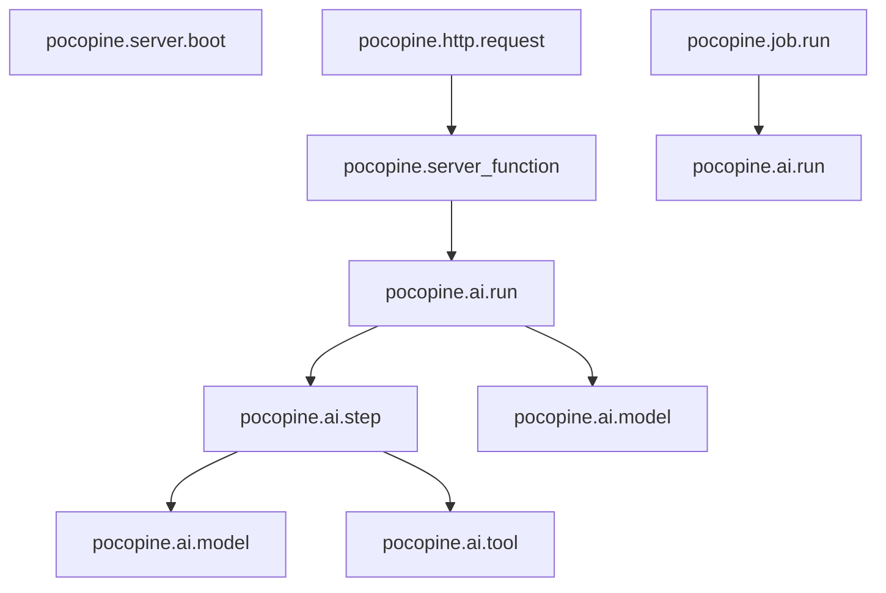

# RFC-123: Span space — one trunk of work every event hangs from

**Status:** Implemented — Phases 1–3 (server trunk, agenkit spans, cross-tier link) on `feat/rfc-123-span-space`; Phase 4 (long-lived streams, job enqueue links) open
**Crates:** `pocopine-observe` (span-name and field constants), `pocopine-server` (`pocopine.http.request`, optional `otel` feature for parent linking), `pocopine-macros` (`pocopine.server_function` fields), `pocopine-jobs` (`pocopine.job.run`), `pocopine-agenkit` (`pocopine.ai.*`), `pocopine-logging` (fills `ObserveContext.trace_id`, feature wiring), `pocopine-core` (Phase 3 only: `traceparent` on server-function fetches)
**Relates to:** RFC-069 (observability — this is the "first-class route and server-function instrumentation points" and "OpenTelemetry adapter" phases it deferred), RFC-093 (agenkit — the `TraceEvent` stream stays the stable schema; spans are added beside it), RFC-119 (authority is explicit — a span never carries a principal, only a hash)

## Summary

pocopine emits ~270 `tracing` events and exactly one span. Events carry a
copied `request_id` to correlate; nothing nests. That works for grep and is
nearly useless for a trace backend: `tracing-opentelemetry` attaches events to
the *current span* and drops events that have none, so with the `otlp` feature
on, the backend sees root-level `pocopine.server_function` spans and nothing
else — no HTTP layer, no jobs, no boot, no agenkit steps.

This RFC defines the **span space**: a closed set of span names under one
target, a field-naming rule, and the rule for which crate opens which span.
Spans exist for **topology and timing**. Events remain the stable schema
(`ObservedEvent`, the agenkit `TraceEvent` stream) and do not change shape.

The load-bearing decision is the **trunk**. Every server-side unit of work
hangs from one of three roots — an HTTP request, a job run, or a server boot —
and the agenkit tree hangs from whichever of those is current. Once the trunk
exists, every existing event lands inside a span for free, `request_id`
becomes a span field instead of a copied one, and the OTLP export becomes
useful without touching any event.

## 1. What exists today

```
HTTP request ──► request_event_middleware        no span; stamps RequestId(u64), emits Http* hook EVENTS
                    └─► #[server] handler ──────► info_span!("pocopine.server_function")   the only span
                            ├─ "server function completed"          event, inside the span
                            └─ agenkit ──► TraceEvent{run_id, step_id, parent_step_id} ──► EVENTS
jobs ──► "job started" / "job completed"           events, no span
boot ──► server_boot_* ObservedEvents              events, no span
```

- The span at `crates/pocopine-macros/src/lib.rs` (`#[server]` expansion) has
  `function`, `function_path`, `route` — and not `request_id`.
- `crates/pocopine-server/src/observability.rs` opens no span; it is hook-gated
  and copies `request_id` onto each event.
- `pocopine-agenkit-core` rebuilds a tree (`TraceSpan`) from `TraceEvent`s
  after the fact. Parenting is a field, not a span relationship.
- `ObserveContext.trace_id` exists in the schema and is never populated.
- The wasm `ConsoleLayer` implements `enabled` + `on_event` only; a client span
  would be silently ignored.
- No `traceparent` is read or written anywhere.

None of this is wrong. It is the event-first slice RFC-069 shipped, and the
RFC listed spans as a later phase. This is that phase.

## 2. The span space (binding)

### 2.1 One target, one grammar

Every span carries `target: "pocopine.trace"` (the existing constant
`pocopine_observe::TRACE_TARGET`). Span names are

```
pocopine.<domain>.<unit>
```

lowercase, `snake_case`, `domain` = the crate-ish area, `unit` = the thing
that starts and ends. Names are **constants in `pocopine-observe`**, next to
the target constants; a crate never spells a span name inline. The one
already-shipped name, `pocopine.server_function`, is kept as-is — renaming it
buys nothing and breaks anyone filtering on it.

### 2.2 The closed set

| Span | Opened by | `otel.kind` | Parent |
|---|---|---|---|
| `pocopine.server.boot` | `pocopine-server` `Server::serve` | internal | root |
| `pocopine.http.request` | `pocopine-server` request middleware | server | remote `traceparent` if accepted (§5.3), else root |
| `pocopine.server_function` | `#[server]` macro (exists) | internal | `http.request` |
| `pocopine.job.run` | `pocopine-jobs` worker, around one attempt | consumer | root (§10 links to the enqueuer) |
| `pocopine.ai.run` | `pocopine-agenkit` flow / agent `run()` | internal | whatever is current |
| `pocopine.ai.turn` | `pocopine-agenkit` conversational runtime, one turn | internal | whatever is current |
| `pocopine.ai.step` | `ctx.step`, `ctx.parallel`, `ctx.reduce`, `ctx.retrieve` | internal | `ai.run` / `ai.turn` / enclosing `ai.step` |
| `pocopine.ai.model` | `loop_core::run_model_step` | client | enclosing `ai.*` |
| `pocopine.ai.tool` | tool execution inside the agent loop | internal | enclosing `ai.*` |

Adding a name means adding a row here and a constant in `pocopine-observe`.
Long-lived streams (`pocopine-live` SSE, collab and sync sessions) are
deliberately absent from v1 — see §10.



### 2.3 Fields: OpenTelemetry names where one exists, `pocopine.*` otherwise

Span fields use the [OTel semantic-convention] name when the concept has one,
and a `pocopine.`-prefixed name when it does not. Bare names (`function`,
`route`, `request_id`) are **event** vocabulary and stay there; span fields
and event fields are separate namespaces in every formatter, so nothing
collides.

| Span | Fields at open | Recorded at close |
|---|---|---|
| `http.request` | `http.request.method`, `http.route` (from `MatchedPath`), `url.path`, `pocopine.request_id`, `session.id` (Phase 3, from the client header) | `http.response.status_code`, `otel.status_code`, `error.type` on 5xx |
| `server_function` | `pocopine.function`, `pocopine.function_path`, `http.route`, `pocopine.request_id` | `otel.status_code`, `error.type` (the existing `error_kind` classification) |
| `job.run` | `pocopine.job.name`, `pocopine.job.id`, `pocopine.job.attempt`, `pocopine.job.max_attempts`, `pocopine.job.backend` | `otel.status_code`, `error.type` |
| `ai.run` / `ai.turn` | `pocopine.ai.flow` (or agent id), `pocopine.ai.run_id`, `pocopine.ai.trace_id`, `enduser.pseudo.id` (hash, never the principal) | `otel.status_code`, `gen_ai.usage.input_tokens`, `gen_ai.usage.output_tokens` (turn total) |
| `ai.step` | `pocopine.ai.step_id`, `pocopine.ai.step_kind`, `pocopine.ai.step_name`, `pocopine.ai.parallel_group_id` | `otel.status_code` |
| `ai.model` | `gen_ai.operation.name` = `chat`, `gen_ai.provider.name`, `gen_ai.request.model`, `pocopine.ai.step_id` | `gen_ai.usage.input_tokens`, `gen_ai.usage.output_tokens`, `gen_ai.response.model` if reported, `otel.status_code` |
| `ai.tool` | `gen_ai.tool.name`, `pocopine.ai.step_id` | `otel.status_code`, `error.type` |

`pocopine.ai.step_id` is the **join key**: it is the same `StepId` the
`TraceEvent` stream carries, so a backend that has both the OTel tree and the
metering stream can line them up.

Fields recorded at close are declared `tracing::field::Empty` at open and
filled with `Span::record`. `otel.kind` / `otel.status_code` /
`otel.status_message` are the control fields `tracing-opentelemetry`
understands; the local formatters just print them.

[OTel semantic-convention]: https://opentelemetry.io/docs/specs/semconv/

### 2.4 Level and gating

Every span is `INFO`. The default filter `info,pocopine=debug` enables all of
them; an app that wants none sets `pocopine.trace=off` and pays one callsite
check per would-be span. Spans are **filter-gated, never hook-gated** — a span
is not a plugin event and never consults the hook registry. (§6 keeps the
existing zero-cost path for apps that install nothing.)

If a span is disabled by filter, `tracing` parents its would-be children to
the nearest enabled ancestor. That is the intended degradation, not a bug.

### 2.5 Privacy

A span carries only **structural** fields: ids, names, counts, durations,
classifications. Never a body, prompt, tool output, header value, or query
string. This is the same allowlist `pocopine-agenkit/src/server/observe.rs`
already applies to `TraceEvent::fields`; spans reuse it, they do not widen it.
`url.path` is the path only — never `url.query`.

### 2.6 No `#[instrument]` in framework crates

`#[tracing::instrument]` names the span after the function, sets the target to
the module path, and records every argument by `Debug`. All three break this
RFC: the name is outside the space, the target is outside `pocopine.trace`, and
the arguments are a privacy leak by default. Framework crates open spans with
`info_span!(target: TRACE_TARGET, NAME, ...)` and `.instrument(span)` on the
future, nothing else. App code may do what it likes.

## 3. The trunk

### 3.1 `pocopine.http.request`

`request_event_middleware` becomes:

```rust
let span = info_span!(target: TRACE_TARGET, HTTP_REQUEST,
    otel.kind = "server",
    http.request.method = %method,
    http.route = route_pattern.as_deref().unwrap_or(""),
    url.path = %path,
    pocopine.request_id = tracing::field::Empty,
    http.response.status_code = tracing::field::Empty,
    otel.status_code = tracing::field::Empty,
    error.type = tracing::field::Empty,
);
if span.is_disabled() && !has_http_hooks && !has_server_fn_hooks {
    return next.run(request).await;          // today's fast path, unchanged
}
let request_id = plugin::next_request_id();
span.record("pocopine.request_id", request_id);
request.extensions_mut().insert(RequestId(request_id));
// … existing Started emit …
let response = next.run(request).instrument(span.clone()).await;
span.record("http.response.status_code", response.status().as_u16());
// … existing Completed / Failed emit, then otel.status_code …
```

The hook emits are unchanged and now fire inside the span. With the `otel`
feature (§5.3) the span's parent is set from the incoming `traceparent` before
the future is instrumented.

### 3.2 `pocopine.server_function`

Exists. Gains `pocopine.request_id` (read from the `RequestId` extension the
middleware stamped), `otel.kind = "internal"`, and records `error.type` on the
failure arm from the existing `__pocopine_error_kind`. Nothing else in the
macro moves; the `pocopine.trace` events it already emits are now children.

### 3.3 `pocopine.job.run`

The worker wraps one attempt's future: `.instrument(job_span)`. The existing
`"job started"` / `"job completed"` events at `crates/pocopine-jobs/src/lib.rs`
are unchanged and now sit inside it.

### 3.4 `pocopine.server.boot`

Wraps plugin install through bind. `server_boot_started` / `server_listening`
/ `server_boot_failed` land inside it. Cheap, and it means the OTel export is
non-empty for a server that never receives a request.

## 4. Agenkit: spans beside the stream, not instead of it

The `TraceEvent` stream is the public schema (RFC-093 §D6/§D8), the metering
input, and what the flow-trace and metering tests assert on. It does not
change. Spans are opened at the same seams that already emit the paired
`*_started` / `*_completed` events:

| Seam | Today | Adds |
|---|---|---|
| `run_flow_inner`, `AgentRun::run` | `ai_flow_started/completed/failed` | `.instrument(ai.run)` |
| runtime turn | `pocopine.trace` events per turn | `.instrument(ai.turn)` |
| `FlowCtx::step`, parallel branches, reduce, retrieve | `ai_step_started/…` | `.instrument(ai.step)` |
| `run_model_step` | `ai_model_request/response/failed` | `.instrument(ai.model)`, usage recorded on the span |
| tool dispatch in the loop | `ai_tool_started/…` | `.instrument(ai.tool)` |

Because each branch of `ctx.parallel` is a future that already carries its
own `step_id`, `.instrument` gives it its own span parented to the group's
`ai.step` with no bookkeeping — the manual `parent_step` field stays for the
event stream and is not used for spans.

`AgentEvent` (the live firehose) is untouched; it is a client-facing stream and
spans never leave the server.

## 5. Correlation

### 5.1 `request_id` stays

The `u64` `RequestId` is the cheap in-process id; hooks and events keep it.
It also becomes `pocopine.request_id` on the two request-scoped spans, so
every event inside the request prints it via the span prefix (compact/pretty)
or the `span` object (JSON) **without** each emitter copying it.

### 5.2 `ObserveContext.trace_id` gets filled

With the `otlp` feature on, the logging plugin fills the already-existing
`ObserveContext.trace_id` slot from the current span's OTel context
(`OpenTelemetrySpanExt::context().span().span_context().trace_id()`). Without
`otlp` it stays `None`, as today. No new field, no schema bump.

### 5.3 Incoming `traceparent` — behind a feature, no protocol

Linking `http.request` to a remote parent needs `opentelemetry` types, which
`pocopine-server` does not have. Rather than a hook or a function-pointer slot
(RFC-069 §3.2 forbids runtime crates installing exporters; the memory rule
against plugin protocols for small surfaces applies), `pocopine-server` gains
an **optional `otel` feature** that pulls `opentelemetry` +
`tracing-opentelemetry` for the two lines that extract W3C `traceparent` /
`tracestate` and call `span.set_parent(cx)`. `pocopine-logging`'s existing
`otlp` feature enables `pocopine-server/otel`. Feature unification, no
runtime surface.

Whether the server **accepts** an incoming `traceparent` by default is open
(§10). Default proposed: accept. That is what every OTel HTTP instrumentation
does, and pocopine apps sit behind the same edges those do.

### 5.4 Outgoing: response header

Every `http.request` response gets `x-request-id: <pocopine.request_id>` when
the span is enabled. With `otlp`, also `traceparent` echoing the server's span,
so a browser devtools user can paste it into the backend. Two headers, both
opt-out via `ServerObservabilityConfig`.

## 6. Cost

| App configuration | Per-request cost added by this RFC |
|---|---|
| No observability plugin | none — the middleware is not installed; only `#[server]` fns have a span, as today |
| Plugin installed, `pocopine.trace=off` | one callsite `enabled` check (a relaxed load) |
| Plugin installed, default filter, fmt layer | one registry slab insert + field storage per span; field record on close |
| `otlp` | above + span export through the batch processor already configured |

The zero-cost path for plugin-free apps is preserved by construction: the span
lives in the middleware the plugin installs.

## 7. What changes on the wire (local formatters)

- **compact / pretty:** events inside a request gain the standard span prefix,
  e.g. `pocopine.http.request{http.request.method=POST http.route=/api/fn pocopine.request_id=42}:pocopine.server_function{…}: server function completed`.
- **json:** `span` and `spans` objects appear on every event inside a span
  (`tracing_subscriber`'s JSON formatter emits both by default).
- No `with_span_events`. Span open/close lines are **not** printed; the
  existing `*_completed` events already carry `duration_ms`. One canonical
  output, no knob.
- **wasm:** unchanged. No spans are opened in the browser in this RFC, and
  `ConsoleLayer` keeps ignoring them.

Worked examples of all of the above: Appendix A.

## 8. Non-goals (binding)

- **No span plugin surface.** No trait, hook, or registry for "adding spans";
  the set is the table in §2.2 and grows by PR.
- **No `#[instrument]`** in framework crates (§2.6).
- **No event changes.** No field renames, no removed events, no event moved
  onto a span. Existing log consumers see the same events plus a span prefix.
- **No spans in `pocopine-core` reactivity** — effects, scopes, and DOM
  patches are far too hot and run in wasm.
- **No replacement of the agenkit `TraceEvent` stream** or `TraceSpan` tree.
- **No metrics from spans** (no `tracing-opentelemetry` `MetricsLayer`);
  `pocopine.metric` is a separate target per RFC-069.
- **No client-side spans** in v1; §9 Phase 3 only injects a header.

## 9. Phases

1. **Server trunk.** `pocopine-observe` name/field constants; `http.request`,
   `server.boot`, `job.run` spans; `server_function` fields; `x-request-id`
   header. Tests: a capture `Layer` implementing `on_new_span` + `on_event`
   asserts the parent chain and that every existing `pocopine.trace` event has
   an ancestor span. No OTLP needed to test. `docs/guides/observability/logging-tracing.md` gains
   a "Spans" section: the table in §2.2 and the prefix shape in §7.
2. **Agenkit.** `ai.run` / `ai.turn` / `ai.step` / `ai.model` / `ai.tool` with
   `gen_ai.*` fields. Test: the OTel-shaped tree and the `TraceSpan` tree built
   from events agree on step ids and nesting for the flow-trace fixtures.
3. **Cross-tier link.** `pocopine-server/otel` feature, `traceparent` in and
   out, `ObserveContext.trace_id` filled. Client: `pocopine-core/src/fetch.rs`
   sends `x-pocopine-session: <hex>`, generated once per app boot (random
   bytes via `pocopine-crypto`, hex via `pocopine-codec`); the server records
   it as `session.id` on `http.request` and fills `ObserveContext.session_id`
   server-side. The browser sends **no** `traceparent`: without a client
   exporter every request would become the child of a span no backend ever
   receives (Appendix A.7).
4. **Later, same rules.** Long-lived streams (`pocopine-live` SSE, collab and
   sync sessions) as `server`-kind spans with per-message child spans; job
   enqueue → run links via a `traceparent` stored in `JobEnvelope`.

## 10. Open questions

- **Accept incoming `traceparent` by default?** Proposed yes (§5.3). The
  alternative is `accept_incoming_trace_context = false` unless set, which
  matches a "public edge" posture. The browser client never sends one
  (Phase 3), so this only affects edge and service-to-service callers.
- **Static assets and health routes.** The middleware wraps the whole router,
  so `/health` and asset requests get spans too. Skip when `MatchedPath` is
  absent? Skip a configurable prefix list? Or accept the noise and let the
  OTel sampler handle it.
- **Sampling.** Head-based via the standard `OTEL_TRACES_SAMPLER` env, read
  by `opentelemetry_sdk` — nothing pocopine-specific — unless someone needs
  route-aware sampling, which would be a new knob.
- **Job enqueue links** need a `JobEnvelope` schema change (Phase 4); is that
  a migration for the SQL backends or a nullable column added lazily?
- **`enduser.pseudo.id`** on `ai.run`: hash of the principal id, same hash as
  `ObserveContext.user_id_hash`. Confirm that hash is routed through
  `pocopine-crypto` and salted per service, or omit the field.

## Appendix A — Worked examples

All examples use one app: a `#[server] fn summarize_thread` that runs an
`#[ai_flow] fn summarize` which loads a thread, fans out two model calls over
chunks in `ctx.parallel`, and reduces them with a third call.

### A.1 One request, compact format, before and after

Today the two `pocopine.trace` events for the request are siblings with a
copied `request_id`:

```
2026-09-03T10:12:01.204Z  INFO pocopine.trace: server function completed function=summarize_thread function_path=app::api::summarize_thread route=/api/summarize_thread duration_ms=812 body_bytes=140
2026-09-03T10:12:01.205Z  INFO pocopine.trace: http_request_completed event_name=http_request_completed event_class=trace request_id=42 method=POST route=/api/summarize_thread status=200 duration_ms=815
```

After Phase 1 the same two lines carry their ancestry as the standard span
prefix. The events themselves are byte-identical after the `pocopine.trace:`
target:

```
2026-09-03T10:12:01.204Z  INFO pocopine.http.request{http.request.method=POST http.route=/api/summarize_thread url.path=/api/summarize_thread pocopine.request_id=42}:pocopine.server_function{pocopine.function=summarize_thread pocopine.function_path=app::api::summarize_thread http.route=/api/summarize_thread pocopine.request_id=42}: pocopine.trace: server function completed function=summarize_thread function_path=app::api::summarize_thread route=/api/summarize_thread duration_ms=812 body_bytes=140
2026-09-03T10:12:01.205Z  INFO pocopine.http.request{http.request.method=POST http.route=/api/summarize_thread url.path=/api/summarize_thread pocopine.request_id=42 http.response.status_code=200}: pocopine.trace: http_request_completed event_name=http_request_completed event_class=trace request_id=42 method=POST route=/api/summarize_thread status=200 duration_ms=815
```

Note the second line: `http.response.status_code` was `Empty` at open and
shows up once recorded. An app `tracing::warn!` fired from inside the server
function gets the same prefix without the app doing anything.

### A.2 The same event as one JSON line

```json
{
  "timestamp": "2026-09-03T10:12:01.204Z",
  "level": "INFO",
  "target": "pocopine.trace",
  "fields": {
    "message": "server function completed",
    "function": "summarize_thread",
    "function_path": "app::api::summarize_thread",
    "route": "/api/summarize_thread",
    "duration_ms": 812,
    "body_bytes": 140
  },
  "span": {
    "name": "pocopine.server_function",
    "pocopine.function": "summarize_thread",
    "pocopine.function_path": "app::api::summarize_thread",
    "http.route": "/api/summarize_thread",
    "pocopine.request_id": 42
  },
  "spans": [
    { "name": "pocopine.http.request", "http.request.method": "POST", "http.route": "/api/summarize_thread", "url.path": "/api/summarize_thread", "pocopine.request_id": 42 },
    { "name": "pocopine.server_function", "pocopine.function": "summarize_thread", "pocopine.function_path": "app::api::summarize_thread", "http.route": "/api/summarize_thread", "pocopine.request_id": 42 }
  ]
}
```

`fields` is event vocabulary, `span`/`spans` is span vocabulary (§2.3) — the
bare `route` and the dotted `http.route` coexist. Pulling one request out of
a log file no longer depends on every emitter having copied the id:

```sh
jq -c 'select(.spans[]? | .["pocopine.request_id"] == 42)' server.jsonl
```

### A.3 What a trace backend shows

The same request in Jaeger / Tempo / Honeycomb after Phase 2, with the `otlp`
feature on. Every row is a span from §2.2; the `gen_ai.*` fields are on the
`ai.model` rows.

```
pocopine.http.request   POST /api/summarize_thread                        815 ms  ████████████████████████████
└ pocopine.server_function   summarize_thread                             812 ms  ████████████████████████████
  └ pocopine.ai.run   flow=summarize run_id=run_01J7…                     790 ms   ███████████████████████████
    ├ pocopine.ai.step   load_thread   kind=custom                         14 ms   █
    ├ pocopine.ai.step   chunks   kind=parallel  group=pg_1               610 ms    ████████████████████
    │ ├ pocopine.ai.step   chunks[0]   kind=custom                        598 ms    ████████████████████
    │ │ └ pocopine.ai.model   claude-sonnet-5   in=1830 out=212           590 ms    ████████████████████
    │ └ pocopine.ai.step   chunks[1]   kind=custom                        604 ms    ████████████████████
    │   └ pocopine.ai.model   claude-sonnet-5   in=1910 out=198           596 ms    ████████████████████
    └ pocopine.ai.step   merge   kind=reduce                              160 ms                        █████
      └ pocopine.ai.model   claude-sonnet-5   in=640 out=301              155 ms                        █████
```

The two parallel branches overlap because each branch future was
`.instrument`ed with its own `ai.step` span before being spawned (§4); no
parent bookkeeping was needed to get that picture.

A job that runs the same flow from the worker is a second root:

```
pocopine.job.run   send_digest   attempt=2/5   backend=postgres          2.1 s   ████████████████████████████
└ pocopine.ai.run   flow=summarize …                                      …
```

And a `pocopine.trace` event emitted inside `ai.model` (say
`ai_model_response` with its usage) appears as a span event on that row,
which is exactly what `tracing-opentelemetry` was dropping when there was no
span to attach it to (§1).

### A.4 Opening a span at a framework seam

`pocopine-jobs`, one attempt. This is the whole pattern: a name constant, the
target constant, structural fields, `Empty` for what is known at close,
`.instrument` on the future, `record` at close.

```rust
use pocopine_observe::{spans, TRACE_TARGET};
use tracing::field::Empty;
use tracing::Instrument as _;

let span = tracing::info_span!(
    target: TRACE_TARGET,
    spans::JOB_RUN,                       // "pocopine.job.run"
    otel.kind = "consumer",
    pocopine.job.name = %envelope.job_name,
    pocopine.job.id = %envelope.job_id,
    pocopine.job.attempt = envelope.attempt,
    pocopine.job.max_attempts = envelope.max_attempts,
    pocopine.job.backend = backend,
    otel.status_code = Empty,
    error.type = Empty,
);

let outcome = run_attempt(&envelope).instrument(span.clone()).await;

match &outcome {
    Ok(()) => {
        span.record("otel.status_code", "OK");
    }
    Err(err) => {
        span.record("otel.status_code", "ERROR");
        span.record("error.type", err.kind());   // classification, never the message
    }
}
```

The existing `log_job_started` / `log_job_completed` events stay exactly where
they are inside `run_attempt` and inherit the span.

### A.5 `ctx.step` after Phase 2

Only the two marked lines are new. The `TraceEvent` emits are untouched.

```rust
pub async fn step<T, Fut>(&self, name: &str, work: Fut) -> AgenkitResult<T>
where
    Fut: Future<Output = AgenkitResult<T>>,
{
    let step_id = self.run.next_step_id();
    let span = tracing::info_span!(                       // new
        target: TRACE_TARGET,
        spans::AI_STEP,
        pocopine.ai.step_id = %step_id,
        pocopine.ai.step_kind = "custom",
        pocopine.ai.step_name = name,
        otel.status_code = Empty,
    );

    self.run.emit(/* ai_step_started, as today */);

    let result = work.instrument(span.clone()).await;    // new
    span.record("otel.status_code", if result.is_ok() { "OK" } else { "ERROR" });

    match &result { /* ai_step_completed / ai_step_failed, as today */ }
    result
}
```

`pocopine.ai.step_id` on the span is the same `StepId` in the emitted events,
so a consumer holding both the OTel tree and the metering stream can join
them (§2.3).

### A.6 App code nests for free

The §2.6 ban on `#[instrument]` is for framework crates. App authors keep
using whatever they like; anything they open inside a server function is a
child of `pocopine.server_function` automatically.

```rust
#[server]
pub async fn summarize_thread(thread_id: ThreadId) -> Result<Summary, ServerError> {
    let thread = load_thread(thread_id).await?;
    let summary = agenkit().flow::<Summarize>().input(thread)?.run().await?;
    Ok(summary)
}

#[tracing::instrument(skip_all, fields(thread_id = %thread_id))]   // fine in app code
async fn load_thread(thread_id: ThreadId) -> Result<Thread, ServerError> { /* … */ }
```

Compact output for a warning inside `load_thread`:

```
… WARN pocopine.http.request{…}:pocopine.server_function{…}:load_thread{thread_id=th_9f2}: app::api: thread has 0 messages
```

### A.7 Headers on the wire (Phase 3)

The browser sends a session id, not a `traceparent`:

```
POST /api/summarize_thread HTTP/1.1
content-type: application/json
x-pocopine-session: 7f3a9c1e5b2d4f60a8c1e2d3f4a5b6c7      ← generated once per app boot

HTTP/1.1 200 OK
x-request-id: 42                                          ← pocopine.request_id
traceparent: 00-4bf92f3577b34da6a3ce929d0e0e4736-00f067aa0ba902b7-01   ← only with `otlp`
```

The server records `session.id = 7f3a…` on `pocopine.http.request`. Every
request from that page load is then one query away in any backend
(`session.id = "7f3a…"`), and each request is still its own well-formed trace
with a root the backend actually received. Had the client sent a
`traceparent` instead, every trace would have shown as the child of a span
that never arrived.

An upstream service or edge that *does* export its own spans may send a
`traceparent`; with `pocopine-server/otel` on, `http.request` becomes its
child (§5.3):

```
traceparent: 00-4bf92f3577b34da6a3ce929d0e0e4736-c1f2e3d4a5b6c7d8-01
                ▲ trace id — kept                  ▲ becomes http.request's parent
```

### A.8 Turning it off, or down

```sh
RUST_LOG='info,pocopine=debug,pocopine.trace=off'     # no spans, no pocopine.trace events
RUST_LOG='info,pocopine.trace=info'                    # spans + trace events, default everything else
OTEL_TRACES_SAMPLER=parentbased_traceidratio OTEL_TRACES_SAMPLER_ARG=0.1   # otlp only: keep 10 %
```

Filtering `pocopine.trace` to `off` disables the events and the spans in one
move, because they share the target — the point of §2.1.

### A.9 The Phase 1 test

A capture layer that records `on_new_span` (id, name, parent) as well as
`on_event` (current span chain) is enough; no OTLP in tests.

```rust
#[tokio::test]
async fn trace_events_hang_from_the_request_span() {
    let capture = SpanCapture::new();
    capture
        .run(async {
            let app = Server::new(router())
                .plugin(server_observability())
                .into_router();
            app.oneshot(post_json("/api/summarize_thread", &input)).await
        })
        .await;

    let completed = capture.event("pocopine.trace", "server function completed");
    assert_eq!(
        completed.ancestry(),
        ["pocopine.http.request", "pocopine.server_function"]
    );

    // Every pocopine.trace event emitted during the request has the request span as its root.
    for event in capture.events_for_target("pocopine.trace") {
        assert_eq!(event.ancestry().first(), Some(&"pocopine.http.request"));
    }

    let request = capture.span("pocopine.http.request");
    assert_eq!(request.field("http.response.status_code"), Some("200"));
    assert_eq!(request.field("pocopine.request_id"), completed.field("request_id"));
}
```
